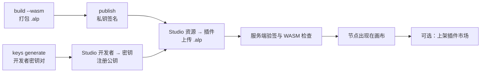

# 插件体系

**一个第三方写的节点，要经过哪些环节才能在别人的画布上运行，平台又凭什么信任它？** 本页回答这个问题。动手开发从 [开发教程](/api/plugins/tutorial) 开始。

本页讲的是工作流节点插件。另有一类 runtime 插件：manifest 声明 `kind: "runtime"`，是挂进 sandbox 运行态 Agent 核心（DeepSeek Harness）的 Cordis 插件，在 Agent 的 microVM 内运行，签名方式与本页相同，上传到 Studio 的「Runtime 插件」页，见 [开发 runtime 插件](/api/plugins/runtime)。

## 插件是什么

插件是一组自定义节点。每个节点声明输入端口、输出端口与配置项，端口的 `dataType` 与内置节点共用同一套端口类型（见 [端口类型](/guide/getting-started/)），因此插件节点可以和内置节点直接连线。

插件打包成 `.alp` 文件（ZIP 归档），内含：

- `manifest.json`：插件 ID、版本、作者、权限与签名信息；
- `node-definitions.json`：节点定义；
- `dist/plugin.wasm`：节点的执行代码（Extism 规范的 WebAssembly 模块）。

## 两种运行形态

| 形态 | 写法 | 在哪里运行 | 用途 |
| --- | --- | --- | --- |
| WASM | Rust + `extism-pdk`，导出 `execute` 函数 | AgentLoom 服务端的 Extism 沙箱 | 唯一能注册到平台、在工作流中执行的形态 |
| TypeScript | 节点对象上的 `execute(context)` 方法 | 开发者本机的 `agentloom-plugin dev` 服务器 | 本地调试节点定义与逻辑，不能注册 |

服务端只执行 WASM，原因是它需要在多租户环境里限制插件能做的事：WASM 模块默认没有文件系统与网络访问，内存与执行时间有上限，只有声明了 `network:outbound` 权限的插件才能访问清单里列出的主机。TypeScript 代码一旦在服务端进程里执行就拿到了整个 Node.js 运行时，无法做同等隔离。

两种形态的执行契约不同：TypeScript 预览接收上下文对象、返回 `{ outputs: {…} }`；WASM 接收 `{ nodeType, inputs, config }` 的 JSON，直接返回端口对象，例如 `{"result":"hello"}`。细节见 [Plugin SDK](/api/plugins/sdk#wasm-执行契约)。

## 信任从签名开始

- 开发者在本地生成 RSA 密钥对，把公钥注册到组织；私钥只留在本地。
- `agentloom-plugin publish` 用私钥对归档的规范化内容做 RSA-PSS（SHA-256）签名，把签名、内容哈希和公钥指纹写回 `manifest.json`。它只签名，不上传。
- 上传时服务端按指纹找到已注册且未撤销的公钥，重新计算哈希并验签；任何文件在签名后被改动都会失败。撤销一把公钥后，用它签名的插件包不再通过验签。
- 服务端还要求清单的 `wasmEntry` 指向归档内真实存在、以 WASM 魔数开头的文件，所以 TypeScript 产物在这一步被拒绝。

服务端验签管线、沙箱参数与执行队列的实现见 [服务端插件系统](/dev/server/plugins)。

## 从注册到收益

注册后的插件只在本组织可用。要给其他组织使用，在插件市场提交上架；按次计费的插件被调用时记录用量，平台每月结算开发者收益。上架、定价与分成见 [市场与收益](/api/plugins/marketplace)。

## 相关包

| 目录 | 包名 | 作用 |
| --- | --- | --- |
| `agentloom-plugin-sdk/` | `@agentloom/plugin-sdk` | 类型、清单与节点校验、签名与验签函数 |
| `agentloom-plugin-cli/` | `@agentloom/plugin-cli` | `agentloom-plugin` 命令：脚手架、本地预览、打包、密钥、签名 |
| `agentloom-plugin-template/` | — | TypeScript 预览形态的示例插件（文本转大写） |

这两个包目前不在 npm 上发布，从本仓库构建使用，见 [开发教程](/api/plugins/tutorial#前提)。
