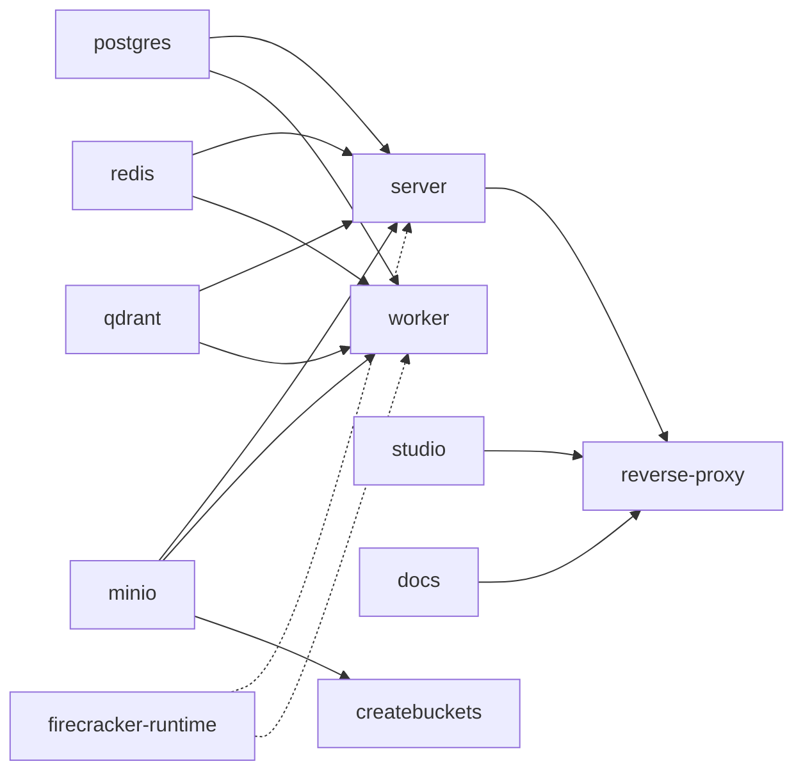
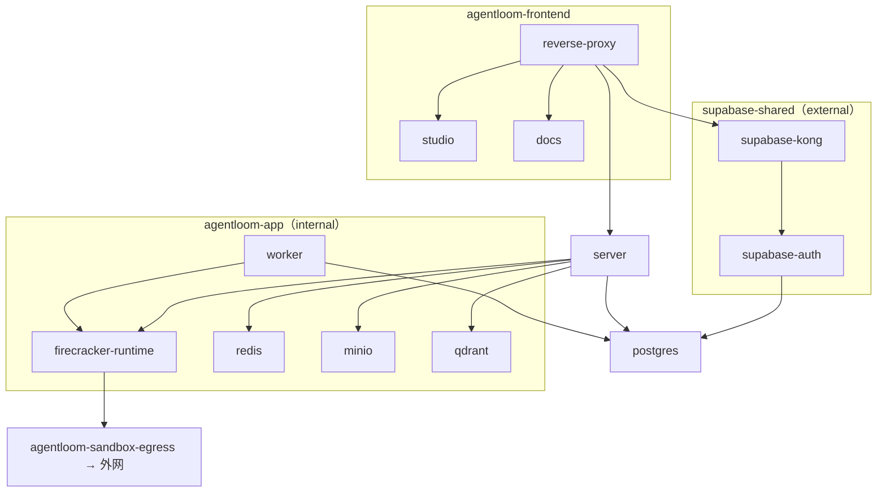

# 部署拓扑

> 一套私有部署由哪些进程组成，它们之间怎样连通，为什么 server 起不来时整个入口都不可用？

部署资产全部在 `agentloom-deploy/`。本页描述 Docker Compose 拓扑（以 `agentloom-deploy/docker-compose.yml` 与 `agentloom-deploy/docker-compose.supabase.yml` 为准），以及它与 Helm Chart 的差别。动手部署请从 [Docker Compose 部署](/deploy/compose) 开始。

## 服务

主 Compose 文件 `agentloom-deploy/docker-compose.yml`：

| 服务 | 镜像（默认） | 作用 | 启动方式 |
| --- | --- | --- | --- |
| `reverse-proxy` | `openresty/openresty:alpine` | 唯一对外 Web 入口，按路径转发到 studio / server / docs / Supabase Kong，见 [反向代理](/deploy/reverse-proxy) | 常驻 |
| `studio` | `agentloom/studio:private-local` | Studio 前端静态站，容器内 nginx 监听 8080 | 常驻 |
| `docs` | `agentloom/docs:private-local` | 本文档站，容器内 nginx 监听 8081，路径前缀 `/documentation/` | 常驻 |
| `server` | `agentloom/server:private-local` | NestJS API 与 Socket.IO，监听 3000 | 常驻 |
| `worker` | 同 server 镜像 | 与 server 同一入口 `node dist/src/main.js`，不接入 `agentloom-frontend`，入口不会把请求转给它 | 常驻 |
| `firecracker-runtime` | `agentloom/firecracker-runtime:1.16.1` | 沙箱 microVM 的 runtime manager，特权容器，mTLS 监听 8443，见 [Firecracker 沙箱](/deploy/firecracker) | profile `sandbox`（`.env.template` 默认启用） |
| `postgres` | `postgres:16-alpine` | 业务数据库；自托管 Supabase 也用这个库 | 常驻 |
| `redis` | `redis:7-alpine` | BullMQ 队列与缓存，开启 AOF | 常驻 |
| `minio` | `pgsty/minio:RELEASE.2026-08-04T00-00-00Z` | 对象存储，默认 bucket `agentloom-documents` | 常驻 |
| `qdrant` | `qdrant/qdrant:v1.17.0` | 向量库 | 常驻 |
| `createbuckets` | `pgsty/mc:RELEASE.2026-09-16T00-00-00Z` | 创建 bucket 后退出 | 一次性 |
| `server-migrator` | server 镜像的 `migrator` 构建阶段 | 执行 `pnpm db:migrate` / `pnpm db:seed` | profile `tools` |
| `sandbox-cutover` | 同 runtime 镜像，入口 `/usr/local/bin/sandbox-cutover` | 旧 Docker 沙箱迁移到 Firecracker；唯一挂载宿主 Docker socket 的服务 | profile `migration` |

可选的 Supabase 认证栈 `agentloom-deploy/docker-compose.supabase.yml`：

| 服务 | 镜像 | 作用 |
| --- | --- | --- |
| `supabase-db-ready` | `postgres:16-alpine` | 循环 `pg_isready -h postgres` 直到主栈 PostgreSQL 可连，然后退出 |
| `supabase-auth` | `supabase/gotrue:v2.175.0` | GoTrue，数据写入主栈 PostgreSQL 的 `auth` schema |
| `supabase-kong` | `kong:3.9` | 把 `/auth/v1/` 转发到 GoTrue（`agentloom-deploy/supabase/kong.yml`） |

`APP_DEPLOYMENT_MODE=private` 且 `APP_SUPABASE_*` 全部留空时 server 也能启动，但邮箱注册与登录会返回认证不可用错误（`agentloom-server/src/modules/auth/supabase/supabase.service.ts` 的 `ensureAvailable`）。用 `./scripts/generate-secrets.sh` 生成的 `.env` 已填好 `APP_SUPABASE_*`，因此按 [Docker Compose 部署](/deploy/compose) 的路径需要启动这套栈。细节见 [自托管 Supabase](/deploy/supabase)。

## 启动依赖

`depends_on` 全部使用 `condition: service_healthy`，其中 server/worker 对 `firecracker-runtime` 的依赖带 `required: false`（图中虚线）：

`reverse-proxy` 要等 `server` 健康。`firecracker-runtime` 属于 profile `sandbox`：profile 未启用时不创建它；启用后 server/worker 先等它健康，健康检查（带 mTLS 客户端证书的 `GET https://firecracker-runtime:8443/readyz`）失败时 Compose 打印 `optional dependency "firecracker-runtime" failed to start` 警告后照常启动 server/worker，Web 入口可用，只有 sandbox 运行态的 Agent 不可用。没有可用 KVM 的宿主按 [不启用沙箱](/deploy/firecracker#不启用沙箱) 关闭该 profile。

## 网络

Compose 声明了 5 个网络。主栈 4 个网络名带前缀 `AGENTLOOM_NETWORK_PREFIX`（默认 `agentloom`），不随 Compose project 名变化；备份与恢复脚本按 `<前缀>-app` 找到 MinIO：

| 网络键 | Docker 网络名 | internal | 成员 |
| --- | --- | --- | --- |
| `frontend_net` | `<前缀>-frontend`（默认 `agentloom-frontend`） | 否 | reverse-proxy、studio、docs、server |
| `app_net` | `<前缀>-app`（默认 `agentloom-app`） | 是 | server、worker、firecracker-runtime、postgres、redis、minio、qdrant、createbuckets、server-migrator、sandbox-cutover |
| `data_net` | `<前缀>-data`（默认 `agentloom-data`） | 是 | postgres、server-migrator |
| `sandbox_egress_net` | `<前缀>-sandbox-egress`（默认 `agentloom-sandbox-egress`） | 否 | firecracker-runtime（guest 出站） |
| `supabase_net` | `${SUPABASE_NETWORK:-supabase-shared}`，external | 由 `docker network create` 决定 | reverse-proxy、server、worker、postgres、server-migrator、sandbox-cutover，以及 Supabase 栈的三个服务 |

`supabase_net` 是 external 网络，主 Compose 与 Supabase Compose 都不会创建它，首次部署必须先执行 `docker network create supabase-shared`。同一台 Docker 宿主上运行第二套栈时，改 `AGENTLOOM_PROJECT_NAME`、`AGENTLOOM_SUPABASE_PROJECT_NAME`、`AGENTLOOM_NETWORK_PREFIX`、`SUPABASE_NETWORK` 与各宿主端口变量即可。

server 同时在 `agentloom-frontend`、`agentloom-app` 与 `supabase-shared` 上；postgres 同时在 `agentloom-app`、`agentloom-data` 与 `supabase-shared` 上，所以 GoTrue 用主机名 `postgres` 访问它。

## 端口

| 宿主端口 | 变量 | 容器端口 | 绑定地址 | 说明 |
| --- | --- | --- | --- | --- |
| 8080 | `NGINX_HTTP_PORT` | reverse-proxy 80 | 所有接口 | 唯一 Web 入口：Studio、`/api/`、`/socket.io/`、`/documentation/`、`/auth/` |
| 9001 | `MINIO_CONSOLE_PORT` | minio 9001 | `127.0.0.1` | MinIO 控制台 |
| 6333 | `QDRANT_HTTP_PORT` | qdrant 6333 | `127.0.0.1` | Qdrant HTTP |
| 8000 | `SUPABASE_KONG_PORT` | supabase-kong 8000 | 所有接口 | Supabase Kong（Supabase Compose） |

以下端口只在 Docker 网络内可达，不映射到宿主：server 3000、studio 8080、docs 8081、firecracker-runtime 8443（仅接受 mTLS）、MinIO API 9000、PostgreSQL 5432、Redis 6379。

## 持久化

命名卷 `postgres_data`、`redis_data`、`minio_data`、`qdrant_data`、`firecracker_state`。备份脚本覆盖 PostgreSQL 与 MinIO；`firecracker_state` 中的 microVM 磁盘不在备份范围内，见 [备份与恢复](/deploy/backup-restore)。

## Compose 与 Helm

| 方面 | Docker Compose | Helm（`agentloom-deploy/kubernetes/helm/agentloom/`） |
| --- | --- | --- |
| Web 入口 | reverse-proxy（OpenResty），含 `/documentation/` 与 `/auth/` | Ingress，只有 `/api`、`/socket.io`、`/` 三条路径 |
| 文档站 | `docs` 服务 | 不部署 |
| Supabase | `docker-compose.supabase.yml` | 不部署，`env.server.APP_SUPABASE_*` 指向外部实例 |
| 沙箱运行时节点 | 每台宿主一个 `firecracker-runtime` 容器 | StatefulSet，`firecrackerRuntime.replicas` 可大于 1 |
| 横向扩容 | 不支持 | server / worker / studio 可开 HPA |
| 备份 | `agentloom-deploy/scripts/` 与 `agentloom-deploy/systemd/` | Chart 不包含 |

单台服务器、需要文档站与内置认证时用 Compose；已有 Kubernetes 集群、需要多副本 server 或多个沙箱节点时用 Helm，见 [Helm 部署](/deploy/helm)。

## 本分区页面

- [Docker Compose 部署](/deploy/compose)：从空目录到 `/api/v1/health` 返回 200 的完整步骤
- [配置参考](/deploy/configuration)：`.env`、server、Studio 的全部变量
- [自托管 Supabase](/deploy/supabase)：GoTrue、Kong、OAuth 回调
- [Firecracker 沙箱](/deploy/firecracker)：宿主条件、PKI、产物构建、多节点与迁移
- [Helm 部署](/deploy/helm)：values 键与模板
- [备份与恢复](/deploy/backup-restore)：脚本、产物与定时器
- [反向代理](/deploy/reverse-proxy)：路由表与外层 TLS
