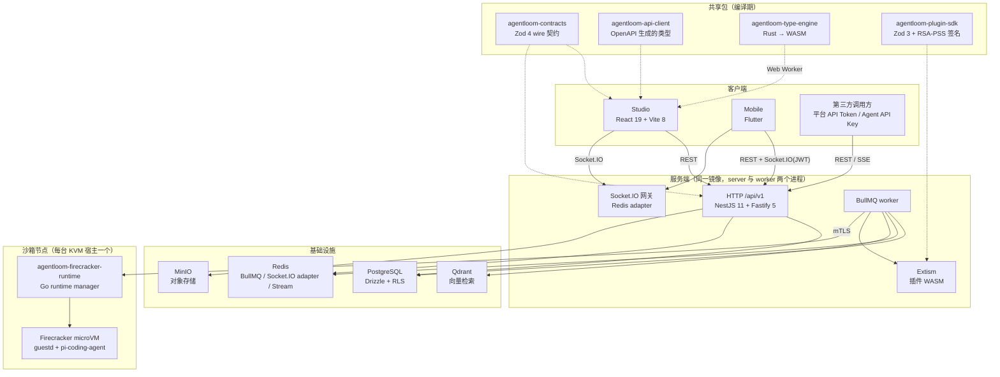
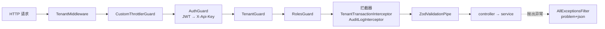
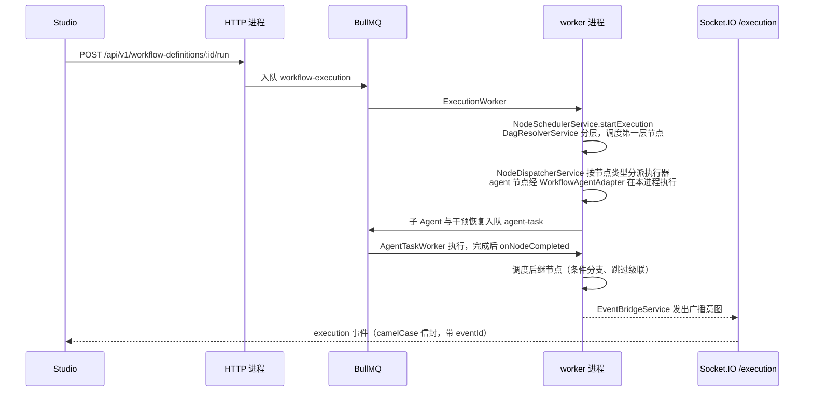

# 系统架构

一个 HTTP 请求、一次工作流运行、一个 Agent 回合，分别经过哪些进程与组件？本页回答这个问题，并给出读代码时的入口文件。

## 系统组成

`agentloom-deploy/docker-compose.yml` 中的 `server` 与 `worker` 服务使用同一个镜像、同一个入口 `node dist/src/main.js`。两个进程都注册全部 HTTP 路由、网关与 BullMQ 处理器，因此任何一个进程都可能消费某个队列任务；跨进程的事件扇出依赖 Redis（Socket.IO Redis adapter、Redis 频道、Redis Stream），不依赖进程内状态。部署拓扑见 [部署运维](/deploy/)。

## 一个 REST 请求的路径

`agentloom-server/src/main.ts` 设置全局前缀 `api/v1`、全局过滤器 `AllExceptionsFilter`、全局管道 `ZodValidationPipe`，并在 `docs` 路径挂 Swagger UI。`agentloom-server/src/app.module.ts` 注册全局中间件、守卫与拦截器。NestJS 的执行顺序固定为中间件 → 守卫 → 拦截器 → 管道 → 处理器，异常统一落到过滤器：

| 组件 | 定义位置 | 作用 |
| --- | --- | --- |
| `TenantMiddleware` | `agentloom-server/src/common/middleware/tenant.middleware.ts` | 解析租户上下文；`app.module.ts` 对公开路径（模板、市场浏览、生成应用公开页、分享短链、webhooks、agent-api）排除 |
| `CustomThrottlerGuard` | `agentloom-server/src/common/guards/custom-throttler.guard.ts` | Redis 存储的限流，默认 100 次 / 60 秒；识别 `al_` 与 `alak_` 两种 Key |
| `AuthGuard` | `agentloom-server/src/common/guards/auth.guard.ts` | 先验 `Authorization: Bearer` JWT，再验 `X-Api-Key` 平台 Token；`@Public()` 路由跳过 |
| `TenantGuard`、`RolesGuard` | `agentloom-server/src/common/guards/` | 租户归属与角色校验 |
| `TenantTransactionInterceptor` | `agentloom-server/src/common/interceptors/tenant-transaction.interceptor.ts` | 把处理器包进租户事务，使 RLS 生效；`request.user` 不存在时放行 |
| `AuditLogInterceptor` | `agentloom-server/src/modules/evidence/audit-log.interceptor.ts` | 由 `EvidenceModule` 以 `APP_INTERCEPTOR` 注册，记录审计日志 |
| `AllExceptionsFilter` | `agentloom-server/src/common/filters/all-exceptions.filter.ts` | 输出 RFC 9457 `application/problem+json` |

每一环的细节与 WebSocket 侧的鉴权见 [请求管线](/dev/server/request-pipeline)；错误格式对调用方的约定见 [API 与集成](/api/)。

`/api/v1/agent-api/**` 是例外：controller 标记 `@Public()`，由 `AgentApiKeyGuard` 校验 `Bearer alak_…`，不设置 `request.user`，所以不进全局租户事务，service 内自行开短事务。决策来由见 [ADR 0001](/dev/decisions/0001-agent-external-api)。

## 一次工作流运行的路径

- 调度入口是 `agentloom-server/src/modules/execution/node-scheduler.service.ts`：每个节点完成后从数据库重新读取步骤状态，决定后继节点调度、等待或跳过，并保存检查点。`agentloom-server/src/modules/execution/node-dispatcher.service.ts` 维护节点类型到执行器的映射，执行器位于 `agentloom-server/src/modules/execution/node-executors/`。
- 队列名与 worker 类名见 [队列](/dev/server/queues)。

## 实时事件如何到达客户端

worker 不直接操作 Socket.IO。`agentloom-server/src/modules/execution/services/event-bridge.service.ts` 中的 `EventBridgeService` 把内部事件转换为 `ExecutionEvent` 信封，为每个执行维护单调递增的 `eventId`，保存最近 500 个事件用于回放，再通过 EventEmitter2 发出广播意图；网关用 `@OnEvent` 订阅后向房间推送。网关侧有背压队列：上限 500 条、每 100ms 排空一次（`execution.gateway.ts`、`agent-conversation.gateway.ts` 中的 `BACKPRESSURE_QUEUE_LIMIT`、`BACKPRESSURE_DRAIN_INTERVAL_MS`）。客户端断线重连时带上 `lastEventId`，网关从缓冲区增量回放。Socket.IO 使用 Redis adapter，所以事件可以从执行进程送达连接在另一个进程上的客户端。

命名空间、事件名与方向见 [实时通信](/dev/server/realtime)。

## 类型如何在包之间流动

两条独立的链路：

1. **REST 契约**：server 的 Zod DTO（`createZodDto`）→ `pnpm openapi:export` 导出 `agentloom-server/sdk/openapi.json` → openapi-generator 生成 `agentloom-server/sdk/typescript-models` → 同步为 `agentloom-api-client/src/models.ts`。根命令 `pnpm contracts:regen` 串起全部步骤，生成产物禁止手改。
2. **wire 契约**：Socket 事件、端口数据类型、Agent 运行配置等跨端格式直接定义在 `agentloom-contracts/src/`，server、Studio、mobile 共同依赖它；mobile 侧的 Dart 模型手写并以契约测试对齐。

细节见 [契约与再生成](/dev/contracts)。

**大小写边界**：Studio 的 ky 客户端（`agentloom-studio/src/shared/api/client.ts`）在 `afterResponse` 钩子里把 JSON 响应键统一转为 camelCase；请求体没有全局转换，由调用处按端点 DTO 决定是否用 `toSnakeBody` 转成 snake_case。例如 `agentloom-studio/src/features/workflow/api/workflowMutations.ts` 中 `PATCH workflow-definitions/:id` 直接发送 camelCase，因为该端点的 strict DTO 只接受 camelCase。Socket wire 一律 camelCase。

## Agent 的两种运行态

Agent 定义上的运行态字段取值 `sandbox` 或 `no_sandbox`（`agentloom-server/src/database/schema/agent-definitions.schema.ts`）：

| 运行态 | 执行位置 | 入口 |
| --- | --- | --- |
| `no_sandbox` | server/worker 进程内运行 pi-agent-core | `agentloom-server/src/modules/agent/in-process-agent.adapter.ts` → `agentloom-server/src/modules/agent/pi-agent-core.adapter.ts` |
| `sandbox` | Firecracker microVM 内运行 pi-coding-agent | `agentloom-server/src/modules/sandbox/sandbox.module.ts` 把 `SANDBOX_RUNTIME_DRIVER` 绑定到 `agentloom-server/src/modules/sandbox/firecracker-runtime.service.ts`，经 undici mTLS 调用各节点的 runtime manager |

server 与 worker 不持有 KVM、网络或 cgroup 特权；这些只在运行 `agentloom-firecracker-runtime` 的宿主机上需要。pi-mono 包是纯 ESM，CJS 的 Nest 代码必须经 `agentloom-server/src/modules/agent/pi-imports.ts` 惰性 `await import()`。工作流中的 `agent` 节点经 `agentloom-server/src/modules/execution/workflow-agent-adapter.ts` 进入同一套 Agent 运行时。

沙箱节点登记、容量择优与 handle 路由见 [Agent 运行态](/dev/server/agent-runtime)；manager 的 HTTP API 见 [Firecracker 运行时](/dev/firecracker-runtime)。

## 关键文件

| 文件 | 内容 |
| --- | --- |
| `agentloom-server/src/main.ts` | HTTP 启动：Fastify 适配器、multipart 上限、Redis Socket.IO adapter、`api/v1` 前缀、全局过滤器与管道、CORS、Swagger |
| `agentloom-server/src/app.module.ts` | 根模块：导入全部域模块、限流与 BullMQ 的 Redis 连接、全局守卫与拦截器、`TenantMiddleware` 排除路径 |
| `agentloom-server/src/acp-stdio.ts` | ACP JSON-RPC stdio 独立进程入口 |
| `agentloom-server/src/config/env.schema.ts` | server 环境变量的 Zod 定义（清单见 [配置参考](/deploy/configuration)） |
| `agentloom-server/drizzle.config.ts` | Drizzle 配置：schema 入口 `agentloom-server/src/database/schema/index.ts`，迁移目录 `agentloom-server/src/database/migrations` |
| `agentloom-studio/src/app/providers.tsx` | Studio 全局 Provider |
| `agentloom-studio/src/app/router.tsx` | TanStack Router 路由树 |
| `agentloom-studio/src/app/routes/__root.tsx` | 根路由与登录守卫 |
| `agentloom-studio/vite.config.ts` | Vite 与 Vitest 共用配置，含 dev 代理 |
| `agentloom-studio/src/shared/api/client.ts` | ky 客户端：注入 Bearer token、401 时刷新会话后重试一次、响应转 camelCase |
| `agentloom-contracts/src/index.ts` | 契约包公共出口 |
| `agentloom-firecracker-runtime/cmd/runtime-manager/main.go` | Go runtime manager 入口 |
| `agentloom_mobile/lib/main.dart` | Flutter 入口 |
| `agentloom_mobile/lib/routes/app_router.dart` | Flutter 路由 |
| `pnpm-workspace.yaml` | workspace 成员、依赖版本 catalog、overrides |
| `agentloom-server/.env.example` | server 环境变量样例 |
| `agentloom-studio/.env.example` | Studio 环境变量样例 |
| `agentloom-deploy/.env.template` | 部署环境变量模板 |
