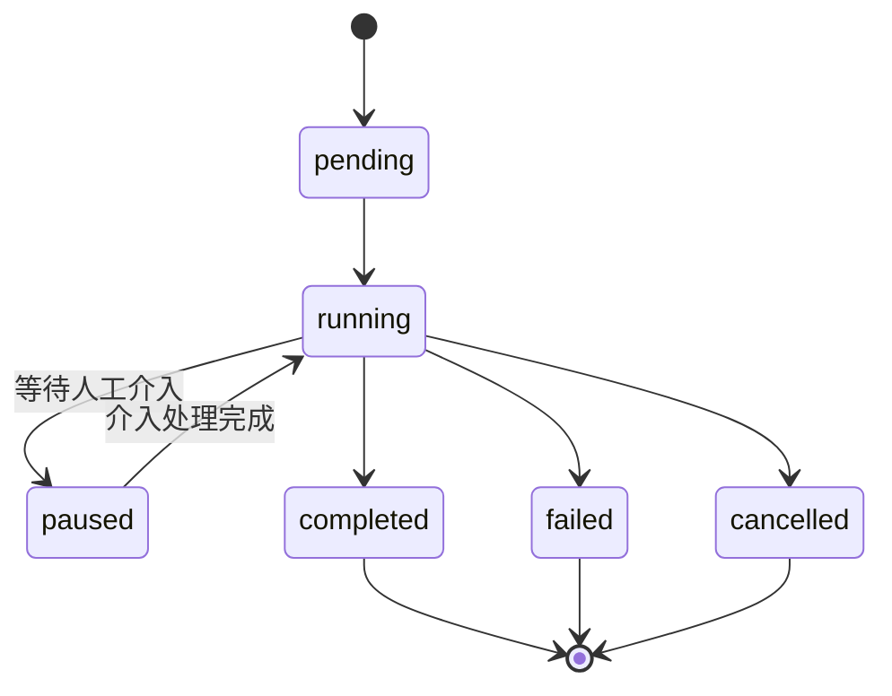

# 核心概念

AgentLoom 里的工作流、Agent、节点、端口、运行态各指什么，它们在运行时怎样衔接？本页按设计时到运行时的顺序解释这些对象，清单与取值见各节链接的参考页。

## 工作流：定义与执行

工作流分两个实体：**工作流定义**（设计时）与**工作流执行**（运行时）。

- 工作流定义保存画布上的节点与边，以及输入参数的收集方式（`collectionMode` 取 `form`、`conversation`、`hybrid`）。表 `workflow_definitions` 的 `version` 列做乐观并发控制：Studio 自动保存时带上版本号，版本落后的写入被拒绝。发布后 `published_version_id` 指向一份不可变的版本快照。
- 工作流执行是一次运行的记录，包含若干**执行步骤**（每个节点一条）。执行状态取值 `pending`、`running`、`paused`、`completed`、`failed`、`cancelled`（`agentloom-server/src/database/schema/workflow-executions.schema.ts`）；步骤状态另有 `queued`、`waiting_intervention`、`skipped` 等（`agentloom-server/src/database/schema/execution-steps.schema.ts`）。
- 执行的触发来源记录在 `trigger_type`：`manual`、`api`、`webhook`、`system`。

## Agent：与工作流并列的顶层对象

Agent 有自己的定义、版本、对话与执行体系，不依赖工作流即可运行。用户在 Studio 里与 Agent 多轮对话，回合由 BullMQ 队列异步执行，事件经 `/agent-conversation` 命名空间推送。工作流里的 `agent` 节点引用一个 Agent 定义，经 `WorkflowAgentAdapter` 进入同一套运行时，所以 Agent 的能力在两条路径上一致。

第三方系统可以用 Agent 专用 Key 直接调用某个 Agent，见 [Agent 对外 API](/api/agent-api) 与 [ADR 0001](/dev/decisions/0001-agent-external-api)。

## 运行态：进程内或 microVM

Agent 定义的 `runtime_mode` 列决定一个 Agent 在哪里运行（`agentloom-server/src/database/schema/agent-definitions.schema.ts`）：

- `no_sandbox`：在 server/worker 进程内运行 pi-agent-core，没有文件系统与终端隔离，适合只调用模型与平台工具的 Agent。
- `sandbox`：在 Firecracker microVM 内运行 pi-coding-agent，Agent 可以读写文件、执行命令。microVM 由部署在 KVM 宿主机上的 `agentloom-firecracker-runtime` 管理，server 经 mTLS 调用它。

两者的边界由数据访问而不是性能决定：需要执行任意代码或保留工作目录的 Agent 必须进 microVM，因为 server 进程不应把宿主机能力交给模型。`no_sandbox` 的 Agent 不能调用 `sandbox` 子 Agent。实现细节见 [Agent 运行态](/dev/server/agent-runtime) 与 [Firecracker 运行时](/dev/firecracker-runtime)。

工作流的 `sandbox` 节点与 Agent 对话共用沙箱会话表 `sandbox_sessions`：一条会话关联一个工作流执行或一个 Agent 对话，或者是持久会话（`lifecycleMode` 为 `persistent`）。

## 节点

节点是工作流的处理单元，每个节点有类型、配置和输入/输出端口。节点类型、所属分类、端口与配置项由 Studio 的 `agentloom-studio/src/features/canvas/types/nodeTypeRegistry.ts` 定义，server 端由 `agentloom-server/src/modules/execution/node-dispatcher.service.ts` 把类型映射到执行器。逐个节点的说明见 [节点参考](/guide/nodes/)。

节点分三种执行方式：

- **资源节点**（如模型、知识库、记忆、工作区、沙箱）在调度时直接产出一个引用，供下游节点消费。
- **计算节点**（如 HTTP 请求、代码、条件、循环）在 worker 进程内同步执行。
- **Agent 节点**运行一个 Agent 回合；子 Agent 调用经 `agent-task` 队列执行。

## 端口与数据类型

节点之间通过端口传值。每个端口带一个数据类型，取值全集定义在 `agentloom-contracts/src/port-data-type.ts`，Rust 类型引擎、插件 SDK、Studio、server 四处的镜像由契约测试机械比对。其中 `exec` 与 `volume` 用于画布上的控制流与工作区挂载连线。取值与兼容矩阵见 [类型引擎](/dev/type-engine)。

连线时，类型引擎给出四级兼容结果（`agentloom-type-engine/src/checker/compatibility.rs` 中的 `CompatibilityLevel`）：`Exact`（类型相同）、`Transform`（存在跨类型变换规则，允许连线）、`Partial`（可连接但可能丢信息）、`Incompatible`（画布拒绝连线）。server 执行期按同一张规则表校验连线，并在组装下游输入时执行变换函数（`parse_json`、`stringify_json`、`extract_skill_text`）；变换失败时透传上游原值并记录告警，节点不失败。类型引擎编译为 WASM，在 Studio 的 Web Worker 中运行，所以连线校验不需要请求 server。

## DAG 调度

工作流是有向无环图。一次运行的调度过程：

1. `POST /api/v1/workflow-definitions/:workflowId/run` 创建执行并入队 `workflow-execution`。执行快照（`workflow_executions.definition_snapshot`）由 `agentloom-server/src/modules/execution/reusable-block-expansion.util.ts` 的 `buildExecutableWorkflowGraph` 生成：规范化画布图，并把 `reusable-block` 节点展平为其内嵌 `blockDefinition` 中的节点，内部节点 ID 为 `<blockNodeId>::<innerId>`（分隔符 `REUSABLE_BLOCK_INNER_NODE_ID_SEPARATOR`，定义在 `agentloom-contracts/src/workflow-graph.ts`），连到块端口的边按端口的 `sourceNodeId`/`sourcePortId` 改写到内部节点。调度器因此不需要块执行器。
2. `ExecutionWorker` 调用 `NodeSchedulerService.startExecution`，`DagResolverService` 把图分层，第一层节点并行调度。
3. 每个节点完成后调用 `onNodeCompleted`：从数据库重读步骤状态，逐个判断后继节点是调度、等待还是跳过；条件节点只放行命中的分支，未命中分支级联跳过；随后保存检查点。
4. 所有步骤进入终态后，执行状态随之更新。

调度状态每次都从数据库读取，因此调度可以在任意 worker 进程上继续，进程重启后也能从检查点恢复。事件如何推到客户端见 [系统架构](/dev/architecture#实时事件如何到达客户端)。

## 人工介入

Agent 节点的 `autonomyMode` 决定是否需要人工确认，运行时取节点配置与组织自治上限中更严格的一方（组织上限见 [自治策略](/guide/collaboration/autonomy-policy)）。有效模式为 `MANUAL_CONFIRM` 时，Agent 先产出建议，步骤进入 `waiting_intervention`，执行进入 `paused`；用户批准、修改或拒绝后恢复。

介入策略规定超时动作：`approve`、`reject`、`escalate`，默认 `reject`；升级次数上限由 `agentloom-server/src/modules/execution/execution.constants.ts` 的 `MAX_ESCALATION_ATTEMPTS` 定义。

## 子 Agent

Agent 可以调用子 Agent，工具名为 `call_subagent`（同步等待结果）与 `spawn_subagent`（立即返回，子 Agent 在后台运行）。嵌套深度上限由 `agentloom-server/src/modules/execution/node-handlers/sub-agent.handler.ts` 的 `MAX_SUB_AGENT_DEPTH` 定义，防止递归调用无限展开。

## Skill

Skill 是 Agent 的行为指导文件，格式为 SKILL.md（YAML frontmatter + Markdown 正文）。`agentloom-server/src/modules/skill/skill-resolver.service.ts` 按租户查询已启用的 Skill，生成 `<available_skills>` 片段注入 Agent 的系统提示。平台内置 Skill 由 `pnpm db:seed` 写入，清单见 [内置技能](/guide/skills/built-in)。

## 触发器

除手动运行外，工作流可以由定时表达式、入站 Webhook 与 API 事件触发。API 事件经 `agentloom-server/src/modules/trigger/adapters/event-source-adapter.registry.ts` 选择适配器：`GithubWebhookAdapter` 校验 GitHub 签名，`GenericEventAdapter` 透传通用事件。签名与接入方式见 [Webhook 与 API 事件](/api/webhooks)。

## 智能路由

`smart-routing` 节点按策略为下游 Agent 选择模型。策略取值定义在 `agentloom-server/src/modules/smart-routing/dto/routing-context.dto.ts` 的 `ROUTING_STRATEGIES`：`TOKEN_OPTIMIZED`、`COST_OPTIMIZED`、`QUALITY_FIRST`、`LATENCY_FIRST`、`HISTORICAL_BEST`、`FALLBACK_CHAIN`。
