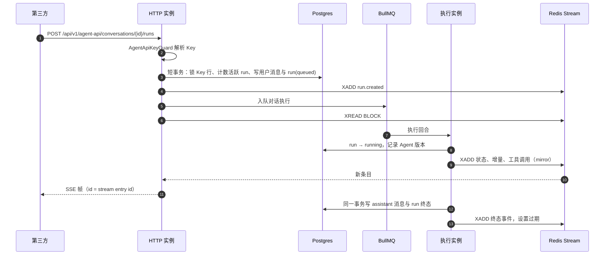

# 0001 Agent 对外 API：专用 Key + 原生 REST/SSE

- 状态：已实施
- 日期：2026-10-01

调用方式、端点、事件与错误码见 [Agent 对外 API](/api/agent-api)。本篇只记录为什么这样设计。

## 背景

第三方系统需要以 API 方式调用已部署的 Agent：发消息、拿到流式回复、断线续传、取消。决策时（2026 年 10 月）仓库中的相关事实如下，行号为当时位置：

| # | 事实 | 证据 |
| --- | --- | --- |
| F1 | `X-Api-Key` 走 `PlatformApiTokenService.validateToken`，守卫以 Token 创建者的用户、租户、角色身份放行，`scopes` 存了但未校验 | `agentloom-server/src/common/guards/auth.guard.ts` |
| F2 | `platform_api_tokens.user_id` 外键 `ON DELETE CASCADE`，表上没有 RLS | `agentloom-server/src/database/schema/platform-api-tokens.schema.ts` |
| F3 | 发消息只写入用户消息并发出事件，回复由 BullMQ `agent-conversation-execution` 队列（`jobId=conversationId`）异步生成 | `agentloom-server/src/modules/agent-execution/agent-execution.service.ts` |
| F4 | `/agent-conversation` 的 Socket.IO 握手只做 JWT 校验 | `agentloom-server/src/modules/agent-execution/agent-conversation.gateway.ts` |
| F5 | server 与 worker 是同一镜像、同一入口，任一进程都可能执行对话 job；事件计数器、回放缓冲、活跃回合都只在进程内；唯一跨进程扇出通道是 Socket.IO Redis adapter | `agentloom-deploy/docker-compose.yml`、`agentloom-server/src/modules/execution/services/event-bridge.service.ts` |
| F6 | 对话事件不落库，断线回放靠内存缓冲 | `agent-conversation.gateway.ts` |
| F7 | 对话 job 可以合并处理多条待处理用户消息，每轮只写一条 assistant 消息 | `agentloom-server/src/modules/agent-execution/agent-execution-worker-persistence.service.ts` |
| F8 | `agent_conversations.created_by` 为 NOT NULL 且级联删除；没有来源列 | `agentloom-server/src/database/schema/agent-conversations.schema.ts` |
| F9 | HTTP 取消只把对话状态改为 `ended`，跨实例时不会中止正在执行的回合 | `agent-execution.service.ts` |
| F10 | `TenantTransactionInterceptor` 把整个处理器包在一个租户事务里 | `agentloom-server/src/common/interceptors/tenant-transaction.interceptor.ts` |
| F11 | 服务端没有 SSE；nginx `/api/` 已关闭缓冲，超时 300 秒 | `agentloom-deploy/nginx.conf` |
| F12 | 限流器抛出的 429 被映射为通用 `http-error` 类型 | `agentloom-server/src/common/filters/all-exceptions.filter.ts` |

需求（每条可判定真假）：

- R1：Owner/Admin 能为某个 Agent 创建 Key，明文只在创建响应中出现一次；吊销后该 Key 的请求立即返回 401。
- R2：Key 绑定 Agent X，访问 Agent Y 的对话或其他 Key 创建的对话一律 404。
- R3：Key 只能访问对外接口，调用任何管理接口返回 401。
- R4：创建 Key 的用户被删除后，Key 及其对话、run 照常可用。
- R5：Agent 未发布时创建对话与 run 返回 409；run 记录当时的已发布版本。
- R6：SSE 跨实例送达，每个 delta 恰好一次。
- R7：带 `Last-Event-ID` 可续传；run 终态 1 小时后事件过期返回 410。
- R8：`Prefer: wait=N` 在 N 秒内结束返回 200，否则 202。
- R9：同一对话已有活跃 run 时再建返回 409 并带 `activeRunId`。
- R10：取消请求发到任意实例都能中止执行中的回合。
- R11：执行进程崩溃后遗留的 run 最终被标记为失败。
- R12：单 Key 限流与并发上限超出时返回 429 与 `Retry-After`。
- R13：API 来源的对话不出现需要人工审批的工具调用。
- R14：Studio 能管理 Key，并能区分 API 来源的对话。

## 决策

| 议题 | 选择 | 被否决的方案及原因 |
| --- | --- | --- |
| 凭证 | 新表 `agent_api_keys`，一个 Key 绑定一个 Agent，以服务身份调用；格式 `alak_` + 64 位十六进制 | **给平台 Token 加 scope**：Token 以个人身份运行，用户删除后 Token 与对话级联消失（F2、F8）；改 scope 语义影响所有现有 Token |
| 认证入口 | 对外 controller 标记 `@Public()`，由专用 `AgentApiKeyGuard` 校验 `Authorization: Bearer alak_…`，不设置 `request.user` | **复用全局 AuthGuard 的 `X-Api-Key` 分支**：会把调用方识别为用户并进入 RolesGuard，Key 变成万能凭证（违反 R3）。用 Bearer 头便于以后兼容 OpenAI SDK |
| 跨进程事件 | 每个 run 一条 Redis Stream `agentloom:agent-api:run:{runId}:events`，由执行进程写入，任一实例读取转发为 SSE | **Redis pub/sub**：不能续传（违反 R7）。**Postgres 事件表**：每个 delta 写库，压力过大。**进程内 Socket.IO 自连**：绕路且要伪造 JWT |
| 调用建模 | 新表 `agent_api_runs`：一条用户消息对应一个 run，同一对话同时只允许一个活跃 run | **直接复用消息**：worker 会合并多条消息处理（F7），没有 run 实体就回答不了"这次调用的结果是什么" |
| 同步语义 | 默认 202 加轮询；`Prefer: wait` 最长 60 秒；流式用 SSE | **纯同步阻塞**：沙箱回合可能持续数分钟，超过 nginx 的 300 秒，客户端分不清超时与失败 |
| 数据库事务 | 对外接口不走 `TenantTransactionInterceptor`，service 内用 `runInTenantTransaction` 开短事务 | **沿用全局拦截器**：SSE 与 wait 请求会持有事务数分钟（F10），耗尽连接池 |
| 人工审批 | API 来源对话不注册自进化工具 | **向第三方暴露审批**：需要新状态机，调用方还得理解平台内部工具 |
| 分页 | 沿用仓库的 `page/pageSize` + `meta.total` | **cursor 分页**：仓库没有先例，会形成第二套约定 |

### 运行时结构



代码分两个模块：`agentloom-server/src/modules/agent-api/`（对外 controller、Key 管理 controller/service、`AgentApiKeyGuard`、SSE 编码）与 `agentloom-server/src/modules/agent-api-runtime/`（run 状态机 `AgentApiRunService`、Stream 读写、在执行进程内把对话事件映射为对外事件的 `AgentApiEventMirrorListener`、`agent-api-maintenance` 队列的清扫 worker）。对外事件 schema 定义在 `agentloom-contracts/src/agent-api-events.ts`。

### 数据模型

- `agent_api_keys`：租户 RLS；存 SHA-256 哈希与前缀；`rate_limit_per_minute` 为空时用租户限额；`max_concurrent_runs` 默认 5；吊销为软删除；`created_by` 在用户删除时置空（R4）。每个 Agent 未吊销的 Key 上限由 `MAX_ACTIVE_AGENT_API_KEYS_PER_AGENT` 定义。
- `agent_api_runs`：租户 RLS；`user_message_id` 唯一；部分唯一索引 `uq_agent_api_runs_active_conversation` 保证同一对话至多一个 queued/running run（R9 在并发下也成立）；`(api_key_id, idempotency_key)` 唯一实现 `Idempotency-Key`。
- `agent_conversations` 增列 `source`（`studio` | `api`）、`api_key_id`、`external_user_id`；`created_by` 改为可空，CHECK 约束要求 Studio 对话有创建人、API 对话有 Key。

### 并发与限流

只在短事务里先 COUNT 再 INSERT 挡不住同一 Key 在不同对话上的并发请求。创建 run 的事务先 `SELECT … FOR UPDATE` 锁住 Key 行，把同一 Key 的建 run 请求串行化，再计数活跃 run，超限回滚并返回 `concurrency-limit-exceeded`；插入触发对话级部分唯一索引冲突时映射为 `conversation-busy`。锁只覆盖这个短事务，不同 Key 互不阻塞。

限流器识别 `Bearer alak_` 后以 `agentkey:<keyPrefix>` 计数（`agentloom-server/src/common/guards/custom-throttler.guard.ts`），并把 429 改为抛出 `rate-limit-exceeded` 的 `DomainException`（修正 F12，对所有路由生效）。

### 跨实例取消与崩溃兜底

- 取消经 Redis 频道 `__agent_conversation_cancel__` 广播，持有回合的实例中止本地执行（修正 F9，Studio 的取消路径同样受益）。
- `agent-api-maintenance` 队列每 5 分钟清扫：创建超过 2 小时仍未结束的 run 标记为失败；幂等键 24 小时后清除；闲置超过 `APP_AGENT_API_CONVERSATION_IDLE_HOURS`（默认 24）小时的 API 对话结束，释放沙箱。

### SSE 帧

`id` 为 Stream entry id，跨实例单调递增；每 15 秒发一次 `: ping` 心跳，避开 nginx 300 秒超时；终态事件发出后关闭连接。工具调用事件不带参数与结果，避免向第三方泄露内部工具数据。终态事件由 run 服务在事务提交后写入，不从状态事件派生，保证与数据库一致。Stream 用 `XADD MAXLEN ~ 5000` 限长，终态后 3600 秒过期。

## 后果

- 第三方获得与 Studio 对话等价的能力，且不依赖任何个人账号。
- 对外接口绕开全局租户事务与 `TenantMiddleware`，新增对外端点时必须在 service 内自行开短事务。
- 每个 run 依赖 Redis Stream；Redis 不可用时对外 API 与队列一同不可用，不引入新的依赖。
- 超长 run 的早期增量会被 `MAXLEN` 裁掉，续传落入缺口时客户端需改为 `GET` run 取完整输出。
- 对话来源列使 Studio 能按 `source` 筛选并标出 API 对话。
- 后续方向：OpenAI 兼容层选 Responses API（`previous_response_id` 对应有状态对话），复用本期的 Key、run 与 Stream，只新增适配 controller。

## 确认方式

- 单测：`agentloom-server/src/modules/agent-api/__tests__/` 与 `agentloom-server/src/modules/agent-api-runtime/__tests__/`（Key 守卫、Key 服务、SSE 编码、controller、service、run 状态机、Stream、mirror、清扫 worker）。
- E2E：`agentloom-server/test/agent-api-concurrency.e2e-spec.ts` 在真实 Postgres 上并行建 run，断言并发上限与 `conversation-busy` 精确生效。

```bash
cd agentloom-server
pnpm test src/modules/agent-api
pnpm test:e2e -- agent-api-concurrency
```
