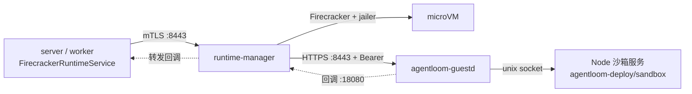

# Firecracker 沙箱运行时

`agentloom-firecracker-runtime/` 是 Go 模块（`go.mod` 声明 `go 1.25.0`，依赖 `firecracker-go-sdk`），产出两类进程：宿主侧的 runtime-manager 负责创建、启停、删除 microVM 并代理到 guest；guest 侧的 agentloom-guestd 在 microVM 内接收请求并托管 Node 沙箱服务。server 通过 mTLS 调用 runtime-manager。部署步骤见 [Firecracker 部署](/deploy/firecracker)，server 侧 Agent 运行态见 [Agent 运行态](/dev/server/agent-runtime)。



## 代码布局

| 路径 | 内容 |
| --- | --- |
| `agentloom-firecracker-runtime/cmd/runtime-manager/main.go` | runtime-manager 入口：读 env、跑 preflight、组装各包、启动控制 API 与回调转发 |
| `agentloom-firecracker-runtime/internal/api` | 控制 API 路由与处理函数（`server.go`）、guest 代理与回调转发（`proxy.go`） |
| `agentloom-firecracker-runtime/internal/manager` | microVM 生命周期、元数据存储、容量记账、ext4 磁盘、产物登记（`manager.go`、`metadata.go`、`capacity.go`、`disk.go`、`artifacts.go`、`types.go`） |
| `agentloom-firecracker-runtime/internal/runtime` | Firecracker/jailer 启动器（`launcher.go`）、guest 证书签发（`certificate.go`）、guest 就绪探测（`guest.go`）、MMDS 令牌恢复（`token.go`） |
| `agentloom-firecracker-runtime/internal/network` | CNI 网络分配（`provisioner.go`）与 nftables 规则（`nftables.go`） |
| `agentloom-firecracker-runtime/internal/preflight` | 启动前宿主检查 |
| `agentloom-firecracker-runtime/internal/guest` | agentloom-guestd 的 HTTP 服务（`server.go`）与运行时 API（`runtime.go`） |
| `agentloom-firecracker-runtime/cmd/agentloom-guestd/main.go` | agentloom-guestd 入口，调用 `guest.RunMain()` |

`agentloom-deploy/firecracker/runtime-manager.Dockerfile` 把 `runtime-manager`、`jailer-wrapper`、`preflight`、`sandbox-cutover` 四个命令编译进 runtime 镜像，入口为 `runtime-manager`。`agentloom-deploy/firecracker/build-artifacts.sh` 编译 `agentloom-guestd` 并放入 guest rootfs。

## 控制 API

路由在 `agentloom-firecracker-runtime/internal/api/server.go` 的 `NewServer` 注册，监听 `FIRECRACKER_MANAGER_LISTEN`，强制 mTLS。

| 方法 | 路径 | 处理函数 | 用途 |
| --- | --- | --- | --- |
| GET | `/healthz` | `health` | 返回 `{"status":"ok"}` |
| GET | `/readyz` | `health` | 同 `/healthz`；compose 健康检查调用它 |
| GET | `/metrics` | `metrics` | Prometheus 文本：`agentloom_firecracker_vms`、`agentloom_firecracker_vms_limit`、`agentloom_firecracker_vcpu`、`agentloom_firecracker_memory_mib`、`agentloom_firecracker_disk_gib` |
| GET | `/v1/capacity` | `capacity` | 容量快照；server 调度时据此挑节点 |
| POST | `/v1/vms` | `create` | 创建 microVM，返回 201；请求体拒绝未知字段，上限 1 MiB，超时 60 秒 |
| GET | `/v1/vms/{id}` | `inspect` | 查询 microVM |
| POST | `/v1/vms/{action}` | `action` | `{id}:start` 启动、`{id}:stop` 停止，其余后缀返回 422 |
| DELETE | `/v1/vms/{id}` | `delete` | 删除 microVM，返回 204；查询参数 `deleteDisk` 默认 `true` |
| 任意 | `/v1/vms/{id}/guest/{path...}` | `guestProxy` | 透传到该 microVM 的 agentloom-guestd |

创建请求体 `manager.CreateRequest`（`agentloom-firecracker-runtime/internal/manager/types.go`）：`id`、`cpu`、`memoryMiB`、`diskGiB`、`lifecycleMode`（`session` | `persistent`）、`workspaceId`。响应体 `VMResponse`：`runtimeHandle`、`state`（`creating` | `running` | `stopping` | `stopped` | `failed`）、`resources`、`lifecycleMode`、`artifactDigest`、`createdAt`、`updatedAt`。

每个请求带回 `X-Request-ID`（请求自带且长度在 8–128 之间时沿用，否则生成）。错误以 problem JSON 返回（`type`、`title`、`status`、`detail`、`requestId`）：

| manager 错误 | HTTP 状态 |
| --- | --- |
| `ErrInvalid` | 422 |
| `ErrNotFound` | 404 |
| `ErrConflict` | 409 |
| `ErrCapacity` | 503 |
| `ErrUnavailable`、超时、取消 | 503 |
| 其他 | 500 |

### guest 代理与回调转发

`guestProxy` 把请求转发到 `https://<guestIP>:8443<path>`，并替换为该 microVM 的 Bearer 令牌。对 `POST /v1/session` 与 `POST /v1/prompt`，它先改写请求体里的回调地址：`/v1/prompt` 的 `permissionCallbackUrl`、`/v1/session` 的 `remoteToolExecution.callbackUrl`/`callbackToken` 被替换成指向网关 `:18080/v1/callbacks/{kind}/{opaque}` 的一次性地址，原地址的主机名必须在 `FIRECRACKER_CALLBACK_ALLOWED_HOSTS` 内，登记 24 小时过期。

回调转发由 `CallbackHandler` 在 `0.0.0.0:18080` 以明文 HTTP 提供，只有一条路由：

| 方法 | 路径 | 处理函数 | 用途 |
| --- | --- | --- | --- |
| POST | `/v1/callbacks/{kind}/{opaque}` | `callback` | 校验来源 IP 等于该 microVM 的 guest IP；`kind` 为 `tools` 时还校验 `x-agentloom-sandbox-session-token` 头；通过后转发到登记的上游地址 |

该头名是 guest、runtime-manager、server 三端共享的契约，由 `agentloom-contracts/src/callback-header.test.ts` 读取三端源码比对。

## mTLS 与证书

`agentloom-deploy/scripts/generate-firecracker-pki.sh` 生成三个互相独立的 CA：manager CA、client CA、guest CA，并签发 manager 服务端证书（SAN 含 `firecracker-runtime`、`agentloom-firecracker-runtime`、`localhost`、`127.0.0.1`，可用 `FIRECRACKER_MANAGER_EXTRA_SANS` 追加）、server/worker 使用的 `app-client` 客户端证书、compose 健康检查使用的 `health-client` 客户端证书。

| 链路 | 服务端校验 | 客户端校验 |
| --- | --- | --- |
| server/worker → runtime-manager | `serverTLSConfig`：TLS 1.3，`RequireAndVerifyClientCert`，客户端证书须由 `FIRECRACKER_MANAGER_CLIENT_CA` 签发 | server 用 `APP_FIRECRACKER_RUNTIME_CA` 校验 manager 证书，SNI 取节点的 `serverName`（为空时取 URL 主机名） |
| runtime-manager → agentloom-guestd | guest 用 MMDS 下发的证书提供 TLS 1.3；请求须带正确的 Bearer 令牌，否则 401 | `clientTLSConfig(FIRECRACKER_GUEST_CA, "")`：不设 `ServerName`，按目标 IP 校验 guest 证书 |

guest 证书由 runtime-manager 在每次启动 microVM 时用 `FIRECRACKER_GUEST_CA`/`FIRECRACKER_GUEST_CA_KEY` 现签（`agentloom-firecracker-runtime/internal/runtime/certificate.go`）：RSA 2048，有效期 24 小时，SAN 为 `FIRECRACKER_GUEST_SERVER_NAME` 与 guest IP，连同令牌与回调地址经 MMDSv2 写入 microVM。

## agentloom-guestd 与 guest 侧沙箱服务

agentloom-guestd 启动时从 MMDSv2（`169.254.169.254`）取元数据（令牌、guest IP、证书、回调地址），监听 `:8443`，并以子进程方式运行 `node /opt/agentloom-sandbox/dist/server.js`，退出后指数退避重启（100 ms 起，上限 5 秒）。systemd 单元是 `agentloom-deploy/firecracker/systemd/agentloom-guestd.service`。

请求分流（`agentloom-firecracker-runtime/internal/guest/server.go`）：

- 先校验 Bearer 令牌；
- `/v1/runtime/` 前缀由 guestd 自己处理（`agentloom-firecracker-runtime/internal/guest/runtime.go`）；
- `GET /health` 探测 Node 的 unix socket，返回 `status`、`guestApiVersion`、`artifactDigest`；
- 其余请求经 unix socket 反向代理给 Node 沙箱服务。

guestd 自身的运行时 API：

| 方法 | 路径 | 处理函数 |
| --- | --- | --- |
| GET | `/v1/runtime/archive` | `getArchive` |
| PUT | `/v1/runtime/archive` | `putArchive` |
| GET | `/v1/runtime/files` | `readTextFile` |
| HEAD | `/v1/runtime/files` | `validateWriteFile` |
| PUT | `/v1/runtime/files` | `writeTextFile` |
| POST | `/v1/runtime/exec` | `createExec` |
| GET | `/v1/runtime/exec/{id}/output` | `execOutput` |
| GET | `/v1/runtime/exec/{id}/wait` | `waitExec` |
| POST | `/v1/runtime/exec/{id}/kill` | `killExec` |
| GET | `/v1/runtime/stats` | `stats` |
| GET | `/v1/runtime/processes` | `processes` |

Node 沙箱服务的源码在 `agentloom-deploy/sandbox/`（包名 `@agentloom/sandbox`）：Fastify 服务包装 pi-coding-agent 的 AgentSession，`agentloom-deploy/sandbox/src/server.ts` 注册 `/v1/session`、`/v1/prompt`、`/v1/abort`、`/v1/pty/*`、`/health` 等路由，监听 `SANDBOX_LISTEN_SOCKET` 指定的 unix socket；远程工具回调的令牌头常量在 `agentloom-deploy/sandbox/src/remote-tools.ts`。`agentloom-deploy/firecracker/build-artifacts.sh` 在该目录执行 `npm ci`、`npm run typecheck`、`npm run build`，把 `dist/` 复制进 rootfs 的 `/opt/agentloom-sandbox/`。同目录的 `agentloom-deploy/sandbox/Dockerfile` 与 `agentloom-deploy/sandbox/build.sh` 构建 Docker 镜像，不参与 Firecracker 产物。

agentloom-guestd 读取的环境变量（`guest.RunMain`）：`AGENTLOOM_GUESTD_LISTEN`（默认 `:8443`）、`SANDBOX_LISTEN_SOCKET`（默认 `/run/agentloom/agent.sock`）、`AGENTLOOM_NODE_ENTRY`（默认 `/opt/agentloom-sandbox/dist/server.js`）、`AGENTLOOM_GUESTD_DEV_MODE`（为 `true` 时不取 MMDS、不启用 TLS，令牌取 `AGENTLOOM_GUEST_TOKEN`）。

## server 侧对接

server 的 `SandboxModule`（`agentloom-server/src/modules/sandbox/sandbox.module.ts`）把 `SANDBOX_RUNTIME_DRIVER` 绑定到 `FirecrackerRuntimeService`（`agentloom-server/src/modules/sandbox/firecracker-runtime.service.ts`），后者实现 `agentloom-server/src/modules/sandbox/sandbox-runtime-driver.port.ts` 的 `SandboxRuntimeDriver` 接口：

- 生命周期方法对应控制 API：`createRuntime` → `POST /v1/vms`，`startRuntime`/`stopRuntime` → `POST /v1/vms/{id}:start`/`:stop`，`deleteRuntime` → `DELETE /v1/vms/{id}?deleteDisk=`，`inspectRuntime`/`healthCheck` → `GET /v1/vms/{id}`；
- 会话与文件、exec 方法走 `/v1/vms/{id}/guest/...`，再由 guestd 处理 `/v1/session`、`/v1/prompt` 与 `/v1/runtime/*`。

runtime-manager 节点登记在 `sandbox_runtime_nodes` 表，由 `agentloom-server/src/modules/sandbox/sandbox-runtime-node-registry.service.ts` 管理：表为空时以 `APP_FIRECRACKER_RUNTIME_URL`、`APP_FIRECRACKER_RUNTIME_SERVER_NAME` 种入 `default` 节点；调度前对每个节点探测 `GET /v1/capacity`，剔除失败节点，在放得下的节点中按空闲内存比例排序。`runtimeHandle` 的格式为 `<nodeId>/<managerHandle>`（`agentloom-server/src/modules/sandbox/sandbox-runtime-handle.util.ts`）。客户端证书路径来自 `APP_FIRECRACKER_RUNTIME_CA`、`APP_FIRECRACKER_RUNTIME_CERT`、`APP_FIRECRACKER_RUNTIME_KEY`。

## runtime-manager 配置

`loadConfig()`（`agentloom-firecracker-runtime/cmd/runtime-manager/main.go`）只读环境变量，不解析命令行参数。空值或纯空白按未设置处理。

| 变量 | 默认值 | 作用 |
| --- | --- | --- |
| `FIRECRACKER_MANAGER_LISTEN` | `0.0.0.0:8443` | 控制 API 监听地址 |
| `FIRECRACKER_STATE_ROOT` | `/var/lib/agentloom-firecracker` | 元数据、磁盘、网络租约根目录 |
| `FIRECRACKER_ARTIFACT_ROOT` | `/opt/agentloom-firecracker/artifacts` | 内核、rootfs 等产物目录 |
| `FIRECRACKER_ARTIFACT_MANIFEST` | `<ARTIFACT_ROOT>/manifest.json` | 产物清单路径 |
| `FIRECRACKER_CHROOT_BASE` | `<STATE_ROOT>/jailer` | jailer chroot 根 |
| `FIRECRACKER_PID_ROOT` | `/run/firecracker-pids` | Firecracker PID 文件目录 |
| `FIRECRACKER_GUEST_CIDR` | `172.30.0.0/16` | guest 地址段 |
| `FIRECRACKER_GATEWAY` | `172.30.0.1` | guest 网关；回调地址也用它 |
| `FIRECRACKER_CNI_TEMPLATE` | `/etc/agentloom-firecracker/network/10-agentloom-firecracker.conflist.template` | CNI 配置模板 |
| `FIRECRACKER_CNI_PATH` | `/opt/cni/bin:/usr/libexec/cni` | CNI 插件目录，冒号分隔 |
| `FIRECRACKER_CALLBACK_ALLOWED_HOSTS` | `server,worker` | 回调上游主机名白名单，逗号分隔，不能为空 |
| `FIRECRACKER_EGRESS_ALLOWED_PRIVATE_CIDRS` | 空 | 允许 guest 访问的私网段，逗号分隔 |
| `FIRECRACKER_MANAGER_TLS_CERT` | 无，必填绝对路径 | manager 服务端证书 |
| `FIRECRACKER_MANAGER_TLS_KEY` | 无，必填绝对路径 | manager 服务端私钥 |
| `FIRECRACKER_MANAGER_CLIENT_CA` | 无，必填绝对路径 | 校验客户端证书的 CA |
| `FIRECRACKER_GUEST_CA` | 无，必填绝对路径 | guest CA 证书 |
| `FIRECRACKER_GUEST_CA_KEY` | 无，必填绝对路径 | guest CA 私钥（RSA，PKCS1 或 PKCS8） |
| `FIRECRACKER_GUEST_SERVER_NAME` | `agentloom-guest` | guest 证书的 CN/DNS SAN |
| `FIRECRACKER_JAILER_WRAPPER` | `/usr/local/bin/jailer-wrapper` | jailer 包装程序路径 |
| `FIRECRACKER_JAILER_UID` | `1000` | jailer 运行 UID |
| `FIRECRACKER_JAILER_GID` | `1000` | jailer 运行 GID |
| `FIRECRACKER_MAX_VMS` | `20` | microVM 数上限 |
| `FIRECRACKER_MAX_VCPU` | `20` | vCPU 上限 |
| `FIRECRACKER_MAX_MEMORY_MIB` | `40960` | 内存上限（MiB） |
| `FIRECRACKER_MAX_DISK_GIB` | `200` | 磁盘上限（GiB）；preflight 按它检查状态卷剩余空间 |
| `FIRECRACKER_ALLOW_UNSUPPORTED_KERNEL` | `false` | 跳过宿主内核版本检查 |
| `FIRECRACKER_SMT_POLICY` | `deny` | 只有 `allow` 时允许宿主开启 SMT |
| `FIRECRACKER_ALLOW_SWAP` | `false` | 允许宿主开启 swap；仅当 `FIRECRACKER_ENV=test` 时可设为真，否则启动失败 |
| `FIRECRACKER_ENV` | 空 | 见上一行 |
| `FIRECRACKER_PREFLIGHT_SKIP_DEVICES` | `false` | preflight 跳过设备检查 |

布尔值按 Go `strconv.ParseBool` 解析，无法解析时视为 `false`。以下值写死在代码中：回调转发监听 `0.0.0.0:18080`，guest HTTPS 端口 8443，guest DNS `1.1.1.1`、`1.0.0.1`，cgroup 父组 `agentloom-firecracker`。

## 测试

在 `agentloom-firecracker-runtime/` 下运行 `go test ./...`。2026-10-01 在本仓库运行的输出（省略模块下载行；原输出的制表符替换为空格）：

```text
?   github.com/agentloom/agentloom-firecracker-runtime/cmd/agentloom-guestd  [no test files]
?   github.com/agentloom/agentloom-firecracker-runtime/cmd/build-artifact-manifest  [no test files]
?   github.com/agentloom/agentloom-firecracker-runtime/cmd/jailer-wrapper  [no test files]
?   github.com/agentloom/agentloom-firecracker-runtime/cmd/preflight  [no test files]
ok  github.com/agentloom/agentloom-firecracker-runtime/cmd/runtime-manager  0.005s
?   github.com/agentloom/agentloom-firecracker-runtime/cmd/sandbox-cutover  [no test files]
ok  github.com/agentloom/agentloom-firecracker-runtime/internal/api  0.005s
ok  github.com/agentloom/agentloom-firecracker-runtime/internal/artifact  0.004s
?   github.com/agentloom/agentloom-firecracker-runtime/internal/artifactpath  [no test files]
ok  github.com/agentloom/agentloom-firecracker-runtime/internal/cutover  0.039s
ok  github.com/agentloom/agentloom-firecracker-runtime/internal/guest  0.012s
ok  github.com/agentloom/agentloom-firecracker-runtime/internal/manager  0.011s
ok  github.com/agentloom/agentloom-firecracker-runtime/internal/network  0.004s
ok  github.com/agentloom/agentloom-firecracker-runtime/internal/preflight  0.005s
ok  github.com/agentloom/agentloom-firecracker-runtime/internal/runtime  0.080s
```

这些单测不启动真实 microVM；端到端验证用 `agentloom-deploy/firecracker/firecracker-smoke.sh`，见 [Firecracker 部署](/deploy/firecracker)。
