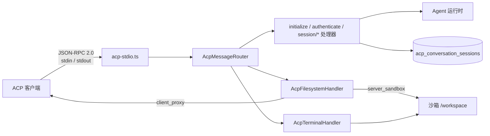
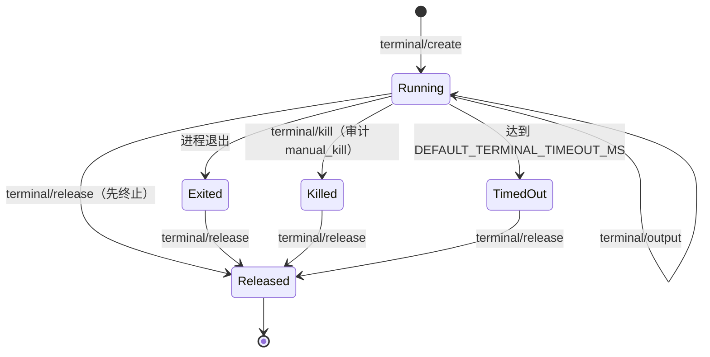

# ACP 网关

ACP 网关让外部编辑器 / AI 客户端通过 stdio 上的 JSON-RPC 2.0 驱动 AgentLoom Agent 会话、读写文件和操作沙箱终端。代码在 `agentloom-server/src/modules/acp-gateway/`，独立入口为 `agentloom-server/src/acp-stdio.ts`。

## 运行方式

`acp-stdio.ts` 用 `NestFactory.createApplicationContext(AcpStdioModule)` 启动不带 HTTP 监听的 Nest 应用上下文，从 stdin 逐行读取 JSON 消息、向 stdout 逐行写响应。服务端发给客户端的请求使用字符串 id `acp-server-<N>`，客户端的应答由 id 匹配。连接关闭或收到 SIGINT/SIGTERM 时，网关对每个已跟踪会话执行一次 `session/cancel` 清理，并拒绝所有等待中的客户端请求。

启动脚本是 `agentloom-server/package.json` 中的 `start:acp:stdio`，它运行 `agentloom-server/scripts/start-acp-stdio.mjs`：静默构建后执行 `dist/src/acp-stdio.js`。`AcpGatewayModule` 也被 `AppModule` 导入，但 HTTP / Socket.IO 服务不暴露 ACP；ACP 只经 stdio 可达。

## 连接状态机

路由器 `agentloom-server/src/modules/acp-gateway/acp-message-router.ts` 按以下顺序检查每条消息：

1. 未完成 `initialize` 时，除 `initialize` 外的请求返回 `-32001 Server not initialized`；通知被丢弃。
2. `session/*`、`terminal/*`、`fs/*` 要求连接已经 `authenticate` 成功，否则返回 `-32002 Authentication required`。
3. 除 `initialized` 与 `session/cancel` 外，以通知形式（无 `id`）发送的方法返回 `-32600 Invalid Request`。
4. 未知方法返回 `-32601 Method not found`（通知则静默忽略）。

对通知产生的任何错误都不回写。

## 入站方法（客户端 → 服务端）

方法名为源码中的字面量，统一使用 `/` 分隔。

| 方法 | 类型 | 处理器 | 参数 | 结果 |
| --- | --- | --- | --- | --- |
| `initialize` | 请求 | `agentloom-server/src/modules/acp-gateway/handlers/initialize.handler.ts` | `protocolVersion`、`clientCapabilities`（均必填） | `{ protocolVersion, serverInfo: { name: 'agentloom', version, capabilities } }` |
| `initialized` | 通知 | 路由器内联 | 无 | 仅记录已收到，无响应 |
| `authenticate` | 请求 | `agentloom-server/src/modules/acp-gateway/handlers/authenticate.handler.ts` | `token`：Supabase 签发的 JWT | 认证上下文 |
| `session/new` | 请求 | `agentloom-server/src/modules/acp-gateway/handlers/session-new.handler.ts` | `agentId`、`cwd?`（必须为绝对路径）、`mcpServers?`、`serverSandbox?`（`executionId` 或 `agentConversationId`） | `{ sessionId }` |
| `session/load` | 请求 | `agentloom-server/src/modules/acp-gateway/handlers/session-load.handler.ts` | `sessionId` | 先重放历史，再响应 |
| `session/prompt` | 请求 | `agentloom-server/src/modules/acp-gateway/handlers/session-prompt.handler.ts` | `sessionId`、`content`（ContentBlock 数组） | `{ stopReason }` |
| `session/cancel` | 通知或请求 | `agentloom-server/src/modules/acp-gateway/handlers/session-cancel.handler.ts` | `sessionId` | 始终为 `null` |
| `terminal/create` | 请求 | `agentloom-server/src/modules/acp-gateway/handlers/acp-terminal.handler.ts` | `sessionId`、命令、`cwd?`、`mode?` | `terminalId` |
| `terminal/output` | 请求 | 同上 | `sessionId`、`terminalId`、`offset?`、`outputByteLimit?` | `{ terminalId, output, nextOffset, truncated }` |
| `terminal/wait_for_exit` | 请求 | 同上 | `sessionId`、`terminalId`、`timeoutMs?` | 退出状态 |
| `terminal/kill` | 请求 | 同上 | `sessionId`、`terminalId` | 终止运行中的进程（TERM） |
| `terminal/release` | 请求 | 同上 | `sessionId`、`terminalId` | 运行中则先终止，再删除终端记录 |
| `fs/read_text_file` | 请求 | `agentloom-server/src/modules/acp-gateway/handlers/acp-filesystem.handler.ts` | `sessionId`、`path`、`mode`（必填） | `{ content: [{ type: 'text', text }] }` |
| `fs/write_text_file` | 请求 | 同上 | `sessionId`、`path`、`mode`（必填）、`content` | `{ success: true }` |

### `initialize`

服务端支持的协议版本只有 `2026-02-18`（`SUPPORTED_PROTOCOL_VERSIONS`，`agentloom-server/src/modules/acp-gateway/handlers/initialize.handler.ts:12`）；版本不符返回 `-32602`，`data` 中带 `requestedProtocolVersion` 与 `supportedProtocolVersions`。

返回的 `serverInfo.capabilities`：

- `loadSession`、`streaming`、`tools` 恒为 `true`。
- `fs.readTextFile` 为 `true`；`fs.writeTextFile` 取决于连接是否具备向客户端发请求的通道。
- `terminal: { create: true }` 仅在客户端同时声明 `terminal.create` 与 `terminal.output` 时出现。路由器不会据此拦截 `terminal/*` 调用。

客户端 `fs` 能力接受 `{ readTextFile, writeTextFile }`，也接受旧写法 `{ read, write }`；`mcpServers` 必须为字面量 `true`。

### `authenticate`

`token` 由 `agentloom-server/src/modules/acp-gateway/acp-authentication.service.ts` 校验，规则与 HTTP 侧 JWT 分支相同：先查 `revoked_tokens` 吊销表，再以 `APP_JWT_SECRET` 按 HS256、`aud=authenticated` 验签，拒绝 `mfa_pending` 令牌。失败以 `DomainException` 抛出，经路由器转换为 `-32000`（`data.type` 为 `token-revoked`、`token-expired`、`token-invalid` 或 MFA 要求）。ACP 不接受平台 API Token（`al_`）或 Agent API Key（`alak_`）。

### 会话与持久化

`session/new` 在租户事务中创建 `conversation` 模式的运行时会话，并通过 `AcpSessionMcpRegistryService` 注册客户端提供的 MCP 工具。会话状态持久化到 `acp_conversation_sessions`（`agentloom-server/src/database/schema/acp-conversation-sessions.schema.ts`，列含 `session_snapshot`、`replay_entries`）。

`session/load` 在返回响应**之前**，把每条持久化重放条目作为 `session/update` 通知发出（`update.replayed = true`），随后恢复 MCP 工具与终端。租户不匹配或会话模式不对时返回 `-32602`，`data.reason` 为 `Session not found`。

`session/prompt` 期间服务端持续发送 `session/update`；同一会话已有进行中的 prompt 时返回 `-32003 Prompt already in progress`（`agentloom-server/src/modules/acp-gateway/handlers/session-prompt.handler.ts:80`）。

`session/cancel` 移除会话跟踪，把等待中的权限请求按 `cancelled` 应答、把等待中的 fs 代理请求按 `{ cancelled: true }` 应答，清理 MCP 工具与终端，再取消运行时。任一清理步骤失败时返回 `-32603`，`data.cleanupFailures` 列出失败项。

## 出站消息（服务端 → 客户端）

| 方法 | 类型 | 说明 |
| --- | --- | --- |
| `session/update` | 通知 | `params: { sessionId, update }`；`update.type` 为 `plan`、`user_message`（仅重放时出现）、`agent_message_chunk`、`tool_call`、`decision`（定义见 `agentloom-server/src/modules/acp-gateway/acp-types.ts`，映射见 `agentloom-server/src/modules/acp-gateway/acp-session-update.mapper.ts`） |
| `session/request_permission` | 请求 | 工具调用进入 `awaiting_permission` 时发出；`params: { sessionId, toolCall, options }` |
| `fs/read_text_file` / `fs/write_text_file` | 请求 | 仅 `client_proxy` 模式，服务端把文件操作转发给客户端执行（`agentloom-server/src/modules/acp-gateway/services/acp-filesystem-proxy.service.ts`） |

`session/request_permission` 的选项 id 为 `allow-once`、`allow-always`、`reject-once`、`reject-always`。客户端应答 `{ outcome: 'selected', optionId }` 或 `{ outcome: 'cancelled' }`。`allow-*` 映射为批准、`reject-*` 映射为拒绝；`always` 不会被持久记住，每次调用都会再次询问。

`session/update` 只由服务端发出，不存在入站的 `session/update` 方法。

## 文件系统

`fs/*` 的 `mode` 参数必填，决定文件在哪一侧：

| 模式 | 读写位置 | 约束 |
| --- | --- | --- |
| `client_proxy` | 客户端本地文件系统 | 客户端须在 `initialize` 中声明对应 fs 能力，否则 `-32004`；相对路径需要会话有 `cwd`；服务端不做路径边界限制 |
| `server_sandbox` | 会话绑定的沙箱 | 会话须有 `serverSandbox` 绑定，且对应 `sandbox_sessions` 状态为 `ready` 或 `busy`；路径按字面解析后必须位于 `/workspace` 之下且不等于 `/workspace` 本身；文件上限 10 MiB；含 NUL 字节视为二进制并拒绝 |

`server_sandbox` 的常量定义在 `agentloom-server/src/modules/acp-gateway/services/acp-filesystem-sandbox.service.ts`（`SANDBOX_WORKSPACE_ROOT`、`MAX_TEXT_FILE_BYTES`）。服务端只做字面路径校验，实际 IO 经 `SandboxRuntimeDriver` 在沙箱内执行。

写文件时，网关先校验参数，再向客户端发 `session/request_permission`，获批后才写入；拒绝或取消会记审计事件 `acp.fs.permission.denied` / `acp.fs.permission.cancelled`。

## 终端

终端只在沙箱内运行，`mode` 只接受 `server_sandbox`（或省略）。限制常量在 `agentloom-server/src/modules/acp-gateway/services/acp-terminal-proxy.service.ts`：

| 常量 | 值 | 含义 |
| --- | --- | --- |
| `DEFAULT_OUTPUT_BYTE_LIMIT` | 1 MiB | 每个终端的输出环形缓冲，按 UTF-8 边界裁剪 |
| `MAX_CONCURRENT_TERMINALS_PER_SESSION` | 5 | 每会话同时运行的终端上限 |
| `DEFAULT_TERMINAL_TIMEOUT_MS` | 300000 | 终端存活上限，到时以 TERM 终止 |
| `BLOCKED_COMMANDS` | `bash` `sh` `zsh` `fish` `sudo` `su` `docker` `kubectl` | 禁止直接执行的命令 |

创建前的检查：命令不在 `BLOCKED_COMMANDS` 中；参数不含 `&&`、`||`、`;`、`$(`、反引号、回车、换行；带递归标志的 `rm` 不得指向 `/`、`.`、`..`、`~` 或工作区本身及其外部；路径类参数与 `cwd` 必须解析到 `/workspace` 内。被拒绝时返回 `-32004`，`data.reason` 为 `terminal_command_not_allowed`、`terminal_command_pattern_not_allowed`、`terminal_cwd_escaped_workspace` 或 `terminal_session_limit_exceeded`，并写审计。

生命周期：

- `terminal/output` 只在进程运行时可用；退出或被终止后返回 `-32004 terminal_output_unavailable`。`offset` 超出末尾返回 `-32602`；`offset` 已被环形缓冲裁掉返回 `-32004 terminal_output_offset_trimmed`。
- `terminal/wait_for_exit` 带 `timeoutMs` 时，等待超时返回 `-32004 terminal_wait_timeout`，**不**终止进程。
- 存活超时会终止进程并审计 `acp.terminal.server_sandbox.timed_out`；之后的 `terminal/wait_for_exit` 返回 `-32004 terminal_timeout`。
- 会话清理时终止的终端以原因 `session_cleanup` 审计。

## 错误码

| 代码 | 消息 / 场景 | 定义处 |
| --- | --- | --- |
| `-32700` | `Parse error`：消息不是合法 JSON | `agentloom-server/src/modules/acp-gateway/acp-jsonrpc.ts` |
| `-32600` | `Invalid Request`：信封不合法，或非通知方法以通知形式发送 | `acp-jsonrpc.ts`、`acp-message-router.ts` |
| `-32601` | `Method not found` | `acp-message-router.ts` |
| `-32602` | `Invalid params`；`data.reason` 可为 `Session not found`、`Relative fs path requires session cwd`、`terminal_not_found`、`terminal_output_offset_invalid`；协议版本不符 | 各处理器 |
| `-32603` | `Internal error` 及处理器失败（创建会话、MCP 转发初始化/恢复、历史重放、取消清理、prompt 无终态事件、权限应答不合法、终端创建失败、fs 代理失败）；stdio 层未捕获异常也以此返回且 `id` 为 `null` | `acp-message-router.ts`、各处理器、`agentloom-server/src/acp-stdio.ts` |
| `-32000` | `DomainException` 转换，`data` 含 `status`、`type`、`detail`、`errors?`、`extensions?`（认证失败走这里） | `acp-message-router.ts` |
| `-32001` | `Server not initialized` | `acp-message-router.ts` |
| `-32002` | `Authentication required`；`session/new` 缺少租户上下文时也返回 | `acp-message-router.ts`、`handlers/session-new.handler.ts` |
| `-32003` | `Prompt already in progress` | `handlers/session-prompt.handler.ts` |
| `-32004` | 能力、策略或沙箱拒绝：客户端不支持所需 fs 能力、fs 代理通道不可用、权限策略拒绝、沙箱错误、终端策略/上限/超时 | `services/acp-filesystem-proxy.service.ts`、`services/acp-terminal-proxy.service.ts` 等 |
| `-32005` | 已取消：fs 代理请求或文件权限请求被取消 | `services/acp-filesystem-proxy.service.ts` |

表中省略目录前缀的文件均位于 `agentloom-server/src/modules/acp-gateway/` 下。
