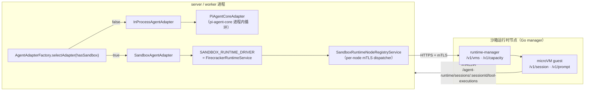
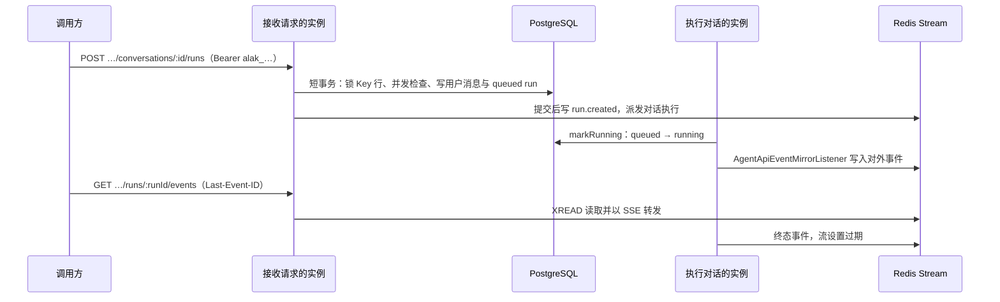

# Agent 运行态

> 本页回答：为什么 Agent 有两种运行态，它们各自在哪个进程、哪台机器上执行？

Agent 定义上的 `runtime_mode` 列决定一次对话或一个工作流 agent 节点由谁执行模型循环与工具调用。枚举 `agent_runtime_mode_enum` 只有 `sandbox` 与 `no_sandbox` 两个值，列默认 `sandbox`（`agentloom-server/src/database/schema/agent-definitions.schema.ts:30-52`）。版本快照里的 `runtimeMode` 优先于定义上的值，其余情况一律按 `sandbox` 处理（`resolveAgentRuntimeMode`，`agentloom-server/src/modules/agent-execution/agent-execution-worker-persistence.service.ts:627-639`）。

两种运行态的差别在于 Agent 能否碰到一个可写的文件系统和终端：

- `no_sandbox`：模型循环跑在 server/worker 的 Node 进程内，工具全部由服务端提供（MCP、知识库检索、代码执行等），不分配任何 VM。
- `sandbox`：模型循环跑在一台 Firecracker microVM 的 guest 里，Agent 拥有 `/workspace/` 工作区和原生读写/编辑/终端工具；服务端只负责编排、转发和回调。

## 运行时端口与适配器选择

上层模块只依赖协议无关的接口 `IAgentRuntime`（`createSession`、`loadSession`、`prompt`、`cancel` 以及可选的工具提供者、工具审批方法），定义在 `agentloom-server/src/modules/agent/ports/agent-runtime.port.ts`。

`AgentAdapterFactory.selectAdapter(hasSandbox)` 是唯一的分叉点：`true` 返回 `SandboxAgentAdapter`，`false` 返回 `InProcessAgentAdapter`（`agentloom-server/src/modules/agent/agent-adapter.factory.ts:20-22`）。它以 `AGENT_RUNTIME_FACTORY` 令牌导出；`AGENT_RUNTIME` 令牌固定绑定 `InProcessAgentAdapter`（`agentloom-server/src/modules/agent/agent.module.ts:54-55`）。对话 worker 与工作流 agent 节点都在算出 `usesSandboxRuntime` 后调用这个工厂。

### `no_sandbox`：进程内执行

`InProcessAgentAdapter` 是一层 facade：它在构造时创建一个 `PiAgentCoreAdapter`，并负责会话快照、会话级工具提供者注册，以及把工作流会话写入 checkpoint、把对话会话交给 `SessionPersistenceService` 持久化（`agentloom-server/src/modules/agent/in-process-agent.adapter.ts:29-125`）。真正的 Agent 循环在 `PiAgentCoreAdapter`（`agentloom-server/src/modules/agent/pi-agent-core.adapter.ts`）里，基于 `@earendil-works/pi-agent-core`。

pi 系列包只发布 ESM，而 NestJS server 以 CJS 运行，因此不能顶层静态 import，只能经 `agentloom-server/src/modules/agent/pi-imports.ts` 中的 `importPiAgentCore`、`importPiAi`、`importPiAiCompat` 动态 `import()`。`importPiAiCompat` 存在的原因是 pi-ai 0.84 把 `streamSimple` 等便利函数移到了 `/compat` 子路径，而 pi-agent-core 的 Agent 需要显式注入 `streamFn`。

这条路径没有隔离边界：工具执行与 server 共享进程，所以它只提供服务端注册的工具，不提供原生文件/终端工具。

### `sandbox`：Firecracker microVM

`SandboxAgentAdapter`（`agentloom-server/src/modules/agent/sandbox-agent.adapter.ts`）同样实现 `IAgentRuntime`，但把职责拆给几个边界服务：

| 服务 | 职责 |
| --- | --- |
| `SandboxSessionRuntimeService` | 解析 sandbox 绑定、等待 guest 就绪、代理 `/v1/prompt` 与 `/v1/abort` |
| `SandboxModelConfigService` | 由租户模型配置生成 pi 的 `settings`/`models`、解析运行时密钥，并初始化 guest 会话（`/v1/session`） |
| `SandboxToolRegistryService` | 把服务端工具序列化为远程工具描述，生成回调地址与回调令牌 |
| `SandboxPtyService` | 终端（PTY）代理 |

guest 内的 Agent 需要调用服务端工具（MCP、知识库、子 Agent 等）时，回调 `POST /api/v1/agent-runtime/sessions/:sessionId/tool-executions`（`agentloom-server/src/modules/agent/agent-runtime.controller.ts:18-23`）。该路由标记 `@Public()`，鉴权靠每个会话独立的回调令牌（`agentloom-server/src/modules/agent/sandbox-tool-registry.service.ts:634-692`）。回调基址取 `APP_SANDBOX_CALLBACK_BASE_URL`；未设置时在容器内回退为 `http://<HOSTNAME>:<APP_PORT>/api/v1`（同文件 `:649-666`）。server 与 worker 各自需要一个 guest 能访问到的地址，部署时分别配置，见 [/deploy/firecracker](/deploy/firecracker)。

工具审批在 sandbox 路径上有超时：`TOOL_PERMISSION_TIMEOUT_MS` 为 30000 ms（`agentloom-server/src/modules/agent/sandbox-agent.adapter.ts:49`）。

## 沙箱驱动与多节点调度

VM 的生命周期操作通过端口 `SandboxRuntimeDriver`（`agentloom-server/src/modules/sandbox/sandbox-runtime-driver.port.ts`）完成，`SandboxModule` 把令牌 `SANDBOX_RUNTIME_DRIVER` 以 `useExisting` 绑定到 `FirecrackerRuntimeService`（`agentloom-server/src/modules/sandbox/sandbox.module.ts:37-40`）。VM 的创建由 `sandbox-lifecycle` 队列异步执行（`SandboxLifecycleWorker.handleCreate`，`agentloom-server/src/modules/sandbox/sandbox-lifecycle.worker.ts:85-114`），成功后把 runtime handle 写回 `sandbox_sessions`。

### 节点注册表

运行时节点存放在 `sandbox_runtime_nodes`（`agentloom-server/src/database/schema/sandbox-runtime-nodes.schema.ts`）。这是平台级表：没有 `tenant_id`，也不挂租户 RLS 策略，因为节点是所有租户共享的物理资源。节点状态枚举为 `active`、`draining`、`disabled`：只有 `active` 节点参与调度，`draining` 保留已有 VM 但不接新 VM，`disabled` 完全下线（`agentloom-server/src/modules/sandbox/sandbox-runtime-node-registry.service.ts:128-132`）。

注册表为空时，`SandboxRuntimeNodeRegistryService.onModuleInit` 用 `APP_FIRECRACKER_RUNTIME_URL` 与 `APP_FIRECRACKER_RUNTIME_SERVER_NAME` 播种一个 id 为 `default` 的节点；表非空后这两个变量不再起作用，节点以数据库为准（同文件 `:76-107`）。节点列表在进程内缓存 10 秒（`CACHE_TTL_MS`）。

节点由 `/api/v1/sandbox-nodes` 管理（`SandboxNodeController`，`agentloom-server/src/modules/sandbox/sandbox-node.controller.ts:36-38`）：`GET` 列出节点并附带实时容量，`POST` 注册，`PATCH :nodeId` 修改，`DELETE :nodeId` 注销。除 `@Roles('owner', 'admin')` 外，每个请求还要过 `assertNodeAdmin`：`APP_DEPLOYMENT_MODE` 为 `private` 时放行；否则只允许 `APP_SANDBOX_NODE_ADMIN_TENANT_IDS` 白名单中的租户，默认空即全部拒绝（`agentloom-server/src/modules/sandbox/sandbox-runtime-node-registry.service.ts:319-328`）。删除要求节点先置为 `disabled`，且 manager 报告的 `vmsUsed` 为 0；节点不可达时只能带 `force=true` 删除（同文件 `:219-245`）。

### mTLS 连接

manager 只接受 mTLS，所以节点 `baseUrl` 必须是 `https://`。注册表为每个节点持有一个 undici `Agent` 作为 dispatcher，所有节点共用一套客户端证书，路径来自 `APP_FIRECRACKER_RUNTIME_CA`、`APP_FIRECRACKER_RUNTIME_CERT`、`APP_FIRECRACKER_RUNTIME_KEY`；SNI 取节点的 `server_name`，为空时取 `baseUrl` 的主机名（`getDispatcher`，同文件 `:280-307`）。证书签发与 manager 侧配置见 [/deploy/firecracker](/deploy/firecracker) 与 [/dev/firecracker-runtime](/dev/firecracker-runtime)。

### 容量择优

`FirecrackerRuntimeService.createRuntime` 先调用 `pickNodes` 选候选节点（`agentloom-server/src/modules/sandbox/firecracker-runtime.service.ts:359-404`）：

1. 取全部 `active` 节点，并行请求每个节点的 `GET /v1/capacity`（探针超时 3000 ms）；探针失败或返回非 2xx 的节点直接剔除。
2. 在健康节点中筛出剩余 VM 数、vCPU、内存、磁盘都能容纳本次 `SandboxConfig` 的节点，按空闲内存比（剩余/上限）降序排列。用比例而不是绝对值，是为了不让大机器长期被优先占满。
3. 若没有节点放得下，不直接失败，而是把全部健康节点交给下一步，由 manager 的 503 做最终判定，因为容量快照可能已过时。

随后按顺序向候选节点 `POST /v1/vms`。返回 503 或网络错误时换下一个节点；其他状态码（参数错误、证书错误、manager 内部错误）在每个节点上都会同样失败，直接上抛（`isRetryableNodeFailure`，同文件 `:482-486`）。全部候选失败时抛出 `SandboxCreationException`。

### 复合 runtime handle

manager 返回的 handle 只在该节点内有意义。server 把它编码为 `<nodeId>/<managerHandle>` 存入 `sandbox_sessions.runtime_handle`，之后的启动、停止、删除、guest 代理、exec 等操作都先用 `splitRuntimeHandle` 解析出节点再路由（`agentloom-server/src/modules/sandbox/sandbox-runtime-handle.util.ts`）。分隔符选 `/` 而不是 `:`，因为 exec handle 的格式是 `<runtimeHandle>:<guestExecId>` 并按第一个 `:` 切分。解析失败或节点不存在时一律抛 `SandboxRuntimeNotFoundException`，不会回退到任何其他节点，以免把请求发到错误的机器。

## 子 Agent

Agent 可以通过会话工具调用子 Agent。`SubAgentToolsProvider`（`agentloom-server/src/modules/agent-execution/subagent/subagent-tools.provider.ts`）为父会话注册 `call_subagent`、`spawn_subagent`、`wait_for_subagents`、`get_subagent_status` 四个工具，并施加两项限制：

- 同一父会话内同时运行的子 Agent 不超过 `MAX_RUNNING_SUBAGENTS`（`10`，同文件 `:33`）。
- 嵌套深度不超过 `MAX_SUB_AGENT_DEPTH`（`5`，`agentloom-server/src/modules/execution/node-handlers/sub-agent.handler.ts:7`），解析子 Agent 时还会用已访问的 Agent id 集合拒绝循环引用。

运行态在父子之间的组合规则：

| 父 Agent 实际运行态 | 子 Agent `runtime_mode` | 结果 |
| --- | --- | --- |
| sandbox | `sandbox` | 子 Agent 使用自己的 sandbox 配置 |
| sandbox | `no_sandbox` | 复用父 Agent 的 sandbox 绑定执行，原生工具策略降为只读（`buildReadOnlyNativeToolPolicy`：只开读，关闭写、编辑、终端） |
| 进程内 | `no_sandbox` | 进程内执行 |
| 进程内 | `sandbox` | 拒绝，抛出「无 sandbox Agent 不支持调用有 sandbox 的子 Agent」 |

对话路径的判定在 `agentloom-server/src/modules/agent-execution/agent-execution-worker-persistence.service.ts:830-864`，工作流路径的判定在 `agentloom-server/src/modules/execution/workflow-agent-adapter.ts:182-218`。拒绝最后一种组合的原因是：进程内父 Agent 没有可交给子 Agent 的 VM 绑定。

## 工作流中的 agent 节点

工作流 agent 节点不直接调用 `IAgentRuntime`，而是经 `WorkflowAgentAdapter`（`agentloom-server/src/modules/execution/workflow-agent-adapter.ts`）桥接。执行器 `workflow-agent-node.executor.ts` 通过执行模块自己的 `AgentAdapterFactory.createFromAgentDefinition(agentDefinitionId, sandboxConfig)` 为每次执行创建一个适配器（`agentloom-server/src/modules/execution/adapters/agent-adapter-factory.ts:24-44`）。注意它与 agent 模块的 `AgentAdapterFactory` 同名但不是同一个类：前者生产 `WorkflowAgentAdapter`，后者在两个 `IAgentRuntime` 实现之间二选一，前者内部会调用后者。

`WorkflowAgentAdapter.execute` 依次：

1. 加载 Agent 定义或指定版本快照，编译出运行时配置与运行态。
2. 合并上游节点经端口传入的 MCP 工具绑定、知识库绑定、输出 schema 和技能（`resolveWorkflowExtensions`，同文件 `:600-658`）。
3. 按上一节的规则决定运行态；`sandbox` 运行态时确保执行级 sandbox 绑定存在（`ensureSandboxBinding`）。
4. 选择 `IAgentRuntime`，注册子 Agent 工具，然后驱动工具轮次；工具轮次上限 `MAX_TOOL_ROUNDS` 为 `10`（同文件 `:83`），超出即失败。
5. 运行期间按 `PROGRESS_CHECKPOINT_INTERVAL_MS`（400 ms）把进度写回执行步骤 checkpoint。

## Skills 注入

技能以系统提示词的形式进入 Agent，两种运行态都走同一套逻辑。技能来源有两处：运行时配置中的 `skillIds`，以及画布上通过 `skills-in` 句柄连到 `agent-main` 节点的 `skill` 节点（`extractConversationSkillIds`，`agentloom-server/src/modules/agent-execution/conversation-skill-resolution.ts:92-125`）；工作流中还会合并上游节点传入的技能。

`SkillResolverService`（`agentloom-server/src/modules/skill/skill-resolver.service.ts`）负责两步：

- `resolveSkillsForAgent` 只保留 `status` 为 `active` 的技能，按传入 id 的顺序返回名称、描述、正文和文件表。
- `buildSkillAugmentedPrompt` 在基础系统提示词后追加 `<available_skills>` 摘要；当全部技能正文总长不超过 `SKILL_CONTENT_SIZE_THRESHOLD`（50 KiB）时，再以 `<skill name="…">` 块追加完整正文，超过时只保留摘要。

技能解析失败只记录 warning 并退回基础提示词，不会中断执行。sandbox 运行态下，对话 worker 还会把技能载荷连同模型与 MCP 配置组装为 `PiConfigInput`，随 sandbox 创建任务一起提交（`agentloom-server/src/modules/agent-execution/agent-execution-worker-persistence.service.ts:875-911`）。

## 对话跨实例派发

对话执行队列 `agent-conversation-execution` 以 conversationId 作为 jobId，同一对话同一时刻只有一个 loop，它可能运行在任一 server / worker 实例上。新消息、取消请求可能落在另一个实例，`AgentExecutionService`（`agentloom-server/src/modules/agent-execution/agent-execution.service.ts`）用两个 Redis pub/sub 频道把它们送到 loop 所在实例，所有实例在 `onModuleInit` 时订阅：

| 频道 | 常量 | 发布时机 | 收到后 |
| --- | --- | --- | --- |
| `__agent_conversation_cancel__` | `AGENT_CONVERSATION_CANCEL_CHANNEL` | `abortExecution`：先中止本实例的 loop，再发布 | 中止本实例上该对话的活跃 loop |
| `__agent_conversation_notify__` | `AGENT_CONVERSATION_NOTIFY_CHANNEL` | 派发时发现该对话的 job 处于 `active` 状态 | 唤醒本实例上空闲等待新消息的 loop |

派发顺序（`dispatchConversationExecution`，在租户事务提交后执行）：本实例有活跃 loop 时直接唤醒；否则查已有 job，`completed` / `failed` 的先删除再入队，`active` 的经通知频道唤醒、不重复入队，其余状态直接跳过。

loop 可能恰好在唤醒消息到达前因空闲超时退出，此时新消息无人处理。`AgentExecutionWorker.onCompleted`（`agentloom-server/src/modules/agent-execution/agent-execution.worker.ts`）在每个对话 job 完成后检查：对话仍为 `active`、运行状态为 `idle`，且存在 `lastProcessedMessageId` 之后的用户消息时，重新调用 `dispatchExecution` 补发。

## Agent 对外 API 运行链

第三方通过 `/api/v1/agent-api/**` 调用已发布的 Agent；调用方文档见 [/api/agent-api](/api/agent-api)，设计背景见 [ADR 0001](/dev/decisions/0001-agent-external-api)。这条链路复用上节的对话执行，只在外围增加 run、事件流和清扫。

- **鉴权与事务**：`agentloom-server/src/modules/agent-api/agent-api.controller.ts` 同时声明 `@Public()` 与 `@UseGuards(AgentApiKeyGuard)`。守卫只设置 `request.agentApiKey`，不设置 `request.user`，所以全局 `TenantTransactionInterceptor` 不为这些请求开事务；`AgentApiService`（`agentloom-server/src/modules/agent-api/agent-api.service.ts`）在需要读写数据库处各自调用 `runInTenantTransaction`，以 Key 所属租户开短事务。SSE 长连接因此不会占住数据库事务。
- **run**：每次调用写一条 `agent_api_runs`（`agentloom-server/src/database/schema/agent-api-runs.schema.ts`）。建 run 的事务中先以 `SELECT … FOR UPDATE` 锁住 `agent_api_keys` 中该 Key 的行，使同一 Key 的建 run 请求串行，再统计该 Key `queued` / `running` 的 run 数：达到 `maxConcurrentRuns` 返回 `concurrency-limit-exceeded`；同一对话已有 `queued` / `running` 的 run 时返回 `conversation-busy`。带 `Idempotency-Key` 的请求在持锁后再查一次幂等记录。
- **认领**：执行对话的 worker 取到待处理消息、开始一轮之前，调用 `AgentApiRunService.markRunning`（`agentloom-server/src/modules/agent-api-runtime/agent-api-run.service.ts`）把对应 run 置为 `running`；同一事务中找出已在执行前被取消或失败的 run 输入，从本轮剔除。这是为了覆盖批次在取消之前加载的竞态。`AgentExecutionWorkerRuntimeService`（`agentloom-server/src/modules/agent-execution/agent-execution-worker-runtime.service.ts`）加载待处理消息和重建历史时，同样排除这类作废输入（对应 run `started_at` 为空，状态为 `cancelled` 或 `failed`）。Studio 发送的消息没有 run，不受影响。
- **事件流**：`AgentApiEventMirrorListener`（`agentloom-server/src/modules/agent-api-runtime/agent-api-event-mirror.listener.ts`）运行在执行对话的进程内，监听对话执行事件，只处理本进程登记过 run 的对话，把事件映射为对外 run 事件后 `XADD` 到 Redis Stream `agentloom:agent-api:run:{runId}:events`（`buildAgentApiRunEventsKey`，长度近似上限 `AGENT_API_RUN_EVENTS_MAXLEN`）。终态事件只由 run 服务在事务提交后写入。监听器吞掉自身异常，不影响 worker。
- **SSE**：任一实例都能响应 `GET …/runs/:runId/events`。`AgentApiEventStreamService`（`agentloom-server/src/modules/agent-api-runtime/agent-api-event-stream.service.ts`）每个进程只用一条 Redis 读连接，所有订阅共享一个 `XREAD BLOCK` 循环。SSE 帧的 `id` 是 Stream entry id，客户端以 `Last-Event-ID` 续传，不带时从头回放。run 进入终态后流保留 `AGENT_API_RUN_EVENTS_TTL_SECONDS`（3600 秒），过期后返回 `run-events-expired`（410）。
- **清扫**：`agent-api-maintenance` 队列每 5 分钟执行一次 `AgentApiMaintenanceWorker`（`agentloom-server/src/modules/agent-api-runtime/agent-api-maintenance.worker.ts`）：创建超过 `AGENT_API_STALE_RUN_HOURS`（2 小时）仍为 `queued` / `running` 的 run 视为执行进程已丢失，标记为 `failed`（`run-worker-lost`）并发布终态；清除创建超过 24 小时的幂等键；把超过空闲时长（环境变量 APP_AGENT_API_CONVERSATION_IDLE_HOURS，默认 24 小时，未列入 env schema 与模板）未更新的 API 来源对话置为 `ended`。常量见 `agentloom-server/src/modules/agent-api-runtime/agent-api-runtime.constants.ts`。

## 相关

- [/dev/server/queues](/dev/server/queues)：`sandbox-lifecycle` 等队列
- [/dev/server/database](/dev/server/database)：`sandbox_sessions`、`sandbox_runtime_nodes` 等表
- [/dev/firecracker-runtime](/dev/firecracker-runtime)：Go runtime-manager 与 guest
- [/deploy/firecracker](/deploy/firecracker)：节点部署、证书与回调地址配置
