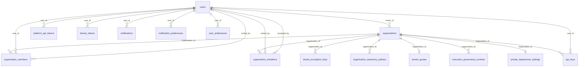
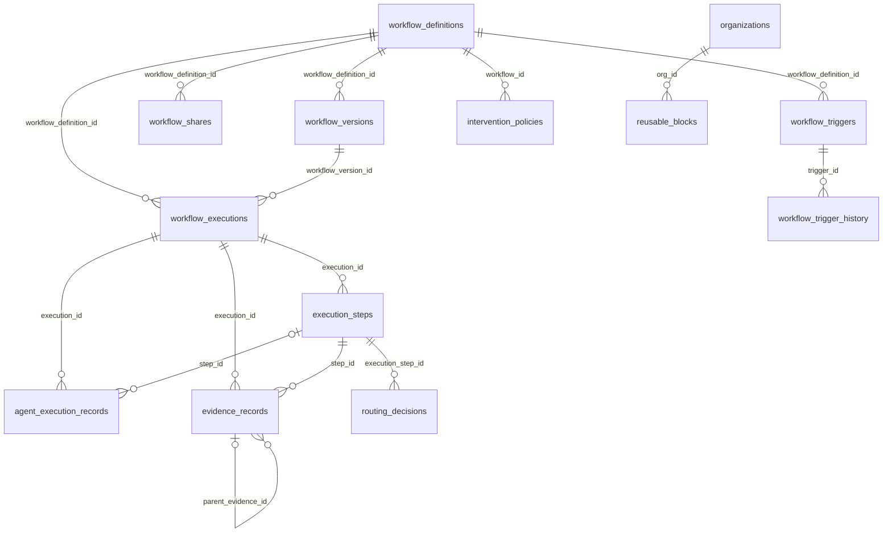
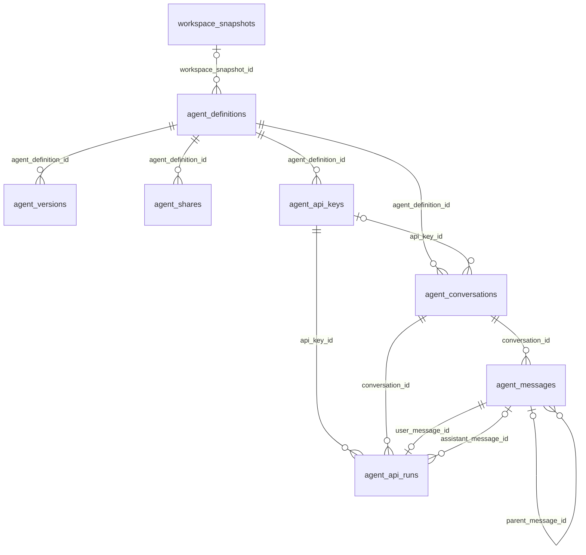
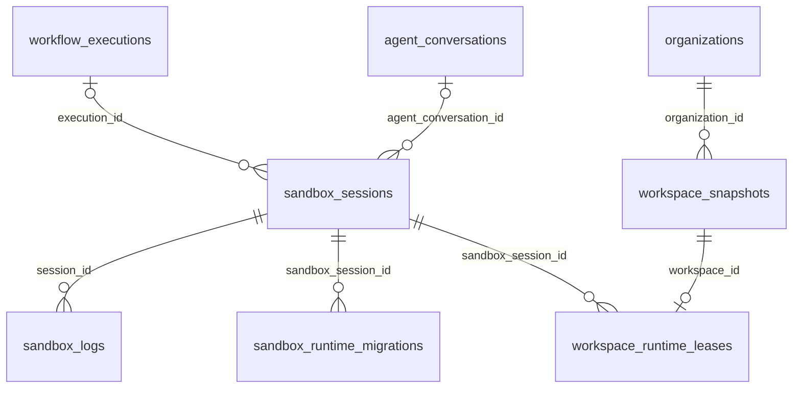
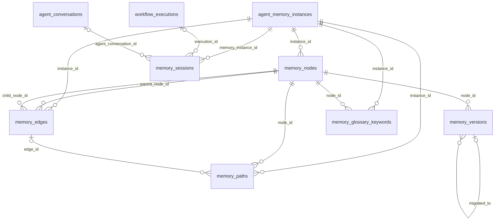
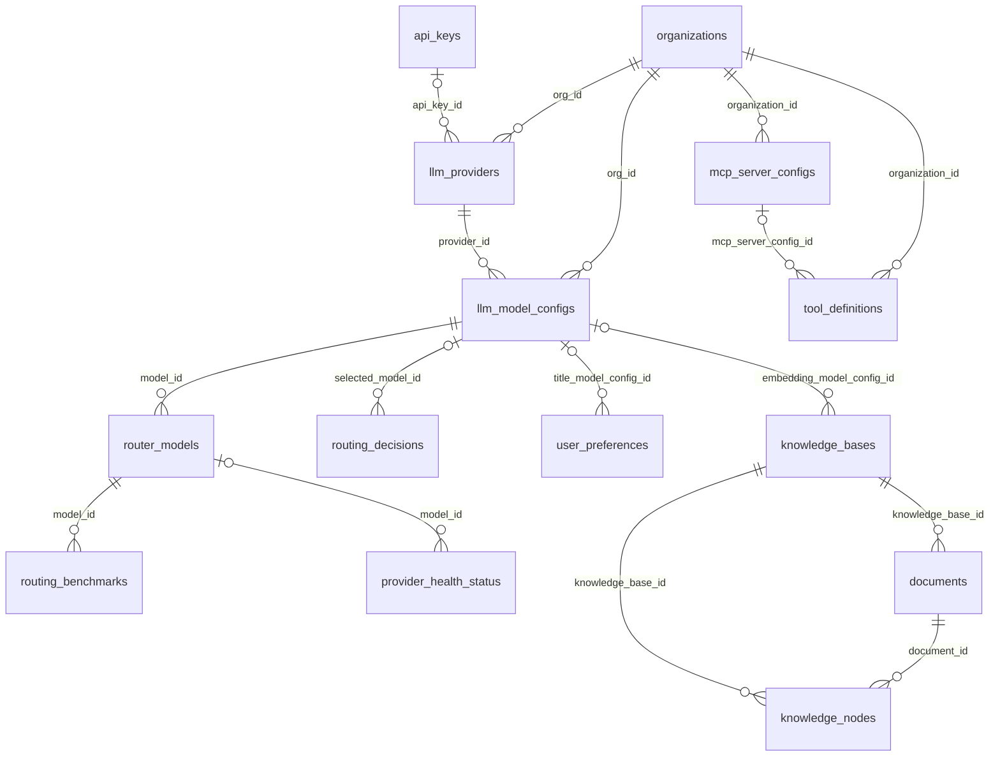
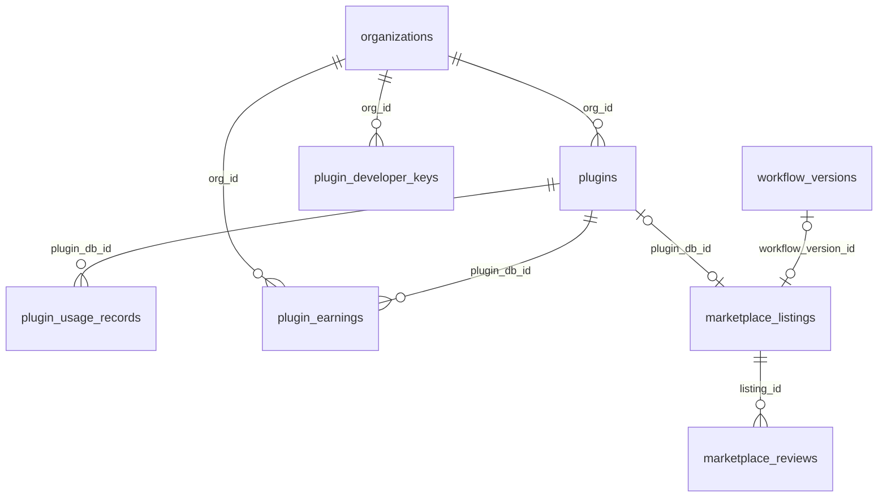
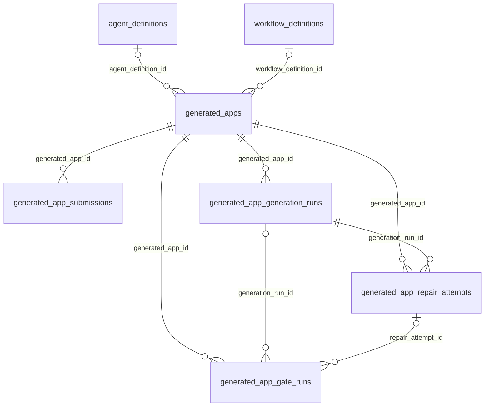

# 数据库

服务端用 Drizzle ORM 声明 PostgreSQL schema，schema 文件位于 `agentloom-server/src/database/schema/`，由 `agentloom-server/src/database/schema/index.ts` 统一导出；迁移由 Drizzle Kit 生成到 `agentloom-server/src/database/migrations/`（见 `agentloom-server/drizzle.config.ts`）。

本页前半部分是参考（表清单、外键关系图），后半部分「租户隔离为什么放在数据库层」是解释。

## 表清单

<!--@include: ../../_generated/tables.md-->

## 外键关系图

以下各图只画 schema 中用 `.references(` 声明的外键，按业务域拆分；同一张表可能出现在多张图里。约定：

- 关系线的标签是子表上的外键列。`||` 表示外键列 `NOT NULL`，`|o` 表示可空；`o|` 在子表一侧表示该外键列上有唯一索引（一对一）。
- 绝大多数表都有 `created_by` / `updated_by` 等指向 `users.id` 的外键，除「身份与组织」图外均省略。
- 各表的 `tenant_id` 列是普通 `uuid`，不是外键；例外是 `router_models.tenant_id` 与 `provider_health_status.tenant_id`，它们引用 `organizations.tenant_id`。
- 没有任何外键的表不出现在图中：`acp_conversation_sessions`、`audit_logs`、`audit_log_archives`、`optimization_suggestions`、`revoked_tokens`、`sandbox_runtime_nodes`、`workflow_templates`。
- `users.supabase_user_id` 引用 Supabase 的 `auth.users.id`（不在本仓库 schema 内，图中省略）。

### 身份与组织



`tenant_encryption_keys` 在 `organization_id` 上有一个仅覆盖 `status = 'active'` 的部分唯一索引，因此一个组织可以有多条历史密钥、但只有一条活跃密钥（`agentloom-server/src/database/schema/tenant-encryption-keys.schema.ts:51`）。

### 工作流与执行



`workflow_definitions.published_version_id` 指向已发布版本，但 schema 中没有为它声明外键（`agentloom-server/src/database/schema/workflow-definitions.schema.ts:109`）。

### Agent 与对话



`agent_api_runs` 在 `conversation_id` 上的唯一索引只覆盖 `queued` / `running` 状态，即同一对话同时只有一个进行中的 run（`agentloom-server/src/database/schema/agent-api-runs.schema.ts:86`）。

### 沙箱运行时与工作区



`sandbox_runtime_nodes` 与 `sandbox_sessions` 之间没有外键：节点标识编码在 `sandbox_sessions.runtime_handle` 的前缀里（`agentloom-server/src/database/schema/sandbox-runtime-nodes.schema.ts:16`）。

### Agent 记忆



### 模型、路由与知识库



### 插件与市场



`marketplace_listings` 的两个外键列各有一个 `IS NOT NULL` 条件的部分唯一索引，因此一个工作流版本或一个插件最多对应一条上架记录（`agentloom-server/src/database/schema/marketplace-listings.schema.ts:173`）。

### 生成式应用



生成式应用的业务流程见 [/dev/server/generated-apps](/dev/server/generated-apps)。

## 行级安全（RLS）

### 策略工厂

策略在 schema 的表回调里声明，三个工厂函数定义在 `agentloom-server/src/database/schema/rls-policies.ts`，生成的策略都授予 Supabase 的 `authenticated` 角色：

| 工厂函数 | 生成的策略 | 条件 | 用法 |
| --- | --- | --- | --- |
| `createDirectTenantPolicies(tableName)` | `<table>_select_policy`、`_insert_policy`、`_update_policy`、`_delete_policy` | `tenant_id = get_tenant_id()` | 表自身有 `tenant_id` 列；默认选择 |
| `createAppendOnlyTenantPolicies(tableName)` | 只有 `_select_policy`、`_insert_policy` | `tenant_id = get_tenant_id()` | 只追加的表：`audit_logs`、`audit_log_archives` |
| `createJoinTenantPolicies(tableName, fkColumn, parentTable, parentPk = 'id')` | 四条，同上 | `EXISTS (SELECT 1 FROM <parentTable> WHERE <parentTable>.<parentPk> = <table>.<fkColumn> AND <parentTable>.tenant_id = get_tenant_id())` | 表没有 `tenant_id`、靠外键归属父表：`organization_members`、`organization_invitations`、`execution_steps`、`routing_benchmarks`、`sandbox_logs` |

`createDirectTenantPolicies` 的用法是在 `pgTable` 第三个参数返回的数组里展开，例如 `agentloom-server/src/database/schema/organizations.schema.ts:62`：

```ts
(table) => [
  uniqueIndex('idx_organizations_tenant_id').on(table.tenantId),
  // 展开为 SELECT / INSERT / UPDATE / DELETE 四条策略
  ...createDirectTenantPolicies('organizations'),
],
```

`get_tenant_id()` 是迁移中创建的 SQL 函数（`agentloom-server/src/database/migrations/0005_lazy_tomorrow_man.sql`），返回 `NULLIF(current_setting('app.current_tenant', true), '')::uuid`；schema 侧通过 `agentloom-server/src/database/schema/rls-helpers.ts` 中的 `getTenantId` 引用它。会话变量未设置时函数返回 `NULL`，所有 `tenant_id = get_tenant_id()` 条件都不成立。

### 不走租户策略的表

| 表 | schema 中的处理 |
| --- | --- |
| `sandbox_runtime_nodes` | 平台级表，没有 `tenant_id`，不挂策略；隔离由管理 API 的鉴权保证（`agentloom-server/src/database/schema/sandbox-runtime-nodes.schema.ts:8`） |
| `marketplace_reviews` | 启用 RLS，但四条策略的条件都是 `true`（`agentloom-server/src/database/schema/marketplace-reviews.schema.ts:47`） |
| `users`、`device_tokens`、`platform_api_tokens`、`revoked_tokens`、`workflow_templates` | schema 中没有声明策略 |

`workflow_shares` 与 `agent_shares` 使用 `createDirectTenantPolicies`，只约束管理端（创建者租户）的列表与撤销；匿名访客与其他租户按 `share_token` 读取、导入时走 `ShareService` 的原始连接，不经过租户事务。

其余表都使用 `createDirectTenantPolicies`。

### 租户事务

RLS 只在租户事务里生效。`runInTenantTransaction(db, tenantId, operation)`（`agentloom-server/src/common/interceptors/tenant-transaction.context.ts:31`）开启事务后依次执行：

1. `SET LOCAL ROLE authenticated`，让策略的目标角色生效；
2. `SELECT set_config('app.current_tenant', <tenantId>, true)`，第三个参数 `true` 使设置只在本事务内有效；
3. 把事务对象放进 `AsyncLocalStorage`，嵌套调用复用同一事务。

HTTP 请求由 `TenantTransactionInterceptor`（`agentloom-server/src/common/interceptors/tenant-transaction.interceptor.ts`）在 `request.user.tenantId` 存在时包一层租户事务，事务提交后才返回响应。Service 通过 `getTenantDb(db)`（`agentloom-server/src/common/providers/tenant-aware-db.provider.ts`）拿到当前事务对象；不在租户事务中时拿到的是原始连接，RLS 不生效（公开路由走这条路径）。Worker 等非 HTTP 入口自行调用 `runInTenantTransaction`。

需要在事务提交后才执行的副作用（例如入队）用 `registerAfterCommitHook` 注册，它只能在租户事务内调用。

因为事务内切换到了 `authenticated` 角色，新建的受 RLS 保护的表还需要在迁移里 `GRANT SELECT, INSERT, UPDATE, DELETE ... TO "authenticated"`，否则查询会报 `permission denied`（42501）。`agentloom-server/src/database/migrations/0053_grant_authenticated_missing_tables.sql` 是为遗漏表补授权的迁移。

## 迁移流程

`agentloom-server/drizzle.config.ts` 指定 schema 入口 `./src/database/schema/index.ts`、输出目录 `./src/database/migrations`，并开启 `strict` 与 Supabase 角色实体（`entities.roles.provider: 'supabase'`）。`agentloom-server/package.json` 中的相关脚本：

| 脚本 | 执行 |
| --- | --- |
| `db:generate` | `drizzle-kit generate`：对比 schema 与 `migrations/meta/` 中的快照，生成下一个编号的 SQL 迁移与快照 |
| `db:migrate` | `drizzle-kit migrate`：按 `migrations/meta/_journal.json` 的顺序应用未执行的迁移，连接串读 `APP_DATABASE_URL` |
| `db:seed` | `tsx drizzle/seed/templates.ts` |
| `db:push`、`db:studio` | Drizzle Kit 的 push 与 Studio |

修改 schema 的流程：

1. 修改 `agentloom-server/src/database/schema/` 下的 `*.schema.ts`；新表需要在 `index.ts` 中导出。
2. 运行 `db:generate`，检查生成的 SQL：外键、索引、RLS 策略，以及新 RLS 表的 `GRANT ... TO "authenticated"`（生成器不会产生这句，需要手工补到迁移里）。
3. 迁移文件中的语句用 `--> statement-breakpoint` 分隔。手写或补充语句时保持这个分隔：数据库 E2E 测试按该标记切分并逐条执行迁移（`agentloom-server/test/rls/rls-test-utils.ts`）。
4. 运行 `db:migrate` 应用。

Drizzle Kit 不生成回滚迁移；需要撤销时写一个新的正向迁移，例如 `agentloom-server/src/database/migrations/0056_known_cammi.sql` 用 `DROP TABLE "document_chunks" CASCADE` 删除了旧的分块表。

本地启动数据库与执行脚本的命令见仓库 README 与 [/dev/setup](/dev/setup)。

## 租户隔离为什么放在数据库层

> 本页回答：为什么租户隔离由 PostgreSQL RLS 执行，而不是只靠 Service 层的 `WHERE tenant_id = ?`？

Service 层过滤依赖每条查询都记得带条件。RLS 把条件挂在表上：只要请求跑在租户事务里，漏写过滤的查询返回空集，而不是别的租户的数据。代价是两条约束：所有业务查询必须拿 `getTenantDb(db)` 返回的事务对象，否则绕过了 RLS；新表除了声明策略，还要给 `authenticated` 授权。

租户上下文用事务级会话变量（`set_config(..., true)`）而不是连接级变量，是因为连接来自连接池：事务结束后设置自动失效，下一个借到这条连接的请求不会继承上一个租户。

`createJoinTenantPolicies` 用于子表不冗余 `tenant_id` 的情况，代价是每次访问都要做一次 `EXISTS` 子查询；多数表选择冗余 `tenant_id` 列并使用 `createDirectTenantPolicies`。`createAppendOnlyTenantPolicies` 不生成 UPDATE/DELETE 策略，`authenticated` 角色因此无法修改或删除审计记录；审计归档任务在不切换角色的原始连接上执行 copy-then-delete（见 [/dev/server/queues](/dev/server/queues) 中的 `audit-log-retention`）。

整体的请求链路与鉴权见 [/dev/server/request-pipeline](/dev/server/request-pipeline) 和 [/dev/server/security](/dev/server/security)。
