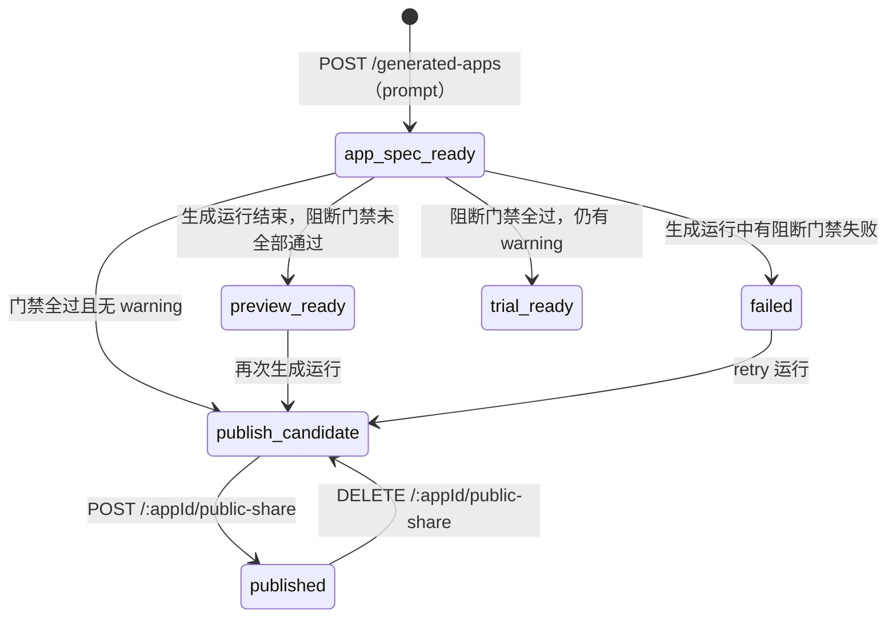

# 生成应用（服务端内部）

> 本页回答：一句自然语言需求在服务端经过哪些阶段才变成可公开访问的应用，代码按什么职责分层？

用户操作流程见 [生成应用](/guide/generated-apps/)，对外接入接口见 [生成应用 API](/api/generated-apps)。代码在 `agentloom-server/src/modules/generated-app/`。

## 生命周期

应用状态枚举 `generated_app_status` 为 `app_spec_ready`、`preview_ready`、`trial_ready`、`publish_candidate`、`published`、`failed`（`agentloom-server/src/database/schema/generated-apps.schema.ts`）。除 `published` 外，状态都由门禁结果计算得出（见下文「就绪度」）。

### 1. 创建：AppSpec 初稿

`POST /api/v1/generated-apps` 只接收 `prompt`。`buildInitialAppSpec(prompt)`（`agentloom-server/src/modules/generated-app/generated-app.app-spec.util.ts`）按固定模板确定性地构造 AppSpec 初稿：应用名、目标、核心需求、页面（创建者工作台、公开运行页）、验收场景等，不调用模型。应用以 `app_spec_ready` 状态写入 `generated_apps`。

### 2. 生成运行：门禁序列

`POST /api/v1/generated-apps/:appId/generation-runs/start` 在**请求内同步**执行一次生成运行（`GeneratedAppGenerationOrchestratorService.startGenerationRun`），参数：

| 字段 | 默认 | 范围 |
| --- | --- | --- |
| `triggerSource` | `manual` | `initial`、`manual`、`retry`、`system` |
| `maxRepairAttempts` | 3 | 0–20 |
| `maxRuntimeSeconds` | 1800 | 1–86400 |

运行记录写入 `generated_app_generation_runs`（状态 `queued` / `running` / `repairing` / `passed` / `failed` / `cancelled`），每个门禁的结果写入 `generated_app_gate_runs`（状态 `running` / `passed` / `failed` / `warning` / `skipped`）。门禁严格按序执行，前一个失败则停止：

| 门禁 | 名称 | 实现 |
| --- | --- | --- |
| `gate-0` | 需求规格门禁 | `evaluateGate0AppSpec`，校验 AppSpec 完整性、风险分类与验收场景 |
| `gate-1` | 架构计划门禁 | `buildGenerationPlan` 生成实现计划，校验其覆盖 AppSpec |
| `gate-2` | 静态合约门禁 | `buildStaticContracts`，校验 API 合约、图 schema、DAG、插件 manifest |
| `gate-3` | 构建与单元门禁 | `GeneratedAppGate3WorkspaceRunner`（`agentloom-server/src/modules/generated-app/generated-app.workspace.ts`）在本地工作区物化代码并执行命令计划 |
| `gate-4` | 集成门禁 | `GeneratedAppGate4IntegrationRunner` |
| `gate-5` | 浏览器验收门禁 | `GeneratedAppGate5BrowserAcceptanceRunner` |
| `gate-6` | 独立审查门禁 | `GeneratedAppGate6IndependentVerifierRunner` |
| `gate-7` | 发布候选门禁 | `GeneratedAppGate7PublishCandidateRunner` |

门禁定义（名称、是否阻断）的唯一来源是 `GENERATED_APP_GATE_DEFINITIONS`（`agentloom-server/src/modules/generated-app/generated-app.gates.ts`），当前全部为阻断门禁。各门禁的计划由 `agentloom-server/src/modules/generated-app/plan-builders/` 下的构建器生成。

门禁 3–7 的 runner 有 `real` / `fixture` / `disabled` 三种执行模式，默认 `real`，由各 runner 的 `getExecutorMode()` 经 `ConfigService` 读取 `GENERATED_APP_GATE<N>_EXECUTOR_MODE`。这些变量（以及 `GENERATED_APP_WORKSPACE_ROOT`、`GENERATED_APP_GATE3_COMMAND_TIMEOUT_MS`）在 `agentloom-server/src/config/env.schema.ts` 中声明，清单与默认值见 [配置参考](/deploy/configuration) 的 server 变量表。变量名不带 `APP_` 前缀，是因为 Gate 5 的证据中已持久化字面量 `GENERATED_APP_GATE5_EXECUTOR_MODE=real-browser-e2e`。

`runGenerationToTerminal` 保证运行无论以何种方式退出都会落一个终态：未显式写入终态时，`finally` 中把运行标记为失败。

### 3. 修复

- **门禁内自动修复**：`gate-3` 失败且 `maxRepairAttempts > 0` 时，`GeneratedAppGenerationRepairService` 创建一条修复尝试（`generated_app_repair_attempts`，状态 `planned` / `running` / `completed` / `failed` / `skipped`），runner 应用修复补丁后重跑 `gate-3`。
- **失败运行的修复记录**：运行以失败结束时，记录一条自动修复尝试，供下一次运行使用。
- **retry 运行**：`triggerSource = 'retry'` 时，先读取最近一次失败的修复上下文，再据此构建生成计划。
- 修复尝试也可通过 `/:appId/generation-runs/:runId/repair-attempts` 手动管理。

### 4. 就绪度与预览

每次门禁结果写入后，`evaluateGeneratedAppReadiness` 重新计算 `readiness`，`getGeneratedAppStatusForReadiness` 据此更新应用状态：

| readiness.state | 条件 | 应用状态 | 可创建公开链接 |
| --- | --- | --- | --- |
| `blocked` | 有阻断门禁 `failed` | `failed` | 否 |
| `preview` | 有阻断门禁未通过但无失败 | `preview_ready` | 否 |
| `trial` | 阻断门禁全过，有 warning | `trial_ready` | 否 |
| `publish_candidate` | 全过且无 warning | `publish_candidate` | 是 |

创建者通过 `/:appId/artifacts` 查看生成产物（`GeneratedAppArtifactService`），通过 `/:appId/runtime-binding-readiness` 查看运行时绑定状态。

### 5. 运行时绑定

`gate-7` 通过后，`GeneratedAppRuntimeBindingService`（`agentloom-server/src/modules/generated-app/generated-app-runtime-binding.service.ts`）：

- 注册并激活通过门禁的**租户私有生成插件**（经 `PluginService`，见 [插件系统](/dev/server/plugins)）；
- 创建或复用一个已发布的工作流，作为应用的运行时，记在 `generated_apps.workflow_definition_id`。

生成运行不会自动创建公开链接。

### 6. 公开运行

- `POST /api/v1/generated-apps/:appId/public-share` 要求 `readiness.state = 'publish_candidate'`，生成 32 字节随机 hex token，把应用置为 `published`；`/public-share/regenerate` 换新 token，`DELETE` 停用并把状态退回由就绪度决定的值。
- 公开控制器 `GeneratedAppPublicController` 挂在 `/api/v1/generated-apps/public`，整体 `@Public()`，且该路径被排除在 `TenantMiddleware` 之外。按 token 查找应用时同时要求 `publicShareEnabled`、`status = 'published'` 且仍满足发布条件，任一不满足返回 404。
- 终端用户提交（`POST /public/:token/submissions`）的处理顺序：先按 AppSpec 生成的运行表单严格校验输入（不合法直接拒绝，而不是截断后接受）→ 本地运行时评估 → 评估完成且绑定了已发布工作流时，经 `ExecutionService.runWorkflow` 触发一次工作流执行 → 写入 `generated_app_submissions`（状态 `received` / `running` / `completed` / `failed`），记录匿名会话 id。创建者在 `/:appId/submissions` 查看提交。

## 代码分层

| 层 | 文件 | 职责 |
| --- | --- | --- |
| HTTP | `generated-app.controller.ts` | 认证路由（`GeneratedAppController`）与公开路由（`GeneratedAppPublicController`） |
| 门面 | `generated-app.service.ts` | 控制器唯一依赖的入口，把调用分派给下列服务 |
| 编排 | `generated-app-generation-orchestrator.service.ts` | 生成运行与门禁序列 |
| 修复 | `generated-app-generation-repair.service.ts` | 修复尝试的创建、完成与上下文解析 |
| 门禁 runner | `generated-app.workspace.ts`、`generated-app.integration-runner.ts`、`generated-app.browser-acceptance-runner.ts`、`generated-app.independent-verifier-runner.ts`、`generated-app.publish-candidate-runner.ts` | `gate-3` 至 `gate-7` 的执行 |
| 计划 | `plan-builders/*.builder.ts` | 各门禁的计划与评估函数 |
| 规则 | `generated-app.gates.ts`、`generated-app.app-spec.util.ts`、`generated-app.plan-validation.util.ts` | 门禁定义、就绪度计算、AppSpec 构造与校验（纯函数） |
| 产物 | `generated-app-artifact.service.ts` | 产物清单与内容读取 |
| 运行时 | `generated-app-runtime-binding.service.ts`、`generated-app.runtime.ts`、`generated-app.runtime-binding.util.ts` | 工作流/插件绑定、公开运行表单与本地评估 |
| 公开运行 | `generated-app-public-runtime.service.ts`、`generated-app-public-submission.util.ts`、`generated-app.public-sanitizer.util.ts` | 公开链接、提交、对外数据脱敏 |
| 持久化 | `generated-app.repository.ts` | 所有表读写；公开链接发布条件 `assertCanEnablePublicShare` |
| 类型与 DTO | `types/`、`dto/` | 领域类型与 Zod DTO |

表中文件均位于 `agentloom-server/src/modules/generated-app/` 下。相关表：`generated_apps`、`generated_app_generation_runs`、`generated_app_gate_runs`、`generated_app_repair_attempts`、`generated_app_submissions`，列定义见 [数据库](/dev/server/database)。
