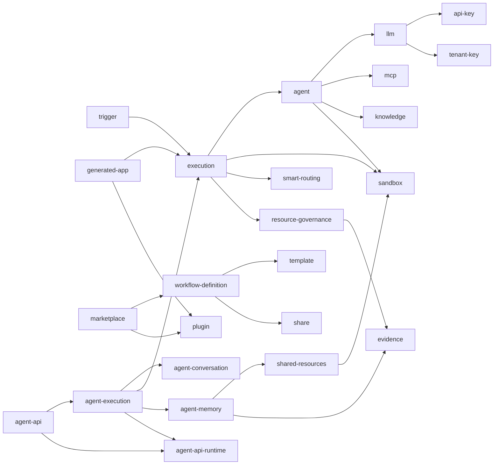

# 服务端架构概述

> 本页回答：服务端代码按什么领域划分？一个需求应该落在哪个模块里？

`agentloom-server` 是一个 NestJS 应用，为 Studio、移动端、ACP 客户端和第三方 API 调用者提供 REST 与 Socket.IO 服务。业务代码全部位于 `agentloom-server/src/modules/` 下，一个目录对应一个领域；横切能力（认证、租户、限流、错误格式）放在 `agentloom-server/src/common/`，不属于任何业务模块。

## 技术栈

| 层 | 选型 | 在服务端中的位置 |
| --- | --- | --- |
| 应用框架 | NestJS 11 | 模块化依赖注入，入口 `agentloom-server/src/main.ts` |
| HTTP | Fastify 5（不是 Express） | `agentloom-server/src/common/http/fastify-adapter.factory.ts` |
| ORM | Drizzle ORM | 表定义在 `agentloom-server/src/database/schema/` |
| 数据库 | PostgreSQL + 行级安全（RLS） | 详见 [数据库](/dev/server/database) |
| 缓存与队列 | Redis + BullMQ | `agentloom-server/src/common/redis/`；队列详见 [异步队列](/dev/server/queues) |
| 实时通信 | Socket.IO + Redis Adapter | `agentloom-server/src/common/adapters/redis-io.adapter.ts`；详见 [实时通信](/dev/server/realtime) |
| 向量检索 | Qdrant | `agentloom-server/src/modules/knowledge/qdrant.provider.ts` |
| 对象存储 | MinIO | `agentloom-server/src/infrastructure/storage/storage.service.ts` |
| 校验 | Zod（经 `nestjs-zod`，不用 class-validator） | `agentloom-server/src/common/pipes/zod-validation.pipe.ts` |
| 测试 | Vitest | 详见 [测试](/dev/testing) |

本地启动、测试和迁移命令只在仓库 README 中维护，见 [开发环境](/dev/setup)。

## 目录结构

```text
agentloom-server/src/
├── main.ts              # HTTP 入口：Fastify 适配器、Redis Socket.IO 适配器
├── app.module.ts        # 根模块；部分业务模块经其他模块的 imports 间接装配
├── acp-stdio.ts         # ACP stdio 独立入口（见 /dev/server/acp）
├── config/              # 环境变量 Zod schema 与 ConfigModule
├── common/              # 横切关注点
│   ├── adapters/        # RedisIoAdapter
│   ├── decorators/      # @CurrentUser、@CurrentTenant、@Public、@Roles
│   ├── exceptions/      # DomainException 等领域异常
│   ├── filters/         # AllExceptionsFilter（统一错误格式）
│   ├── guards/          # 认证、租户、角色、限流、WebSocket JWT 守卫
│   ├── http/            # Fastify 适配器工厂、CORS
│   ├── interceptors/    # 租户事务拦截器
│   ├── middleware/      # 租户中间件
│   ├── pipes/           # ZodValidationPipe
│   ├── providers/       # 租户感知数据库访问
│   ├── redis/           # RedisModule、缓存与 pub/sub 服务
│   ├── services/        # Token 黑名单、用户身份解析、RBAC 缓存
│   ├── types/           # 角色、RBAC 权限、Problem Details 类型
│   └── utils/           # PostgreSQL 错误工具
├── database/            # DatabaseModule、schema/、migrations/、seeds/
├── infrastructure/      # storage/：MinIO StorageModule
├── modules/             # 业务模块，按领域分组见下文
├── openapi/             # Swagger 文档构建
└── types/               # 第三方库类型补丁
```

`common/` 下各组件在一次请求中的执行顺序见 [请求处理链路](/dev/server/request-pipeline)，认证与加密见 [安全](/dev/server/security)。

## 分域说明

下文按领域列出 `agentloom-server/src/modules/` 下的每个目录。路径前缀取自各 controller 的 `@Controller()` 参数；`@Controller()` 不带参数的模块在方法上写完整路径，下文给出其路径开头。

### 工作流

- `workflow-definition`：工作流定义的创建、版本管理、发布与导入，前缀 `/workflow-definitions`。工作流在这里被持久化，运行由 `execution` 负责。
- `workflow`：不是 NestJS 模块，没有 `*.module.ts`；只放工作流输入 schema 的 DTO 与校验工具（`agentloom-server/src/modules/workflow/utils/workflow-input-validation.util.ts`），供其他模块引用。
- `execution`：DAG 执行引擎，负责节点调度、检查点、人工介入、工具调用审批与死信队列，Socket.IO 命名空间 `/execution`。路由挂在 `/workflow-definitions/:workflowId/run`、`/executions/…` 和 `/dlq`。执行引擎的运行态细节见 [Agent 运行时](/dev/server/agent-runtime)。
- `execution-record`：监听执行步骤与执行状态变更事件，写入 `agent_execution_records` 表，前缀 `/execution-records`。
- `reusable-block`：可复用的工作流片段，前缀 `/reusable-blocks`。
- `intervention-policy`：工作流级人工介入策略，挂在 `/workflow-definitions/:workflowId/intervention-policies`。
- `trigger`：工作流触发器，挂在 `/workflow-definitions/:workflowId/triggers`；另有公开的 `/webhooks` 与 `/api-events` 接收端。
- `template`：工作流模板只读查询，前缀 `/templates`；模板种子数据在 `agentloom-server/src/database/seeds/template-seeds.ts`。

#### 触发器类型

`trigger_type_enum`（`agentloom-server/src/database/schema/workflow-triggers.schema.ts:19`）定义了三种触发器：

| 类型 | 触发方式 |
| --- | --- |
| `cron` | 按 Cron 表达式与时区由调度队列触发 |
| `webhook` | `POST /webhooks/:token`，无需登录，按签名头与时间戳头验签 |
| `api_event` | `POST /api-events` 接收事件，经 `EventSourceAdapterRegistry` 解析后分发给所有匹配的触发器 |

### Agent

- `agent-definition`：Agent 定义与版本、画布保存、发布与归档，前缀 `/agent-definitions`。
- `agent`：Agent 运行时适配层。`ports/` 定义运行时端口，`in-process-agent.adapter.ts` 与 `sandbox-agent.adapter.ts` 分别在进程内和沙箱中运行 Agent；对外只有 `/agent-runtime` 下的沙箱工具回调路由。
- `agent-conversation`：对话的创建、消息、标题生成、工具权限与对话工作区读取，路由在 `/agent-conversations/…` 与 `/agent-definitions/:agentId/conversations`。
- `agent-execution`：对话轮次的执行进程。`AgentExecutionWorker` 消费对话队列，`AgentConversationGateway` 推送 `/agent-conversation` 命名空间事件，`subagent/` 提供子 Agent 工具。本模块没有 controller。
- `agent-memory`：图结构的 Agent 记忆（节点、边、路径、术语、版本与审核），前缀 `/memory-instances`，Socket.IO 命名空间 `/memory`。
- `skill`：Skill 的增删改查与文件管理，前缀 `/skills`；文件存放在 MinIO，`SkillResolverService` 在运行时解析 Agent 绑定的 Skill。
- `self-evolution`：Agent 的自进化工具集。会话内提供 `query_state`、`query_resource_pool`、`propose_change` 三个读工具和 `apply_change`、`create_resource` 两个写工具，写工具受 Agent 定义中的 `selfEvolutionPolicy` 与权限审批约束（`agentloom-server/src/modules/self-evolution/self-evolution.service.ts`）。本模块没有 controller。
- `shared-resources`：共享资源注册表，`SharedResourceProvider<TConfig, TInstance>` 接口统一管理某类资源的创建、销毁与共享（`agentloom-server/src/modules/shared-resources/shared-resource-registry.ts`）。本模块没有 controller。
- `workspace`：Agent 工作区的持久化与文件浏览、预览，前缀 `/workspaces`。

### 对外 Agent API

- `agent-api`：第三方以 `Authorization: Bearer alak_…` 调用已发布 Agent 的接口，前缀 `/agent-api`；不走全局 JWT 认证与角色守卫，由 `AgentApiKeyGuard` 认证。Agent API Key 的管理在 `/agent-definitions/:agentId/api-keys`。协议见 [Agent API](/api/agent-api)。
- `agent-api-runtime`：对外 API 中 run 的运行时：run 状态机（`AgentApiRunService`）、每个 run 一条 Redis Stream 的事件流（`AgentApiEventStreamService`）、执行事件镜像与定期清理。它不依赖 `agent-execution`，由 `agent-execution` 与 `agent-api` 共同导入。本模块没有 controller。

### 模型与工具

- `llm`：模型提供商（`/llm-providers`）、模型配置（`/llm-models`）与私有云连接测试（`/llm`）；`LlmEncryptionService` 负责凭据加密。
- `api-key`：LLM 提供商 API Key 的加密存储与轮换，前缀 `/api-keys`。
- `mcp`：MCP 服务器配置、工具发现与导入，前缀 `/mcp`。
- `smart-routing`：模型智能路由，路由在 `/smart-routing/…` 与 `/routing-decisions`。
- `knowledge`：知识库、文档解析与向量化、RAG 检索，前缀 `/knowledge-bases`，Socket.IO 命名空间 `/knowledge`；向量存储在 Qdrant。
- `plugin`：`.alp` 插件的上传验签、WASM 沙箱执行、开发者密钥、使用量与收益结算，前缀 `/plugins`、`/plugins/developer-keys`、`/plugins/marketplace`。内部机制见 [插件系统](/dev/server/plugins)。

#### 智能路由策略

工作流 `smart_routing` 节点按 `strategyName`（或 `strategy`）字段从 `RouterRegistry` 取策略，未配置时使用 `FALLBACK_CHAIN`（`agentloom-server/src/modules/execution/smart-routing-input.util.ts:19`）。大写名称是旧写法，执行前被映射为小写注册名：

| 旧名称 | 注册名 |
| --- | --- |
| `TOKEN_OPTIMIZED` | `token_optimized` |
| `COST_OPTIMIZED` | `cost_optimized` |
| `QUALITY_FIRST` | `quality_first` |
| `LATENCY_FIRST` | `latency_first` |
| `HISTORICAL_BEST` | `historical_best` |
| `FALLBACK_CHAIN` | `fallback_chain` |

`GET /smart-routing/strategies` 只列出 `PUBLIC_ROUTER_STRATEGY_NAMES` 中的策略（`agentloom-server/src/modules/smart-routing/smart-routing.service.ts:45`）。`fallback_chain` 下，Agent 任务失败且不是认证失败时，切换到候选列表中的下一个模型重试（`agentloom-server/src/modules/execution/agent-task-failure-policy.ts`）。路由决策写入 `routing_decisions` 表，`selected_model_id` 可为空。

### 生成应用

- `generated-app`：从需求生成应用、执行生成与修复、运行门禁、提交与公开分享，前缀 `/generated-apps`，公开访问在 `/generated-apps/public`。设计见 [生成应用](/dev/server/generated-apps)。

### 平台与协作

- `auth`：注册、登录、刷新、会话管理（`/auth`），TOTP 多因素（`/auth/mfa`）与 OAuth（`/auth/oauth`）。
- `organization`：组织、成员与角色、邀请、组织自治策略，路由在 `/organizations/…` 与 `/invitations/:token/accept`。
- `platform-api-token`：平台 API Token 管理，前缀 `/platform-api-tokens`；Token 以 `al_` 开头，库中只存 SHA-256 哈希。
- `tenant-key`：租户 RSA 公钥（最小 4096 位）的登记与轮换，前缀 `/tenant-keys`。端到端加密流程见 [安全](/dev/server/security)。
- `user-preference`：当前用户的偏好设置，前缀 `/user-preferences`，读取时不存在则创建默认记录。
- `notification`：站内、邮件与推送通知（偏好渠道 `in_app`、`email`、`push`），路由在 `/notifications/…`，设备注册在 `/devices`，Socket.IO 命名空间 `/notification`。
- `share`：工作流与 Agent 的分享链接，管理端在 `/workflow-shares` 与 `/agent-shares`，公开读取在 `/s/:token`。
- `resource-source`：记录资源来源是手动创建还是从分享导入（`resource_source_records` 表），前缀 `/resource-sources`，提供“转为手动资源”操作。
- `marketplace`：工作流与插件市场，前缀 `/marketplace`，无需登录的浏览接口在 `/marketplace/browse`。

#### 分享机制

- 只有已发布的工作流或 Agent 才能创建分享，`publishedVersionId` 为空时拒绝。
- 公开读取 `GET /s/:token` 返回已发布版本快照中的 `nodes`、`edges`、`viewport`，并以 SQL 自增更新 `view_count`。
- 只有 `copyable` 类型的工作流分享允许复制，复制时自增 `copy_count`；Agent 分享通过 `POST /agent-shares/:token/import` 导入，导入的资源由 `resource-source` 记为 `share_imported`。

#### 市场

- 上架类型 `listingType`：`workflow`、`plugin`；计费模式 `pricingModel`：`free`、`per_execution`（`agentloom-server/src/database/schema/marketplace-listings.schema.ts:27`）。
- `/marketplace/browse` 的列表、详情与评价接口标记为 `@Public()`。
- 安装接口 `POST /marketplace/listings/:id/install` 允许 `owner`、`admin`、`creator`、`operator` 角色。

### 运维与治理

- `resource-governance`：组织级资源配额与执行治理（暂停租户或单个工作流、终止执行），路由在 `/organizations/:id/resource-governance/…`。
- `monitoring`：组织运行监控面板，`GET /organizations/:id/monitoring`，时间窗口 `15m`、`1h`、`24h`，默认 `1h`。
- `evidence`：审计日志（`/audit-logs`）、执行证据（`/executions/:executionId/evidence`）与证据导出（`/evidence-exports`）。
- `optimization-suggestion`：周期分析 Agent 节点配置并生成优化建议，前缀 `/optimization-suggestions`，提供列表、采纳率统计、采纳与忽略。
- `private-deployment`：私有部署设置（SMTP、LLM 代理、TLS 证书、许可证），`/organizations/:id/private-deployment`。

#### 资源配额维度

配额存于 `tenant_quotas` 表（`agentloom-server/src/database/schema/tenant-quotas.schema.ts`），每个组织一行：

| 字段 | 含义 |
| --- | --- |
| `apiRateLimitPerMinute` | 每分钟 API 请求上限，默认 100 |
| `maxConcurrentExecutions` | 并发执行数上限 |
| `dailyExecutionLimit` | 每日执行次数上限 |
| `dailyApiCallLimit` | 每日 API 调用上限 |
| `storageQuotaMb` | 存储容量上限（MB） |
| `maxSandboxCpuPercent` | 沙箱 CPU 百分比上限 |
| `maxSandboxMemoryMb` | 沙箱内存上限（MB） |

除 `apiRateLimitPerMinute` 外，字段为空表示不限制。

#### 审计日志双表

- 热表 `audit_logs` 与归档表 `audit_log_archives` 共用同一组列（`agentloom-server/src/database/schema/audit-logs.schema.ts`），两表都只允许追加。
- 归档由 `AuditLogRetentionScheduler` 以 `upsertJobScheduler()` 注册单例重复任务完成。
- 查询同时读取两张表，按 `id` 去重（热表优先），再按 `(createdAt, id)` 排序（`agentloom-server/src/modules/evidence/audit-log.service.ts:260`）。

#### 优化建议当前不可采纳

建议类型有 `model_downgrade`、`timeout_adjustment`、`tool_pruning`、`autonomy_upgrade`，但 `APPLICABLE_SUGGESTION_TYPES` 是空集合（`agentloom-server/src/modules/optimization-suggestion/optimization-suggestion.service.ts:37`）。`POST /optimization-suggestions/:id/apply` 读出建议并检查状态后，在读取工作流和写入任何数据之前返回 409 `OPTIMIZATION_SUGGESTION_NOT_APPLICABLE`：这些建议改写的字段不参与工作流 `agent` 节点的执行。忽略（`POST /optimization-suggestions/:id/dismiss`）不受影响。

### 沙箱与运行环境

- `sandbox`：沙箱会话生命周期（`/sandboxes`）与分布式沙箱运行时节点管理（`/sandbox-nodes`，`agentloom-server/src/modules/sandbox/sandbox-node.controller.ts`）。运行时节点是平台级全局数据，不带租户隔离，管理接口除角色校验外还要求节点管理员身份。Firecracker 运行时见 [Firecracker 运行时](/dev/firecracker-runtime)。
- `acp-gateway`：Agent Client Protocol 网关，通过 stdio 上的 JSON-RPC 与 ACP 客户端通信，入口 `agentloom-server/src/acp-stdio.ts`。本模块没有 controller，协议细节见 [ACP 网关](/dev/server/acp)。
- `health`：健康检查，`GET /health`。

## 模块依赖

下图只画主要依赖，每条边都对应被指向模块出现在源模块 `*.module.ts` 的 `imports` 中（箭头从导入方指向被导入方）。



## 模块清单

下表由生成器从源码提取，列依次为：模块目录、controller 的 REST 前缀、Gateway 的 Socket.IO 命名空间、模块注册的 BullMQ 队列。

<!--@include: ../../_generated/server-modules.md-->
