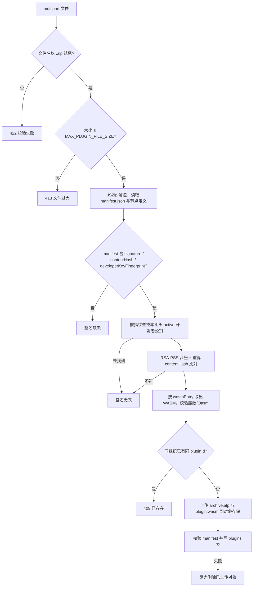
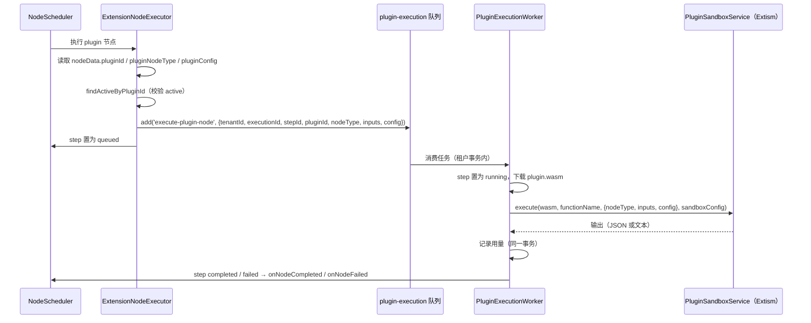

# 插件系统（服务端内部）

> 本页回答：服务端如何接收第三方插件包、确认它出自登记过的开发者、并在工作流里隔离执行它？

插件开发者如何打包、签名、上架和结算收益见 [插件开发](/api/plugins/) 与 [插件市场与收益](/api/plugins/marketplace)。本页只讲 `agentloom-server/src/modules/plugin/` 的内部实现。

## 注册与验签管线

`POST /api/v1/plugins`（`agentloom-server/src/modules/plugin/plugin.controller.ts`，角色 `owner` / `admin` / `creator`）以 multipart 接收 `.alp` 包，按以下顺序处理，任一步失败即拒绝：

各步要点：

- **大小上限**：`MAX_PLUGIN_FILE_SIZE` 为 50 MiB（`agentloom-server/src/modules/plugin/plugin.constants.ts`）。Fastify multipart 的截断或 `FST_REQ_FILE_TOO_LARGE` 同样转为 413。
- **节点定义来源**：优先 `node-definitions.json`（或 `nodeDefinitions.json`），其次 manifest 的 `nodeDefinitions`、`nodes` 字段。
- **开发者公钥**：通过 `/api/v1/plugins/developer-keys` 登记（`agentloom-server/src/modules/plugin/plugin-developer-key.controller.ts`）。`PluginSignatureService.validatePublicKey` 拒绝私钥 PEM、非 RSA 密钥和短于 2048 位的密钥；指纹为 SPKI DER 的 SHA-256 hex。
- **签名口径**：服务端不自己实现签名算法，而是复用 `@agentloom/plugin-sdk` 的 `verifyArchiveSignature` 与 `computeContentHash`（`agentloom-plugin-sdk/src/signing/verify.ts`、`agentloom-plugin-sdk/src/signing/archive.ts`），保证 CLI 签名与服务端验签是同一份代码。被签名的不是 zip 字节，而是规范化载荷：去掉 `signature`、`contentHash`、`developerKeyFingerprint` 三个字段并按键排序后的 manifest，加上除 `manifest.json` 外每个文件的 `{ path, sha256 }`（按路径排序），序列化为 JSON。验签使用 RSA-PSS、SHA-256、`saltLength = RSA_PSS_SALTLEN_DIGEST`；`contentHash` 是该载荷的 SHA-256。因此重新压缩、调整文件顺序不会使签名失效，改动任一文件内容会。
- **WASM 必需**：`wasmEntry` 必须是包内安全相对路径（不以 `/` 开头、不含 `\` 与 `..`），指向的文件以 WASM 魔数开头。WASM 是唯一运行时。
- **对象存储键**：`tenants/<tenantId>/plugins/<pluginId>/<version>/archive.alp` 与同目录的 `plugin.wasm`。
- **manifest 校验**：`PluginService.register` 用 plugin-sdk 的 `validateManifest` 与 `PluginManifestSchema` 校验（`agentloom-server/src/modules/plugin/plugin.service.ts`）。
- **状态**：`plugin_status` 枚举为 `registered`、`active`、`disabled`、`error`，默认 `registered`；上传时可通过表单字段 `status` 直接切换。只有 `active` 插件能被执行（`findActiveByPluginId` 对其他状态抛 `PluginInactiveException`）。

## 工作流中的执行路径

工作流 `plugin` 节点（见 [节点参考](/guide/nodes/)）不在节点调度器中同步执行，而是投递到 BullMQ：

- 入队代码：`ExtensionNodeExecutor.executePlugin`（`agentloom-server/src/modules/execution/node-executors/extension-node.executor.ts`）。节点数据缺少 `pluginId` 或 `pluginNodeType` 时直接报错。插件配置取自节点数据的 `pluginConfig`，不是 manifest。
- 消费代码：`PluginExecutionWorker`（`agentloom-server/src/modules/plugin/plugin-execution.worker.ts`），整个处理过程包在 `runInTenantTransaction` 中。
- 调用的 WASM 导出函数默认为 `execute`，节点配置的 `functionName` 可覆盖；输入为 `{ nodeType, inputs, config }` 的 JSON 字符串。
- 成功结果写入 step 的 `result`（额外带 `exec-out: { triggered: true }`），`checkpointData.runtime` 记为 `wasm-extism`。
- **用量落账**：成功执行后在同一租户事务内写 `plugin_usage_records`。落账失败抛 `PluginUsageLedgerException`，事务（含 step 状态）整体回滚，任务交给 BullMQ 重试，避免开发者收入漏记。其他错误收敛为 step `failed`，不重试。
- 队列重试参数见 [异步任务队列](/dev/server/queues)。
- 生成应用产生的租户私有插件（`metadata.source = 'generated-app-private-plugin'`）在没有 WASM 时走一条受控的确定性回退，`checkpointData.runtime` 记为 `generated-private-deterministic`。

## Extism 沙箱

`PluginSandboxService`（`agentloom-server/src/modules/plugin/plugin-sandbox.service.ts`）每次执行创建一个新的 `@extism/extism` 实例，执行后关闭。固定选项 `runInWorker: true`。默认值 `DEFAULT_SANDBOX_CONFIG`（`agentloom-server/src/modules/plugin/plugin.constants.ts`）：

| 项 | 默认 | 含义 |
| --- | --- | --- |
| `timeoutMs` | 30000 | 单次调用超时 |
| `maxMemoryPages` | 4096 | 线性内存上限（每页 64 KiB，即 256 MiB） |
| `allowedHosts` | 空 | 允许出站 HTTP 的主机，空即无网络 |
| `allowedPaths` | 空 | 文件系统映射，空即无文件访问 |
| `useWasi` | `false` | 不启用 WASI |

限制只能收紧，不能放宽：

1. `buildSandboxConfig(manifest)` 读取 manifest：`permissions` 含 `network:outbound` 时采用 `sandbox.allowedHosts`；`sandbox.timeoutMs` 与 `sandbox.maxMemoryPages` 经 `resolveNumericLimit` 取与默认值的较小者，非正数或非数值回退默认值。
2. Worker 用节点 `pluginConfig` 中的 `timeoutMs`、`maxMemoryPages` 取较小值，`allowedHosts` 取与 manifest 白名单的交集。
3. `mergeSandboxConfig` 再以 `Math.min(值, 默认值)` 封顶。

Extism 错误被分类为领域异常：超时 → `PluginExecutionTimeoutException`；访问未授权主机/路径 → `PluginPermissionDeniedException`；内存耗尽 → `PluginResourceExhaustedException`；函数不存在、插件自身报错及其他 → `PluginSandboxException`。

## 其他使用插件的位置

- **智能路由**：`wasm_plugin` 路由策略（`agentloom-server/src/modules/smart-routing/strategies/wasm-plugin.strategy.ts`）通过 `PluginService.findActiveWasmPluginForRouting` 调用插件选择模型。
- **市场克隆**：从市场安装插件时，`PluginService.cloneMarketplacePlugin` 把源插件的存储对象复制到安装方租户并创建 `active` 状态的副本；`upgradeMarketplaceClone` 处理升级。

## 收益结算

`earnings-settlement` 队列由 `EarningsSettlementWorker`（`agentloom-server/src/modules/plugin/earnings-settlement.worker.ts`）处理两类任务：

- **派发任务** `dispatch-plugin-earnings-settlement`：由调度器按 `EARNINGS_SETTLEMENT_DISPATCH_SCHEDULE`（`0 3 1 * *`，UTC）触发，计算上一个自然月的 UTC 起止时间，按 `plugin_usage_records` 中有计费金额的来源租户/组织分组，为每组投递一个结算任务。
- **结算任务**：在来源租户的事务内汇总该周期各插件用量并写入收益记录。

分成比例常量为 `REVENUE_SPLIT`（`agentloom-server/src/modules/plugin/plugin-earnings.service.ts`）：开发者 `0.70`、平台 `0.30`、上架佣金 `0.15`。金额使用定点小数工具 `agentloom-server/src/modules/plugin/fixed-scale-decimal.ts` 计算。对外的收益查询端点见 [插件市场与收益](/api/plugins/marketplace)。
