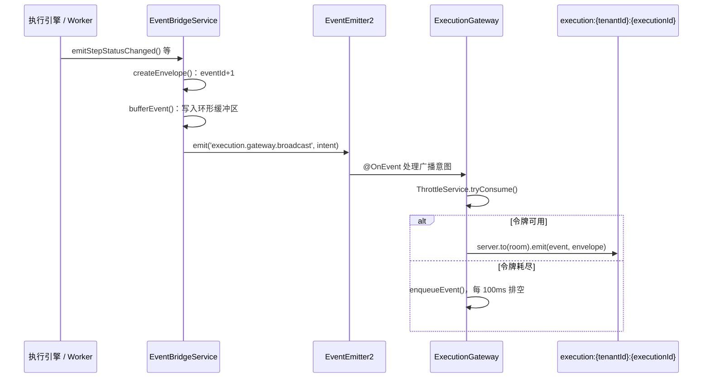

# 实时通信（Socket.IO）

> 本页回答：服务端的实时事件从哪里产生、经过哪些环节到达 Socket.IO 房间，客户端如何认证、订阅和断线续传？为什么事件要先经过 EventBridge 再由 Gateway 发出？

服务端的实时推送全部走 Socket.IO，每个领域一个命名空间（namespace），每个命名空间由一个 NestJS `@WebSocketGateway` 实现。前半部分是参考（命名空间、认证、信封、订阅消息、回放、常量），后半部分解释设计取舍。事件名的完整清单由生成器产出，见[事件清单](#事件清单)。

## 参考

### 命名空间与房间

| 命名空间 | Gateway 源文件 | 房间名 | 订阅 / 退订消息（client → server） | 订阅 ack |
| --- | --- | --- | --- | --- |
| `/execution` | `agentloom-server/src/modules/execution/execution.gateway.ts` | `execution:{tenantId}:{executionId}` | `execution:subscribe` / `execution:unsubscribe`；旧别名 `subscribe`、`join` / `unsubscribe`、`leave` | `{ status: 'subscribed' \| 'error', error?, currentState }` |
| `/agent-conversation` | `agentloom-server/src/modules/agent-execution/agent-conversation.gateway.ts` | `conversation:{tenantId}:{conversationId}` | `conversation:subscribe` / `conversation:unsubscribe`；另有 `conversation:message`、`conversation:cancel` | `{ status, error?, lastEventId? }` |
| `/memory` | `agentloom-server/src/modules/agent-memory/memory.gateway.ts` | `memory:{tenantId}:{instanceId}` | `memory:subscribe` / `memory:unsubscribe` | `{ status, instanceId?, error? }` |
| `/notification` | `agentloom-server/src/modules/notification/notification.gateway.ts` | `tenant:{tenantId}:user:{userId}` | 连接即自动加入；`notification:subscribe` / `notification:unsubscribe` 可重复加入/退出 | `{ status: 'subscribed' \| 'unsubscribed' \| 'error' }` |
| `/knowledge` | `agentloom-server/src/modules/knowledge/knowledge.gateway.ts` | `knowledge:{tenantId}:{knowledgeBaseId}` | `join` / `leave`，载荷 `{ knowledgeBaseId, tenantId? }` | `{ status: 'joined' \| 'left' \| 'error', knowledgeBaseId?, error? }` |

房间名里的 `tenantId` 一律取自 JWT，不取自客户端载荷。`/execution`、`/agent-conversation`、`/knowledge` 允许载荷里带 `tenantId` 作为回声，但与 JWT 不一致时直接返回 `FORBIDDEN`（`agentloom-server/src/modules/knowledge/knowledge.gateway.ts:217`）。订阅失败的 `error` 取值为 `FORBIDDEN`、`INVALID_PAYLOAD`，`/execution` 另有 `NOT_FOUND`（执行不存在）。

所有 Gateway 的 `cors` 均为 `{ origin: '*' }`。

### 认证

每个命名空间都使用同一套两层认证：

1. **握手中间件**：各 Gateway 的 `afterInit()` 调用共享的 `WsAuthService.attachHandshake(server)`（`agentloom-server/src/common/services/ws-auth.service.ts`），在握手阶段校验令牌，失败即拒绝连接。各 Gateway 不自行 `jwt.verify`。
2. **`WsJwtGuard`**：类级 `@UseGuards(WsJwtGuard)`（`agentloom-server/src/common/guards/ws-jwt.guard.ts`）保护每个 `@SubscribeMessage` 处理器。握手中间件已写入 `socket.data.user` 时守卫直接放行；否则委托同一个 `WsAuthService` 解析。

握手中间件的检查顺序：

| 步骤 | 失败时的错误消息 |
| --- | --- |
| 从 `handshake.auth.token` 或 `Authorization: Bearer` 头取令牌 | `Authentication required` |
| 令牌吊销与会话存活（`TokenBlacklistService`，见 [/dev/server/security](/dev/server/security)） | `Token has been revoked` |
| `jwt.verify`：HS256、`audience: 'authenticated'`，密钥为 `APP_JWT_SECRET` | `Token has expired` / `Invalid or expired token` |
| 拒绝 `type: 'mfa_pending'` 的令牌 | `MFA verification required` |
| `sub`、`aud`、`exp`、`iat` 齐全 | `Invalid token claims` |
| `sub` 能解析为应用用户 | `User account not found` |

握手错误带 `data: { code: 4001, reason }`，客户端从 `err.data.code` 读取（常量 `WS_CLOSE_AUTH_FAILURE`，定义在 `agentloom-server/src/common/services/ws-auth.service.ts`）。

认证成功后，JWT 的 `sub`（Supabase 用户 ID）经 `UserIdentityResolverService` 解析为应用用户 ID 写入 `socket.data.user.sub`，原始值保存在 `supabaseUserId`，与 HTTP `req.user` 的身份契约一致；解析失败返回 `User account not found`。

`/agent-conversation` 的 `conversation:message` 与 `conversation:cancel` 另外要求调用者在当前租户的角色为 operator、creator、admin 或 owner（与 HTTP `POST agent-conversations/:id/messages|cancel` 相同），且会话属于调用者租户；否则返回 `{ status: 'error', error: 'FORBIDDEN' }` 或会话不存在。

::: tip /knowledge 与其他命名空间同等认证
`KnowledgeGateway` 使用 `@UseGuards(WsJwtGuard)`（`agentloom-server/src/modules/knowledge/knowledge.gateway.ts:65`），握手中间件与 `/execution`、`/memory` 相同。未携带令牌的连接在握手阶段即被拒绝，Studio 的 `agentloom-studio/src/features/knowledge/hooks/useKnowledgeBaseSocket.ts` 在没有令牌时不建立连接。
:::

### 事件信封

`/execution` 的每个事件都是 `ExecutionEvent<T>`，定义在 `agentloom-contracts/src/execution-events.ts`（服务端规范定义在 `agentloom-server/src/modules/execution/types/execution-event.types.ts`）。线上字段为 camelCase：

```typescript
interface ExecutionEvent<T extends ExecutionEventName = ExecutionEventName> {
  readonly eventId: number; // 每个 execution 内单调递增
  readonly event: T; // 事件名，与 Socket.IO 事件名相同
  readonly timestamp: string; // ISO 8601
  readonly executionId: string;
  readonly tenantId: string;
  readonly data: ExecutionEventPayloadMap[T]; // 按事件名区分的载荷
}
```

- `eventId` 由 `EventBridgeService.nextEventId()` 按 `executionId` 计数，从 1 开始（`agentloom-server/src/modules/execution/services/event-bridge.service.ts:529`）。
- 载荷 schema 按事件名登记在 `EXECUTION_EVENT_PAYLOAD_SCHEMAS`；需要逐字段校验时调用 `parseExecutionEvent()`。
- 其他命名空间的信封不同：
  - `/agent-conversation`：`{ conversationId, tenantId, timestamp, eventId, ...载荷 }`，`eventId` 读自 EventBridge 中该 `conversationId` 的当前计数（`agentloom-server/src/modules/agent-execution/agent-conversation.gateway.ts:904`）。回放时下发的是原始 `ExecutionEvent`。
  - `/memory`：`{ eventId, timestamp, type, data }`，`eventId` 来自 Gateway 级的单一计数器，跨实例共享（`agentloom-server/src/modules/agent-memory/memory.gateway.ts:409`）。
  - `/notification`、`/knowledge`：直接发送业务对象，没有 `eventId`。

### /execution：从领域事件到 Socket



`EventBridgeService`（`agentloom-server/src/modules/execution/services/event-bridge.service.ts`）不持有 Socket.IO 服务器，只向 `EventEmitter2` 发出广播意图；`ExecutionGateway` 用 `@OnEvent` 订阅这些意图。意图名定义在 `ExecutionBroadcastIntent`：

| 意图 | 值 | Gateway 行为 |
| --- | --- | --- |
| `BROADCAST` | `execution.gateway.broadcast` | 经令牌桶与背压队列发送 |
| `BROADCAST_IMMEDIATELY` | `execution.gateway.broadcast_immediately` | 跳过令牌桶直接发送 |
| `FLUSH_QUEUE` | `execution.gateway.flush_queue` | 一次性发出该执行积压的事件 |
| `CLEAR_QUEUE` | `execution.gateway.clear_queue` | 丢弃该执行的积压与排空定时器 |

部分 `emit*` 方法还会以事件名（如 `execution.node.agent-event`）在 `EventEmitter2` 上发出领域事件，供 `AgentConversationGateway` 等进程内监听者使用；这条通道与发往 Socket 的广播意图互相独立。

#### 流量控制常量

| 常量 | 值 | 定义处 | 作用 |
| --- | --- | --- | --- |
| `EVENT_BUFFER_CAPACITY` | 500 | `agentloom-server/src/modules/execution/services/event-bridge.service.ts:53` | 每个执行的回放环形缓冲区上限，超出丢最旧 |
| `TERMINAL_EVENT_RETENTION_MS` | 30 000 ms | `agentloom-server/src/modules/execution/services/event-bridge.service.ts:54` | 终态后保留计数器与缓冲区的时长 |
| `BACKPRESSURE_QUEUE_LIMIT` | 500 | `agentloom-server/src/modules/execution/execution.gateway.ts:36` | 每个执行的背压队列上限，满时丢最旧并记 warn |
| `BACKPRESSURE_DRAIN_INTERVAL_MS` | 100 ms | `agentloom-server/src/modules/execution/execution.gateway.ts:39` | 背压队列排空定时器间隔 |
| `ThrottleService.RATE_LIMIT` | 100 | `agentloom-server/src/modules/execution/services/throttle.service.ts:44` | 令牌桶容量与每秒补充量（按执行计） |
| `ThrottleService.MERGE_WINDOW_MS` | 50 ms | `agentloom-server/src/modules/execution/services/throttle.service.ts:45` | 同一 `stepId` 输出块的合并窗口 |

合并窗口由 `ThrottleService.bufferOutputChunk()` 启用；当前生产代码没有调用它（调用方只有 `agentloom-server/src/modules/execution/__tests__/throttle.service.spec.ts`），`emitOutputChunk()` 产生的输出块与其他事件一样逐条走令牌桶。

#### 终态处理

`emitExecutionStatusChanged()` 收到 `completed`、`failed`、`cancelled` 时依次：

1. 发出 `FLUSH_QUEUE`，并对 `ThrottleService` 中待合并的输出块 `forceFlush()`，逐块立即广播；
2. 立即广播终态事件（不经令牌桶）；
3. 清理该执行的令牌桶，发出 `CLEAR_QUEUE`；
4. 30 秒后调用 `clearExecution()`，删除计数器与环形缓冲区。之后同一 `executionId` 的 `eventId` 重新从 1 开始。

#### 订阅与断线续传

`execution:subscribe` 的载荷为 `{ executionId, lastEventId?, tenantId? }`。服务端先通过 `StateReplayService.getExecutionSnapshot()` 取快照（取不到则返回 `FORBIDDEN` 或 `NOT_FOUND`），加入房间后按下面的规则补发（`agentloom-server/src/modules/execution/execution.gateway.ts:425`）：

- 带 `lastEventId`，且不小于服务端当前 `eventId`：不补发。
- 带 `lastEventId`，且环形缓冲区仍覆盖缺口：逐条补发 `eventId > lastEventId` 的事件。
- 其他情况：发送 `execution.state.snapshot`，再补发缓冲区中仍处于 `queued`、`running`、`waiting_intervention` 状态的步骤的节点级事件。

ack 的 `currentState` 总是携带快照。

```typescript
import { io } from "socket.io-client";

// token 为 Supabase 签发的访问令牌；executionId、lastEventId 由调用方提供
const socket = io("/execution", { auth: { token } });

socket.emit(
  "execution:subscribe",
  { executionId, lastEventId },
  (ack: { status: "subscribed" | "error"; error?: string }) => {
    if (ack.status === "error") console.error(ack.error);
  },
);

socket.on("execution.node.status-changed", (event) => {
  // event 为 ExecutionEvent，记录 event.eventId 供重连时作为 lastEventId
});
```

### /agent-conversation

`AgentConversationGateway` 不调用 EventBridge 的广播意图，而是用 `@OnEvent` 监听 EventBridge 在 `EventEmitter2` 上发出的领域事件（以及 `workspace.file_change`、`conversation.subagent.event`、`conversation.subagent.status`、`conversation.title.updated`），按 `executionType === 'conversation'` 过滤后映射为 `conversation.*` 事件，发往 `conversation:{tenantId}:{conversationId}`。对话执行的 `executionId` 即 `conversationId`，因此计数器与环形缓冲区与 `/execution` 共用 EventBridge。

该 Gateway 有自己的背压队列（同为 500 / 100 ms，`agentloom-server/src/modules/agent-execution/agent-conversation.gateway.ts:90`），并复用 `ThrottleService` 令牌桶。

`conversation:subscribe` 的载荷为 `{ conversationId, lastEventId?, tenantId? }`。带 `lastEventId` 时：

- 服务端计数器不小于 `lastEventId` 且缓冲区仍覆盖缺口：把缓冲区中的 `ExecutionEvent` 逐条映射为对话事件补发；遇到终态的 `execution.status.changed` 时紧跟一条 `conversation.agent.done`。ack 的 `lastEventId` 为补发完成时的服务端计数。
- 否则（计数器回退或缓冲区已不覆盖）：发送 `conversation.state.snapshot`（常量 `CONVERSATION_STATE_SNAPSHOT_EVENT`，`agentloom-contracts/src/conversation-events.ts`），其中 `lastEventId` 为新的游标起点，`reason` 为 `replay-buffer-gap`。此时 ack 不带 `lastEventId`。

`conversation:message`（`{ conversationId, content, contentType?, metadata? }`）调用 `AgentExecutionService.injectMessage()`，`conversation:cancel`（`{ conversationId }`）调用 `cancelExecution()`，两者 ack 为 `{ status: 'ok' | 'error', error? }`。

### /memory

`MemoryGateway` 由服务层直接调用 `emitNodeCreated()` 等方法发事件，不经 EventBridge 与 `ThrottleService`。

| 常量 | 值 | 定义处 |
| --- | --- | --- |
| `BACKPRESSURE_QUEUE_LIMIT` | 500 | `agentloom-server/src/modules/agent-memory/memory.gateway.ts:18` |
| `BACKPRESSURE_DRAIN_INTERVAL_MS` | 100 ms | `agentloom-server/src/modules/agent-memory/memory.gateway.ts:21` |
| `REPLAY_BUFFER_LIMIT` | 1000 | `agentloom-server/src/modules/agent-memory/memory.gateway.ts:24` |

- 背压队列只在已有积压时才入队，排空时一次发完，没有令牌桶限速。
- 断线续传的游标从**握手查询参数** `lastEventId` 读取（`client.handshake.query.lastEventId`），不在 `memory:subscribe` 载荷里；订阅成功后补发该实例回放缓冲区中 `eventId` 更大的事件。
- `flushMemoryQueue()`、`clearMemoryQueue()` 是公开方法，当前只有 `agentloom-server/src/modules/agent-memory/services/__tests__/memory.gateway.spec.ts` 调用。

### /notification

`NotificationProcessor`（`agentloom-server/src/modules/notification/notification.processor.ts`）处理 `notification` 队列任务时调用 `NotificationGateway.sendToUser()` 和 `sendUnreadCount()`，分别发出 `notification.new`（通知行对象）与 `notification.unread-count`（`{ count }`）。站内推送受用户 `in_app` 偏好与通知体内 `notifyChannels` 控制；设备推送由 `PushNotificationService` 处理，不经 Socket.IO。

### /knowledge

`KnowledgeGateway` 的发送方法由文档上传、处理、索引流程调用（`agentloom-server/src/modules/knowledge/document.service.ts`、`agentloom-server/src/modules/knowledge/document-processing.worker.ts`、`agentloom-server/src/modules/knowledge/document-indexing.worker.ts`、`agentloom-server/src/modules/knowledge/knowledge-base.controller.ts`）：

| 方法 | 事件 | 载荷类型 |
| --- | --- | --- |
| `emitDocumentStatusChanged()` | `document:status-changed` | `DocumentStatusEvent`（状态 `uploaded` / `processing` / `ready` / `failed`，可带进度阶段） |
| `emitKnowledgeBaseUpdated()` | `knowledge-base:updated` | `{ knowledgeBaseId }` |

### 多实例：Redis adapter

`agentloom-server/src/main.ts` 用 `RedisIoAdapter`（`agentloom-server/src/common/adapters/redis-io.adapter.ts`）作为 WebSocket 适配器。它用 `APP_REDIS_URL` 创建独立的 pub/sub 两个 ioredis 客户端，连接成功后为每个命名空间服务器挂上 `@socket.io/redis-adapter`，使 `server.to(room).emit()` 跨进程生效。连接失败时只记 warn，服务以单实例模式继续运行。

适配器还把 `maxHttpBufferSize` 提高到至少 `MAX_CONVERSATION_TRANSPORT_PAYLOAD_BYTES`（`agentloom-server/src/modules/agent-conversation/conversation-attachment.ts`），以容纳带 base64 附件的对话消息。

### 事件清单

生成列：命名空间 | 方向 | 事件 | 来源文件。

<!--@include: ../../_generated/socket-events.md-->

## 设计说明

### 为什么 EventBridge 不直接持有 Socket 服务器

`EventBridgeService` 被执行引擎、Worker、子代理桥接等大量模块注入。如果它直接依赖 `ExecutionGateway`，这些模块都会间接依赖 WebSocket 层，而 stdio 入口（`agentloom-server/src/acp-stdio.ts`）这类不启动 Socket.IO 的进程图也要装配 Gateway。改为向 `EventEmitter2` 发出意图后，EventBridge 只负责编号、缓冲和终态清理；是否真正发往 Socket、以多快的速度发，由 Gateway 决定。同一份领域事件还能被 `AgentConversationGateway`、证据模块等多个监听者消费，而不必互相知道对方。

### 为什么编号与缓冲放在 EventBridge，限速放在 Gateway

断线续传要求"编号"和"缓冲"看到的是同一个序列：先编号再入缓冲区，二者都在 `broadcast()` 里同步完成，补发时才能保证没有空洞。限速只影响"何时送达"，不改变序列，因此放在 Gateway 的背压队列里；队列满时丢最旧事件，客户端仍可凭 `eventId` 的跳跃发现缺口并通过重新订阅取回。

### 回放能力的边界

计数器、环形缓冲区、背压队列都是进程内的 `Map`。Redis adapter 只同步房间广播，不同步这些状态：客户端重连到另一个实例时，该实例的缓冲区里没有这次执行的事件，订阅会落到快照路径。快照路径（`execution.state.snapshot`、`conversation.state.snapshot`）因此是正确性的兜底，增量补发只是在同一进程内省带宽。

相关页面：[请求管线](/dev/server/request-pipeline)、[安全模型](/dev/server/security)、[队列](/dev/server/queues)、[添加 Socket 事件](/dev/howto/add-socket-event)。
