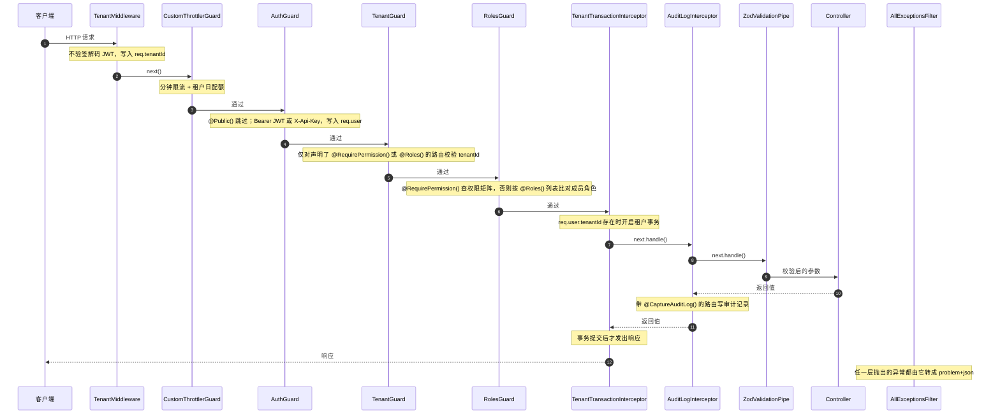

# 请求管线

> 本页回答：一个 HTTP 请求或 WebSocket 连接在到达 controller / gateway 之前经过哪些层，这些层为什么按现在的顺序排列？

对外错误格式、认证头写法等调用方契约在 [/api/](/api/)；租户隔离、令牌与加密的设计在 [/dev/server/security](/dev/server/security)。本页只讲服务端内部的执行顺序。

## HTTP 请求的执行顺序

Nest 对每个 HTTP 请求按固定阶段执行：Middleware → Guards → Interceptors（前半段）→ Pipes → Handler → Interceptors（后半段）→ Exception Filters。同一阶段内的全局组件按注册顺序执行。

AgentLoom 在各阶段注册的全局组件：

| 阶段 | 组件 | 注册位置 |
| --- | --- | --- |
| Middleware | `TenantMiddleware` | `agentloom-server/src/app.module.ts:171` 的 `configure()`，`forRoutes('*')` 并排除公开路由 |
| Guards | `CustomThrottlerGuard` → `AuthGuard` → `TenantGuard` → `RolesGuard` | `agentloom-server/src/app.module.ts:152`，`APP_GUARD` 按声明顺序 |
| Interceptors | `TenantTransactionInterceptor`（外层）→ `AuditLogInterceptor`（内层） | `agentloom-server/src/app.module.ts:148`、`agentloom-server/src/modules/evidence/evidence.module.ts:70` |
| Pipes | `ZodValidationPipe` | `agentloom-server/src/main.ts:51`，`app.useGlobalPipes` |
| Exception Filters | `AllExceptionsFilter` | `agentloom-server/src/main.ts:50`，`app.useGlobalFilters` |

两个 interceptor 分属不同模块。Nest 扫描模块时根模块 `AppModule` 先于它导入的 `EvidenceModule` 登记，跨模块的 `APP_INTERCEPTOR` 按登记顺序加入全局列表，列表靠前者包在外层。因此 `TenantTransactionInterceptor` 包住 `AuditLogInterceptor`，审计记录的写入发生在租户事务的上下文之内。这一顺序是用与上述两模块同构的最小 Nest 应用（`@nestjs/core` 11.2.3）运行确认的，不是由显式配置保证的：调整 `AppModule` 的 provider 或改为在其他模块注册，顺序都可能变化。

controller 或方法上用 `@UseGuards()` 声明的守卫排在全部全局守卫之后执行，例如 `/agent-api` 的 `AgentApiKeyGuard`。

### 为什么是这个顺序

- **限流在认证之前。** `CustomThrottlerGuard` 先于 `AuthGuard`，无效令牌发起的请求也会被计数，认证失败不能绕开限流。代价是限流阶段拿不到已验证的身份，所以它需要自己识别调用方（见下文），而这正是 `TenantMiddleware` 存在的原因。
- **中间件只做不验签的租户提取。** 限流守卫要按租户共享计数桶，此时 `AuthGuard` 还没运行，`req.user` 不存在。`TenantMiddleware` 解码 JWT payload 取出 `tenantId`，供限流阶段使用。验签由随后的 `AuthGuard` 完成，伪造的 `tenantId` 最多把请求计入别的租户的限流桶，拿不到数据访问权限。
- **租户事务在守卫之后。** `TenantTransactionInterceptor` 读取的是 `AuthGuard` 写入的 `req.user.tenantId`，而不是中间件写入的 `req.tenantId`，所以数据库会话只会绑定到验签通过的租户。Nest 的 interceptor 本来就排在 guard 之后，不需要额外配置。
- **校验在事务之内。** `ZodValidationPipe` 在 interceptor 前半段之后、handler 之前运行，校验失败抛出的异常沿 interceptor 链向外传播，`TenantTransactionInterceptor` 据此回滚事务，再由 `AllExceptionsFilter` 输出错误。

## 各层的行为

### TenantMiddleware

源文件：`agentloom-server/src/common/middleware/tenant.middleware.ts`

- 请求带 `X-Api-Key` 头时直接跳过，平台 API Token 的租户由 `AuthGuard` 写入。
- 否则从 `Authorization: Bearer <jwt>` 中 base64url 解码 payload，读取 `tenantId` 或 `tenant_id`，是合法 UUID 才写入 `req.tenantId`。解码失败静默放行。
- 不校验签名、不拒绝请求。
- 在 `agentloom-server/src/app.module.ts:174` 排除的路由上不运行：`templates`、`marketplace/browse`、`generated-apps/public`、`s`、`webhooks`、`agent-api` 及其子路径。

### CustomThrottlerGuard

源文件：`agentloom-server/src/common/guards/custom-throttler.guard.ts`；默认配额在 `agentloom-server/src/app.module.ts:74`：名为 `default` 的节流器，`ttl: 60_000`、`limit: 100`，即每分钟 100 次。计数存储在 `APP_REDIS_URL` 指向的 Redis（`ThrottlerStorageRedisService`）。

它继承 `@nestjs/throttler` 的 `ThrottlerGuard`，覆盖了调用方识别与上限计算：

1. **识别 Agent API Key。** `Authorization` 以 `Bearer alak_` 开头时，先调用 `AgentApiKeyService.validate()`，结果缓存在请求对象上。Key 无效时不在这里报错，回退为按 IP 计数，由后面的 `AgentApiKeyGuard` 返回 401。
2. **tracker（计数键）优先级**（`getTracker`）：有效的 Agent API Key → `agentkey:<keyPrefix>`；`X-Api-Key` 以 `al_` 开头 → `apikey:<前缀>`（`al_` 加 8 个字符）；可解码出 `sub` 的 JWT → `jwt:`；否则 → 客户端 IP。
3. **租户共享桶。** 能解析出租户（来自 Agent Key、`TenantMiddleware`、JWT payload，或用 `X-Api-Key` 查库）且不是 Agent Key 请求时，计数键改为 `tenant:<tenantId>`，同一租户的所有成员共用一个分钟桶。Agent Key 始终按 Key 独立计数。
4. **有效上限**：Agent Key 自身的 `rateLimitPerMinute` → 租户配额的 `apiRateLimitPerMinute` → 默认 100。
5. **租户日配额。** 租户配额设置了 `dailyApiCallLimit` 时，另按 UTC 自然日计数，超出抛 `ResourceGovernanceDecisionBlockedException`（409）。
6. **超限响应。** 写 `Retry-After` 与限流响应头。有租户上下文的平台请求（JWT / `al_` Token）抛 `ResourceGovernanceDecisionBlockedException`（分钟限流为 429，并写入资源治理拦截记录）；Agent Key 请求和无租户的请求抛 `RateLimitExceededException`，problem type 为 `rate-limit-exceeded`、状态 429。

跳过限流用 `@nestjs/throttler` 自带的 `@SkipThrottle()`，例如 `agentloom-server/src/modules/health/health.controller.ts`。

### AuthGuard

源文件：`agentloom-server/src/common/guards/auth.guard.ts`

- 路由或 controller 标了 `@Public()`（`agentloom-server/src/common/decorators/public.decorator.ts`）时直接放行。
- **带 `Authorization: Bearer …` 时只走 JWT 分支**，不会回退到 API Key：
  1. 按令牌 SHA-256 查 `revoked_tokens`；令牌带 `session_id` 时同一条 SQL 还检查 `auth.sessions` 中该会话仍存在且未过 `not_after`。任一不满足返回 401 `token-revoked`；`auth.sessions` 不可读时返回 503 `session-verification-unavailable`。细节见 [/dev/server/security](/dev/server/security)。
  2. 用 `APP_JWT_SECRET` 以 HS256 验签，要求 `aud` 为 `authenticated`。过期返回 `token-expired`，其他失败返回 `token-invalid`。
  3. payload 的 `type` 为 `mfa_pending`（登录第一步签发的临时令牌）时返回 403 `mfa-required`。
  4. 用 `UserIdentityResolverService` 把 Supabase 用户 ID 换成应用内用户 ID：`req.user.sub` 是应用用户 ID，原始值保存在 `req.user.supabaseUserId`。找不到应用用户返回 401。
  5. `req.authMethod = 'jwt'`。
- **没有 Bearer、但有 `X-Api-Key` 时走平台 API Token 分支**：`PlatformApiTokenService.validateToken()` 校验 `al_` 前缀、按 SHA-256 查记录、检查吊销与过期，并从成员表读取角色。成功后 `req.user.tenantId`、`req.tenantId`、`req.apiKeyPrefix` 被写入，`req.authMethod = 'api_key'`，异步更新 `lastUsedAt`。
- 两者都没有时返回 401 `token-missing`。
- `alak_` Agent API Key 不由它识别。`/agent-api` 的 controller 同时声明 `@Public()` 与 `@UseGuards(AgentApiKeyGuard)`（`agentloom-server/src/modules/agent-api/agent-api.controller.ts:104`）：全局守卫全部放行，随后 `AgentApiKeyGuard`（`agentloom-server/src/modules/agent-api/agent-api-key.guard.ts`）校验 `Bearer alak_…`，只写入 `req.agentApiKey`，不写 `req.user`。

### TenantGuard

源文件：`agentloom-server/src/common/guards/tenant.guard.ts`

只对声明了 `@RequirePermission()` 或 `@Roles()` 的非公开路由生效：`req.user.tenantId` 缺失抛 `TenantRequiredException`，不是 UUID 抛 `InvalidTenantContextException`。两者都没有的路由直接放行。

### RolesGuard

源文件：`agentloom-server/src/common/guards/roles.guard.ts`；装饰器 `agentloom-server/src/common/decorators/require-permission.decorator.ts`、`agentloom-server/src/common/decorators/roles.decorator.ts`

- 路由的访问要求由 `resolveRouteAccess()` 解析：`@RequirePermission(permission)` 与 `@Roles(...)` 各自方法级覆盖类级，`@RequirePermission` 优先，其角色集合取自 `agentloom-contracts/src/rbac.ts` 的 `RBAC_PERMISSION_MATRIX`。`TenantGuard` 与路由访问快照测试共用这个函数。
- 两者都没有或标了 `@Public()` 时放行。
- 重复检查 `tenantId`，然后用 `RbacCacheService.getUserRole(tenantId, userId)` 读取成员角色（Redis 缓存，未命中时查 `organization_members`）。
- **按集合精确匹配**：成员角色必须在解析出的角色集合中。角色之间没有隐式继承，矩阵中每个权限显式列出允许的角色。角色的含义见 [/dev/server/security](/dev/server/security#rbac-角色)。
- 全部路由的有效访问集合由 `agentloom-server/src/common/guards/__tests__/route-access.snapshot.spec.ts` 生成快照（`__snapshots__/route-access.json`）；改动 `@Roles`、`@RequirePermission` 或矩阵后，快照 diff 必须只包含有意的变化。

### TenantTransactionInterceptor

源文件：`agentloom-server/src/common/interceptors/tenant-transaction.interceptor.ts`，事务实现在 `agentloom-server/src/common/interceptors/tenant-transaction.context.ts`。

- `req.user.tenantId` 不存在（公开路由、`/agent-api`）时直接放行，不开事务。
- 否则调用 `runInTenantTransaction()`：开启事务，执行 `SET LOCAL ROLE authenticated` 和 `set_config('app.current_tenant', <tenantId>, true)`，把事务对象放进 `AsyncLocalStorage`。服务代码通过 `getTenantDb()`（`agentloom-server/src/common/providers/tenant-aware-db.provider.ts`）取到这个事务，RLS 策略据此过滤。
- handler 的返回值在事务**提交之后**才发给客户端；`registerAfterCommitHook()` 注册的回调在提交后执行。

RLS 策略本身见 [/dev/server/security](/dev/server/security#数据库行级安全)。

### AuditLogInterceptor

源文件：`agentloom-server/src/modules/evidence/audit-log.interceptor.ts`

只处理 HTTP 请求，且只对带 `@CaptureAuditLog()`（`agentloom-server/src/modules/evidence/audit-log.capture.ts`）的路由生效：handler 成功返回后用配置的 `buildRecord` 生成审计记录并写入。写入失败只记 warn 日志，不影响响应。

### ZodValidationPipe

源文件：`agentloom-server/src/common/pipes/zod-validation.pipe.ts`，即 `nestjs-zod` 的 `createZodValidationPipe()`。

全局 pipe 对用 `createZodDto` 定义的 DTO 参数做解析与转换。也可以在参数上显式写 `new ZodValidationPipe(schema)`。schema 带 transform 时不要在全局 pipe 之外再挂一道显式 pipe，否则已转换的值会被二次校验（见 `agentloom-server/src/modules/sandbox/sandbox-node.controller.ts:95` 的注释）。

### AllExceptionsFilter

源文件：`agentloom-server/src/common/filters/all-exceptions.filter.ts`

`@Catch()` 捕获所有异常，统一输出 `Content-Type: application/problem+json`（RFC 9457）。`type` 以 `https://agentloom.dev/errors/` 为前缀：

- `ZodValidationException` → 422 `validation-error`，`errors` 列出字段与消息；
- `DomainException` 及其子类 → 使用异常自带的 `type`、状态码和扩展字段，并写入异常携带的响应头（例如限流的 `Retry-After`）；
- 其他 `HttpException` → `http-error`，保留原状态码；
- 未知异常 → 500 `internal-server-error`。

错误响应的字段与各 `type` 的对外含义只在 [/api/](/api/) 维护。

## WebSocket 连接的鉴权

Socket.IO 连接不经过上面的 HTTP 管线：中间件、全局守卫、interceptor 和 filter 都不作用于握手。所有 gateway 共用 `WsAuthService`（`agentloom-server/src/common/services/ws-auth.service.ts`），分两层：

1. **握手阶段**：`afterInit()` 调用 `WsAuthService.attachHandshake(server)` 给本 namespace 注册 Socket.IO 中间件。令牌取自 `handshake.auth.token`，或 `Authorization: Bearer` 头；依次检查吊销与会话存活（同 HTTP）、HS256 验签（`aud` 为 `authenticated`）、拒绝 `mfa_pending` 令牌、要求 `sub`/`aud`/`exp`/`iat` 齐全、把 Supabase `sub` 解析为应用用户 ID，然后把身份写入 `socket.data.user`。任一步失败，连接在握手阶段被拒绝。
2. **消息阶段**：class 上的 `@UseGuards(WsJwtGuard)` 作用于每个 `@SubscribeMessage` 处理器。`WsJwtGuard`（`agentloom-server/src/common/guards/ws-jwt.guard.ts`）发现 `socket.data.user` 已存在就直接放行；否则委托同一个 `WsAuthService` 完成校验。

| Namespace | Gateway 源文件 | 握手中间件 | `WsJwtGuard` |
| --- | --- | --- | --- |
| `/execution` | `agentloom-server/src/modules/execution/execution.gateway.ts` | `afterInit`（`:165`） | class 级（`:79`） |
| `/agent-conversation` | `agentloom-server/src/modules/agent-execution/agent-conversation.gateway.ts` | `afterInit`（`:142`） | class 级（`:104`） |
| `/memory` | `agentloom-server/src/modules/agent-memory/memory.gateway.ts` | `afterInit`（`:127`） | class 级（`:88`） |
| `/knowledge` | `agentloom-server/src/modules/knowledge/knowledge.gateway.ts` | `afterInit`（`:80`） | class 级（`:65`） |
| `/notification` | `agentloom-server/src/modules/notification/notification.gateway.ts` | `afterInit`（`:32`） | class 级（`:20`） |

所有 namespace 的 `socket.data.user.sub` 都是应用用户 ID，原始 Supabase 用户 ID 存为 `supabaseUserId`，与 HTTP 侧 `req.user` 一致。

`/notification` 的 `handleConnection()` 还会把连接加入以 `tenantId` 与用户 ID 组成的房间；其余 gateway 的 `handleConnection()` 只记录日志，房间在订阅消息里按服务端解析出的 `tenantId` 加入。

事件名与载荷见 [/dev/server/realtime](/dev/server/realtime)。
