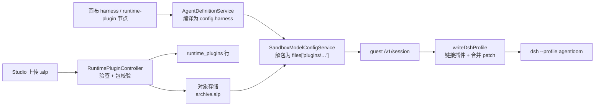

# Runtime 插件

> 本页回答：用户写的 DeepSeek Harness 插件，怎样从一个上传的包或一个 npm 包名，变成 microVM 里 Agent 运行时的一部分？

sandbox 运行态的 Agent 核心是 guest 内的 dsh 子进程（见 [Agent 运行态](/dev/server/agent-runtime)）。dsh 由 Cordis 插件树组成，profile 的 `cordis.patch.yml` 决定挂哪些插件、每个插件的配置。runtime 插件就是用户追加进这份 patch 的 Cordis 插件，可以注册工具、拦截工具调用、改写提示词组装或 agent loop。它与工作流的 [节点插件](/dev/server/plugins) 是两套东西：节点插件是在服务端 Extism 沙箱里执行的 WASM，runtime 插件是在 microVM 内 dsh 进程中执行的 ESM 代码，不在服务端加载。

插件开发者视角的打包与 manifest 字段见 [Runtime 插件开发](/api/plugins/runtime)，画布操作见 [Harness 与 runtime 插件](/guide/agents/harness)。

## 两种来源

| 来源 | 画布节点的 `source` | 进入 VM 的方式 | 版本固定 |
| --- | --- | --- | --- |
| 已签名插件包 | `package` | 上传到 `/runtime-plugins`，会话创建时由 server 解包并随 `/v1/session` 的 `files` 下发 | 包的 `(pluginId, version)` |
| npm 包 | `npm` | 会话创建时 guest 在会话目录内 `npm install` | 节点上填写的版本或 range |

## 数据流

## 上传与校验

`POST /api/v1/runtime-plugins`（`agentloom-server/src/modules/runtime-plugin/runtime-plugin.controller.ts`，角色 `owner` / `admin` / `creator`）以 multipart 接收 `.alp`，按顺序：

1. 共用的签名入口 `readSignedAlpArchive`（`agentloom-server/src/modules/plugin/plugin-archive-intake.util.ts`）：扩展名、大小（`MAX_RUNTIME_PLUGIN_FILE_SIZE`，50 MiB）、`manifest.json`、签名元数据、上传者本人登记的开发者公钥、RSA-PSS 验签与 `contentHash` 比对。这一段与节点插件完全一致，错误类型沿用 `plugin-*`。
2. `manifest.kind` 必须为 `runtime`，否则 422 提示节点插件到 `/plugins` 上传；再用 plugin-sdk 的 `validateManifest` 做完整校验（`kind: runtime` 时必须有 `runtime` 字段、不得有 `wasmEntry`）。
3. `runtime.dshVersion` 必须与 `RUNTIME_PLUGIN_SUPPORTED_DSH_VERSION`（`agentloom-server/src/modules/runtime-plugin/runtime-plugin.constants.ts`）精确相等。平台只装了一份 dsh，插件按哪个版本的 API 写，就只能在那个版本上跑。
4. 读出 `runtime.patch` 与 `runtime.entry` 指向的文件，缺失时 422。patch 必须是 YAML 列表，每项含 `insert` 或 `id`。
5. 同组织同 `(pluginId, version)` 已存在时 409；否则上传对象并写表。

对象存储键为 `tenants/<tenantId>/runtime-plugins/<pluginId>/<version>/archive.alp`；写表失败时删除已上传的对象。`runtime_plugins` 行保存 manifest 原文、bundle patch 原文、`configSchema`、签名与哈希（`agentloom-server/src/database/schema/runtime-plugins.schema.ts`），REST 响应不返回存储键、签名、patch 与 manifest。状态 `registered` → `active` → `disabled` 由 `PATCH /runtime-plugins/:id/status` 切换，带 `occVersion` 做乐观锁；只有 `active` 的插件能被发布与下发（`RuntimePluginService.findActiveById`）。

## 画布编译

Agent 画布上，`runtime-plugin` 节点经 `plugins-in` 端口连到 `harness` 节点，`harness` 节点经 `harness-in` 连到 Agent Main。`AgentDefinitionService.buildRuntimeConfigFromNodes`（`agentloom-server/src/modules/agent-definition/agent-definition.service.ts`）把它们编译为 `AgentRuntimeConfig.harness`（schema 在 `agentloom-contracts/src/agent-runtime-config.ts` 的 `HarnessConfigSchema`）：

- `plugins` 按 `plugins-in` 连线在画布中的顺序排列，这个顺序就是 patch 的叠加顺序。没连到 harness 的 runtime-plugin 节点不参与编译。
- `profilePatch` 去空白后为空即省略；非空时必须是 YAML 列表且不超过 65536 字符。
- `package` 节点必须选了插件；`npm` 节点的包名按 `RUNTIME_PLUGIN_NPM_NAME_PATTERN` 校验、版本必填。
- 运行态不是 `sandbox` 却带 harness 时拒绝。

以上错误都抛 `AgentCanvasInvalidHarnessException`（422，`agent-canvas-invalid-harness`），保存草稿时就会触发。harness 配置不单独入库，随版本快照的 `nodes` 冻结、在运行时重新编译。

发布、保存版本、保存并发布时，`assertRuntimePluginsPublishable` 再确认每个启用的 `package` 插件存在且为 `active`，否则以 `agent-publish-validation` 拒绝。这项检查不放在草稿保存路径上，所以插件还没启用时也能先搭画布。

## 下发

会话创建时 `SandboxModelConfigService.buildContainerSessionPayload`（`agentloom-server/src/modules/agent/sandbox-model-config.service.ts`）组装 `harness` 载荷：

- 启用的 `package` 插件：在租户事务中 `findActiveById`，补上 `pluginId`；事务外下载归档，把每个文件（含 `manifest.json`）以 UTF-8 严格解码后写入 `files['plugins/<pluginId>/<path>']`。插件发布后被停用或删除，新会话在这一步失败。
- 停用的节点与 `npm` 插件原样下发，分别由 guest 跳过与安装。

`files` 是文本通道，所以 runtime 插件包只能包含 UTF-8 文本文件，否则 422 `sandbox-runtime-plugin-unsupported-file`。插件文件与技能文件共用会话文件上限（单文件 1 MiB、合计 16 MiB），超出时 422 `sandbox-skill-payload-too-large`。每个启用的 npm 插件把会话初始化的请求超时加 180 s。

## guest 内加载

`writeDshProfile`（`agentloom-deploy/sandbox/src/dsh/profile-writer.ts`）对每个启用的插件：

| 步骤 | `package` | `npm` |
| --- | --- | --- |
| 插件根目录 | `<会话目录>/plugins/<pluginId>/` | `<会话目录>/dsh-home/npm/node_modules/<name>/` |
| 获取 | 已随 `files` 写好 | `npm install --omit=dev --no-audit --no-fund --ignore-scripts --legacy-peer-deps --no-package-lock <name>@<version>`，超时 180 s，失败时会话创建失败并带 stderr 末尾 |
| 链接进 profile `node_modules/` | 包内 `package.json` 的 `name`；没有合法 name 时用 `@agentloom-runtime-plugins/<pluginId>` | 包名 |
| patch 来源 | manifest 的 `runtime.patch` | `package.json` 的 `dsh.bundle.patch`（字符串或数组）；没有时把包本身作为一个插件条目挂载，id 为 `runtime-plugin-<nodeId>` |

读出的 patch 先把字面量 `__PLUGIN_ROOT__` 替换为插件根目录，再把 `insert` 条目中以相对路径写的 `name` 按 patch 文件所在目录转为绝对路径（多份 patch 合并进一个文件后，相对基准会变）；节点上的 `pluginConfig` 浅合并到该插件每个顶层 `insert` 条目的 `config` 上。处理基于 YAML AST，`!!js` 等标签原样保留。最终叠加顺序：平台层 → 各插件（画布顺序）→ 用户 profile patch，后者可以覆盖前面任何条目。

### 依赖解析

插件 `import` 的 `@deepseek-ai/*` 包必须解析到 guest 安装的那一份 dsh，否则同一个服务会有两份实例。实测只有同时满足两点时 import 才成功：插件被链接进 profile 的 `node_modules/`，并且插件的 `package.json` 在 `peerDependencies` 中声明了它 import 的每个 `@deepseek-ai/*` 包。只做其一都会失败。npm 安装用 `--legacy-peer-deps` 正是为了不再装一份 peer 副本。

## 约束与取舍

- **信任边界**：runtime 插件是 dsh 进程内的任意代码，能读写会话目录、执行命令、访问 guest 允许的网络。它只在该 Agent 的 microVM 内运行，不进入 server 进程；隔离靠 microVM，不靠插件签名。签名只证明包出自本组织登记的开发者。
- **npm 在线安装**：每次会话都在会话 tmpfs 内重新安装，不缓存，随会话销毁；registry 走 guest 的 80/443 出站。`--ignore-scripts` 使依赖安装脚本不执行，需要原生编译的包无法使用。
- **版本锁**：平台与插件都锁在同一个 dsh 版本。升级 guest 的 dsh 时，`RUNTIME_PLUGIN_SUPPORTED_DSH_VERSION`、CLI 模板版本与 Studio 显示的版本一起改，旧版本声明的插件包需要重新构建上传。
- **rootfs 体积**：dsh 及其依赖进入 rootfs 后，rootfs 大小由 `agentloom-deploy/firecracker/artifact-lock.json` 的 `rootfs.sizeGiB` 决定，见 [Firecracker 沙箱](/deploy/firecracker)。

决策背景见 [ADR 0003](/dev/decisions/0003-dsh-sandbox-runtime)。
