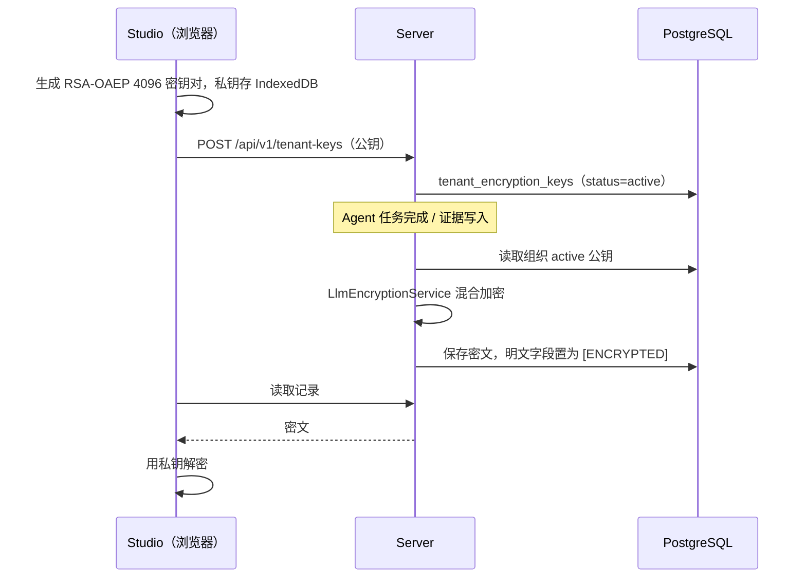

# 安全模型

> 本页回答：服务端用哪些机制识别调用者、隔离租户数据、保护密钥与敏感内容，每种机制的边界在哪里？

守卫与拦截器的执行顺序、限流算法见 [请求处理链路](/dev/server/request-pipeline)；本页只讲各机制本身。对外凭证的用法见 [API 与集成](/api/)。

## 调用者身份

服务端接受三种凭证，彼此不互相回退：

| 凭证 | 传递方式 | 校验位置 | 可访问范围 |
| --- | --- | --- | --- |
| Supabase JWT | `Authorization: Bearer <jwt>` | `AuthGuard`（HTTP）、`WsJwtGuard` 与各 gateway 握手中间件（Socket.IO）、`agentloom-server/src/modules/acp-gateway/acp-authentication.service.ts`（ACP） | 全部非公开路由 |
| 平台 API Token（`al_` 前缀） | `X-Api-Key: al_…` | `AuthGuard` 调用 `PlatformApiTokenService.validateToken` | 普通 REST 路由，按 token 的 scopes 与签发者角色 |
| Agent API Key（`alak_` 前缀） | `Authorization: Bearer alak_…` | `AgentApiKeyGuard`（`agentloom-server/src/modules/agent-api/agent-api-key.guard.ts`） | 仅 `/api/v1/agent-api/*` |

请求带 `Bearer` 头时，`AuthGuard` 只走 JWT 分支；JWT 无效即返回 401，不会再尝试 `X-Api-Key`。`AuthGuard` 不识别 `alak_`：`/agent-api` 控制器声明 `@Public()` 跳过全局认证，再用自己的 `AgentApiKeyGuard`。

### JWT 校验与吊销

JWT 以 `APP_JWT_SECRET` 按 HS256 验签，要求 `aud=authenticated`。验签前先查吊销表：`TokenBlacklistService`（`agentloom-server/src/common/services/token-blacklist.service.ts`）把 token 的 SHA-256 哈希与过期时间写入数据库表 `revoked_tokens`，不使用 Redis。

GoTrue 签发的 access token 带 `session_id` 声明。带该声明的 token 在校验时，同一条 SQL 同时检查 `revoked_tokens` 与 `auth.sessions`：会话行不存在或已过 `not_after` 即视为吊销（`token-revoked`）。因此 `DELETE /api/v1/auth/sessions/:id`、`POST /api/v1/auth/sessions/revoke-all`、GoTrue 侧登出与会话超时都会让该会话已签发的 access token 立即失效；`POST /api/v1/auth/logout` 另外把当前 token 写入 `revoked_tokens`。`session_id` 不是 UUID 时直接按吊销处理。

`auth.sessions` 不可读（表不存在、权限不足、查询失败）时 fail-closed：返回 503 `https://agentloom.dev/errors/session-verification-unavailable`，不退化为只查哈希黑名单。应用的 `APP_DATABASE_URL` 必须能读到 GoTrue 的 `auth.sessions`。HTTP `AuthGuard`、Socket.IO 握手与 ACP 认证共用这一检查。

验签成功后，`UserIdentityResolver` 把 Supabase `sub` 换成应用内用户 ID，写入 `req.user`。

### MFA

用户绑定了已验证的 TOTP 因子时，`POST /api/v1/auth/login` 先签发 `type: 'mfa_pending'`、有效期 5 分钟的临时 JWT；客户端用它调用 `POST /api/v1/auth/mfa/login/verify` 换取正式令牌。`AuthGuard`、`WsJwtGuard`、各 gateway 握手中间件和 ACP `authenticate` 都拒绝 `mfa_pending` 令牌（HTTP 返回 403 `mfa-required`）。TOTP 绑定与解绑路由在 `agentloom-server/src/modules/auth/mfa.controller.ts`。

### OAuth

`POST /api/v1/auth/oauth/:provider` 发起登录，`provider` 取值为 `google` 或 `github`（`agentloom-server/src/modules/auth/dto/oauth.dto.ts`）；回调为 `GET /api/v1/auth/oauth/callback`，部署时由 `APP_OAUTH_REDIRECT_URL` 指向它。请求带 `platform=mobile` 时，回调结果以深链 `agentloom://auth/callback?…` 交给移动端，失败时为 `agentloom://auth/callback?error=oauth_callback_failed`（`agentloom-server/src/modules/auth/oauth.service.ts`、`agentloom-server/src/modules/auth/oauth.controller.ts`）。

## 平台 API Token

`agentloom-server/src/modules/platform-api-token/platform-api-token.service.ts`：

- 明文为 `al_` 加 32 字节随机数的 hex，只在创建响应中返回一次；数据库存 SHA-256 哈希，另存 `al_` 加 8 位的 `tokenPrefix` 供展示和限流识别。
- 每个用户在每个租户下最多持有 20 个未吊销的 token。
- 校验检查前缀、哈希、吊销标记与过期时间，角色从 `RbacCacheService` 读取，即 token 继承签发者当前的组织角色。
- 管理路由前缀为 `/api/v1/platform-api-tokens`。

## Agent API Key

`agentloom-server/src/modules/agent-api/agent-api-key.service.ts`：明文为 `alak_` 加 32 字节随机数的 hex，存 SHA-256 哈希，`keyPrefix` 为 `alak_` 加 8 位；每个 Agent 最多 `MAX_ACTIVE_AGENT_API_KEYS_PER_AGENT`（20）个有效 key。管理路由为 `/api/v1/agent-definitions/:agentId/api-keys`。`AgentApiKeyGuard` 只在请求上挂 `agentApiKey`，不设置 `req.user`，因此这类请求不进入租户事务拦截器，服务层自行按 key 所属租户查询。

## RBAC 角色

组织角色定义为 `OrgRole`（`agentloom-server/src/common/types/org-role.type.ts`），数据库枚举 `org_role` 取值 `owner`、`admin`、`creator`、`operator`、`viewer`。

- 路由用 `@Roles(...)` 声明允许的角色；`RolesGuard` 用 `requiredRoles.includes(userRole)` 精确匹配，角色之间**没有继承**。允许 `operator` 的路由若也要允许 `owner`，必须把两者都写进 `@Roles`。
- 未声明 `@Roles` 的路由不经过 `TenantGuard` 与 `RolesGuard` 的检查。
- 用户在组织中的角色由 `RbacCacheService`（`agentloom-server/src/common/services/rbac-cache.service.ts`）缓存在 Redis；未命中时查询 `organization_members` 关联 `organizations`。角色变更调用 `invalidateUserRole` 删除缓存并通过 Redis pub/sub 通知其他实例。
- `agentloom-server/src/common/types/rbac-permissions.ts` 中的 `RBAC_PERMISSION_MATRIX` / `hasPermission` 当前没有生产代码调用，权限以各路由的 `@Roles` 为准。

## 数据库行级安全

租户隔离最终由 PostgreSQL RLS 保证，应用层的过滤条件只是第一道防线。

- 数据库函数 `get_tenant_id()` 定义为 `NULLIF(current_setting('app.current_tenant', true), '')::uuid`（迁移 `agentloom-server/src/database/migrations/0005_lazy_tomorrow_man.sql`；schema 侧引用在 `agentloom-server/src/database/schema/rls-helpers.ts`）。
- 策略工厂在 `agentloom-server/src/database/schema/rls-policies.ts`，策略都授予 `authenticated` 角色：
  - `createDirectTenantPolicies(table)`：select / insert / update / delete 四条策略，条件 `tenant_id = get_tenant_id()`。带 `tenant_id` 列的业务表默认使用它。
  - `createAppendOnlyTenantPolicies(table)`：只有 select / insert，用于 `audit_logs` 与 `audit_log_archives`。
  - `createJoinTenantPolicies(...)`：用于没有 `tenant_id` 列、通过父表关联判定租户的子表。
- 租户事务：`TenantTransactionInterceptor` 对已认证请求开启事务，在事务内执行 `SET LOCAL ROLE authenticated` 与 `set_config('app.current_tenant', <tenantId>, true)`（`agentloom-server/src/common/interceptors/tenant-transaction.context.ts`）。事务提交后响应才发出。服务代码通过 `getTenantDb(this.db)` 取得当前事务连接。
- 不在请求链里的代码（BullMQ worker、定时任务、事件监听器）没有拦截器建立的事务。`getTenantDb()`（`agentloom-server/src/common/providers/tenant-aware-db.provider.ts`）在事务上下文之外直接返回基础连接，不做角色切换，因此这类代码要么自行调用 `runInTenantTransaction`，要么在查询中显式带租户条件。

哪些表没有租户策略、迁移中 `GRANT` 的约定见 [数据库](/dev/server/database)。

## 端到端加密（E2EE）

E2EE 让数据库中保存的 LLM 输出与部分证据只有持有租户私钥的浏览器能解密。

- **算法**：`LlmEncryptionService`（`agentloom-server/src/modules/llm/llm-encryption.service.ts`）的算法标识为 `RSA-OAEP-4096+AES-256-GCM`。每次加密生成随机 32 字节 DEK 与 12 字节 IV，用 AES-256-GCM 加密明文，AAD 为 `<tenantId>:<timestamp>`；DEK 用租户公钥以 RSA-OAEP（SHA-256）加密。输出字段：`ciphertext`、`encryptedSessionKey`、`iv`、`authTag`、`aad`、`keyFingerprint`、`algorithm`。
- **加密范围**：`AgentTaskWorker` 加密 LLM 输出（`agentloom-server/src/modules/execution/agent-task.worker.ts`，`content` 置为 `[ENCRYPTED]`）；`EvidenceService` 只加密 `agent_decision` 与 `tool_output` 两类证据。`LlmEncryptionService.isE2EEEnabled` 为假（组织未配置公钥）时不加密。
- **公钥管理**（`agentloom-server/src/modules/tenant-key/`）：公钥至少 4096 位，拒绝私钥 PEM（`agentloom-server/src/modules/tenant-key/rsa-key-utils.ts`）；指纹为 SPKI DER 的 SHA-256。表 `tenant_encryption_keys` 状态为 `active` / `rotating` / `revoked`，组织 + 指纹唯一，部分唯一索引保证每个组织至多一个 `active`（`agentloom-server/src/database/schema/tenant-encryption-keys.schema.ts`）。已有 active key 时再次上传会被拒绝，换钥走 `POST /api/v1/tenant-keys/:id/rotate`：旧 key 置为 `rotating`，新 key 成为 `active`。上传、轮换、删除要求 `owner` 或 `admin`；查询要求 `owner`、`admin`、`creator` 或 `operator`（`viewer` 不可）。
- **私钥**：Studio 在浏览器内生成密钥对，PKCS8 字节存入 IndexedDB，解密时以 non-extractable 方式导入（`agentloom-studio/src/features/tenant-key/lib/clientCrypto.ts`、`agentloom-studio/src/features/tenant-key/lib/keyStorage.ts`）。私钥不上传服务端。

## 服务端密钥加密

LLM 提供商 API Key、MCP 服务凭据、私有部署配置中的密钥等**由服务端自己需要读取**的机密，使用信封加密，与租户 E2EE 无关：

- KEK 为 `APP_MASTER_ENCRYPTION_KEY`，必须是 Base64 编码的 32 字节值（`agentloom-server/src/config/env.schema.ts` 中有校验）。
- `EncryptionService`（`agentloom-server/src/modules/api-key/encryption.service.ts`）每条数据生成随机 DEK，用 AES-256-GCM 加密数据，再用 KEK 以 AES-GCM 加密 DEK。
- 调用方：`agentloom-server/src/modules/api-key/api-key.service.ts`、`agentloom-server/src/modules/mcp/mcp.service.ts`、`agentloom-server/src/modules/private-deployment/private-deployment.service.ts`。

更换 `APP_MASTER_ENCRYPTION_KEY` 会使已存密文无法解密。

## Webhook 签名

入站 Webhook 的签名模式使用 HMAC-SHA256，签名串为 `<timestamp>.<rawBody>`，比较使用常数时间比较（`agentloom-server/src/modules/trigger/webhook.service.ts`）。请求头、容忍窗口和示例脚本见 [Webhook](/api/webhooks)。
