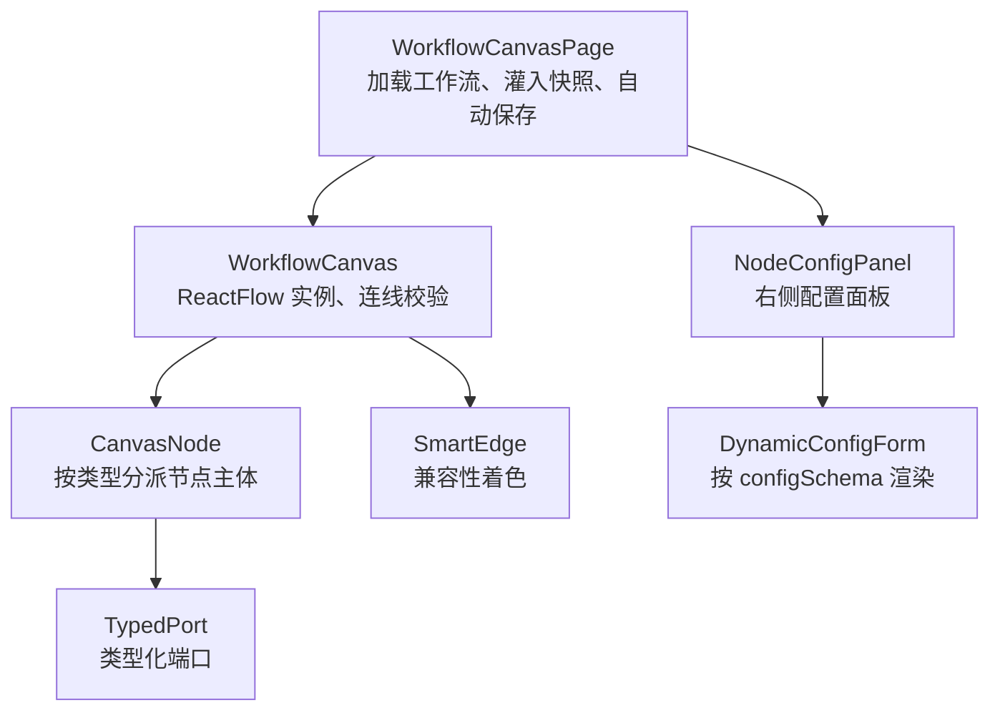
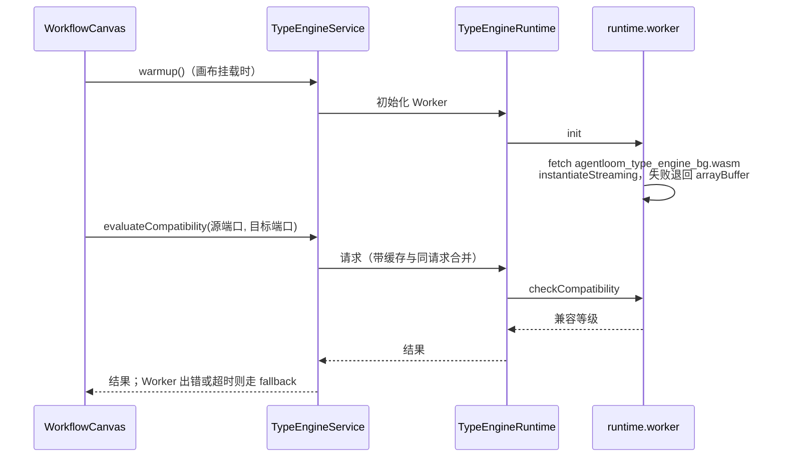

# 画布

工作流画布如何把节点注册表、本地草稿、自动保存与端口兼容性检查串在一起？本页解释 `agentloom-studio/src/features/canvas/` 的运行机制。节点类型本身的说明见 [节点参考](/guide/nodes/)。

## 节点从哪里来

画布上能放的节点由 `agentloom-studio/src/features/canvas/types/nodeTypeRegistry.ts` 决定：`NODE_TYPES` 是类型全集，`NODE_TYPE_REGISTRY` 为每个类型给出 label、描述、分类、输入/输出端口与配置项 schema；`DYNAMIC_ONLY_NODE_TYPES` 中的类型只在运行时生成，不出现在节点面板里。面板分组的名称与顺序来自 `agentloom-studio/src/features/canvas/components/nodeCategories.ts`。新增节点类型的步骤见 [新增节点类型](/dev/howto/add-node-type)。

## 组件结构

| 组件 | 文件 |
| --- | --- |
| `WorkflowCanvasPage` | `agentloom-studio/src/features/canvas/components/WorkflowCanvasPage.tsx` |
| `WorkflowCanvas` | `agentloom-studio/src/features/canvas/components/WorkflowCanvas.tsx` |
| `CanvasNode` | `agentloom-studio/src/features/canvas/components/CanvasNode.tsx` |
| `TypedPort` | `agentloom-studio/src/features/canvas/components/TypedPort.tsx` |
| `SmartEdge` | `agentloom-studio/src/features/canvas/components/edges/SmartEdge.tsx` |
| `NodeConfigPanel` | `agentloom-studio/src/features/canvas/components/panels/NodeConfigPanel.tsx` |
| `DynamicConfigForm` | `agentloom-studio/src/features/canvas/components/panels/DynamicConfigForm.tsx` |
| `agent` 节点专用面板 | `agentloom-studio/src/features/canvas/components/panels/AgentNodeConfigPanel.tsx` |
| 叠加层 | `agentloom-studio/src/features/canvas/components/overlays/` 下的 `CompatibilityPreview`、`ConnectionStateOverlay`、`NodeInfoCard` |

**细节层级**：`agentloom-studio/src/features/canvas/hooks/useLevelOfDetail.ts` 按缩放比例切换节点渲染精度：缩放 ≥ 0.7 为 full，0.4 到 0.7 为 compact，低于 0.4 为 minimal。节点越多、缩放越小，渲染的 DOM 越少。

## 画布草稿：canvasStore

`agentloom-studio/src/features/canvas/stores/canvasStore.ts` 中的 `useCanvasStore` 持有节点、边、视口、选中状态与 `isDirty` 标记，中间件为 `devtools`、`subscribeWithSelector`、`immer`。它是画布的本地草稿，不是服务端数据的缓存：服务端版本由 TanStack Query 持有，草稿通过自动保存回写。

action 按职责分组（以 `CanvasActions` 接口为准）：

| 职责 | action |
| --- | --- |
| ReactFlow 变更 | `onNodesChange`、`onEdgesChange`、`createConnection`、`addNode`、`updateNodeData` |
| 删除与选择 | `deleteSelectedNode`、`deleteSelectedNodes`、`selectNode`、`selectNodes`、`toggleNodeSelection`、`clearSelection`、`selectEdge` |
| 连线字段映射 | `openFieldMapping`、`closeFieldMapping`、`updateEdgeData`、`updateFieldMapping`、`batchUpdateFieldMappings`、`saveMappingSnapshot`、`undoFieldMapping`、`refreshEdgeCompatibility` |
| 视口 | `setViewport`（不标脏）、`commitViewport`（标脏） |
| 与服务端同步 | `applyServerSnapshot`、`markSaved`、`advanceVersion`、`setIsSaving`、`reset` |
| 搜索与辅助 | `toggleSearch`、`setSearchQuery`、`nextSearchResult`、`prevSearchResult`、`clearSearch`、`toggleMiniMap`、`setHoveredNodeId` |
| 校验提示 | `setNodeValidationError`、`clearNodeValidationErrors` |

## 自动保存

`agentloom-studio/src/features/canvas/hooks/useAutoSave.ts` 订阅 store 的节点、边、视口与 `isDirty`，防抖 2000 毫秒（常量 `AUTOSAVE_DEBOUNCE_MS`，写在源码里）后调用 `useUpdateWorkflow`，即 `PATCH workflow-definitions/:id`，请求体为 `{ nodes, edges, viewport, version }`，字段保持 camelCase。

- 请求带上当前 `version`，server 用它做乐观并发控制。
- 成功后，若保存期间没有新的编辑，调用 `markSaved(version)` 清除脏标记；若有新编辑，只调用 `advanceVersion(version)` 推进版本号，让下一次保存不因版本落后被拒。
- 失败时提示「自动保存失败」或「自动保存失败，修改已保留在本地」，草稿不丢。
- 已归档的工作流不自动保存。

`agentloom-studio/.env.example` 与部署模板中声明的 `VITE_AUTOSAVE_DEBOUNCE_MS` 目前没有被 Studio 源码读取，改防抖时长要改 `AUTOSAVE_DEBOUNCE_MS`。

## 服务端快照与本地草稿

`WorkflowCanvasPage` 只在工作流 id 或 `version` 与 store 中不同时调用 `applyServerSnapshot` 覆盖草稿。如果是同一个工作流且画布有未保存修改，它跳过服务端快照并提示「已保留本地未保存修改」。这样，自动保存成功后 TanStack Query 写回的数据不会把用户在保存期间做的编辑冲掉。

## 连线兼容性检查

拖出连线时，画布需要立刻知道两个端口能否相连。检查在 Web Worker 里的 WASM 中完成，主线程不阻塞，也不请求 server：

| 文件 | 作用 |
| --- | --- |
| `agentloom-studio/src/features/canvas/lib/typeEngine/service.ts` | `TypeEngineService`：`warmup`、`getCachedCompatibility`（同步读缓存）、`evaluateCompatibility`（异步，异常时退回 fallback） |
| `agentloom-studio/src/features/canvas/lib/typeEngine/runtime.ts` | 创建 Worker、结果缓存、同请求合并、请求超时 4000 毫秒 |
| `agentloom-studio/src/features/canvas/lib/typeEngine/runtime.worker.ts` | 加载 `agentloom-type-engine/pkg/agentloom_type_engine_bg.wasm` 并调用 `checkCompatibility` |
| `agentloom-studio/src/features/canvas/lib/typeEngine/contracts.ts` | 主线程与 Worker 之间的消息类型、序列化后的端口定义 |
| `agentloom-studio/src/features/canvas/lib/typeEngine/serialize.ts` | 把画布端口序列化为 WASM 的输入 |
| `agentloom-studio/src/features/canvas/lib/typeEngine/fallback.ts` | Worker 不可用时的兜底判断，规则取自 `@agentloom/contracts` 的 `PORT_DATA_TYPE_TRANSFORM_RULES` |
| `agentloom-studio/src/features/canvas/lib/connectionCompatibility.ts` | 画布侧入口：同步读缓存结果供拖线高亮，异步评估供落线校验 |

兼容等级与转换规则见 [类型引擎](/dev/type-engine)。
