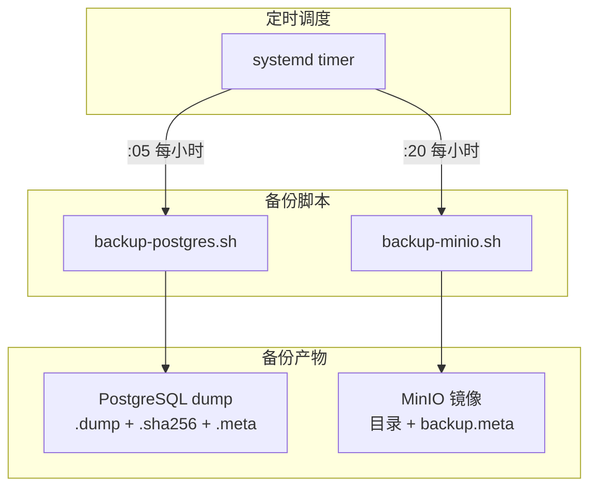
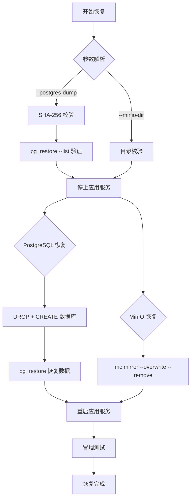

# 备份与恢复

AgentLoom 提供自动化备份脚本，覆盖 PostgreSQL 数据库和 MinIO 对象存储，支持 SHA-256 完整性校验和自动保留策略。

## 备份架构



## PostgreSQL 备份

### 备份流程

`backup-postgres.sh` 脚本执行以下步骤：

1. **导出数据库** — 使用 `pg_dump -Fc`（自定义压缩格式）
2. **生成校验码** — `sha256sum` 生成 `.sha256` 文件
3. **验证完整性** — `pg_restore --list` 验证 dump 可读性
4. **写入元数据** — 生成 `.meta` 文件（时间戳、大小、数据库名等）
5. **清理历史** — 按保留策略删除过期备份

### 执行方式

```bash
# 手动执行
./scripts/backup-postgres.sh

# 默认输出目录
# backups/postgres/agentloom_<timestamp>.dump
# backups/postgres/agentloom_<timestamp>.dump.sha256
# backups/postgres/agentloom_<timestamp>.meta
```

### 备份产物

| 文件 | 说明 |
|------|------|
| `*.dump` | PostgreSQL 自定义格式备份（`pg_dump -Fc`） |
| `*.dump.sha256` | SHA-256 校验码文件 |
| `*.meta` | 元数据（时间戳、数据库名、大小） |

### 环境变量

| 变量 | 默认值 | 说明 |
|------|--------|------|
| `POSTGRES_HOST` | `localhost` | 数据库主机 |
| `POSTGRES_PORT` | `5432` | 数据库端口 |
| `POSTGRES_USER` | `agentloom` | 数据库用户 |
| `POSTGRES_DB` | `agentloom` | 数据库名 |
| `BACKUP_DIR` | `./backups/postgres` | 备份输出目录 |
| `RETENTION_DAYS` | `7` | 备份保留天数 |

## MinIO 备份

### 备份流程

`backup-minio.sh` 脚本执行以下步骤：

1. **镜像同步** — 使用 `mc mirror` 从 MinIO 拉取完整副本
2. **SSL 感知** — 自动检测 MinIO 连接是否使用 SSL
3. **写入元数据** — 生成 `backup.meta` 记录备份信息
4. **清理历史** — 按保留策略删除过期备份目录

### 执行方式

```bash
# 手动执行
./scripts/backup-minio.sh

# 默认输出目录
# backups/minio/<timestamp>/
# backups/minio/<timestamp>/backup.meta
```

### 环境变量

| 变量 | 默认值 | 说明 |
|------|--------|------|
| `MINIO_ENDPOINT` | `http://localhost:9000` | MinIO 端点 |
| `MINIO_ROOT_USER` | — | MinIO 管理员用户 |
| `MINIO_ROOT_PASSWORD` | — | MinIO 管理员密码 |
| `MINIO_BUCKET` | `agentloom` | 备份的 Bucket 名称 |
| `BACKUP_DIR` | `./backups/minio` | 备份输出目录 |
| `RETENTION_DAYS` | `7` | 备份保留天数 |

## 自动调度 (systemd)

AgentLoom 提供 4 个 systemd 单元文件，实现小时级自动备份：

### 单元文件

| 文件 | 类型 | 说明 |
|------|------|------|
| `agentloom-backup-postgres.service` | Service | PostgreSQL 备份服务 |
| `agentloom-backup-postgres.timer` | Timer | 每小时第 5 分钟触发 |
| `agentloom-backup-minio.service` | Service | MinIO 备份服务 |
| `agentloom-backup-minio.timer` | Timer | 每小时第 20 分钟触发 |

### 安装与启用

```bash
# 1. 复��单元文件
sudo cp systemd/*.service systemd/*.timer /etc/systemd/system/

# 2. 编辑 service 文件，确认脚本路径和环境变量
sudo systemctl edit agentloom-backup-postgres.service

# 3. 重新加载 daemon
sudo systemctl daemon-reload

# 4. 启用并启动 timer
sudo systemctl enable --now agentloom-backup-postgres.timer
sudo systemctl enable --now agentloom-backup-minio.timer

# 5. 验证 timer 状态
systemctl list-timers | grep agentloom
```

### 调度时间

| Timer | 触发时间 | 说明 |
|-------|---------|------|
| postgres | `*:05:00` | 每小时第 5 分钟 |
| minio | `*:20:00` | 每小时第 20 分钟 |

两个 timer 均配置了 `Persistent=true`，即使系统重启后也会补偿执行错过的备份周期。

::: warning Kubernetes 环境
systemd timer 仅适用于 Docker Compose 部署模式。在 Kubernetes 环境中，应使用 **CronJob** 资源替代。
:::

## 恢复流程

`restore.sh` 提供一键式灾难恢复，同时支持 PostgreSQL 和 MinIO 的恢复。

### 恢复步骤



### 执行恢复

```bash
# 仅恢复 PostgreSQL
./scripts/restore.sh --postgres-dump backups/postgres/agentloom_20260320.dump

# 仅恢复 MinIO
./scripts/restore.sh --minio-dir backups/minio/20260320/

# 同时恢复两者
./scripts/restore.sh \
  --postgres-dump backups/postgres/agentloom_20260320.dump \
  --minio-dir backups/minio/20260320/
```

### 恢复流程详解

#### PostgreSQL 恢复

1. **SHA-256 校验** — 验证 dump 文件未被篡改
2. **pg_restore --list** — 验证 dump 格式完整
3. **停止应用服务** — 停止 server 和 worker（避免活跃连接干扰）
4. **DROP + CREATE** — 删除并重建目标数据库
5. **pg_restore** — 从 dump 恢复全部数据
6. **重启应用服务**
7. **冒烟测试** — 验证 API 健康端点可达

#### MinIO 恢复

1. **目录校验** — 验证备份目录存在且非空
2. **停止应用服务**
3. **mc mirror** — 使用 `--overwrite --remove` 参数完全同步
   - `--overwrite`: 覆盖目标中的已有文件
   - `--remove`: 删除目标中备份不存在的文件
4. **重启应用服务**
5. **冒烟测试**

::: danger 恢复注意事项
- 恢复操作会**完全覆盖**目标数据，请确认备份版本正确
- PostgreSQL 恢复会先 **DROP** 整个数据库再重建
- MinIO 的 `--remove` 参数会删除备份中不存在的文件
- 恢复前建议先备份当前数据作为回退点
:::

## 备份策略建议

### 生产环境推荐

| 配置项 | 建议值 | 说明 |
|--------|--------|------|
| PostgreSQL 备份频率 | 每小时 | 默认调度 |
| MinIO 备份频率 | 每小时 | 默认调度 |
| 本地保留 | 7 天 | 默认值 |
| 异地备份 | 每日 | 使用 rsync/rclone 同步到远程 |
| 恢复演练 | 每月 | 验证备份可用性 |

### 异地备份扩展

默认脚本仅支持本地备份。建议通过 cron 或 systemd timer 追加异地同步：

```bash
# 示例：每日凌晨将备份同步到远程服务器
0 3 * * * rsync -avz /path/to/backups/ remote:/backups/agentloom/
```

## SHA-256 完整性校验

所有 PostgreSQL 备份都自动生成 SHA-256 校验码。手动验证方式：

```bash
# 校验备份完整性
sha256sum -c backups/postgres/agentloom_20260320.dump.sha256

# 预期输出
# backups/postgres/agentloom_20260320.dump: OK
```

恢复脚本会在恢复前自动执行 SHA-256 校验，校验失败时拒绝恢复并报错。
