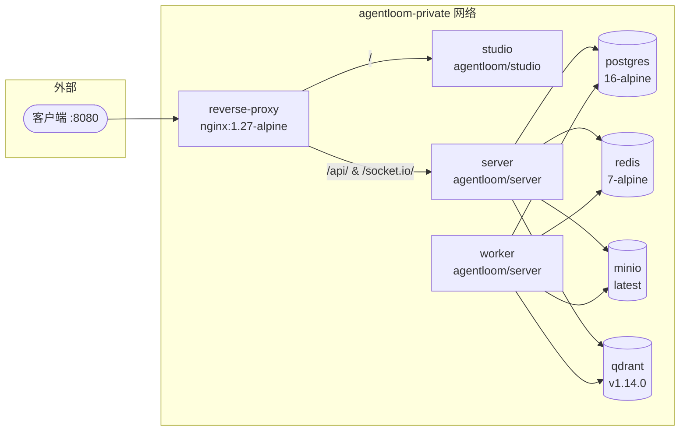

# Docker Compose 部署

使用 Docker Compose 在单机上快速部署 AgentLoom 全套服务。

## 前置要求

- Docker 24.0+ (含 Compose V2)
- 最低 4 vCPU / 8 GiB 内存 / 100 GiB SSD
- Linux 主机（推荐 Ubuntu 22.04+ 或 Debian 12+）

## 快速开始

```bash
# 1. 克隆部署资产
git clone <repo-url> && cd agentloom-deploy

# 2. 配置环境变量
cp .env.template .env
# 编辑 .env，填入密码、密钥等敏感配置

# 3. 初始化数据库（首次部署）
docker compose up -d postgres
docker compose exec postgres bash /scripts/init-db.sh
# init-db.sh 会创建 Supabase 兼容的角色和 schema

# 4. 启动全部服务
docker compose up -d

# 5. 验证服务状态
docker compose ps
curl http://localhost:8080/api/health
```

## 服务架构

Docker Compose 编排了 8 个服务，运行在 `agentloom-private` 网络上：



## 服务详解

### 反向代理 (reverse-proxy)

基于 `nginx:1.27-alpine`，对外暴露 `${EXPOSE_PORT:-8080}` 端口，承担所有流量路由：

| 路径          | 上游          | 说明                       |
| ------------- | ------------- | -------------------------- |
| `/healthz`    | 本地 200      | 健康检查端点               |
| `/socket.io/` | `server:3000` | WebSocket 升级，超时 3600s |
| `/api/`       | `server:3000` | REST API 代理              |
| `/`           | `studio:8080` | 前端 SPA                   |

关键配置参数：

```nginx
client_max_body_size 50m;     # 支持大文件上传
keepalive 32;                  # 上游连接池
proxy_http_version 1.1;        # WebSocket 必需
```

### Studio 前端 (studio)

内部运行在 `:8080` 端口。使用 Nginx 托管构建产物，支持 SPA fallback。

::: info 运行时环境变量注入
Studio 使用 **构建时占位符 + 运行时 sed 替换** 策略：

1. 构建时，Vite 环境变量使用 `__VITE_*__` 占位符
2. 容器启动时，`/docker-entrypoint.d/40-runtime-env.sh` 脚本自动将占位符替换为实际环境变量值

这使得同一镜像可在不同环境中使用，无需重新构建。
:::

### Server API (server)

运行 `node dist/src/main.js`，监听端口 3000。提供 REST API 和 Socket.IO 实时通信。

### Worker (worker)

::: warning 关键设计
Worker 使用**与 Server 完全相同的镜像和启动命令**。两者通过 Docker Compose 的服务名实现拓扑分离，而非运行时差异。这种设计确保代码一致性并简化 CI/CD 流程。
:::

::: details Worker 运维注意事项

1. **无独立 Worker 运行时** — 不存在仅启动队列消费者的模式，Worker 进程同时监听 HTTP 端口（健康检查需要）
2. **Server 同时消费队列** — Server 进程也会消费 BullMQ 队列，Worker 是水平扩展补充而非必需组件
3. **Worker 不应对外暴露** — Worker 的 HTTP 端口仅用于健康检查（`/api/health`），reverse-proxy 不应转发流量到 Worker
4. **认证依赖 Supabase 配置** — Server 和 Worker 共享同一 Supabase 连接，认证行为由 Supabase 项目配置决定
:::

### 基础设施服务

| 服务         | 镜像                    | 持久化卷        | 说明                                |
| ------------ | ----------------------- | --------------- | ----------------------------------- |
| **postgres** | `postgres:16-alpine`    | `postgres_data` | 主数据库，含初始化脚本              |
| **redis**    | `redis:7-alpine`        | `redis_data`    | 开启 AOF 持久化，需配置密码         |
| **minio**    | `minio/minio:latest`    | `minio_data`    | 控制台绑定 `127.0.0.1:9001`         |
| **qdrant**   | `qdrant/qdrant:v1.14.0` | `qdrant_data`   | 绑定 `127.0.0.1:6333`，仅内网可访问 |

### 沙箱容器 (sandbox)

Agent 隔离执行环境，基于 `agentloom/sandbox:latest`（archlinux + pi-coding-agent + Fastify HTTP）。

| 项目     | 说明                                              |
| -------- | ------------------------------------------------- |
| 镜像     | `agentloom/sandbox:latest`                        |
| 构建     | `cd agentloom-deploy/sandbox && bash build.sh`    |
| 端口     | 内部服务，由 Server 通过 HTTP + SSE 调用          |
| 环境变量 | LLM API Key 通过环境变量注入                      |

::: tip
沙箱��器不对外暴露端口，仅由 Server（`SandboxAgentAdapter`）通过内网 HTTP + SSE 协议调用。不使用沙箱功能的部署可跳过此服务。
:::

## Dockerfile 解析

### server.Dockerfile

单阶段构建，基于 `node:22-bookworm-slim`：

```dockerfile
# 1. 先构建 plugin-sdk 依赖
COPY agentloom-plugin-sdk/ ./agentloom-plugin-sdk/
RUN cd agentloom-plugin-sdk && pnpm install && pnpm build

# 2. 再构建 server
COPY agentloom-server/ ./agentloom-server/
RUN cd agentloom-server && pnpm install && pnpm build

EXPOSE 3000
CMD ["node", "dist/src/main.js"]
```

构建顺序的关键在于 **plugin-sdk 必须先于 server 构建**，因为 server 依赖 plugin-sdk 的类型声明和构建产物。

### studio.Dockerfile

多阶段构建：

**阶段 1: 构建** (node:22-bookworm-slim)

```dockerfile
# 复制 type-engine WASM 产物（已提交到仓库）
COPY agentloom-type-engine/pkg/ ./agentloom-type-engine/pkg/

# 构建时使用 __VITE_*__ 占位符作为 ARG
ARG VITE_API_URL=__VITE_API_URL__
ARG VITE_WS_URL=__VITE_WS_URL__

COPY agentloom-studio/ ./agentloom-studio/
RUN cd agentloom-studio && pnpm install && pnpm build
```

**阶段 2: 运行时** (nginx:1.27-alpine)

```dockerfile
# 复制构建产物到 Nginx
COPY --from=build /app/agentloom-studio/dist /usr/share/nginx/html

# SPA fallback 配置
RUN echo 'server { ... try_files $uri $uri/ /index.html; }' \
    > /etc/nginx/conf.d/default.conf

# 运行时环境变量替换脚本
RUN cat > /docker-entrypoint.d/40-runtime-env.sh << 'EOF'
#!/bin/sh
# 将 __VITE_*__ 占位符替换为实际环境变量
find /usr/share/nginx/html -type f -name '*.js' \
  -exec sed -i "s|__VITE_API_URL__|${VITE_API_URL}|g" {} \;
  -exec sed -i "s|__VITE_WS_URL__|${VITE_WS_URL}|g" {} \;
EOF
```

## YAML 锚点 (DRY 配置)

Docker Compose 使用 YAML 锚点避免 Server/Worker 和 Studio 的配置重复：

```yaml
x-server-app: &server-app
  image: ${SERVER_IMAGE:-agentloom/server:latest}
  env_file: .env
  depends_on:
    postgres: { condition: service_healthy }
    redis: { condition: service_healthy }
    minio: { condition: service_healthy }
    qdrant: { condition: service_healthy }
  networks:
    - agentloom-private

services:
  server:
    <<: *server-app
    # Server 专用配置

  worker:
    <<: *server-app
    # Worker 专用配置（拓扑分离）
```

## 健康检查

所有 8 个服务均配置了健康检查，确保依赖服务就绪后再启动上游：

| 服务          | 检查方式                  | 间隔 |
| ------------- | ------------------------- | ---- |
| postgres      | `pg_isready`              | 10s  |
| redis         | `redis-cli ping`          | 10s  |
| minio         | `curl /minio/health/live` | 10s  |
| qdrant        | HTTP `/healthz`           | 10s  |
| server        | HTTP `/api/health`        | 15s  |
| worker        | HTTP `/api/health`        | 15s  |
| studio        | HTTP 200 检查             | 15s  |
| reverse-proxy | 依赖上游健康              | —    |

## 常用运维命令

```bash
# 查看服务状态
docker compose ps

# 查看日志（跟踪模式）
docker compose logs -f server worker

# 重启单个服务
docker compose restart server

# 更新镜像并重建
docker compose pull
docker compose up -d --remove-orphans

# 停止全部服务（保留数据）
docker compose down

# 停止并清除数据卷（⚠️ 危险操作）
docker compose down -v
```

## 端口映射

| 端口                   | 服务          | 绑定        | 说明         |
| ---------------------- | ------------- | ----------- | ------------ |
| `${EXPOSE_PORT:-8080}` | reverse-proxy | `0.0.0.0`   | 对外统一入口 |
| 9001                   | minio 控制台  | `127.0.0.1` | 仅本地访问   |
| 6333                   | qdrant HTTP   | `127.0.0.1` | 仅本地访问   |

::: danger 安全提示
MinIO 控制台 (9001) 和 Qdrant HTTP 接口 (6333) 默认仅绑定 `127.0.0.1`。**切勿**将这些端口暴露到公网。如需远程管理，请使用 SSH 隧道。
:::

## 数据库初始化

首次部署时需运行 `init-db.sh` 脚本：

```bash
docker compose exec postgres bash /scripts/init-db.sh
```

该脚本会：

1. 在原生 PostgreSQL 上创建 Supabase 兼容的角色和 schema
2. 执行 Drizzle ORM 迁移 (`pnpm db:migrate`)
3. 可选执行种子数据填充 (`pnpm db:seed`)

::: info 为什么需要 Supabase 兼容角色？
AgentLoom 的 RLS (Row-Level Security) 策略依赖 Supabase 的角色体系。`init-db.sh` 在私有部署的原生 PostgreSQL 上复刻这些角色，确保 RLS 正常运作。
:::
