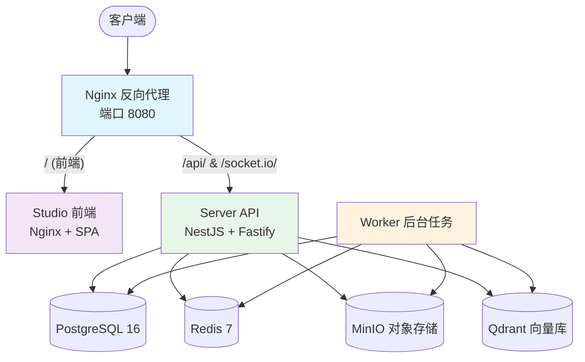

# 部署运维

AgentLoom 支持多种部署模式，适用于从开发调试到企业级生产的不同场景。

## 部署模式

| 模式                        | 适用场景           | 复杂度        |
| --------------------------- | ------------------ | ------------- |
| [Docker Compose](./docker)  | 单机部署、小团队   | ⭐ 低         |
| [Kubernetes / Helm](./helm) | 集群部署、弹性伸缩 | ⭐⭐⭐ 高     |
| 裸机部署                    | 特殊合规要求       | ⭐⭐⭐⭐ 极高 |

::: tip 推荐
对于大多数私有化部署场景，**Docker Compose** 模式是最佳起步方案 — 快速、可预测、运维简单。
:::

## 基础设施要求

### 最低配置

| 资源     | 要求                                    |
| -------- | --------------------------------------- |
| CPU      | 4 vCPU                                  |
| 内存     | 8 GiB                                   |
| 磁盘     | 100 GiB SSD                             |
| 操作系统 | Linux (推荐 Ubuntu 22.04+ / Debian 12+) |
| Docker   | 24.0+ (含 Compose V2)                   |

### 推荐生产配置

| 资源 | 要求              |
| ---- | ----------------- |
| CPU  | 8+ vCPU           |
| 内存 | 16+ GiB           |
| 磁盘 | 200+ GiB NVMe SSD |
| 网络 | 内网带宽 ≥ 1 Gbps |

## 服务架构

AgentLoom 私有化部署包含 9 个核心服务：



### 服务说明

| 服务              | 镜像                    | 说明                               |
| ----------------- | ----------------------- | ---------------------------------- |
| **reverse-proxy** | `nginx:1.27-alpine`     | 反向代理，统一入口                 |
| **studio**        | `agentloom/studio`      | React 前端，Nginx 托管 SPA         |
| **server**        | `agentloom/server`      | NestJS API 服务                    |
| **worker**        | `agentloom/server`      | 后台任务处理（与 server 共享镜像） |
| **postgres**      | `postgres:16-alpine`    | 主数据库                           |
| **redis**         | `redis:7-alpine`        | 缓存与消息队列 (BullMQ)            |
| **minio**         | `minio/minio:latest`    | S3 兼容对象存储                    |
| **qdrant**        | `qdrant/qdrant:v1.17.0` | 向量数据库（知识库 RAG）           |
| **sandbox**       | `agentloom/sandbox:latest` | 沙箱容器：archlinux + pi-coding-agent + Fastify HTTP，Agent 隔离执行环境 |

::: info Server 与 Worker 的关系
Server 和 Worker 使用**完全相同的 Docker 镜像和启动命令**，仅通过拓扑分离实现职责划分。这种设计简化了构建流程并确保代码一致性。
:::

## 环境配置模板

AgentLoom 使用 `envs/` 目录管理分层环境变量模板：

| 模板文件 | 用途 |
|----------|------|
| `.env.shared.example` | 基础设施（端口、镜像标签、数据库、Redis、MinIO、Qdrant） |
| `.env.server.example` | Server/Worker 专用（`APP_*` 前缀应用配置 + Supabase + Firebase） |
| `.env.studio.example` | Studio 前端（`VITE_*` 前缀构建时注入） |

### 1. 基础设置 (.env.shared)

```bash
# 对外暴露端口
EXPOSE_PORT=8080

# 镜像标签
SERVER_IMAGE=agentloom/server:latest
STUDIO_IMAGE=agentloom/studio:latest
```

### 2. 共享基础设施 (.env.shared)

```bash
# PostgreSQL（容器初始化用）
POSTGRES_USER=agentloom
POSTGRES_PASSWORD=<你的数据库密码>
POSTGRES_DB=agentloom

# Redis（容器初始化用）
REDIS_PASSWORD=<你的 Redis 密码>

# MinIO（容器初始化用）
MINIO_ROOT_USER=agentloom
MINIO_ROOT_PASSWORD=<你的 MinIO 密码>
```

### 3. Server 专用配置 (.env.server)

Server/Worker 共享同一份配置，所有应用级变量使用 **`APP_` 前缀**：

```bash
# 数据库连接（APP_ 前缀）
APP_DATABASE_URL=postgresql://agentloom:<密码>@postgres:5432/agentloom
APP_REDIS_URL=redis://:<密码>@redis:6379/0

# MinIO 对象存储
APP_MINIO_ENDPOINT=minio
APP_MINIO_PORT=9000
APP_MINIO_ACCESS_KEY=agentloom
APP_MINIO_SECRET_KEY=<你的 MinIO 密码>
APP_MINIO_USE_SSL=false
APP_MINIO_BUCKET=agentloom

# Qdrant 向量数据库
APP_QDRANT_URL=http://qdrant:6333

# JWT 与加密
APP_JWT_SECRET=<你的 JWT 密钥>
APP_MASTER_ENCRYPTION_KEY=<你的加密密钥>

# 部署模式
APP_DEPLOYMENT_MODE=private
APP_FRONTEND_URL=http://localhost:8080
APP_OAUTH_REDIRECT_URL=http://localhost:8080/auth/callback

# Supabase (可选，私有部署可全部留空)
SUPABASE_URL=
SUPABASE_ANON_KEY=
SUPABASE_SERVICE_ROLE_KEY=

# Firebase 推送通知 (可选)
FIREBASE_SERVICE_ACCOUNT=

# 私有部署 License
APP_PRIVATE_DEPLOYMENT_LICENSE_PUBLIC_KEY=<RSA 公钥>
```

### 4. Studio 前端配置 (.env.studio)

```bash
# 运行时注入的环境变量
VITE_API_BASE_URL=http://localhost:8080
VITE_WS_URL=ws://localhost:8080
VITE_SUPABASE_URL=<你的 Supabase URL>
VITE_SUPABASE_ANON_KEY=<你的 Supabase Anon Key>
VITE_AUTOSAVE_DEBOUNCE_MS=1000
```

::: warning Supabase 配置约束
私有部署模式下，Supabase 相关配置要么**全部提供**，要么**全部留空**。不支持部分配置。
:::

::: tip 环境变量命名规范
- 基础设施容器初始化变量：直接使用服务名前缀（如 `POSTGRES_*`、`REDIS_*`、`MINIO_*`）
- Server/Worker 应用配置：统一使用 `APP_` 前缀
- Studio 前端配置：统一使用 `VITE_` 前缀
:::

## 运维文档导航

| 文档                             | 内容                           |
| -------------------------------- | ------------------------------ |
| [Docker Compose 部署](./docker)  | 完整的 Docker Compose 部署指南 |
| [Kubernetes / Helm 部署](./helm) | Helm Chart 安装与配置          |
| [备份与恢复](./backup)           | 数据备份策略与灾难恢复         |
| [Nginx 文档站托管](./nginx)      | VitePress 文档站的 Nginx 配置  |

## 相关管理功能

在 AgentLoom Studio 中，以下管理页面与私有部署密切相关：

- **私有部署设置** (`/settings/private-deployment`) — SMTP、LLM 代理、证书、License 配置
- **资源配额** (`/settings/resource-quotas`) — 并发执行、API 限流、存储预算
- **运行监控** (`/settings/monitoring`) — 执行状态、治理策略、通知概览
- **审计日志** (`/settings/audit-logs`) — 操作审计与归档管理
