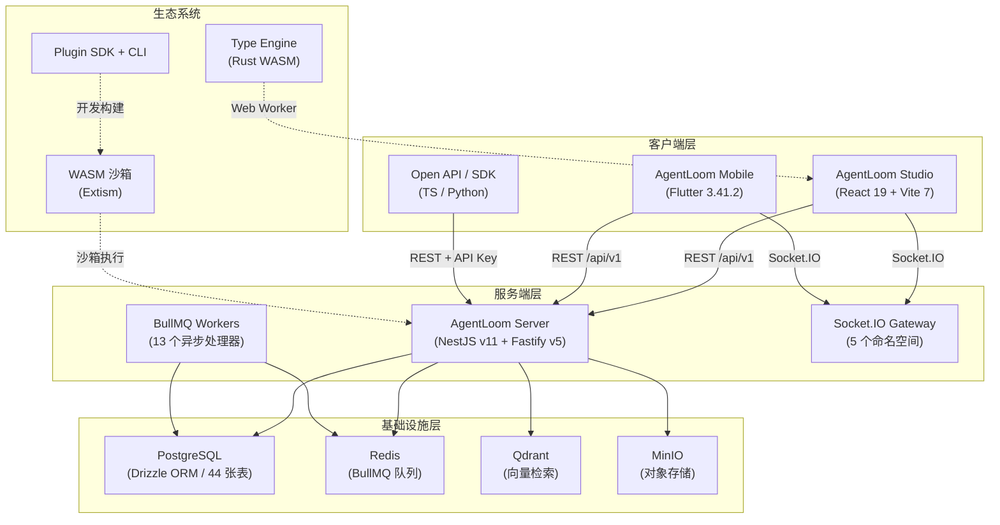
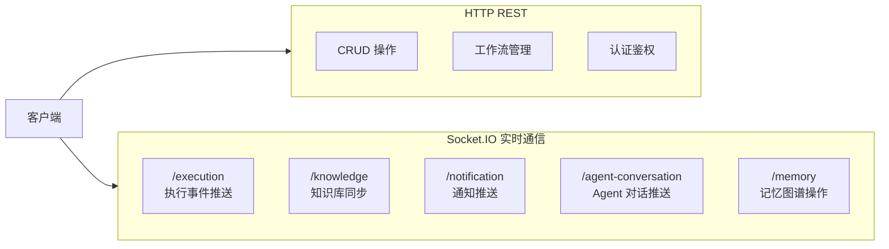
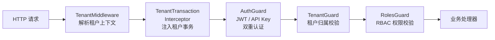
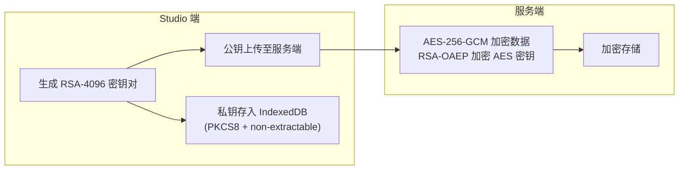

# 架构总览

AgentLoom 采用前后端分离的多层架构，各子系统通过明确的协议边界进行协作。本页从全局视角介绍系统的整体架构、包结构、技术选型以及多租户设计。

## 系统架构图



## 通信协议

客户端与服务端之间通过两种协议通信：



| 协议                          | 用途                                          | 认证方式                    |
| ----------------------------- | --------------------------------------------- | --------------------------- |
| **REST** (`/api/v1`)          | 资源 CRUD、工作流管理、配置操作               | JWT / API Key（`al_` 前缀） |
| **Socket.IO** `/execution`    | 执行状态实时推送，支持 `lastEventId` 断线续传 | JWT                         |
| **Socket.IO** `/knowledge`    | 知识库操作同步                                | JWT                         |
| **Socket.IO** `/notification` | 通知 fan-out（完成 / 失败 / 需介入）          | JWT                         |
| **Socket.IO** `/agent-conversation` | Agent 对话实时推送，与 `/execution` 对称 | JWT + MFA                   |
| **Socket.IO** `/memory`       | Agent 记忆图谱实时操作                        | JWT                         |

> Socket.IO `/execution` 使用 typed `ExecutionEvent<T>` 信封，含单调递增 `eventId`，支持断线后按 `lastEventId` 增量回放。详见 [服务端 Socket.IO 协议](/zh/server/)。

## 包结构

```text
agentloom/
├── agentloom-server/          # 后端服务 (NestJS v11)
├── agentloom-studio/          # 前端工作台 (React 19)
├── agentloom-type-engine/     # 类型引擎 (Rust → WASM)
├── agentloom-plugin-sdk/      # 插件 SDK (TypeScript)
├── agentloom-plugin-cli/      # 插件 CLI 脚手架
├── agentloom-plugin-template/ # 插件模板
├── agentloom_mobile/          # 移动端 (Flutter)
├── agentloom-deploy/          # 部署资产 (Docker / Helm)
└── agentloom-docs/            # 文档站 (VitePress)
```

::: info 非标准 Monorepo
AgentLoom 不使用 pnpm-workspace.yaml，各子包独立管理依赖和 lockfile。包间无直接的 workspace 依赖引用，而是通过 WASM 产物提交、REST API 契约等方式进行集成。
:::

## 技术选型

### 服务端

| 领域     | 技术                        | 选型理由                        |
| -------- | --------------------------- | ------------------------------- |
| 框架     | **NestJS v11 + Fastify v5** | 模块化架构 + 高性能 HTTP        |
| ORM      | **Drizzle**                 | 类型安全 + 轻量级，schema-first |
| 数据库   | **PostgreSQL** (Supabase)   | JSONB 支持 + RLS 行级安全       |
| 队列     | **BullMQ + Redis**          | 可靠的异步任务处理              |
| 向量检索 | **Qdrant**                  | 知识库 RAG 语义搜索             |
| 对象存储 | **MinIO**                   | S3 兼容，自托管                 |
| 校验     | **Zod**                     | 运行时 + 编译时双重类型安全     |
| AI 集成  | **Vercel AI SDK**           | 统一多模型调用接口              |
| 测试     | **Vitest**                  | 80% 覆盖率阈值                  |

### 前端工作台

| 领域    | 技术                          | 选型理由                         |
| ------- | ----------------------------- | -------------------------------- |
| 框架    | **React 19 + TypeScript 5.9** | 最新 Concurrent 特性             |
| 构建    | **Vite 7**                    | 极速 HMR                         |
| 样式    | **Tailwind CSS v4**           | 原子化 + CVA 变体                |
| 路由    | **TanStack Router**           | 类型安全路由                     |
| 请求    | **TanStack Query + ky**       | 缓存 + 自动 snake/camelCase 转换 |
| 状态    | **Zustand**                   | 轻量级全局状态                   |
| 画布    | **@xyflow/react v12**         | DAG 可视化编辑                   |
| UI 组件 | **Radix Primitives + CVA**    | 无障碍 + 变体组合                |

### 类型引擎

| 领域        | 技术                 | 选型理由                 |
| ----------- | -------------------- | ------------------------ |
| 语言        | **Rust**             | 性能 + 安全              |
| 编译目标    | **WASM (wasm-pack)** | 浏览器端运行，零网络延迟 |
| Studio 集成 | **Web Worker**       | 不阻塞 UI 主线程         |

### 插件生态

| 领域 | 技术               | 选型理由                    |
| ---- | ------------------ | --------------------------- |
| SDK  | **Zod 3.x + tsup** | ESM/CJS 双输出 + 运行时校验 |
| 签名 | **RSA-PSS**        | 插件包完整性验证            |
| 沙箱 | **Extism (WASM)**  | 隔离执行，平台安全保障      |

### 移动端

| 领域 | 技术               | 选型理由            |
| ---- | ------------------ | ------------------- |
| 框架 | **Flutter 3.41.2** | 跨平台 + 高性能渲染 |
| 状态 | **Riverpod**       | 编译时安全          |
| 路由 | **GoRouter**       | 声明式 + 深层链接   |
| 网络 | **Dio**            | 拦截器 + 灵活配置   |

## 多租户架构

AgentLoom 在服务端实现了完整的多租户隔离，通过一条全局中间件链保障每个请求都在正确的租户上下文中执行：



### 中间件职责

| 组件                             | 职责                                                        |
| -------------------------------- | ----------------------------------------------------------- |
| **TenantMiddleware**             | 从请求中解析 `organizationId`，注入租户上下文               |
| **TenantTransactionInterceptor** | 自动为每个请求创建租户隔离的数据库事务                      |
| **AuthGuard**                    | JWT → API Key（`al_` 前缀 + SHA-256 hash）双重认证 fallback |
| **TenantGuard**                  | 校验当前用户是否属于目标租户                                |
| **RolesGuard**                   | 基于 RBAC 五级角色体系进行权限校验                          |

### 角色层级

```text
owner > admin > creator > operator > viewer
```

每个角色继承低级角色的所有权限，详细的权限矩阵请参阅 [服务端架构](/zh/server/)。

## 安全架构

### 端到端加密 (E2EE)

AgentLoom 使用 **RSA-4096 + AES-256-GCM** 混合加密方案保护敏感数据：



- 租户公钥通过 `TenantKeyModule` 管理，使用 `organization_id + key_fingerprint` 唯一索引
- `tenant_encryption_keys` 为 append-only 历史模型，支持密钥轮转
- `AgentTaskWorker` 在执行完成路径加密 LLM 输出
- `EvidenceService` 加密 `agent_decision` / `tool_output` 证据

### API 认证

| 认证方式    | 格式                            | 适用场景            |
| ----------- | ------------------------------- | ------------------- |
| **JWT**     | `Authorization: Bearer <token>` | Web / 移动端用户    |
| **API Key** | `X-Api-Key: al_<key>`           | Open API / 外部集成 |

API Key 使用 `al_` 前缀 + SHA-256 哈希存储，通过 `PlatformApiTokenModule` 管理生命周期。`CustomThrottlerGuard` 对 JWT 与 API Key 请求统一限流（默认 100 req/min）。

## 下一步

- [核心概念](/zh/guide/concepts) — 理解工作流、节点、端口等核心抽象
- [服务端架构](/zh/server/) — 30 个 NestJS 模块的详细设计
- [工作室前端](/zh/studio/) — 画布引擎与 Feature-Slice 架构
- [类型引擎](/zh/type-engine/) — Rust WASM 类型兼容性引擎
