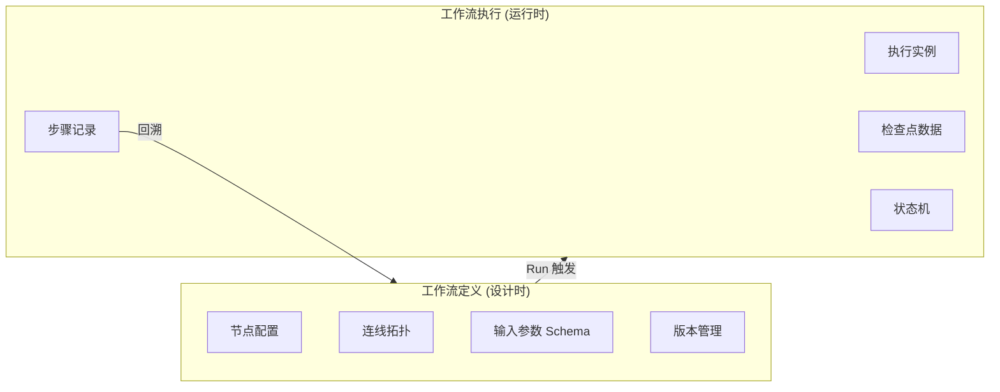
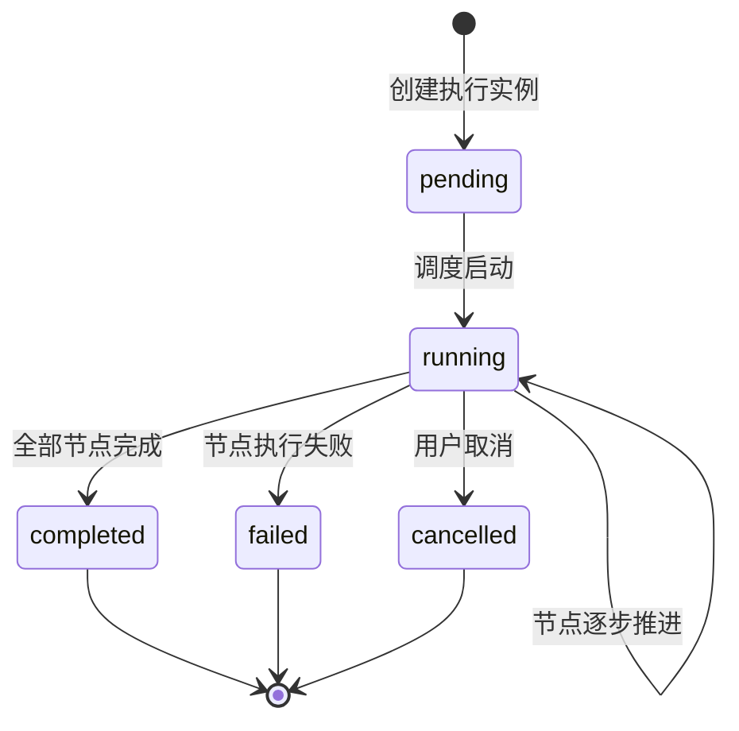
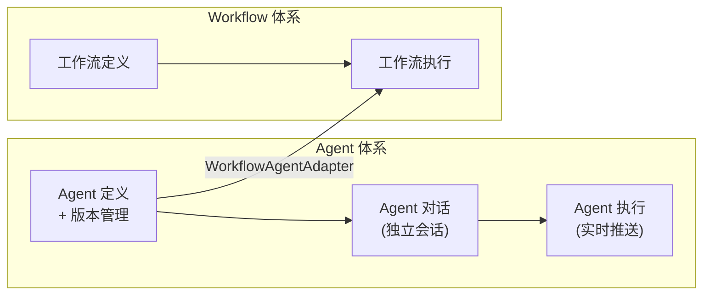
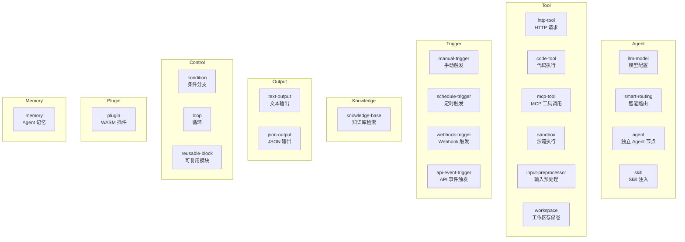
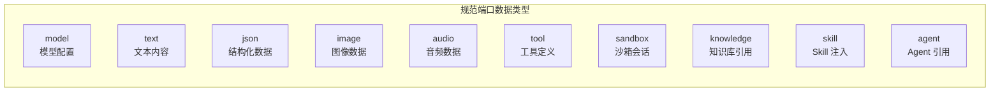
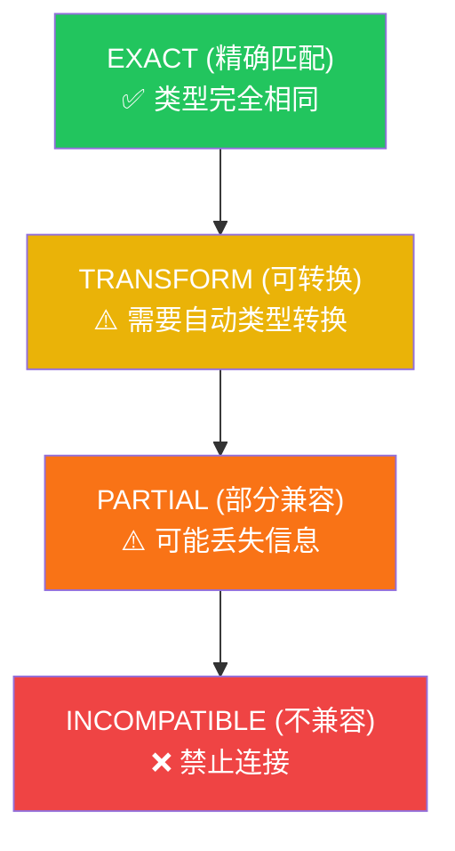
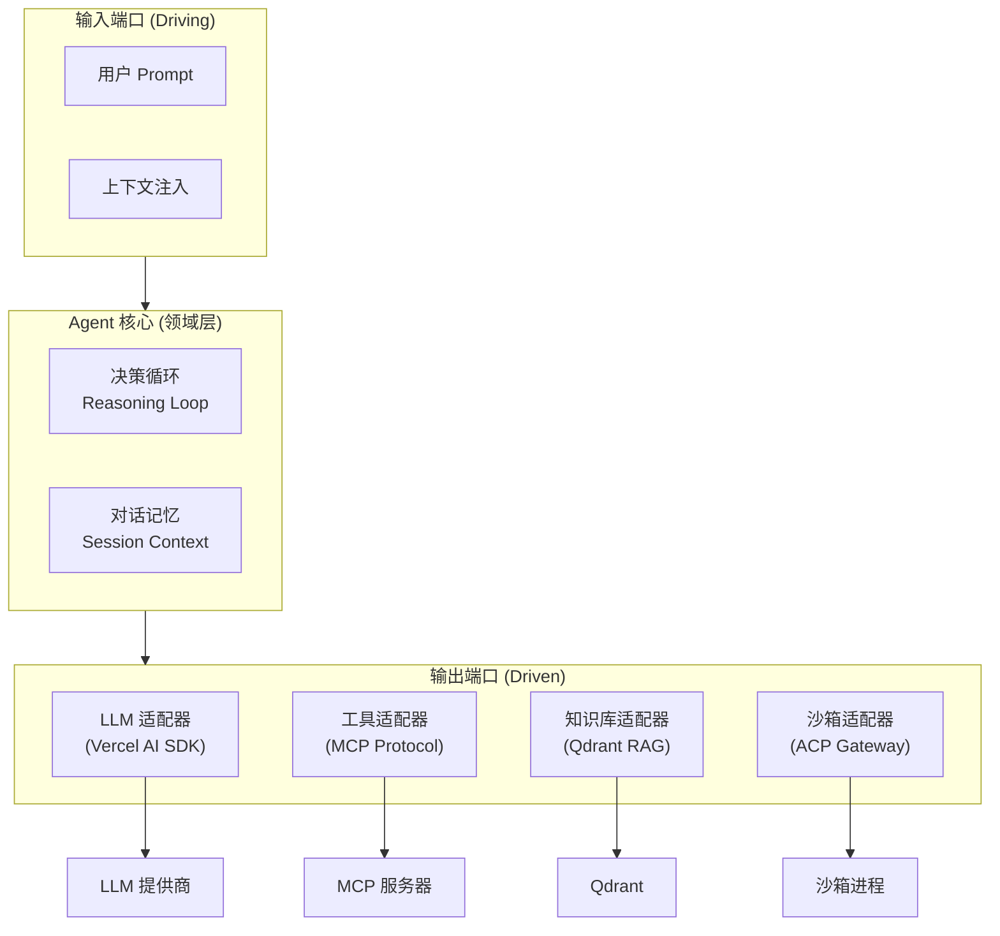
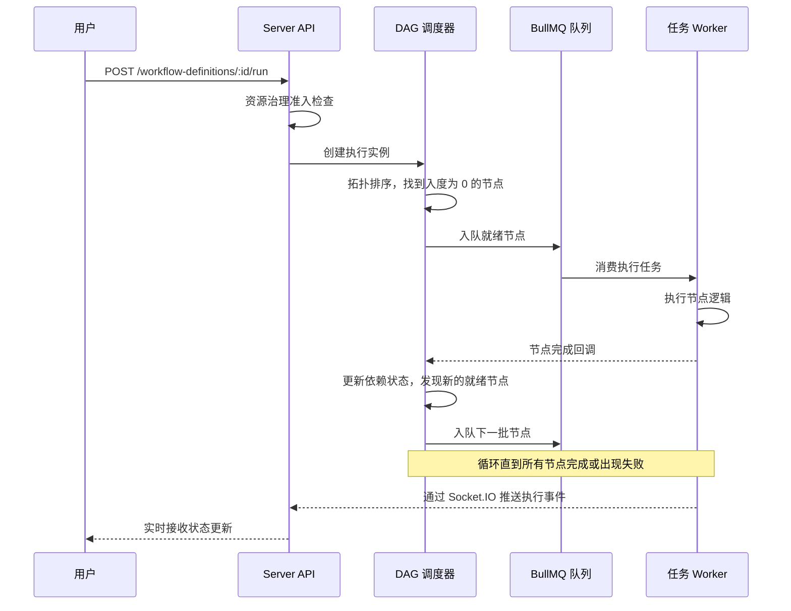

# 核心概念

本页介绍 AgentLoom 的核心领域模型和关键抽象。理解这些概念将帮助你更高效地使用平台和阅读后续文档。

## 工作流：定义与执行

AgentLoom 将工作流分为两个阶段性实体：**工作流定义**（Workflow Definition）和**工作流执行**（Workflow Execution）。

### 工作流定义

工作流定义是设计时的静态产物，描述了一个 DAG 工作流的完整结构：

- **节点**（Nodes）— 工作流中的处理单元，每个节点有类型、配置和输入/输出端口
- **边**（Edges）— 节点间的连线，定义数据流向
- **输入参数 Schema** — 支持 `form`（表单）、`conversation`（对话）、`hybrid`（混合）三种参数收集模式
- **版本控制** — 每次保存递增 `version` 字段，使用 OCC（乐观并发控制）防止冲突

### 工作流执行

执行是定义的运行时实例，记录整个工作流的执行过程：

每个执行实例包含多个**执行步骤**（Execution Steps），对应各节点的运行记录。步骤内的 `checkpointData` 保存了会话上下文，支持断点续传。

## Agent：独立顶层概念

Agent 与 Workflow 是 AgentLoom 中两个**并行的顶层概念**。Agent 拥有独立的定义、版本、对话、执行体系，不依赖工作流即可独立运行。

- **独立对话** — Agent 可直接与用户进行多轮对话，通过 `/agent-conversation` Socket.IO namespace 实时推送
- **工作流桥接** — 通过 `WorkflowAgentAdapter`，Agent 可作为工作流中的 `agent` 节点执行
- **沙箱共享** — `sandbox_sessions` 表使用双 FK（`execution_id` OR `agent_conversation_id`），在工作流与 Agent 对话间复用沙箱会话
- **记忆系统** — Agent Memory 提供图拓扑记忆存储与检索，通过 `/memory` Socket.IO namespace 实时操作

## 节点类型

AgentLoom 提供 **22 种节点类型**，按功能归为 **8 大类别**：

### 关键节点说明

| 节点                   | 说明                                                                      |
| ---------------------- | ------------------------------------------------------------------------- |
| **smart-routing**      | 根据 6 种策略智能选择最优模型（成本 / 质量 / 延迟 / 历史最优 / Fallback） |
| **agent**              | 工作流中的 AI 推理节点，引用一个已发布的 Agent Definition，通过 `WorkflowAgentAdapter` 桥接 Agent 体系 |
| **mcp-tool**           | 调用 MCP（Model Context Protocol）兼容的外部工具                          |
| **workspace**          | 工作区存储卷，提供 `volume` 端口输出供沙箱和 Agent 挂载                   |
| **webhook-trigger**    | 外部系统通过 HTTP 回调触发工作流，含签名验证                              |
| **api-event-trigger**  | 通过 Open API 接收外部事件触发工作流                                      |
| **condition**          | 基于条件表达式分支，支持多条件分支                                        |
| **plugin**             | 在 WASM 沙箱中执行第三方插件                                              |
| **sandbox**            | ACP 沙箱环境，提供文件读写和终端操作能力                                  |
| **memory**             | Agent 记忆节点，接入图拓扑记忆存储与检索                                  |

## 端口与数据类型

每个节点通过**端口**（Port）与其他节点交换数据。端口分为输入端口和输出端口，每个端口携带一个**数据类型**标签。

### 十种规范数据类型

AgentLoom 定义了 **10 种规范端口数据类型**，在 Type Engine（Rust）、Server（NestJS）和 Plugin SDK 三端统一使用：

| 类型        | 描述                                  | 典型场景                        |
| ----------- | ------------------------------------- | ------------------------------- |
| `model`     | LLM 模型配置（提供商、模型 ID、参数） | smart-routing → agent           |
| `text`      | 纯文本内容                            | input → agent → output          |
| `json`      | 结构化 JSON 数据                      | code-tool → http-tool           |
| `image`     | 图像数据（URL 或 Base64）             | 多模态 Agent 输入               |
| `audio`     | 音频数据                              | 语音场景                        |
| `tool`      | MCP 工具定义                          | mcp-tool → agent                |
| `sandbox`   | 沙箱会话引用                          | sandbox → agent                 |
| `knowledge` | 知识库引用或检索结果                  | knowledge-base → agent          |
| `skill`     | Skill 行为指导注入                    | skill → agent                   |
| `agent`     | Agent 定义引用                        | agent → 工作流节点（子代理桥接）|

::: info Studio 扩展类型
Studio 前端额外扩展了 `exec`（执行控制流）和 `volume`（工作区存储卷）两种 UI-only 类型，用于画布内的视觉连线，不参与 Type Engine 的兼容性检查。
:::

### 类型兼容性

连线时，Type Engine 会检查源端口与目标端口的数据类型兼容性。兼容性分为 **4 个等级**：

- **EXACT** — 类型完全相同，直接传递
- **TRANSFORM** — 类型不同但可自动转换（如 `text` → `json` 经解析）
- **PARTIAL** — 可以连接但可能丢失部分信息
- **INCOMPATIBLE** — 不允许连接，Studio 画布会阻止拖线

::: tip Legacy 兼容
Studio 的 `mcpToolMapping` 兼容 legacy `number` / `boolean` 类型，自动回退映射为 `json`。
:::

> 类型引擎的详细规则请参阅 [类型引擎文档](/zh/type-engine/)。

## Agent 运行时

AgentLoom 中的 `agent` 节点采用**六角架构**（Hexagonal Architecture / Ports & Adapters）设计，将核心决策循环与外部依赖解耦：

### 决策循环

Agent 的核心是一个 **Reasoning-Action 循环**：

1. **接收输入** — 接收 Prompt 和上下文数据
2. **推理** — 调用 LLM 进行推理，决定下一步动作
3. **工具调用** — 如需使用工具，通过适配器调用并获取结果
4. **权限检查** — 敏感操作（如文件写入）触发 `session/request_permission` 流程
5. **循环** — 将工具结果反馈给 LLM，继续推理直到产出最终回复
6. **输出** — 将结果通过输出端口传递给下游节点

::: info 自主性模式
`agent` 节点上的 `autonomyMode` 是发布期的治理标记：组织自治上限会在发布时校验它，超过上限则阻止发布。它不进入 `WorkflowAgentAdapter.createSession()`，因此不是引用式 agent 节点的执行输入。
:::

## DAG 调度

工作流以有向无环图（DAG）的拓扑结构执行。调度器负责解析节点依赖并按正确顺序推进执行：

### 调度特性

- **拓扑排序** — 根据边的依赖关系确定执行顺序
- **并行执行** — 无依赖关系的节点可以并行调度
- **背压控制** — Socket.IO Gateway 含 500 容量的背压队列（100ms 排空周期）
- **断线续传** — 客户端可通过 `lastEventId` 从断点恢复事件流
- **检查点** — 每个步骤的 `checkpointData` 支持执行恢复

## 触发方式

工作流执行可以通过多种方式触发：

| 触发方式      | 说明                                   | 状态         |
| ------------- | -------------------------------------- | ------------ |
| **手动执行**  | Studio 画布中点击 Run 按钮             | 完整支持     |
| **Cron 定时** | 基于 Cron 表达式的周期触发             | 完整支持     |
| **Webhook**   | 外部系统通过 HTTP 回调触发，含签名验证 | 完整支持     |
| **API 事件**  | 通过 Open API 编程触发                 | 完整支持     |

::: tip 事件适配器
`api_event` 触发器通过 `EventSourceAdapterRegistry` 分发外部事件，内置 `GithubWebhookAdapter`（HMAC-SHA256 验签）和 `GenericEventAdapter`（通用透传）。
:::

## 智能路由

Smart Routing 节点提供 **6 种模型选择策略**，根据不同维度动态选择最优模型：

| 策略              | 优化目标          | 适用场景     |
| ----------------- | ----------------- | ------------ |
| `TOKEN_OPTIMIZED` | 最小化 Token 消耗 | 长文本处理   |
| `COST_OPTIMIZED`  | 最低执行成本      | 预算敏感场景 |
| `QUALITY_FIRST`   | 最高输出质量      | 关键决策任务 |
| `LATENCY_FIRST`   | 最低响应延迟      | 实时交互     |
| `HISTORICAL_BEST` | 基于历史表现      | 稳定性优先   |
| `FALLBACK_CHAIN`  | 故障自动降级      | 高可用场景   |

`FALLBACK_CHAIN` 策略会在非认证失败的情况下自动切换到备选模型重试，是系统默认的路由策略。

## 介入策略

对于需要人工参与的场景，AgentLoom 提供了**介入策略**（Intervention Policy）机制：

- 工具调用时的**权限审批** — 敏感操作需要人工确认
- 超时处理 — 支持 `approve` / `reject` / `escalate` 三种超时动作
- 逐级升级 — 最大升级次数为 3 次（`MAX_ESCALATION_ATTEMPTS = 3`）
- 执行步骤在等待权限时保持 `running` 状态，工具调用处于 `awaiting_permission` 状态

## Skill 系统

Skill 是 Agent 的行为指导文件，采用 **SKILL.md** 格式（YAML frontmatter + Markdown 正文）。`SkillResolverService` 按租户查询已启用的 Skill，生成 `<available_skills>` XML 片段，注入到 Agent 对话和工作流执行的系统提示中。

- 平台内置 **5 个 Skill**（code-review / documentation / test-generation / refactoring / debugging），通过 `pnpm db:seed` 幂等 upsert
- 画布中的 `skill` 节点在调度器中有独立分支，执行前将上游 Skill 内容注入 Agent 上下文
- Studio 提供 `/settings/skills` 管理页（分类 Tabs + 搜索 + 启停 + Monaco 编辑器）

## Sub-agent 双模式

Agent 节点内部支持两种子代理调用模式：

| 模式 | 行为 | 适用场景 |
| --- | --- | --- |
| `call_subagent` | 同步阻塞，等待子代理返回结果 | 需要子代理结果才能继续推理 |
| `spawn_subagent` | 异步 fire-and-return，立即返回 | 后台任务、不阻塞主流程 |

最大嵌套深度为 **5 层**，防止无限递归。

## 企业级能力

AgentLoom 内置多项企业级运维和治理能力：

| 能力 | 说明 |
| --- | --- |
| **资源治理** | 7 个配额字段（并发/日执行量/API 限流/存储/沙箱 CPU 与内存等），超限返回 429（限流）或 409（治理阻断） |
| **审计日志** | hot/archive 双表架构，append-only 写入，支持保留归档与资源级事件序列回放 |
| **监控仪表板** | 15m / 1h / 24h 时间窗口，执行趋势、队列快照、告警热点 |
| **优化建议** | 4 类建议（模型降级 / 超时调整 / 工具精简 / 自主性升级），周期分析执行记录后生成；当前四类均不可采纳，仅可查看与忽略 |
| **Agent Memory** | 图拓扑记忆系统，d3-force + dagre 可视化，`/memory` namespace 实时操作 |

## 下一步

- [服务端架构](/zh/server/) — 了解 30 个 NestJS 模块的详细职责
- [工作室前端](/zh/studio/) — 探索画布编辑器与 Feature-Slice 架构
- [类型引擎](/zh/type-engine/) — 深入了解 Rust WASM 类型兼容性规则
- [插件开发](/zh/plugins/) — 使用 SDK 开发自定义插件
