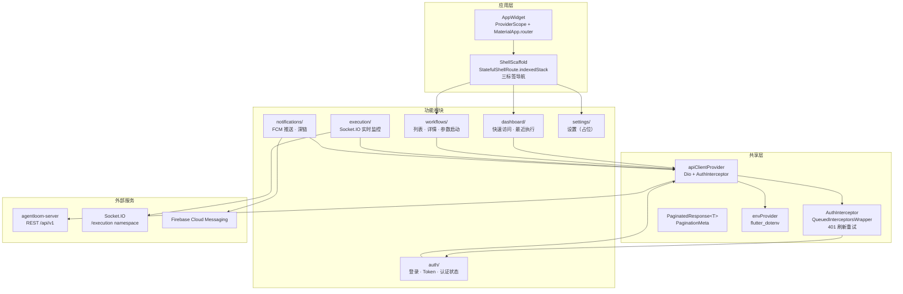

# 架构详解

## 组件架构图



## 目录结构

```text
lib/
├── app/                 # 应用壳与根 Widget (AppWidget, ShellScaffold)
├── config/              # 环境、主题、常量
├── features/
│   ├── auth/
│   │   ├── api/         # AuthApi (独立 Dio，无 AuthInterceptor) + authDioProvider
│   │   ├── models/      # Freezed: AuthTokens, AuthState (sealed), LoginUser
│   │   ├── providers/   # AuthNotifier (login/logout/refresh/forceLogout) + TokenStorage
│   │   ├── screens/     # LoginScreen (email/password + 验证 + 错误/MFA/加载态)
│   │   └── widgets/     # AuthTextField (可复用，密码可见性切换)
│   ├── dashboard/
│   │   ├── providers/   # recentWorkflowsProvider + recentExecutionsProvider
│   │   ├── screens/     # DashboardScreen
│   │   └── widgets/     # RecentExecutionsSection, QuickAccessSection, RecentExecutionCard
│   ├── execution/
│   │   ├── models/      # Freezed: ExecutionEventEnvelope, ExecutionStateSnapshot, StepSnapshot 等
│   │   ├── services/    # ExecutionSocketService (Socket.IO /execution namespace)
│   │   ├── providers/   # ExecutionMonitorNotifier (autoDispose.family)
│   │   ├── screens/     # ExecutionMonitorScreen
│   │   └── widgets/     # StatusHeader, AlertBanner, StepTimeline, ConnectionModeIndicator
│   ├── notifications/
│   │   ├── api/         # DeviceApi (register/unregister)
│   │   ├── models/      # Freezed: PushNotificationPayload
│   │   ├── services/    # NotificationService (FCM init/permission/token/foreground)
│   │   └── providers/   # PushNotificationNotifier (initializeAfterAuth/cleanupOnLogout)
│   ├── settings/
│   │   └── screens/     # SettingsScreen (占位)
│   └── workflows/
│       ├── api/         # WorkflowApi (list/get/executions/run/getExecution/getInputSchema)
│       ├── models/      # Freezed: WorkflowDefinitionDto, ExecutionSummaryDto, InputFieldDefinition 等
│       ├── providers/   # WorkflowListNotifier, workflowDetailProvider, WorkflowLaunchNotifier
│       ├── screens/     # WorkflowsScreen, WorkflowDetailScreen, ParameterInputScreen
│       └── widgets/     # WorkflowCard, WorkflowStatusChip, ExecutionSummaryTile 等
├── routes/              # GoRouter 配置 + AuthRouteNotifier redirect guard
└── shared/
    ├── interceptors/    # AuthInterceptor
    ├── models/          # PaginatedResponse<T> + PaginationMeta
    ├── providers/       # apiClientProvider, envProvider
    └── widgets/         # 共享组件（预留）
```

## 六大功能模块

### auth — 认证模块

管理完整的认证生命周期。

**核心类:**

- **AuthApi** — 独立 Dio 实例（通过 `authDioProvider`），不挂载 AuthInterceptor，避免循环依赖
- **AuthNotifier** — Riverpod AsyncNotifier，提供 `login()` / `logout()` / `refresh()` / `forceLogout()` 方法
- **TokenStorage** — 基于 `flutter_secure_storage` 的安全存储，要求 access/refresh/expires_in 三项完整
- **AuthState** — Freezed sealed class 状态机：`Unauthenticated` / `Authenticated` / `Loading` / `Error`

**认证流程:**

```
LoginScreen → AuthApi.login() → AuthNotifier → TokenStorage
                                     ↓
                            GoRouter redirect guard
                            (AuthRouteNotifier 桥接)
```

**路由守卫:** `AuthRouteNotifier` (ChangeNotifier) 桥接 Riverpod `authProvider`，GoRouter `redirect` 回调在判断路由前统一 `await authProvider.future`，确保首屏路由正确。

### dashboard — 仪表板模块

提供应用首页的聚合视图。

- **recentWorkflowsProvider** — 获取最近使用的工作流列表
- **recentExecutionsProvider** — 聚合最近执行记录
- **QuickAccessSection** — 快速访问常用工作流
- **RecentExecutionsSection** — 最近执行卡片列表，点击跳转执行监控

### workflows — 工作流模块

工作流的浏览、查看和启动。

**页面:**

| 页面 | 路由 | 功能 |
|------|------|------|
| WorkflowsScreen | `/workflows` | 搜索、状态筛选、下拉刷新、无限滚动 |
| WorkflowDetailScreen | `/workflows/:workflowId` | 元数据卡片、执行历史、FAB 运行按钮 |
| ParameterInputScreen | `/workflows/:workflowId/launch` | 动态参数表单、空参数确认、conversation Web 引导 |

**启动链路:**

```
WorkflowDetailScreen FAB
  → /workflows/:workflowId/launch (ParameterInputScreen)
    → 参数校验 + 提交
      → /executions/:executionId (ExecutionMonitorScreen)
```

**参数表单特性:**

- 支持 `text` / `number` / `single_select` / `multi_select` 四种字段类型
- `required` / `min` / `max` / `minLength` / `maxLength` 客户端校验
- `visibility` 条件字段控制，基于递归求值决定显示
- `collectionMode = 'conversation'` 时统一走 Web 端引导（`ConversationModePrompt`）
- 提交时仅收集可见字段

### execution — 执行监控模块

实时展示工作流执行状态。

**核心组件:**

- **ExecutionSocketService** — 解析执行 Socket URL，连接 `/execution` 命名空间
- **ExecutionMonitorNotifier** — `AsyncNotifierProvider.autoDispose.family`，REST detail 建立初始 snapshot，WS 事件流式更新
- **ExecutionMonitorScreen** — 状态头 + 告警横幅 + 步骤时间线 + 连接模式指示器

**实时通信策略详见下方 [Socket.IO 集成](#socket-io-集成) 章节。**

### notifications — 推送通知模块

FCM 推送全链路管理。

- **NotificationService** — FCM 初始化、权限请求、token 获取、前台消息展示、点击事件流
- **PushNotificationNotifier** — 认证后初始化（幂等锁 `_initCompleter`），登出时清理；FCM token 缓存 + dedup 防重复注册
- **DeviceApi** — 设备 token 注册/注销 API
- **PushNotificationPayload** — Freezed 模型，`fromFcmData()` 解析 camelCase 推送数据

**深链跳转:** 前台通知点击、后台通知点击、终止态冷启动恢复，都能导航到 `/executions/:executionId`。

**Firebase 优雅降级:** 应用在无 Firebase 配置文件（`google-services.json` / `GoogleService-Info.plist`）时仍可正常运行，推送功能自动跳过。

### settings — 设置模块

当前为占位页面，预留扩展空间。

## 共享层

### apiClientProvider — Dio HTTP 客户端

全局 Dio 实例，挂载 AuthInterceptor，所有 feature 模块的 API 调用都通过它发起。

### AuthInterceptor — 401 智能处理

继承 `QueuedInterceptorsWrapper`，序列化所有并发 401 请求。

**四种 401 类型处理:**

| 类型 | 行为 |
|------|------|
| `token-expired` | 刷新 token，重试原请求 |
| `token-revoked` | 强制登出 |
| `token-invalid` | 强制登出 |
| `token-missing` | 强制登出 |

**Stale-token 优化:** 比较当前存储的 token 与失败请求携带的 token。如果 token 已被其他请求刷新，直接用新 token 重试，不再触发额外的 refresh 请求。

**QueuedInterceptorsWrapper 原理:**

```
请求 A (401) ──→ 进入队列，触发 refresh
请求 B (401) ──→ 进入队列，等待（不触发第二次 refresh）
请求 C (401) ──→ 进入队列，等待
                    ↓
             refresh 完成
                    ↓
请求 A ──→ 用新 token 重试
请求 B ──→ 用新 token 重试
请求 C ──→ 用新 token 重试
```

### envProvider — 环境配置

在 `main.dart` 中通过 `ProviderScope.overrides` 注入当前环境配置（`flutter_dotenv`），提供 `API_BASE_URL`、`APP_NAME` 等运行时配置。

### 数据模型

- **PaginatedResponse\<T\>** — 泛型分页封装，`@JsonSerializable(genericArgumentFactories: true)`
- **PaginationMeta** — 分页元信息（总数、当前页、每页条数等）

## Socket.IO 集成

### 连接方式

执行监控模块通过 `ExecutionSocketService` 连接服务端 `/execution` 命名空间，使用 JWT token 认证。

### 协议特性

- **类型化信封:** `ExecutionEvent<T>` 统一事件格式，含 monotonic `eventId`
- **订阅管理:** `execution:subscribe` / `execution:unsubscribe` + ACK 确认
- **事件名称:** `execution.node.*` 系列 + `execution.status.changed`
- **断线回放:** 重连时发送 `lastEventId`，服务端增量回放缺失事件

### 5 秒轮询降级

当 Socket.IO 连接断开时，自动切换到 REST API 5 秒轮询模式，确保用户始终能看到最新执行状态。

**降级策略:**

```
Socket.IO 连接正常 → 实时 WS 事件推送
        ↓ 断连
5 秒 REST 轮询 (GET /executions/:id)
        ↓ 重连成功
切回 WS + lastEventId 增量回放
```

`ConnectionModeIndicator` 组件在 UI 上显示当前连接模式（实时/轮询），帮助用户了解数据刷新状态。

### Metadata Merge

REST detail 建立初始 snapshot 后，WS ACK / plain snapshot 通过 metadata merge 保留 `nodeName` / `nodeType` / `startedAt` / `completedAt`，确保 UI 展示信息完整，不会因为 WS 事件缺少某些字段而丢失数据。

## 状态管理模式

### Riverpod 3.x 手写 Provider

项目使用手写 Provider（无 `riverpod_generator` / `@riverpod`），AsyncNotifier 和 FutureProvider 用于状态管理。

### Sealed Class 状态机

所有核心状态都采用 sealed class 建模，而非 plain AsyncValue:

- `AuthState` — Freezed sealed (Unauthenticated / Authenticated / Loading / Error)
- `ExecutionMonitorState` — 执行监控状态
- `WorkflowLaunchState` — 工作流启动状态
- `WorkflowListState` — 工作流列表状态

### ref.mounted 守卫

所有 async 路径在 `await` 后均检查 `ref.mounted`，防止 Provider dispose 后仍尝试写入状态，避免 Riverpod 3.x 的 `StateError`。

```dart
Future<void> submit() async {
  final result = await api.run(...);
  if (!ref.mounted) return; // 关键守卫
  state = SuccessState(result);
}
```

## 数据层模式

### Freezed 3.x 模型

模型使用 `abstract class` + `sealed class` + `@freezed` + `@JsonKey(name: 'snake_case')` 进行 JSON 序列化。生成的 `.freezed.dart` / `.g.dart` 已提交到 git。

**特殊处理:**

- `InputFieldDefinition` 有意不使用 Freezed（含递归 `Object?` equality，deep equality 不适用）
- `WorkflowInputSchema` 含可选 `conversationPlan: ConversationPlan { systemPrompt, maxTurns }`
- `WorkflowApi.getInputSchema()` 对 `collectionMode` / `minLength` / `maxLength` 等做 camelCase/snake\_case 兼容归一化

## 平台配置

### iOS

- `AppDelegate` 实现 `FlutterImplicitEngineDelegate` + `FlutterAppDelegate`，支持 Firebase Messaging

### Android

- `AndroidManifest.xml` 声明 `POST_NOTIFICATIONS` 权限
- FCM channel ID 硬编码
- `main.dart` 中后台消息 handler 使用 `@pragma('vm:entry-point')` 标注
