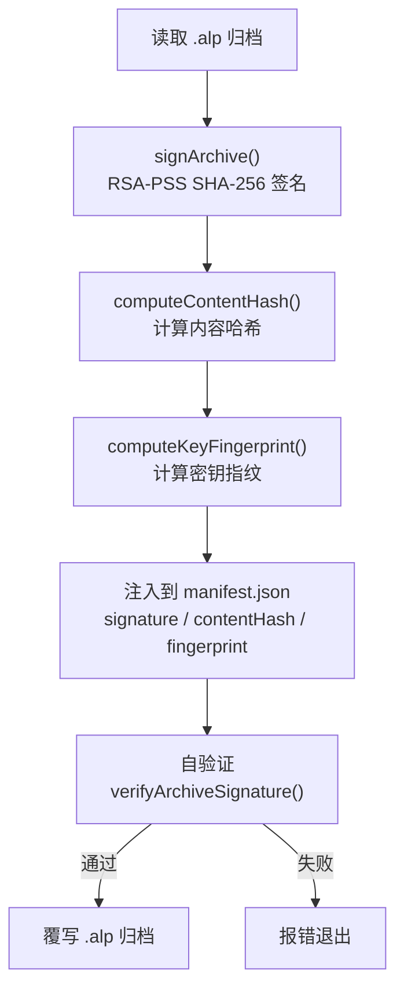

# 插件 CLI

`@agentloom/plugin-cli` 是 AgentLoom 插件开发的命令行工具，提供脚手架创建、构建打包、密钥管理、开发调试和签名发布 5 个核心命令。

## 基本信息

| 属性     | 值                                                                               |
| -------- | -------------------------------------------------------------------------------- |
| 包名     | `@agentloom/plugin-cli`                                                          |
| 版本     | `0.1.0`                                                                          |
| 入口命令 | `agentloom-plugin`                                                               |
| 核心依赖 | `commander ^12`、`prompts ^2.4`、`archiver ^7`、`chokidar ^3.6`、`express ^4.18` |

## 安装

```bash
npm install -g @agentloom/plugin-cli
```

## 命令概览

| 命令            | 说明                                    | 核心参数       |
| --------------- | --------------------------------------- | -------------- |
| `create <name>` | 创建 TypeScript 或 Rust/Extism 插件项目 | `--wasm`       |
| `build`         | 构建并打包 `.alp`                       | `-o`、`--wasm` |
| `keys generate` | 生成 RSA 密钥对                         | `-o`、`-b`     |
| `dev`           | 启动 TypeScript 本地预览服务器          | `-p`           |
| `publish`       | 签名并生成可注册的 `.alp`（不负责上传） | `-k`、`-o`     |

---

## `create` — 创建插件项目

交互式创建一个新的插件项目脚手架。默认生成仅用于 `dev` 本地预览的 TypeScript
项目；加 `--wasm` 生成正式服务端运行所需的 Rust/Extism 项目。

```bash
agentloom-plugin create <name> [--wasm]
```

### 交互提示

| 字段        | 说明       | 默认值 |
| ----------- | ---------- | ------ |
| Author      | 作者名     | —      |
| Description | 插件描述   | —      |
| License     | 开源许可证 | MIT    |

### 生成文件

默认 TypeScript 脚手架包含 `manifest.json`、`package.json`、`tsconfig.json`、
`src/index.ts` 和 `tests/index.test.ts`。Rust/Extism 脚手架使用
`agentloom-plugin create <name> --wasm` 创建，包含：

```text
<name>/
├── Cargo.toml
├── manifest.json              # wasmEntry: dist/plugin.wasm
├── node-definitions.json      # 至少一个合法节点定义
├── package.json
├── README.md
└── src/
    └── lib.rs                 # Extism execute export
```

### create 示例

```bash
# TypeScript：仅供 dev 本地预览
agentloom-plugin create text-processor

# Rust/Extism：用于构建可注册的正式插件
agentloom-plugin create text-processor --wasm
```

生成的 `manifest.json`：

```json
{
  "id": "com.agentloom.text-processor",
  "name": "text-processor",
  "version": "1.0.0",
  "author": "your-name",
  "description": "A text processor plugin",
  "license": "MIT",
  "minPlatformVersion": "0.1.0",
  "permissions": []
}
```

---

## `build` — 构建打包

创建 `.alp` 归档。正式服务端插件必须使用 `--wasm`；默认 TypeScript 构建仅供
`agentloom-plugin dev` 本地预览，CLI 会在构建成功后输出明确警告。

```bash
agentloom-plugin build [options]
```

### build 参数

| 参数                 | 说明                                      | 默认值   |
| -------------------- | ----------------------------------------- | -------- |
| `-o, --output <dir>` | 输出目录                                  | `build/` |
| `--wasm`             | 打包正式 WASM；无预置产物时运行 cargo     | `false`  |

### WASM 节点定义要求

项目根目录必须存在非空的 `node-definitions.json`。每个节点使用与 SDK 相同的
节点 schema；端口 `dataType` 必须取自 14 值 `PortDataType`。文件缺失、数组为空、
节点字段非法或 `type` 重复都会终止构建，并在运行 cargo 前给出修复提示。

### 归档内容

可注册的 `.alp` 是 ZIP 归档，至少包含：

```text
{pluginId}-{version}.alp
├── manifest.json
├── node-definitions.json
└── dist/
    └── plugin.wasm       # manifest.wasmEntry 指向此文件
```

### build 示例

```bash
# TypeScript 本地预览产物；不能注册到服务端
agentloom-plugin build

# 正式 WASM 构建
agentloom-plugin build --wasm

# 指定输出目录
agentloom-plugin build --wasm -o dist/
```

---

## `keys` — 密钥管理

生成用于插件签名的 RSA 密钥对。

```bash
agentloom-plugin keys generate [options]
```

### keys 参数

| 参数                  | 说明         | 默认值  |
| --------------------- | ------------ | ------- |
| `-o, --output <dir>`  | 输出目录     | `keys/` |
| `-b, --bits <number>` | RSA 密钥长度 | `2048`  |

### 支持的密钥长度

- `2048` — 最低要求，默认值
- `3072` — 推荐用于生产
- `4096` — 最高安全级别

### 输出文件

```text
keys/
├── public.pem       # 公钥（注册到平台）
└── private.pem      # 私钥（本地保管，用于签名）
```

### 密钥指纹

生成完成后会输出密钥指纹（SPKI DER 的 SHA-256），用于在平台上关联开发者身份。

### keys 示例

```bash
# 默认 2048 位
agentloom-plugin keys generate

# 4096 位，输出到自定义目录
agentloom-plugin keys generate -b 4096 -o my-keys/
```

::: warning 安全提醒
**私钥必须妥善保管！** 不要将 `private.pem` 提交到版本控制系统。建议在 `.gitignore` 中添加 `keys/private.pem`。
:::

---

## `dev` — 开发调试

启动本地开发服务器，支持文件监听和热重载。

```bash
agentloom-plugin dev [options]
```

### dev 参数

| 参数                  | 说明       | 默认值 |
| --------------------- | ---------- | ------ |
| `-p, --port <number>` | 服务器端口 | `4400` |

### 开发服务器端点

| 方法   | 路径                   | 说明             |
| ------ | ---------------------- | ---------------- |
| `GET`  | `/manifest`            | 返回插件清单     |
| `GET`  | `/nodes`               | 返回所有节点定义 |
| `POST` | `/nodes/:type/execute` | 执行指定类型节点 |

### 工作原理

1. **Express 服务器** — 启动 HTTP 服务器，端口默认 `4400`
2. **Chokidar 监听** — 监听 `src/` 目录下的文件变更
3. **自动重载** — 文件变更时自动重新加载插件

### dev 示例

```bash
# 默认端口 4400
agentloom-plugin dev

# 自定义端口
agentloom-plugin dev -p 3000
```

测试节点执行：

```bash
curl -X POST http://localhost:4400/nodes/text-to-uppercase/execute \
  -H "Content-Type: application/json" \
  -d '{
    "inputs": { "text-in": "hello world" },
    "config": { "prefix": "[", "suffix": "]" }
  }'
```

---

## `publish` — 签名归档

对已构建的 `.alp` 包进行 RSA-PSS 签名，生成可注册归档。该命令是
**sign-only**：不会上传或发布市场 listing；签名完成后须前往 Studio
插件管理页上传。

```bash
agentloom-plugin publish -k <private-key-path> [options]
```

### publish 参数

| 参数                 | 说明                       | 默认值   |
| -------------------- | -------------------------- | -------- |
| `-k, --key <path>`   | 签名私钥路径；必须显式提供 | 无       |
| `-o, --output <dir>` | `.alp` 所在目录            | `build/` |

### 签名流程



### 注入的清单字段

签名后，`manifest.json` 会被注入以下字段：

| 字段                      | 说明                          |
| ------------------------- | ----------------------------- |
| `signature`               | Base64 编码的 RSA-PSS 签名    |
| `contentHash`             | 规范化归档载荷的 SHA-256 哈希 |
| `developerKeyFingerprint` | 开发者公钥的指纹              |

### publish 示例

```bash
agentloom-plugin publish -k my-keys/private.pem
```

`publish` 会在签名后自动自验证，但不会上传文件。将生成的 `.alp` 通过 Studio
插件管理页上传；服务端注册要求清单有非空 `wasmEntry`，归档中存在对应文件，
且文件以 WASM 魔数 `00 61 73 6d` 开头。
