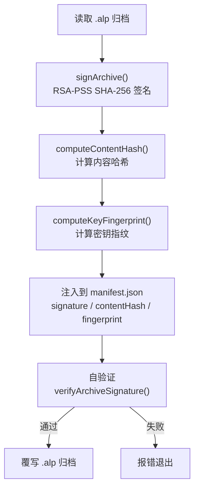

# 插件 CLI

`@agentloom/plugin-cli` 是 AgentLoom 插件开发的命令行工具，提供脚手架创建、构建打包、密钥管理、开发调试和签名发布 5 个核心命令。

## 基本信息

| 属性     | 值                                                                               |
| -------- | -------------------------------------------------------------------------------- |
| 包名     | `@agentloom/plugin-cli`                                                          |
| 版本     | `0.1.0`                                                                          |
| 入口命令 | `agentloom-plugin`                                                               |
| 核心依赖 | `commander ^12`、`prompts ^2.4`、`archiver ^7`、`chokidar ^3.6`、`express ^4.18` |

## 安装

```bash
npm install -g @agentloom/plugin-cli
```

## 命令概览

| 命令            | 说明              | 核心参数       |
| --------------- | ----------------- | -------------- |
| `create <name>` | 创建插件项目      | 交互式提示     |
| `build`         | 构建并打包 `.alp` | `-o`、`--wasm` |
| `keys generate` | 生成 RSA 密钥对   | `-o`、`-b`     |
| `dev`           | 启动开发服务器    | `-p`           |
| `publish`       | 签名并发布        | `-k`、`-o`     |

---

## `create` — 创建插件项目

交互式创建一个新的插件项目脚手架。

```bash
agentloom-plugin create <name>
```

### 交互提示

| 字段        | 说明       | 默认值 |
| ----------- | ---------- | ------ |
| Author      | 作者名     | —      |
| Description | 插件描述   | —      |
| License     | 开源许可证 | MIT    |

### 生成文件

```text
<name>/
├── manifest.json      # 插件清单 (id: com.agentloom.<name>)
├── package.json       # 项目配置
├── tsconfig.json      # TypeScript 配置
├── src/
│   └── index.ts       # 插件入口
└── tests/
    └── index.test.ts  # 测试文件
```

### create 示例

```bash
agentloom-plugin create text-processor
# 交互输入后生成 text-processor/ 目录
```

生成的 `manifest.json`：

```json
{
  "id": "com.agentloom.text-processor",
  "name": "text-processor",
  "version": "1.0.0",
  "author": "your-name",
  "description": "A text processor plugin",
  "license": "MIT",
  "minPlatformVersion": "0.1.0",
  "permissions": []
}
```

---

## `build` — 构建打包

编译 TypeScript 源码并创建 `.alp` 归档包。

```bash
agentloom-plugin build [options]
```

### build 参数

| 参数                 | 说明                | 默认值   |
| -------------------- | ------------------- | -------- |
| `-o, --output <dir>` | 输出目录            | `build/` |
| `--wasm`             | 使用 wasm-pack 构建 | `false`  |

### 构建流程

1. **编译** — TypeScript (`tsc`) 或 Wasm Pack (`wasm-pack build`)
2. **打包** — 创建 `.alp` ZIP 归档（DEFLATE-9 压缩）
3. **输出** — `build/{pluginId}-{version}.alp`

### 归档内容

```text
{pluginId}-{version}.alp (ZIP)
├── manifest.json
├── dist/            # 编译产物
├── package.json
└── README.md        # 如果存在
```

### build 示例

```bash
# 标准 TypeScript 构建
agentloom-plugin build

# 指定输出目录
agentloom-plugin build -o dist/

# WASM 构建
agentloom-plugin build --wasm
```

---

## `keys` — 密钥管理

生成用于插件签名的 RSA 密钥对。

```bash
agentloom-plugin keys generate [options]
```

### keys 参数

| 参数                  | 说明         | 默认值  |
| --------------------- | ------------ | ------- |
| `-o, --output <dir>`  | 输出目录     | `keys/` |
| `-b, --bits <number>` | RSA 密钥长度 | `2048`  |

### 支持的密钥长度

- `2048` — 最低要求，默认值
- `3072` — 推荐用于生产
- `4096` — 最高安全级别

### 输出文件

```text
keys/
├── public.pem       # 公钥（注册到平台）
└── private.pem      # 私钥（本地保管，用于签名）
```

### 密钥指纹

生成完成后会输出密钥指纹（SPKI DER 的 SHA-256），用于在平台上关联开发者身份。

### keys 示例

```bash
# 默认 2048 位
agentloom-plugin keys generate

# 4096 位，输出到自定义目录
agentloom-plugin keys generate -b 4096 -o my-keys/
```

::: warning 安全提醒
**私钥必须妥善保管！** 不要将 `private.pem` 提交到版本控制系统。建议在 `.gitignore` 中添加 `keys/private.pem`。
:::

---

## `dev` — 开发调试

启动本地开发服务器，支持文件监听和热重载。

```bash
agentloom-plugin dev [options]
```

### dev 参数

| 参数                  | 说明       | 默认值 |
| --------------------- | ---------- | ------ |
| `-p, --port <number>` | 服务器端口 | `4400` |

### 开发服务器端点

| 方法   | 路径                   | 说明             |
| ------ | ---------------------- | ---------------- |
| `GET`  | `/manifest`            | 返回插件清单     |
| `GET`  | `/nodes`               | 返回所有节点定义 |
| `POST` | `/nodes/:type/execute` | 执行指定类型节点 |

### 工作原理

1. **Express 服务器** — 启动 HTTP 服务器，端口默认 `4400`
2. **Chokidar 监听** — 监听 `src/` 目录下的文件变更
3. **自动重载** — 文件变更时自动重新加载插件

### dev 示例

```bash
# 默认端口 4400
agentloom-plugin dev

# 自定义端口
agentloom-plugin dev -p 3000
```

测试节点执行：

```bash
curl -X POST http://localhost:4400/nodes/text-to-uppercase/execute \
  -H "Content-Type: application/json" \
  -d '{
    "inputs": { "text-in": "hello world" },
    "config": { "prefix": "[", "suffix": "]" }
  }'
```

---

## `publish` — 签名发布

对 `.alp` 包进行 RSA-PSS 签名并准备发布。

```bash
agentloom-plugin publish [options]
```

### publish 参数

| 参数                 | 说明     | 默认值             |
| -------------------- | -------- | ------------------ |
| `-k, --key <path>`   | 私钥路径 | `keys/private.pem` |
| `-o, --output <dir>` | 输出目录 | `build/`           |

### 签名流程



### 注入的清单字段

签名后，`manifest.json` 会被注入以下字段：

| 字段                      | 说明                          |
| ------------------------- | ----------------------------- |
| `signature`               | Base64 编码的 RSA-PSS 签名    |
| `contentHash`             | 规范化归档载荷的 SHA-256 哈希 |
| `developerKeyFingerprint` | 开发者公钥的指纹              |

### publish 示例

```bash
# 使用默认密钥路径
agentloom-plugin publish

# 指定私钥
agentloom-plugin publish -k my-keys/private.pem
```

::: tip
`publish` 命令会在签名后自动进行自验证。如果验证失败，命令将报错退出，确保不会生成无效签名的包。
:::
