# 插件生态

AgentLoom 插件生态提供完整的扩展能力，允许开发者创建自定义节点类型并将其发布到插件市场。本章节涵盖插件系统的设计理念、开发工具链和服务端运行时。

## 生态组件

| 组件 | 包名 | 说明 |
|------|------|------|
| **Plugin SDK** | `@agentloom/plugin-sdk` | 类型定义、校验工具、签名模块，ESM + CJS 双输出 |
| **Plugin CLI** | `@agentloom/plugin-cli` | 脚手架生成、构建打包、密钥管理、开发调试、签名发布 |
| **Plugin Template** | `agentloom-plugin-template` | 参考示例插件（text-to-uppercase） |
| **Server 插件系统** | `agentloom-server/plugin` | .alp 注册、RSA-PSS 验签、WASM 沙箱、收益结算 |

## 插件生命周期

从开发到上线收益的完整链路：

```mermaid
flowchart LR
    A["🔑 密钥生成\nkeys generate"] --> B["📦 脚手架创建\ncreate"]
    B --> C["🛠️ 本地开发\ndev (watch + :4400)"]
    C --> D["🔨 构建打包\nbuild → .alp"]
    D --> E["✍️ 签名发布\npublish (RSA-PSS)"]
    E --> F["📤 注册上传\nPOST /plugins (.alp)"]
    F --> G["✅ 服务端验签\nverify + contentHash"]
    G --> H["🏪 市场上架\nmarketplace listing"]
    H --> I["⚡ WASM 沙箱执行\nExtism (30s / 256MB)"]
    I --> J["📊 使用量记录\nplugin_usage_records"]
    J --> K["💰 收益结算\n70/30 分成"]

    style A fill:#e8f5e9
    style E fill:#fff3e0
    style G fill:#e3f2fd
    style I fill:#fce4ec
    style K fill:#f3e5f5
```



## 插件架构

### 核心概念

**插件（Plugin）** 是一个包含清单文件和自定义节点的可部署单元：

- **清单（Manifest）** — 元数据描述：id、版本、权限、签名信息
- **自定义节点（Custom Node）** — 画布中可使用的新节点类型，定义输入/输出端口和执行逻辑
- **端口类型（Port Data Type）** — 平台统一的 8 种数据类型：`model | text | json | image | audio | tool | sandbox | knowledge`

### 权限模型

插件通过 `permissions` 字段声明所需权限，平台在注册时校验：

| 权限标识 | 说明 |
|----------|------|
| `network:outbound` | 允许外部网络访问 |
| `storage:read` | 读取存储 |
| `storage:write` | 写入存储 |
| `knowledge:read` | 读取知识库 |
| `knowledge:write` | 写入知识库 |
| `llm:invoke` | 调用 LLM 模型 |

### 节点分类

自定义节点支持 5 种类别：

| 类别 | 标识 | 适用场景 |
|------|------|----------|
| 转换器 | `transform` | 数据格式转换、文本处理 |
| 过滤器 | `filter` | 条件过滤、数据筛选 |
| 聚合器 | `aggregator` | 数据合并、统计汇总 |
| 连接器 | `connector` | 外部系统集成 |
| 通用工具 | `utility` | 其他辅助功能 |

## 安全机制

插件生态的安全保障贯穿全链路：

1. **开发签名** — 开发者使用 RSA 私钥对 `.alp` 包进行 RSA-PSS 签名
2. **注册验签** — 服务端使用开发者公钥验证签名和内容哈希
3. **WASM 沙箱** — Extism 隔离执行，硬限制超时和内存
4. **权限声明** — 最小权限原则，仅授予声明的权限

## 收益模型

插件采用按执行计费 + 收益分成的模式：

```
总收入 × 70% = 开发者毛收入
开发者毛收入 × 15% = 上架佣金
开发者净收入 = 毛收入 - 佣金 ≈ 总收入的 59.5%
平台份额 = 总收入 × 30%
```

## 快速开始

```bash
# 1. 安装 CLI
npm install -g @agentloom/plugin-cli

# 2. 生成密钥对
agentloom-plugin keys generate

# 3. 创建插件项目
agentloom-plugin create my-plugin

# 4. 本地开发
cd my-plugin && agentloom-plugin dev

# 5. 构建并发布
agentloom-plugin build
agentloom-plugin publish -k keys/private.pem
```

详细步骤请参阅 [开发教程](./tutorial)。

## 章节导航

| 章节 | 内容 |
|------|------|
| [插件 SDK](./sdk) | SDK 类型定义、辅助函数、签名模块 API |
| [插件 CLI](./cli) | CLI 5 个命令详细用法和参数说明 |
| [开发教程](./tutorial) | 基于模板的端到端插件开发教程 |
| [服务端系统](./server-side) | 注册验签、WASM 沙箱、使用量记录、收益结算 |
