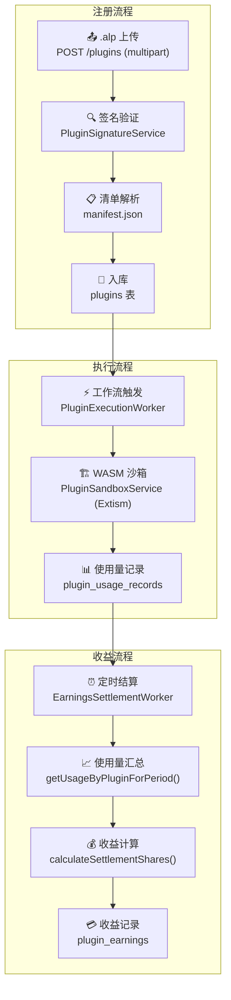
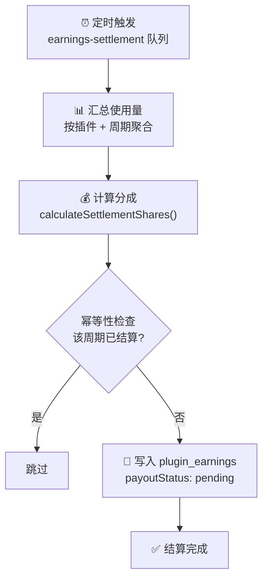

# 服务端插件系统

AgentLoom 服务端提供完整的插件注册、验签、沙箱执行、使用量记录和收益结算能力。

## 系统架构



## 插件注册

### `.alp` 上传

插件通过 `.alp` 文件（ZIP 格式）以 multipart 形式上传到平台：

```text
POST /api/v1/plugins
Content-Type: multipart/form-data

file: <.alp 文件>
```

**文件大小限制**：最大 **50 MB**。

### WASM 注册门禁

WASM 是唯一正式服务端运行时。验签后、写入对象存储前，注册接口还会执行：

1. `manifest.wasmEntry` 必须是非空的安全相对路径，不得包含反斜杠或 `..` 路径段。
2. `.alp` 内必须存在该路径；归档还必须包含 `manifest.json` 和
   `node-definitions.json`。
3. 产物前四字节必须是 WASM 魔数 `00 61 73 6d`（`\0asm`）。

任一门禁失败均以 422 拒绝，TypeScript `execute(context)` 产物不能注册。

### RSA-PSS 签名验证

`PluginSignatureService` 负责验证插件签名的完整性：

1. **提取清单** — 从 `.alp` 中读取 `manifest.json`
2. **查找公钥** — 根据 `developerKeyFingerprint` 查找已注册的开发者公钥
3. **验证签名** — 使用 SDK 的 `verifyArchiveSignature()` 验证 RSA-PSS 签名
4. **校验哈希** — 使用 `computeContentHash()` 重新计算并比对内容哈希

::: info 公钥要求

- 算法：RSA
- 最低位数：**2048 bits**
- 拒绝私钥上传
  :::

### 数据模型

注册后的插件存入 `plugins` 表：

| 字段                   | 说明            |
| ---------------------- | --------------- |
| `org_id` + `plugin_id` | 组合唯一键      |
| `manifest`             | 完整清单 JSONB  |
| `node_definitions`     | 节点定义列表    |
| `signature`            | Base64 签名     |
| `content_hash`         | 内容哈希        |
| `wasm_bundle_url`      | WASM 包存储 URL |
| `occ_version`          | 乐观并发版本号  |

## 开发者密钥管理

开发者需要先将公钥注册到平台，后续的插件签名验证才能匹配：

```text
POST   /api/v1/plugins/developer-keys     # 注册公钥
GET    /api/v1/plugins/developer-keys     # 列出密钥
DELETE /api/v1/plugins/developer-keys/:id # 吊销密钥
```

`plugin_developer_keys` 表结构：

| 字段                         | 说明                 |
| ---------------------------- | -------------------- |
| `org_id` + `key_fingerprint` | 组合唯一键           |
| `public_key`                 | PEM 格式公钥         |
| `status`                     | `active` / `revoked` |

## WASM 沙箱执行

### Extism 运行时

`PluginSandboxService` 使用 `@extism/extism` 创建隔离的 WASM 执行环境：

```typescript
const plugin = await createPlugin(wasmBundle, {
  runInWorker: true, // Worker 线程隔离
  config: pluginConfig,
});
```

### WASM ABI

服务端按以下 ABI 调用插件：

- export 名默认为 `execute`，可由 `pluginConfig.functionName` 覆盖。
- 输入为 JSON envelope：`{"nodeType":"example.echo","inputs":{},"config":{}}`。
- 输出必须是端口输出直出对象，例如 `{"result":"hello"}`；禁止使用
  `{"outputs":{"result":"hello"}}` 包装。
- 插件失败必须通过 Extism error 返回。

TypeScript `execute(context)` 仅用于 `agentloom-plugin dev` 本地预览，不属于此
服务端 ABI。

### 平台默认上限

下列值是平台给运行时的默认安全上限。租户或插件 runtime 配置只能进一步收紧
（例如缩短超时或降低内存），不能放宽到平台上限之外：

| 限制             | 平台默认上限       | 说明             |
| ---------------- | ------------------ | ---------------- |
| `timeoutMs`      | **30,000** (30 秒) | 单次执行超时     |
| `maxMemoryPages` | **4,096** (256 MB) | 最大内存页数     |
| `allowedPaths`   | `{}` (空)          | 禁止文件系统访问 |
| `useWasi`        | `false`            | 禁用 WASI        |

### 错误分类

沙箱执行中的异常会被分类处理：

| 错误类型             | 触发条件       | 处理方式 |
| -------------------- | -------------- | -------- |
| `timeout`            | 执行超过 30 秒 | 强制终止 |
| `permission-denied`  | 尝试越权操作   | 拒绝执行 |
| `resource-exhausted` | 超出内存限制   | 强制终止 |
| `sandbox-error`      | 其他沙箱异常   | 记录日志 |

## 使用量记录

每次插件成功执行后，`PluginUsageService` 会在完成检查点的同一租户事务中写入使用量；写入失败会使事务回滚并触发任务重试：

### `plugin_usage_records` 表

| 字段                    | 说明             |
| ----------------------- | ---------------- |
| `plugin_id`             | 插件 ID          |
| `org_id`                | 租户 ID          |
| `execution_id`          | 工作流执行 ID    |
| `billing_amount`        | 计费金额         |
| `execution_duration_ms` | 执行耗时（毫秒） |
| `input_tokens`          | 输入 token 数    |
| `output_tokens`         | 输出 token 数    |

### 聚合查询

```typescript
// 查询指定周期内某插件的使用量汇总
const usage = await pluginUsageService.getUsageByPluginForPeriod(
  pluginId,
  startDate,
  endDate,
);
```

## 收益结算

### 分成模型

AgentLoom 采用 **70/30** 收益分成模型：

```text
总收入 (totalRevenue)
├── 开发者份额: 70%
│   ├── 毛收入 = totalRevenue × 0.70
│   ├── 上架佣金 = 毛收入 × 0.15
│   └── 净收入 = 毛收入 - 佣金 ≈ totalRevenue × 59.5%
└── 平台份额: totalRevenue × 30%
```

::: tip 具体示例
假设某插件在一个结算周期内产生 **¥1,000** 收入：

| 项目               | 计算         | 金额     |
| ------------------ | ------------ | -------- |
| 开发者毛收入       | ¥1,000 × 70% | ¥700     |
| 上架佣金           | ¥700 × 15%   | ¥105     |
| **开发者净收入**   | ¥700 - ¥105  | **¥595** |
| 平台份额           | ¥1,000 × 30% | ¥300     |
| 上架佣金（归平台） | —            | ¥105     |

:::

### 结算流程

`EarningsSettlementWorker` 通过 BullMQ `earnings-settlement` 队列定时执行：



### `plugin_earnings` 表

| 字段                          | 说明                                              |
| ----------------------------- | ------------------------------------------------- |
| `plugin_id`                   | 插件 ID                                           |
| `period_start` / `period_end` | 结算周期                                          |
| `total_revenue`               | 总收入                                            |
| `developer_share`             | 开发者净收入                                      |
| `platform_share`              | 平台份额                                          |
| `listing_commission`          | 上架佣金                                          |
| `payout_status`               | `pending` / `processing` / `completed` / `failed` |

### 结算特性

- **租户事务** — 在租户事务中执行，确保数据隔离
- **幂等性** — 检查同一周期是否已有结算记录，避免重复结算
- **队列驱动** — 通过 BullMQ 异步执行，不阻塞主流程

## 插件市场

### 上架

已注册的插件可通过市场 API 进行上架管理：

```text
POST   /api/v1/plugins/marketplace          # 上架
GET    /api/v1/plugins/marketplace          # 浏览列表
GET    /api/v1/plugins/marketplace/:id      # 详情
PUT    /api/v1/plugins/marketplace/:id      # 更新
```

### `marketplace_listings` 表

| 字段                  | 说明                     |
| --------------------- | ------------------------ |
| `listing_type`        | `workflow` / `plugin`    |
| `pricing_model`       | `free` / `per_execution` |
| `workflow_version_id` | nullable，插件上架时为空 |

### 安装权限

插件安装需要以下组织角色之一：

- `owner`
- `admin`
- `creator`
- `operator`

## BullMQ 队列

插件系统使用两个 BullMQ 队列：

| 队列名                | 说明     | 触发方式       |
| --------------------- | -------- | -------------- |
| `plugin-execution`    | 插件执行 | 工作流节点触发 |
| `earnings-settlement` | 收益结算 | 定时调度       |
