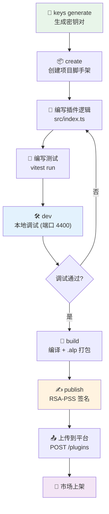

# 开发教程

本教程以 `text-to-uppercase`（文本转大写）示例插件为蓝本，带你从零完成一个 AgentLoom 插件的完整开发流程。

## 前置条件

- Node.js >= 18
- 已全局安装 `@agentloom/plugin-cli`

```bash
npm install -g @agentloom/plugin-cli
```

## 第一步：生成密钥对

在开始开发之前，先生成用于插件签名的 RSA 密钥对：

```bash
agentloom-plugin keys generate -b 2048
```

输出：

```text
✅ RSA key pair generated successfully!
   Public key:  keys/public.pem
   Private key: keys/private.pem
   Fingerprint: a1b2c3d4e5f6...
```

::: warning
请妥善保管 `private.pem`，不要提交到版本控制。将 `public.pem` 后续注册到 AgentLoom 平台的开发者密钥管理中。
:::

## 第二步：创建插件项目

```bash
agentloom-plugin create text-to-uppercase
```

按照交互提示输入：

```text
? Author: your-name
? Description: 将文本转换为大写
? License: MIT
```

生成的项目结构：

```text
text-to-uppercase/
├── manifest.json
├── package.json
├── tsconfig.json
├── src/
│   └── index.ts
└── tests/
    └── index.test.ts
```

## 第三步：安装 SDK

```bash
cd text-to-uppercase
npm install @agentloom/plugin-sdk
```

## 第四步：编写插件逻辑

编辑 `src/index.ts`，实现文本转大写节点：

```typescript
import type {
  AgentLoomPlugin,
  PluginManifest,
  CustomNodeDefinition,
} from "@agentloom/plugin-sdk";
import {
  defineInputPort,
  defineOutputPort,
  defineNode,
} from "@agentloom/plugin-sdk";
import manifest from "../manifest.json";

// 定义输入端口
const textInput = defineInputPort({
  id: "text-in",
  label: "文本输入",
  dataType: "text",
  required: true,
  description: "待转换的文本",
});

// 定义输出端口
const textOutput = defineOutputPort({
  id: "text-out",
  label: "文本输出",
  dataType: "text",
  description: "转换后的大写文本",
});

// 定义节点
const uppercaseNode = defineNode({
  type: "text-to-uppercase",
  label: "文本转大写",
  category: "transform",
  description: "将输入文本转换为大写形式",
  inputPorts: [textInput],
  outputPorts: [textOutput],
  // 配置 schema：支持前缀和后缀
  configSchema: {
    type: "object",
    properties: {
      prefix: {
        type: "string",
        description: "添加到结果前面的前缀",
      },
      suffix: {
        type: "string",
        description: "添加到结果后面的后缀",
      },
    },
  },
  // 执行函数
  async execute(context) {
    const text = String(context.inputs["text-in"] ?? "");
    const upper = text.toUpperCase();

    const prefix = String(context.config.prefix ?? "");
    const suffix = String(context.config.suffix ?? "");
    const result = `${prefix}${upper}${suffix}`;

    context.logger.info(`转换完成: "${text}" → "${result}"`);

    return {
      outputs: { "text-out": result },
    };
  },
});

// 导出插件
const plugin: AgentLoomPlugin = {
  manifest: manifest as PluginManifest,
  nodes: [uppercaseNode],
  async activate() {
    console.log("text-to-uppercase 插件已激活");
  },
  async deactivate() {
    console.log("text-to-uppercase 插件已停用");
  },
};

export default plugin;
```

### 关键概念说明

| 概念                                   | 说明                                            |
| -------------------------------------- | ----------------------------------------------- |
| `defineInputPort` / `defineOutputPort` | 端口定义辅助函数，自动注入方向标记              |
| `defineNode`                           | 节点定义辅助函数，返回冻结对象确保不可变性      |
| `configSchema`                         | JSON Schema 格式的配置定义，在画布中渲染为表��� |
| `context.inputs`                       | 输入端口数据，key 为端口 id                     |
| `context.config`                       | 用户在画布中配置的参数                          |
| `context.logger`                       | 平台提供的日志记录器                            |

## 第五步：编写测试

编辑 `tests/index.test.ts`：

```typescript
import { describe, it, expect } from "vitest";
import plugin from "../src/index";

describe("text-to-uppercase", () => {
  it("插件清单 ID 正确", () => {
    expect(plugin.manifest.id).toBe("com.agentloom.text-to-uppercase");
  });

  it("注册了 1 个节点", () => {
    expect(plugin.nodes).toHaveLength(1);
  });

  it("基本转换", async () => {
    const node = plugin.nodes[0];
    const result = await node.execute({
      inputs: { "text-in": "hello world" },
      config: {},
      logger: {
        debug: () => {},
        info: () => {},
        warn: () => {},
        error: () => {},
      },
      metadata: { executionId: "e1", stepId: "s1", nodeId: "n1" },
    });
    expect(result.outputs["text-out"]).toBe("HELLO WORLD");
  });

  it("支持前缀和后缀", async () => {
    const node = plugin.nodes[0];
    const result = await node.execute({
      inputs: { "text-in": "test" },
      config: { prefix: "[", suffix: "]" },
      logger: {
        debug: () => {},
        info: () => {},
        warn: () => {},
        error: () => {},
      },
      metadata: { executionId: "e1", stepId: "s1", nodeId: "n1" },
    });
    expect(result.outputs["text-out"]).toBe("[TEST]");
  });

  it("处理空输入", async () => {
    const node = plugin.nodes[0];
    const result = await node.execute({
      inputs: { "text-in": "" },
      config: {},
      logger: {
        debug: () => {},
        info: () => {},
        warn: () => {},
        error: () => {},
      },
      metadata: { executionId: "e1", stepId: "s1", nodeId: "n1" },
    });
    expect(result.outputs["text-out"]).toBe("");
  });
});
```

运行测试：

```bash
npx vitest run
```

## 第六步：本地开发调试

启动开发服务器：

```bash
agentloom-plugin dev
```

输出：

```text
🚀 Plugin dev server running at http://localhost:4400
   Watching src/ for changes...
```

### 测试端点

查看清单：

```bash
curl http://localhost:4400/manifest
```

查看节点列表：

```bash
curl http://localhost:4400/nodes
```

执行节点：

```bash
curl -X POST http://localhost:4400/nodes/text-to-uppercase/execute \
  -H "Content-Type: application/json" \
  -d '{
    "inputs": { "text-in": "hello agentloom" },
    "config": { "prefix": ">>", "suffix": "<<" }
  }'
```

返回：

```json
{
  "outputs": { "text-out": ">>HELLO AGENTLOOM<<" }
}
```

修改 `src/index.ts` 中的代码后，服务器会自动重新加载。

## 第七步：构建 `.alp` 包

```bash
agentloom-plugin build
```

输出：

```text
📦 Building plugin...
   Compiling TypeScript...
   Creating archive: build/com.agentloom.text-to-uppercase-1.0.0.alp
✅ Build complete!
```

## 第八步：签名并发布

```bash
agentloom-plugin publish -k keys/private.pem
```

输出：

```text
✍️  Signing archive...
   Computing content hash...
   Signing with RSA-PSS SHA-256...
   Self-verifying signature...
✅ Archive signed and verified!
   Output: build/com.agentloom.text-to-uppercase-1.0.0.alp
```

## 第九步：注册到平台

将签名后的 `.alp` 文件上传到 AgentLoom 服务端：

```bash
curl -X POST https://your-agentloom-server/api/v1/plugins \
  -H "Authorization: Bearer YOUR_TOKEN" \
  -F "file=@build/com.agentloom.text-to-uppercase-1.0.0.alp"
```

服务端会自动执行：

1. 提取 `manifest.json`
2. 使用开发者公钥验证 RSA-PSS 签名
3. 校验内容哈希
4. 注册插件到数据库

## 完整流程图



## 常见问题

### 构建失败

确保 `tsconfig.json` 中的 `outDir` 设置为 `dist/`，且 `manifest.json` 位于项目根目录。

### 签名验证失败

- 检查是否使用了正确的私钥
- 确保 `.alp` 文件未被修改
- 确认平台上注册的公钥与本地密钥对匹配

### 开发服务器端口冲突

使用 `-p` 参数指定其他端口：

```bash
agentloom-plugin dev -p 5500
```
