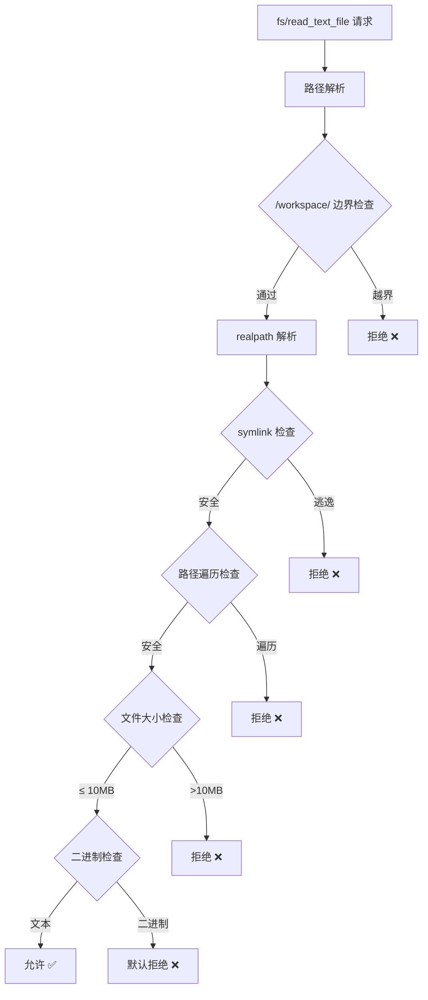
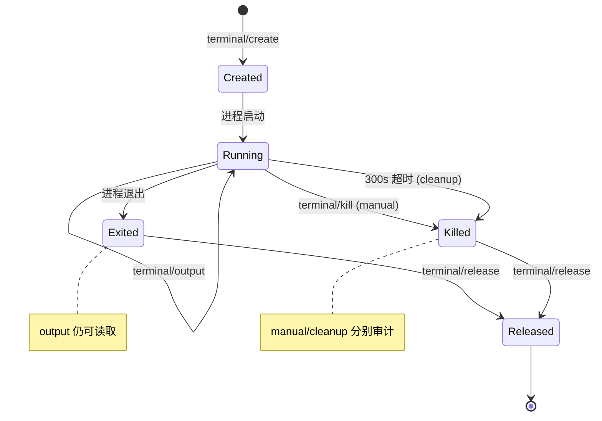
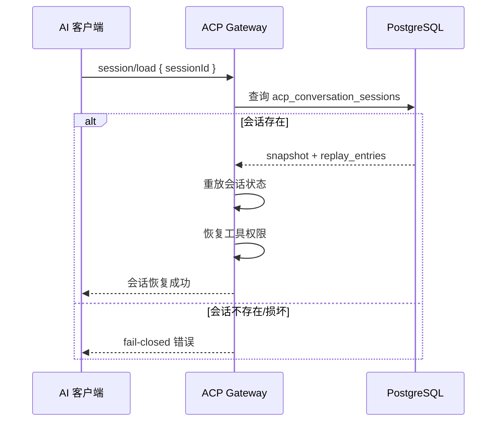
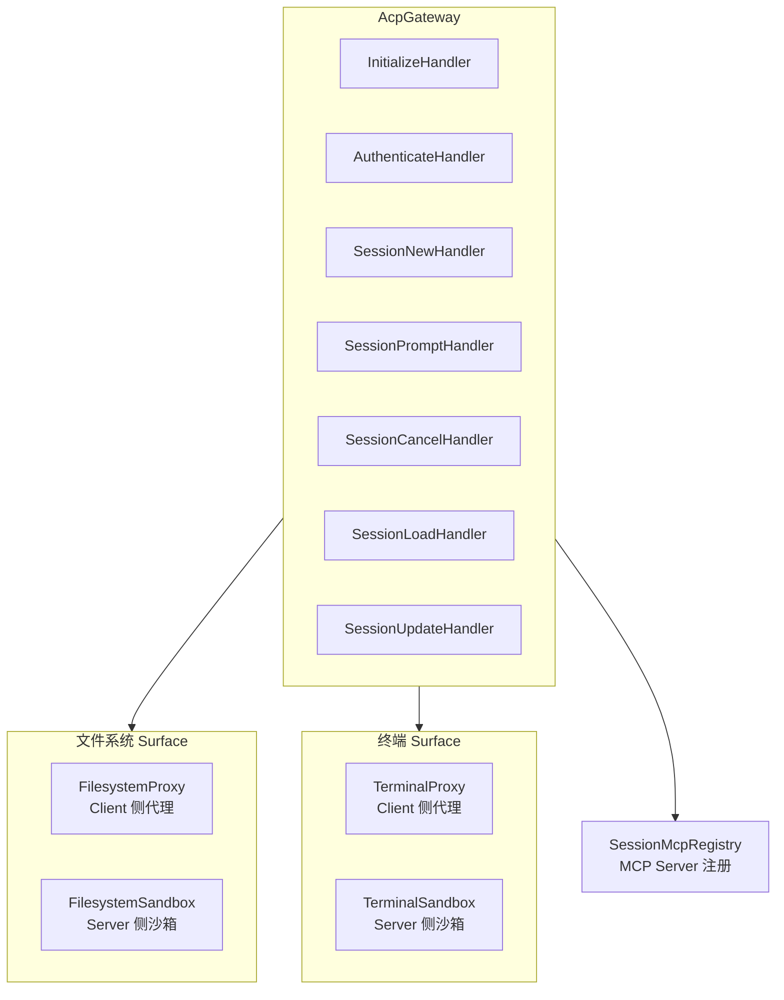

# ACP Gateway

AgentLoom Conversation Protocol (ACP) 是一个基于 **JSON-RPC 2.0** 的 stdio 协议，用于连接外部 AI 客户端与 AgentLoom 的会话、文件系统和终端能力。

## 架构概览

```mermaid
flowchart LR
    Client[AI 客户端] -->|"JSON-RPC 2.0<br/>stdin/stdout"| STDIO[acp-stdio.ts]
    STDIO --> GW[AcpGateway]
    GW --> SH[Session Handler]
    GW --> FH[Filesystem Handler]
    GW --> TH[Terminal Handler]

    SH --> DB[(acp_conversation_sessions)]
    FH --> FS[/workspace/ 沙箱]
    TH --> PTY[终端进程]
```

### 入口

```bash
# 独立 stdio 入口
pnpm start:acp:stdio
```

`acp-stdio.ts` 启动 NestJS 应用，通过 stdin/stdout 与客户端通信。

---

## 能力协商

连接建立后，客户端必须先调用 `initialize` 方法进行能力协商。

### 服务端能力

| 能力 | 说明 |
|------|------|
| `loadSession` | 支持会话加载与恢复 |
| `streaming` | 支持流式响应 |
| `tools` | 支持工具调用 |
| `fs` | 文件系统读写（条件暴露） |
| `terminal` | 终端创建与控制（条件暴露） |

### 客户端能力

| 能力 | 说明 |
|------|------|
| `roots` | 客户端根目录声明 |
| `fs` | 客户端侧文件系统 |
| `terminal.create` | 终端创建能力 |
| `terminal.output` | 终端输出能力 |
| `mcpServers` | MCP Server 配置 |

### 条件暴露规则

::: tip 终端能力协商
服务端仅在客户端**同时**声明 `terminal.create = true` 和 `terminal.output = true` 时，才暴露终端相关方法。

这是 canonical 的 `readTextFile` / `writeTextFile` 与 `terminal: { create: true }` 能力协商模式（兼容 `initialize` legacy alias）。
:::

---

## 方法列表

ACP 共提供 **12 个** JSON-RPC 方法，分为 4 组：

### 连接管理

#### `initialize`

初始化连接，交换能力声明。

```json
// 请求
{
  "jsonrpc": "2.0",
  "method": "initialize",
  "params": {
    "clientCapabilities": {
      "roots": true,
      "fs": true,
      "terminal": { "create": true, "output": true },
      "mcpServers": []
    }
  },
  "id": 1
}

// 响应
{
  "jsonrpc": "2.0",
  "result": {
    "serverCapabilities": {
      "loadSession": true,
      "streaming": true,
      "tools": true,
      "fs": true,
      "terminal": true
    }
  },
  "id": 1
}
```

#### `authenticate`

JWT 认证，建立租户上下文。

```json
{
  "jsonrpc": "2.0",
  "method": "authenticate",
  "params": { "token": "jwt-xxx" },
  "id": 2
}
```

### 会话管理

#### `session/new`

创建新会话。

#### `session/prompt`

发送对话消息，支持流式响应和工具调用。

#### `session/cancel`

取消进行中的会话请求。触发 stdio 连接关闭时的 cleanup 逻辑。

#### `session/load`

加载已持久化的会话。执行 **replay-before-response** — 从 `acp_conversation_sessions` 加载 `session_snapshot` 和 `replay_entries`，在响应前重放会话状态。

Cold-recovery 失败时 **fail-closed**（拒绝恢复而非给出不完整状态）。

#### `session/update`

更新会话元数据。

#### `session/request_permission`

写入操作前的权限请求：

```json
// 请求
{
  "jsonrpc": "2.0",
  "method": "session/request_permission",
  "params": {
    "sessionId": "uuid-xxx",
    "operation": "write_file",
    "resource": "/workspace/src/main.ts"
  },
  "id": 10
}

// 响应选项
// allow_once / allow_always / reject_once / reject_always
```

### 文件系统操作

基于 `sandbox_sessions` 的 ACP-local sandbox workspace 解析。

#### `fs/read_text_file`

读取沙箱内文本文件。

#### `fs/write_text_file`

写入沙箱内文本文件（需权限）。

```json
{
  "jsonrpc": "2.0",
  "method": "fs/read_text_file",
  "params": {
    "sessionId": "uuid-xxx",
    "path": "/workspace/src/main.ts"
  },
  "id": 5
}
```

### 终端操作

#### `terminal/create`

创建终端进程。

#### `terminal/output`

获取终端输出（支持 `outputByteLimit` 限制返回大小）。

#### `terminal/wait_for_exit`

等待终端进程退出。

#### `terminal/kill`

终止终端进程（manual kill 与 cleanup kill 分别审计）。

#### `terminal/release`

释放终端资源。

---

## 安全模型

### 文件系统沙箱



| 防护 | 说明 |
|------|------|
| `/workspace/` 边界 | 所有路径必须在 workspace 目录下 |
| `realpath` 解析 | 解析真实路径，防止符号链接逃逸 |
| symlink 检查 | 拒绝指向 workspace 外的符号链接 |
| 路径遍历 | 拒绝 `../` 等遍历模式 |
| 文件大小限制 | 默认 10MB 上限 |
| 二进制检测 | 默认拒绝二进制文件 |

### 终端沙箱

| 限制 | 值 | 说明 |
|------|-----|------|
| Ring Buffer | 1MB | 终端输出缓冲区 |
| 并发终端 | 5 | 每会话最大 |
| 存活超时 | 300s | 超时自动 kill |
| 输出限制 | `outputByteLimit` | 每次请求可限制返回大小 |

#### 危险命令防护

spawn 前执行命令安全检查：

- **危险命令拒绝** — 预配置的 denylist 模式匹配
- **危险路径拒绝** — 禁止在受保护路径执行
- **危险 pattern 拒绝** — 检测危险命令组合
- **CWD 限制** — 工作目录必须在沙箱内
- 所有拒绝和允许都记录正式审计

### 终端生命周期



---

## 会话持久化

ACP 会话持久化到 `acp_conversation_sessions` 表：

| 字段 | 说明 |
|------|------|
| `session_snapshot` | 会话状态快照 |
| `replay_entries` | 重放条目（用于 session/load） |
| conversation-session 级工具权限 | 恢复时自动恢复 |

### 加载流程



---

## 连接状态

ACP Gateway 维护每个连接的状态：

| 状态字段 | 说明 |
|---------|------|
| `initialized` | 是否已完成 initialize 握手 |
| `clientCapabilities` | 客户端声明的能力集 |
| `authContext` | 认证后的租户/用户上下文 |
| `sessions` | 当前连接的活跃会话列表 |

### 连接关闭

stdio 连接关闭时触发 cleanup：
- 取消所有进行中的 `session/prompt` 请求
- 终止所有活跃终端
- 持久化会话状态

---

## 错误处理

ACP 使用标准 JSON-RPC 2.0 错误码，并扩展了 AgentLoom 特定错误：

| 错误码 | 说明 |
|--------|------|
| `-32700` | 解析错误 |
| `-32600` | 无效请求 |
| `-32601` | 方法不存在 |
| `-32602` | 参数无效 |
| `-32603` | 内部错误 |
| `-32000` | 未认证 |
| `-32001` | 会话不存在 |
| `-32002` | 权限拒绝 |
| `-32003` | 沙箱违规 |

---

## 服务架构



**双 Surface 模式**：
- **Proxy** — 将请求代理到客户端侧（利用客户端声明的 `fs`/`terminal` 能力）
- **Sandbox** — 在服务端沙箱内直接执行（安全受控环境）

实际路由取决于能力协商结果和操作类型。
