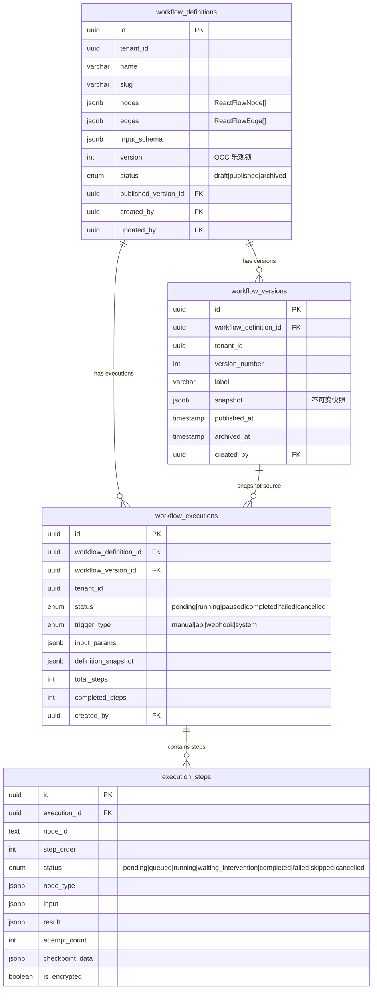
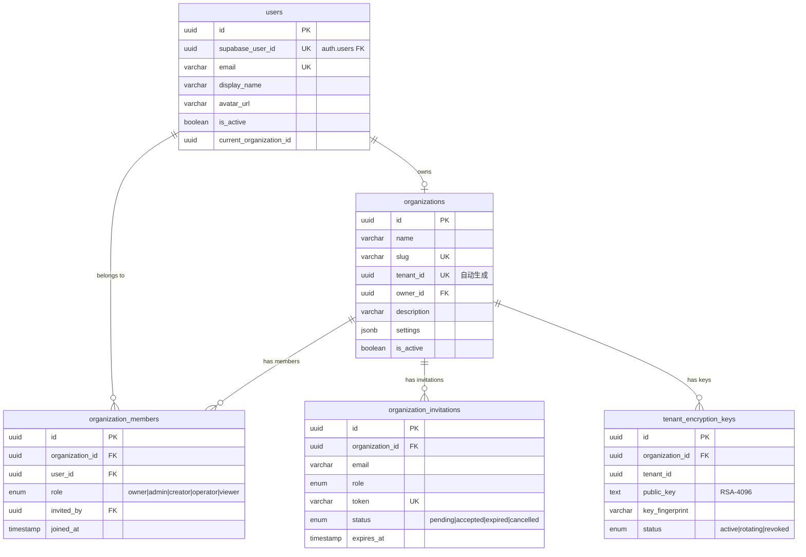
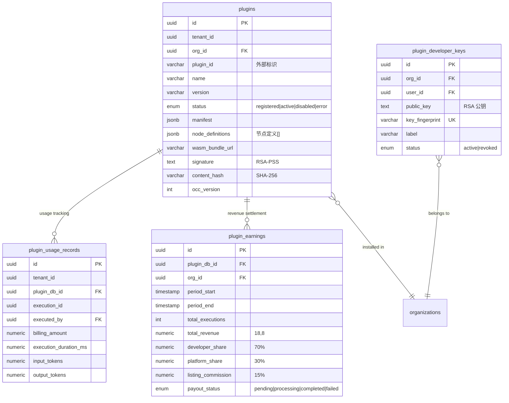
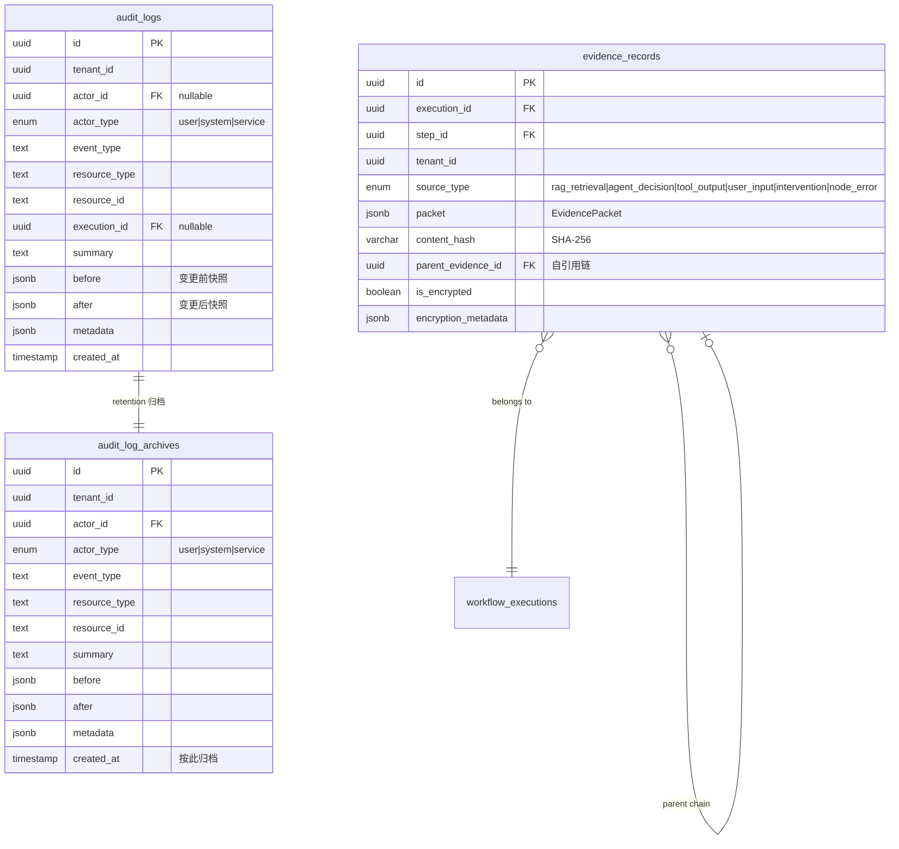
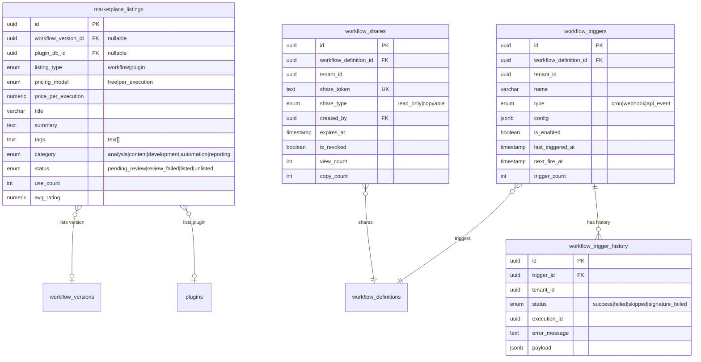

# 数据库架构

AgentLoom 使用 **Drizzle ORM** + **PostgreSQL**（Supabase 托管），采用 schema-first 声明式模型定义。

## 技术栈概览

| 组件 | 技术 | 说明 |
|------|------|------|
| ORM | Drizzle ORM | 类型安全、schema-first |
| 数据库 | PostgreSQL (Supabase) | 含 RLS 策略 |
| 迁移 | Drizzle Kit | 声明式 diff + SQL 生成 |
| 连接池 | `drizzle-orm/node-postgres` | pg Pool |

## Schema 文件总览

`agentloom-server/src/database/schema/` 下共有 **44 个** schema 定义文件，按业务域划分为 6 个领域：

### 核心工作流域

| 表名 | 说明 |
|------|------|
| `workflow_definitions` | 工作流定义（画布节点/边/视口） |
| `workflow_versions` | 版本快照（不可变 snapshot） |
| `workflow_executions` | 执行实例（含定义快照） |
| `execution_steps` | 执行步骤（DAG 节点级） |
| `execution_records` | Agent 执行记录 |
| `reusable_blocks` | 可复用节点模板 |

### 认证与租户域

| 表名 | 说明 |
|------|------|
| `users` | 用户（关联 Supabase Auth） |
| `organizations` | 组织（自动生成 tenant_id） |
| `organization_members` | 组织成员（5 级角色） |
| `organization_invitations` | 邀请（token + 过期） |
| `tenant_encryption_keys` | E2EE 公钥历史（append-only） |
| `org_autonomy_policies` | 组织级自主策略 |
| `revoked_tokens` | 令牌黑名单 |

### 插件域

| 表名 | 说明 |
|------|------|
| `plugins` | 插件注册元数据（WASM bundle） |
| `plugin_developer_keys` | 开发者 RSA 公钥 |
| `plugin_usage_records` | 使用量计量 |
| `plugin_earnings` | 收益结算周期 |

### 审计与证据域

| 表名 | 说明 |
|------|------|
| `audit_logs` | 审计日志（热表） |
| `audit_log_archives` | 审计日志归档（冷表） |
| `evidence_records` | 证据链（含加密） |
| `evidence_export_jobs` | 证据导出任务 |
| `sandbox_logs` | 沙箱操作日志 |

### 平台与市场域

| 表名 | 说明 |
|------|------|
| `marketplace_listings` | 市场上架（workflow/plugin） |
| `marketplace_reviews` | 用户评价 |
| `workflow_shares` | 分享链接（公开短链） |
| `workflow_templates` | 系统预置模板 |
| `workflow_triggers` | 触发器（cron/webhook/api_event） |
| `workflow_trigger_history` | 触发执行历史 |

### Agent 与工具配置域

| 表名 | 说明 |
|------|------|
| `llm_model_configs` | LLM 模型配置 |
| `mcp_server_configs` | MCP Server 配置 |
| `tool_definitions` | 工具定义 |
| `routing_decisions` | 智能路由决策记录 |
| `intervention_policies` | 介入策略 |
| `optimization_suggestions` | Agent 配置优化建议 |

### 治理与运维域

| 表名 | 说明 |
|------|------|
| `tenant_quotas` | 租户配额（7 个指标） |
| `execution_governance_controls` | 执行治理暂停控制 |
| `private_deployment_settings` | 私有部署配置 |
| `platform_api_tokens` | API Key 管理 |
| `api_keys` | 通用 API 密钥 |
| `notifications` | 通知记录 |
| `device_tokens` | 设备推送令牌 |

### 知识库域

| 表名 | 说明 |
|------|------|
| `knowledge_bases` | 知识库 |
| `document_chunks` | 文档分块（向量化） |

### ACP 会话域

| 表名 | 说明 |
|------|------|
| `acp_conversation_sessions` | ACP 会话持久化 |
| `sandbox_sessions` | 沙箱会话 |

---

## ER 关系图

为保证可读性，按业务域拆分为 5 个 ER 图。

### 1. 核心工作流域



### 2. 认证与租户域



### 3. 插件域



### 4. 审计与证据域



### 5. 平台与市场域



---

## 行级安全策略 (RLS)

AgentLoom 在 PostgreSQL 层实现 **3 种 RLS 策略类型**，确保租户数据隔离：

### 策略类型

#### 1. 直接租户策略 (`createDirectTenantPolicies`)

最常用的策略。表中直接包含 `tenant_id` 列，RLS 策略检查：

```sql
-- 4 条策略：SELECT / INSERT / UPDATE / DELETE
tenant_id = get_tenant_id()
```

**适用表**：`workflow_definitions`、`workflow_executions`、`organizations`、`plugins`、`plugin_developer_keys`、`plugin_usage_records`、`plugin_earnings`、`marketplace_listings`、`workflow_triggers`、`tenant_quotas`、`evidence_records`、`tenant_encryption_keys` 等大多数表。

#### 2. 关联租户策略 (`createJoinTenantPolicies`)

表本身无 `tenant_id`（或通过外键间接关联），使用 `EXISTS` 子查询检查父表的 `tenant_id`：

```sql
-- 4 条策略：SELECT / INSERT / UPDATE / DELETE
EXISTS (
  SELECT 1 FROM parent_table
  WHERE parent_table.id = this_table.fk_column
    AND parent_table.tenant_id = get_tenant_id()
)
```

**适用表**：
- `organization_members` — 通过 `organizations` 关联
- `organization_invitations` — 通过 `organizations` 关联
- `execution_steps` — 通过 `workflow_executions` 关联

#### 3. 仅追加策略 (`createAppendOnlyTenantPolicies`)

仅允许 `SELECT` 和 `INSERT`，禁止 `UPDATE` 和 `DELETE`，保证数据不可篡改：

```sql
-- 2 条策略：仅 SELECT + INSERT
tenant_id = get_tenant_id()
```

**适用表**：`audit_logs`、`audit_log_archives`

### 无 RLS 表

部分表不使用 RLS，原因各异：

| 表名 | 原因 |
|------|------|
| `users` | 用户级，无租户概念 |
| `workflow_templates` | 系统级预置模板，全局共享 |
| `device_tokens` | 用户级，通过 `user_id` 控制 |
| `platform_api_tokens` | 用户级，通过 `user_id` 控制 |
| `workflow_shares` | 公开访问，通过 TenantMiddleware 排除 |

### 辅助函数

RLS 策略依赖 `rls-helpers.ts` 中定义的 PostgreSQL 函数：

- **`get_tenant_id()`** — 从当前会话变量提取租户 ID
- **`set_tenant_id(uuid)`** — 在事务开始时设置租户上下文

服务层通过 `TenantTransactionInterceptor` 在每个请求的数据库事务中自动调用 `set_tenant_id()`。

---

## 迁移工作流

AgentLoom 使用 Drizzle Kit 管理数据库迁移：

```bash
# 1. 从 schema 变更生成迁移 SQL
pnpm db:generate

# 2. 执行迁移
pnpm db:migrate

# 3. 填充种子数据（5 个预置模板，基于 slug upsert）
pnpm db:seed

# 可视化 Schema 浏览
pnpm db:studio
```

### 迁移流程


### 注意事项

- **声明式 diff**：Drizzle Kit 对比当前 schema 定义与已有迁移，自动生成增量 SQL
- **种子数据**：基于 `slug` 字段 upsert，支持幂等重跑
- **无 down migration**：Drizzle Kit 默认不生成回滚迁移，需手动处理
- **OCC 乐观锁**：`workflow_definitions.version` 和 `plugins.occ_version` 使用整数版本号实现乐观并发控制

---

## 特殊数据模型

### Append-Only 历史模型

`tenant_encryption_keys` 使用 append-only 设计：

- `organization_id + key_fingerprint` 联合唯一约束
- `status = 'active'` 上的 partial unique index（确保每组织仅一个活跃密钥）
- 密钥轮换通过新增记录 + 旧记录标记 `revoked` 实现

### 审计日志双表架构

| 表 | 用途 | 特点 |
|----|------|------|
| `audit_logs` | 热表 | 近期数据，高频查询 |
| `audit_log_archives` | 冷表 | 归档数据，retention 策略迁移 |

归档由 `audit-log-retention` BullMQ 任务驱动，在原始事务中执行 copy-then-delete。读取侧使用 `(created_at, id)` 做 hot/archive merged recall 与去重。

### JSONB 复合字段

多个表使用 JSONB 存储结构化数据：

| 字段 | 类型说明 |
|------|---------|
| `workflow_definitions.nodes` | `ReactFlowNode[]` — 画布节点 |
| `workflow_definitions.edges` | `ReactFlowEdge[]` — 画布连线 |
| `workflow_versions.snapshot` | `WorkflowVersionSnapshot` — 不可变版本快照 |
| `execution_steps.checkpoint_data` | 包含 session、tool 权限等运行时上下文 |
| `plugins.manifest` | 插件清单（端口、配置 schema 等） |
| `evidence_records.packet` | `EvidencePacket` — 结构化证据包 |
