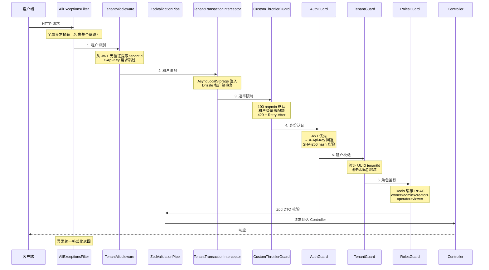

# 中间件与守卫链

AgentLoom 服务端通过 **6 层中间件/守卫链** + 2 个全局横切组件处理每个 HTTP 请求，确保多租户隔离、认证鉴权和速率控制。

## 请求处理流程



## 各层详解

### 1. TenantMiddleware

**位置**：`src/common/middleware/tenant.middleware.ts`

租户识别中间件，是请求链路的第一道关卡。

| 特性         | 说明                                                                        |
| ------------ | --------------------------------------------------------------------------- |
| 提取方式     | 从 JWT payload 无验证提取 `tenantId`（仅解码，不校验签名）                  |
| API Key 处理 | 当请求携带 `X-Api-Key` 头时跳过（租户 ID 在 AuthGuard 中由 API Token 解析） |
| 注入位置     | `req.tenantId`                                                              |

::: tip 为什么不验证 JWT 签名？
TenantMiddleware 只需要提取租户 ID 用于后续事务隔离，真正的 JWT 签名验证在 AuthGuard 中执行。这避免了重复验签的性能开销。
:::

### 2. TenantTransactionInterceptor

**位置**：`src/common/interceptors/tenant-transaction.interceptor.ts`

确保每个请求在正确的租户事务上下文中执行。

| 特性     | 说明                                                  |
| -------- | ----------------------------------------------------- |
| 存储机制 | `AsyncLocalStorage` 请求级隔离                        |
| 事务管理 | Drizzle ORM 租户级事务包裹                            |
| 辅助函数 | `runInTenantTransaction()` 供业务代码获取当前租户事务 |

### 3. CustomThrottlerGuard

**位置**：`src/common/guards/custom-throttler.guard.ts`

基于 `@nestjs/throttler` 的租户感知限流守卫。

| 特性     | 说明                                                                   |
| -------- | ---------------------------------------------------------------------- |
| 默认限制 | 100 req/min（`ThrottlerModule { ttl: 60_000, limit: 100 }`）           |
| 租户覆盖 | 从 `tenant_quotas` 读取 `apiRateLimitPerMinute` 和 `dailyApiCallLimit` |
| 追踪键   | `apikey:{prefix}` / `jwt:{sub}` / `req.ip`（三级优先级）               |
| 存储     | Redis                                                                  |
| 响应     | 分钟限流 → `429` + `Retry-After` + `X-RateLimit-*` 头                  |
| 日配额   | 超出 → `409` 治理阻断                                                  |

### 4. AuthGuard

**位置**：`src/common/guards/auth.guard.ts`

双重认证守卫，是安全链的核心。

```text
请求 → 检查 JWT
         ├── JWT 有效 → 设置 req.user + req.authMethod = 'jwt'
         └── JWT 无效/缺失 → 检查 X-Api-Key
                                ├── API Key 有效 → SHA-256 hash 查验
                                │                  → revoked/expired 检查
                                │                  → 设置 req.user + req.authMethod = 'api_key'
                                └── 均无效 → 401 Unauthorized
```

| 特性         | 说明                                                                |
| ------------ | ------------------------------------------------------------------- |
| JWT 来源     | Supabase Auth                                                       |
| API Key 格式 | `al_` 前缀 + 随机字符串                                             |
| API Key 存储 | SHA-256 hash（不存储明文）                                          |
| 懒加载       | `ModuleRef.get({strict: false})` 按需加载 `PlatformApiTokenService` |
| 输出         | `req.user`、`req.tenantId`、`req.authMethod`                        |

::: warning @Public() 装饰器
标记 `@Public()` 的端点将跳过 AuthGuard 认证检查，但仍会经过 TenantMiddleware 和限流。
:::

### 5. TenantGuard

**位置**：`src/common/guards/tenant.guard.ts`

租户归属校验守卫。

| 特性     | 说明                                           |
| -------- | ---------------------------------------------- |
| 校验内容 | `req.tenantId` 必须为有效 UUID                 |
| 跳过条件 | `@Public()` 装饰器或无 `@Roles()` 装饰器的端点 |
| 作用     | 确保已认证用户只能访问其所属租户的资源         |

### 6. RolesGuard

**位置**：`src/common/guards/roles.guard.ts`

基于 Redis 缓存的 RBAC 角色守卫。

| 特性     | 说明                                                                  |
| -------- | --------------------------------------------------------------------- |
| 角色层级 | `owner` > `admin` > `creator` > `operator` > `viewer`                 |
| 缓存     | `RbacCacheService.getUserRole()` Redis 缓存查询                       |
| 匹配规则 | 向上兼容 — 要求 `operator` 权限时，`creator`/`admin`/`owner` 均可通过 |

#### 角色权限矩阵

| 角色       | 工作流 CRUD | 执行 | 组织管理 | 资源治理 | 插件安装 |
| ---------- | ----------- | ---- | -------- | -------- | -------- |
| `owner`    | ✅          | ✅   | ✅       | ✅       | ✅       |
| `admin`    | ✅          | ✅   | ✅       | ✅       | ✅       |
| `creator`  | ✅          | ✅   | ❌       | ❌       | ✅       |
| `operator` | 只读        | ✅   | ❌       | ❌       | ✅       |
| `viewer`   | 只读        | 只读 | ❌       | ❌       | ❌       |

## 全局横切组件

除了 6 层链路外，还有两个全局组件贯穿所有请求：

### AllExceptionsFilter

**位置**：`src/common/filters/all-exceptions.filter.ts`

全局异常过滤器，捕获所有未处理异常并格式化为统一的 JSON 错误响应。

| 异常类型                                     | HTTP 状态码    |
| -------------------------------------------- | -------------- |
| `HttpException`                              | 保持原始状态码 |
| `ResourceGovernanceDecisionBlockedException` | `409` 或 `429` |
| 未知异常                                     | `500`          |

### ZodValidationPipe

**位置**：`src/common/pipes/zod-validation.pipe.ts`

全局参数校验管道，使用 Zod schema 替代 class-validator 进行 DTO 校验。

## 常用装饰器

| 装饰器                                      | 说明                                                                 |
| ------------------------------------------- | -------------------------------------------------------------------- |
| `@CurrentUser()`                            | 注入当前认证用户对象                                                 |
| `@Roles('admin', 'owner')`                  | 声明端点所需最低角色                                                 |
| `@Public()`                                 | 标记公开端点，跳过认证                                               |
| `@SkipThrottle({ default: true })`          | 跳过限流（v6 语法：`Record<string, boolean>`），用于 HealthController 等 |
| `@CaptureAuditLog(config)`                  | Opt-in HTTP 请求审计捕获，将请求/响应写入审计日志                    |

## WebSocket 守卫

### WsJwtGuard

**位置**：`src/common/guards/ws-jwt.guard.ts`

Socket.IO WebSocket 连接的 JWT + MFA 认证守卫。在连接握手阶段执行：

| 步骤 | 说明                                                         |
| ---- | ------------------------------------------------------------ |
| 1    | 从握手 `auth.token` 或 query 参数提取 JWT                    |
| 2    | 验证 JWT 签名有效性                                          |
| 3    | 检查 JWT 黑名单（Redis）                                     |
| 4    | 若用户已启用 MFA，校验 MFA 会话凭证                          |
| 5    | 通过后将 `user` 和 `tenantId` 附加到 socket `data`           |

所有 Socket.IO namespace（`/execution`、`/agent-conversation`、`/notification`、`/knowledge`、`/memory`）均使用此守卫。
