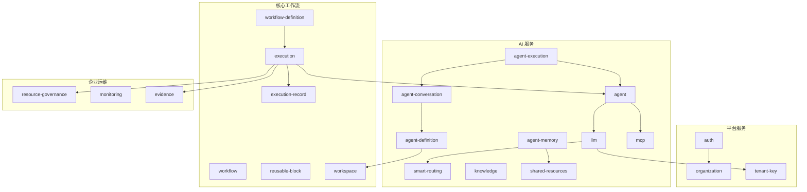

# 模块架构

AgentLoom 服务端包含 **37 个 NestJS 模块**，按职责划分为 8 个领域。每个模块遵循标准 NestJS 结构：`controller` → `service` → `dto (Zod)` → `Drizzle schema`。

## 核心工作流

管理工作流的定义、执行和版本控制。

| 模块                    | 职责                                                    | 关键端点                                                           |
| ----------------------- | ------------------------------------------------------- | ------------------------------------------------------------------ |
| **workflow-definition** | 工作流 CRUD、版本管理 (OCC)、发布、JSON 导入导出        | `POST /workflow-definitions`、`PUT /:id/versions`、`POST /:id/run` |
| **workflow**            | 工作流画布节点/边操作、模板克隆                         | `PATCH /workflows/:id/nodes`、`POST /from-template`                |
| **execution**           | DAG 执行引擎、Socket.IO `/execution` 事件流、检查点恢复 | `POST /executions`、`WS execution:subscribe`                       |
| **execution-record**    | Agent 执行遥测自动记录：步骤完成/失败事件监听 → `agent_execution_records` 表 | `GET /execution-records`                                |
| **workspace**           | Workspace 持久化服务，`workspace_snapshots` 表           | 内部使用                                                           |

**补充模块：**

- **reusable-block** — 可复用工作流片段管理

### 执行引擎特性

- DAG 拓扑排序 + 并行节点执行
- BullMQ `execution-queue` + `agent-task-queue` 双队列
- `execution_steps.checkpointData.session` 持久化会话状态
- 工具权限端点：`/executions/:id/steps/:stepId/tool-calls/:toolCallId/resolve`
- `awaiting_permission` 是 tool-level 状态（step 保持 `running`），当前仅用于自进化写工具（`apply_change` / `create_resource`）

## AI 服务

封装 LLM 调用、Agent 编排和工具集成。

| 模块                      | 职责                                                                                                               | 关键端点                                              |
| ------------------------- | ------------------------------------------------------------------------------------------------------------------ | ----------------------------------------------------- |
| **agent**                 | 六边形架构 (ports/AgentRuntime → InProcess\|Sandbox 适配器)；`PiAgentCoreAdapter` 封装 pi-agent-core 运行时，`SandboxAgentAdapter` 通过 HTTP + SSE 与沙箱容器通信；`tool-schema-converter.ts` Zod ↔ TypeBox 双向转换 | 内部使用（由 execution/agent-execution 调用）         |
| **agent-definition**      | Agent 定义 CRUD + 版本管理 + canvas 保存 + 发布/归档；`agent_definitions`/`agent_versions` 表；compile pipeline 含 sub-agent 节点验证（别名唯一性、格式正则、自引用禁止） | `POST /agent-definitions`、`PUT /:id/versions`        |
| **agent-conversation**    | Agent 对话生命周期：创建/列表/消息历史/发送消息 API；`agent_conversations`/`agent_messages` 表 | `POST /agent-conversations`、`GET /:id/messages`      |
| **agent-execution**       | Agent 对话执行引擎：`AgentExecutionWorker` + Socket.IO `/agent-conversation` gateway + `WorkflowAgentAdapter`（桥接工作流 `agent` 节点）+ `SubAgentToolsProvider`（4 个子代理工具，最大并发 10，最大嵌套深度 5） | `WS conversation:subscribe`                           |
| **agent-memory**          | 图拓扑 Agent 记忆系统：7 张表，25 REST 端点，Socket.IO `/memory` namespace，7 个 Agent 工具，纯 PostgreSQL FTS | `GET /memory-instances`、`POST /:id/nodes`            |
| **llm**                   | LLM 提供商管理、`LlmEncryptionService` E2EE 加密                                                                   | `GET /llm/providers`、`POST /llm/chat`                |
| **mcp**                   | MCP 工具发现与调用、端口 `mcpToolMapping`                                                                          | `GET /mcp/tools`、`POST /mcp/call`                    |
| **smart-routing**         | 6 种路由策略 (TOKEN_OPTIMIZED / COST_OPTIMIZED / QUALITY_FIRST / LATENCY_FIRST / HISTORICAL_BEST / FALLBACK_CHAIN) | `POST /smart-routing/route`                           |
| **knowledge**             | 知识库管理、文档向量化、Qdrant RAG 检索                                                                            | `POST /knowledge/documents`、`POST /knowledge/search` |
| **shared-resources**      | 通用共享资源注册表：`SharedResourceProvider<TConfig, TInstance>` 接口，sandbox 与 memory 为已注册 provider | 内部使用                                              |

### 智能路由策略

| 策略              | 说明                     |
| ----------------- | ------------------------ |
| `TOKEN_OPTIMIZED` | 最小化 Token 消耗        |
| `COST_OPTIMIZED`  | 最低成本路由             |
| `QUALITY_FIRST`   | 优先模型质量             |
| `LATENCY_FIRST`   | 最低延迟                 |
| `HISTORICAL_BEST` | 基于历史表现             |
| `FALLBACK_CHAIN`  | 故障自动切换（默认策略） |

`FALLBACK_CHAIN` 支持非认证失败时自动切换模型重试。`routing_decisions.selected_model_id` 为 nullable。

## 平台服务

用户管理、组织协作和平台基础能力。

| 模块                   | 职责                                                          | 关键端点                                                 |
| ---------------------- | ------------------------------------------------------------- | -------------------------------------------------------- |
| **auth**               | JWT (Supabase) 认证、用户会话管理                             | `POST /auth/login`、`POST /auth/refresh`                 |
| **organization**       | 组织 CRUD、成员与角色管理                                     | `POST /organizations`、`PUT /:id/members`                |
| **notification**       | 多通道通知 (in_app / email / push)、Socket.IO `/notification` | `GET /notifications`、`POST /notifications/read`         |
| **template**           | 预置工作流模板管理（5 个种子模板）                            | `GET /templates`、`POST /from-template`                  |
| **share**              | 工作流分享链接管理，管理端 + 公共短链                         | 管理端 `POST /workflow-shares`、公开 `GET /s/:token`     |
| **platform-api-token** | API Token CRUD（`al_` 前缀 + SHA-256 hash）                   | `POST /api-tokens`、`DELETE /:id`                        |
| **tenant-key**         | RSA-4096 公钥管理 (append-only)、E2EE 密钥轮转                | `POST /tenant-keys`、`GET /tenant-keys/active`           |
| **api-key**            | Agent 配置中的 LLM API Key 管理                               | `POST /api-keys`、`GET /api-keys`                        |
| **marketplace**        | 插件/工作流上架、公共浏览搜索、安装                           | `GET /marketplace/listings`、`POST /marketplace/install` |

### 分享机制

- 分享创建要求 `publishedVersionId` 非空
- 公开读取从 snapshot 返回 `nodes/edges/viewport`
- 原子递增 `view_count` / `copy_count`

### Marketplace 特性

- 公共 browse/search/detail/reviews/install 链路
- 安装 RBAC：`owner/admin/creator/operator`
- 支持 `listingType`：`workflow` 和 `plugin`
- 支持 `pricingModel`：`free` 和 `per_execution`

## 企业运维

面向组织管理员的运维与治理能力。

| 模块                        | 职责                                               | 关键端点                                             |
| --------------------------- | -------------------------------------------------- | ---------------------------------------------------- |
| **resource-governance**     | 租户配额 (7 个维度)、执行准入、限流覆盖            | `GET /resource-quotas`、`PUT /resource-quotas`       |
| **monitoring**              | 组织运行监控仪表板 (15m/1h/24h 窗口)               | `GET /monitoring/dashboard`                          |
| **evidence**                | 审计日志写入、hot/archive 双表查询、retention 归档 | `GET /audit-logs`、`GET /audit-logs/:id`             |
| **optimization-suggestion** | Agent 配置优化建议 (4 类)、采纳率统计              | `GET /optimization-suggestions`、`POST /:id/apply`   |
| **private-deployment**      | 私有部署 SMTP/LLM proxy/证书/许可证配置            | `GET /private-deployment`、`PUT /private-deployment` |
| **intervention-policy**     | 介入策略（approve/reject/escalate + timeout）      | `POST /intervention-policies`、`PUT /:id`            |

### 资源治理 7 维度

| 配额            | 说明                                  |
| --------------- | ------------------------------------- |
| 并发执行数      | 同时运行的工作流上限                  |
| 日执行量        | 每日工作流执行次数上限                |
| 日 API 调用量   | 每日 REST API 调用上限                |
| 存储预算        | MinIO 存储容量限制                    |
| 分钟级 API 速率 | `apiRateLimitPerMinute`，默认 100/min |
| Sandbox CPU     | 沙箱 CPU 使用百分比上限               |
| Sandbox 内存    | 沙箱内存使用上限                      |

### 审计日志架构

- **双表结构**：`audit_logs` (热表) + `audit_log_archives` (归档)
- **Append-only**：JSONB `before/after/metadata`
- **单例归档任务**：`audit-log-retention` 队列 + `upsertJobScheduler()`
- **合并查询**：按 `(createdAt, id)` 做 hot/archive merged recall + 去重

### 优化建议 4 类

| 类型                 | 说明                  |
| -------------------- | --------------------- |
| `model_downgrade`    | 降级模型以节省成本    |
| `timeout_adjustment` | 调整超时设置          |
| `tool_pruning`       | 清理未使用的工具      |
| `autonomy_upgrade`   | 提升 Agent 自主性级别 |

四类建议当前都不可采纳：`POST /optimization-suggestions/:id/apply` 用空的 `APPLICABLE_SUGGESTION_TYPES` 白名单在任何读写之前返回 `OPTIMIZATION_SUGGESTION_NOT_APPLICABLE`（409）——它们写入的字段不参与 workflow `agent` 节点的执行。忽略（dismiss）不受影响。

## 插件生态

| 模块       | 职责                                                                   | 关键端点                                                 |
| ---------- | ---------------------------------------------------------------------- | -------------------------------------------------------- |
| **plugin** | `.alp` 插件注册与验签、WASM 沙箱执行、开发者密钥、使用量记录、收益结算 | `POST /plugins`（multipart）、`GET /plugins/marketplace` |

### 插件系统架构

- **注册**：`.alp` multipart 上传 + RSA-PSS canonical archive 签名验证
- **沙箱**：`@extism/extism` WASM 隔离（`runInWorker: true`），硬限制 `timeoutMs=30000` / `maxMemoryPages=4096`
- **收益分成模型**：
  - 总收入 × 70% = 开发者毛收入
  - 毛收入 × 15% = 上架佣金
  - 开发者净收入 ≈ 59.5%，平台 ≈ 30%
- **BullMQ 队列**：`plugin-execution`（执行）、`earnings-settlement`（周期结算）

## ACP 网关

| 模块            | 职责                                                           | 关键端点               |
| --------------- | -------------------------------------------------------------- | ---------------------- |
| **acp-gateway** | ACP 协议适配、stdio 连接管理、session/sandbox/terminal surface | JSON-RPC 2.0 via stdio |

### ACP 协议 Surface

- **Session**：`session/new`、`session/prompt`、`session/cancel`、`session/load`、`session/update`
- **文件系统**：`fs/read_text_file`、`fs/write_text_file`（写入前 `session/request_permission`）
- **终端**：`terminal/create`、`terminal/output`、`terminal/wait_for_exit`、`terminal/kill`、`terminal/release`
- **安全**：`/workspace/` 边界 + `realpath` / symlink / traversal / oversize / binary guardrails
- **终端治理**：默认 1MB ring buffer、5 并发、300s lifetime timeout

## 基础设施

| 模块        | 职责                        | 关键端点                            |
| ----------- | --------------------------- | ----------------------------------- |
| **sandbox** | 执行沙箱生命周期管理        | 内部使用                            |
| **health**  | 服务健康检查                | `GET /health`                       |
| **trigger** | 定时/Webhook/API 事件触发器 | `POST /triggers`、`PUT /:id/enable` |
| **api-key** | LLM API Key 安全存储        | `POST /api-keys`、`GET /api-keys`   |

### 触发器类型

| 类型        | 说明                   | 状态                                          |
| ----------- | ---------------------- | --------------------------------------------- |
| `cron`      | Cron 表达式定时触发    | 正式                                          |
| `webhook`   | Webhook URL + 签名验证 | 正式                                          |
| `api_event` | API 事件触发           | 正式（`EventSourceAdapterRegistry` + fan-out） |

## 模块依赖关系

