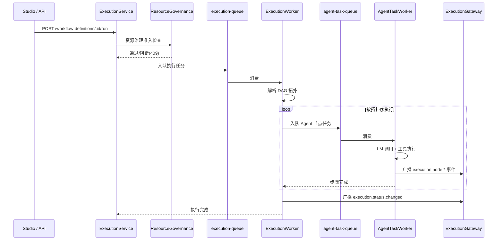

# 任务队列

AgentLoom 使用 **BullMQ** + **Redis** 实现异步任务处理，涵盖工作流执行、插件运行、通知推送等核心场景。

## 架构概览

```mermaid
flowchart TB
    subgraph Producers ["生产者"]
        ES[ExecutionService]
        PS[PluginService]
        NS[NotificationService]
        TS[TriggerService]
        OS[OptimizationService]
        AS[AuditLogService]
        EaS[EarningsService]
        SS[SandboxService]
        KS[KnowledgeService]
    end

    subgraph Redis ["Redis (BullMQ)"]
        Q1[execution-queue]
        Q2[agent-task-queue]
        Q3[plugin-execution]
        Q4[trigger-scheduler]
        Q5[notification]
        Q6[earnings-settlement]
        Q7[optimization-analysis]
        Q8[audit-log-retention]
        Q9[sandbox-lifecycle-queue]
        Q10[document-processing-queue]
        Q11[document-indexing-queue]
        Q12[agent-conversation-queue]
        Q13[smart-routing-learning]
    end

    subgraph Workers ["消费者"]
        W1[ExecutionWorker]
        W2[AgentTaskWorker]
        W3[PluginExecutionWorker]
        W4[TriggerSchedulerProcessor]
        W5[NotificationProcessor]
        W6[EarningsSettlementWorker]
        W7[OptimizationAnalysisWorker]
        W8[AuditLogRetentionWorker]
        W9[SandboxLifecycleWorker]
        W10[DocumentProcessingWorker]
        W11[DocumentIndexingWorker]
        W12[AgentConversationWorker]
        W13[SmartRoutingLearningWorker]
    end

    ES --> Q1 --> W1
    ES --> Q2 --> W2
    PS --> Q3 --> W3
    TS --> Q4 --> W4
    NS --> Q5 --> W5
    EaS --> Q6 --> W6
    OS --> Q7 --> W7
    AS --> Q8 --> W8
    SS --> Q9 --> W9
    KS --> Q10 --> W10
    KS --> Q11 --> W11
    ES --> Q12 --> W12
    SS --> Q13 --> W13
```

## 队列详情

### 1. execution-queue（执行编排）

| 属性   | 值                                                       |
| ------ | -------------------------------------------------------- |
| Worker | `ExecutionWorker`                                        |
| 重试   | 1 次                                                     |
| 职责   | 接收工作流执行请求，解析 DAG 拓扑，按步骤入队 agent-task |

**处理流程**：

1. 接收 `workflowExecutionId`
2. 加载 `definition_snapshot`，解析节点 DAG
3. 按拓扑序逐步提交 `agent-task-queue`
4. 监听步骤完成事件，推进下一批节点
5. 所有节点完成后标记执行为 `completed`

### 2. agent-task-queue（Agent 节点执行）

| 属性   | 值                                                |
| ------ | ------------------------------------------------- |
| Worker | `AgentTaskWorker`                                 |
| 重试   | 3 次，指数退避 2s                                 |
| 并发   | 支持并行执行                                      |
| 职责   | 执行单个 Agent 节点：LLM 调用、工具调用、加密输出 |

**关键特性**：

- LLM 输出在完成路径使用 `LlmEncryptionService` 执行 hybrid RSA-OAEP + AES-256-GCM 加密
- 支持 `waiting_intervention` 状态，等待人工审批
- 处理 `intervention-timeout` 延时任务：超时后执行策略配置的 `approve/reject/escalate` 动作
- `MAX_ESCALATION_ATTEMPTS = 3`

### 3. plugin-execution（插件执行）

| 属性   | 值                            |
| ------ | ----------------------------- |
| Worker | `PluginExecutionWorker`       |
| 重试   | 3 次，指数退避 2s             |
| 职责   | 在 Extism WASM 沙箱中执行插件 |

**安全限制**：

- `timeoutMs = 30000`（30 秒硬限制）
- `maxMemoryPages = 4096`
- `runInWorker: true`（独立 Worker 线程）
- 执行成功后 fire-and-forget 调用 `PluginUsageService.recordUsage()`

### 4. trigger-scheduler（触发器调度）

| 属性   | 值                                           |
| ------ | -------------------------------------------- |
| Worker | `TriggerSchedulerProcessor`                  |
| 重试   | 3 次，指数退避 2s                            |
| 职责   | 处理 cron/webhook/api_event 触发的工作流执行 |

**触发类型**：

- **cron**：定时调度，更新 `next_fire_at`
- **webhook**：签名验证，失败记录 `signature_failed` 历史
- **api_event**：仅预览（preview-only），不可创建/编辑/启用

执行创建在租户事务提交后才入队。

### 5. notification（通知推送）

| 属性   | 值                       |
| ------ | ------------------------ |
| Worker | `NotificationProcessor`  |
| 重试   | 3 次，指数退避 1s        |
| 职责   | Fan-out 推送通知到多通道 |

**通知类型**：`completed` / `failed` / `intervention_required`

**通道**：

- `in_app` — 应用内通知 + Socket.IO `/notification` 实时推送
- `email` — 邮件通知
- `push` — 设备推送

### 6. earnings-settlement（收益结算）

| 属性   | 值                                 |
| ------ | ---------------------------------- |
| Worker | `EarningsSettlementWorker`         |
| 重试   | 1 次                               |
| 职责   | 按周期汇总插件使用量，计算收益分成 |

**分成模型**：

| 项目         | 比例         |
| ------------ | ------------ |
| 总收入       | 100%         |
| 开发者毛收入 | 70%          |
| 上架佣金     | 毛收入 × 15% |
| 开发者净收入 | ≈59.5%       |
| 平台份额     | 30%          |

含幂等性检查，防止重复结算。

### 7. optimization-analysis（优化分析）

| 属性   | 值                                               |
| ------ | ------------------------------------------------ |
| Worker | `OptimizationAnalysisWorker`                     |
| 重试   | 1 次                                             |
| 调度   | `0 2 * * 1`（UTC 每周一凌晨 2 点）               |
| 职责   | 分析 `agent_execution_records`，生成配置优化建议 |

**建议类型**：

- `model_downgrade` — 模型降级建议
- `timeout_adjustment` — 超时调整
- `tool_pruning` — 工具裁剪
- `autonomy_upgrade` — 自主性升级

使用 `upsertJobScheduler()` 注册固定 scheduler ID。

### 8. audit-log-retention（审计日志归档）

| 属性   | 值                                   |
| ------ | ------------------------------------ |
| Worker | `AuditLogRetentionWorker`            |
| 重试   | 1 次                                 |
| 调度   | `upsertJobScheduler()` 单例任务      |
| 职责   | hot 表 → archive 表 copy-then-delete |

在原始 base DB 事务中执行（绕过 RLS），读取侧继续 tenant-aware。

### 9. sandbox-lifecycle-queue（沙箱生命周期）

| 属性   | 值                             |
| ------ | ------------------------------ |
| Worker | `SandboxLifecycleWorker`       |
| 重试   | 3 次，指数退避                 |
| 职责   | 沙箱会话的创建、清理与过期回收 |

### 10. document-processing-queue（文档处理）

| 属性   | 值                         |
| ------ | -------------------------- |
| Worker | `DocumentProcessingWorker` |
| 职责   | 知识库文档解析与分块       |

### 11. document-indexing-queue（文档索引）

| 属性   | 值                            |
| ------ | ----------------------------- |
| Worker | `DocumentIndexingWorker`      |
| 职责   | 将文档分块向量化并写入 Qdrant |

### 12. agent-conversation-queue（Agent 对话执行）

| 属性   | 值                                                 |
| ------ | -------------------------------------------------- |
| Worker | `AgentConversationWorker`                          |
| 重试   | 3 次，指数退避（2s base）                          |
| 职责   | Agent 对话消息执行（独立于 agent-task-queue 工作流节点执行） |

Agent 对话场景与工作流节点执行分离，拥有独立队列和 Worker。通过 `/agent-conversation` Socket.IO namespace 推送实时事件。

### 13. smart-routing-learning（智能路由学习）

| 属性   | 值                                             |
| ------ | ---------------------------------------------- |
| Worker | `SmartRoutingLearningWorker`                   |
| 重试   | 1 次                                           |
| 职责   | 处理路由决策反馈，更新 MLP/Elo/KNN 在线学习模型 |

异步处理执行完成后的路由决策评分反馈，供 `SmartRoutingModule` 的 `learning/` 子模块进行在线模型训练。

---

## 重试与死信队列

### 重试策略

| 队列                  | 重试次数 | 退避策略 | 基础延迟 |
| --------------------- | -------- | -------- | -------- |
| execution-queue       | 1        | —        | —        |
| agent-task-queue      | 3        | 指数退避 | 2s       |
| plugin-execution      | 3        | 指数退避 | 2s       |
| trigger-scheduler     | 3        | 指数退避 | 2s       |
| notification          | 3        | 指数退避 | 1s       |
| earnings-settlement   | 1        | —        | —        |
| optimization-analysis | 1        | —        | —        |
| audit-log-retention   | 1        | —        | —        |
| sandbox-lifecycle     | 3        | 指数退避 | —        |
| agent-conversation    | 3        | 指数退避 | 2s       |
| smart-routing-learning| 1        | —        | —        |

### 死信队列 (DLQ)

BullMQ 重试耗尽后任务进入 `failed` 状态。AgentLoom 提供 DLQ 管理 API 支持：

- 查询失败任务列表
- 重试失败任务
- 清理过期失败任务

---

## 周期调度任务

两个队列使用 `upsertJobScheduler()` 注册周期性任务：

| 任务                  | 队列                  | 调度表达式  | 说明               |
| --------------------- | --------------------- | ----------- | ------------------ |
| optimization-analysis | optimization-analysis | `0 2 * * 1` | 每周一 UTC 2:00    |
| audit-log-retention   | audit-log-retention   | 单例调度    | retention 策略驱动 |

`upsertJobScheduler()` 确保集群环境下仅运行一个调度实例，使用固定 scheduler ID 实现幂等注册。

---

## 工作流执行编排流程

### 治理准入

`ExecutionService.runWorkflow()` 在写入 `workflow_executions` 前调用资源治理准入判断：

- **并发执行数** — `tenant_quotas.maxConcurrentExecutions`
- **日执行量** — `tenant_quotas.dailyExecutionLimit`
- **治理暂停状态** — `execution_governance_controls` 检查

阻断时统一使用 `ResourceGovernanceDecisionBlockedException`（409 状态码），并写正式审计。
