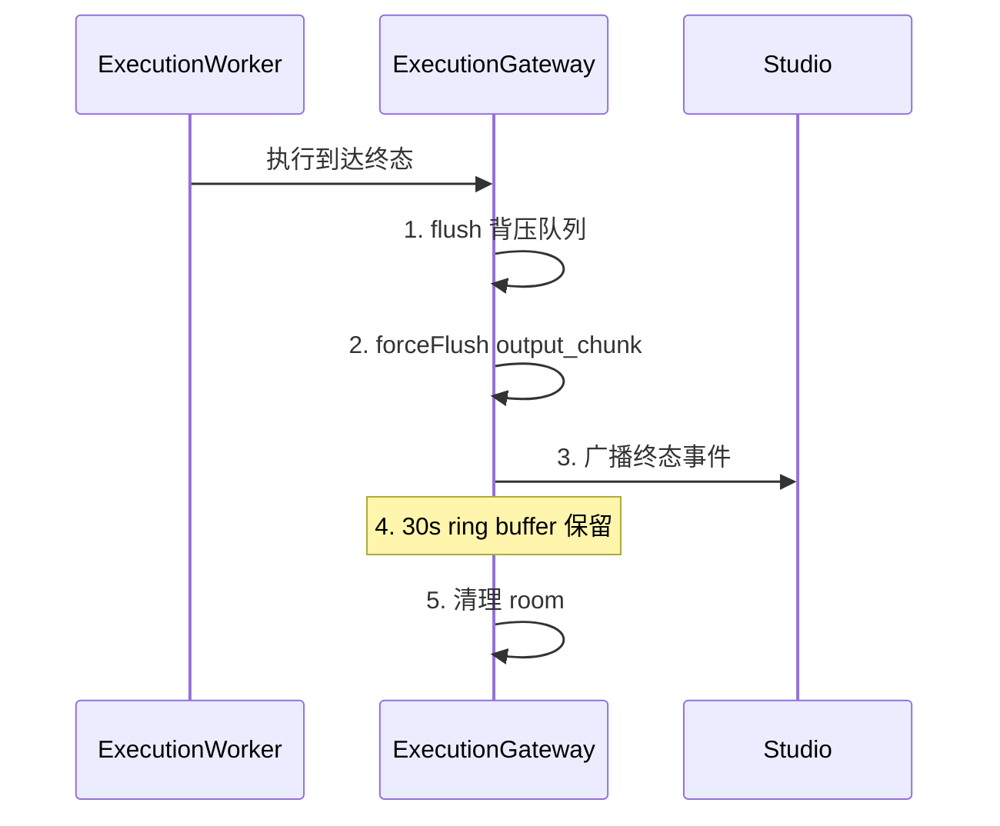
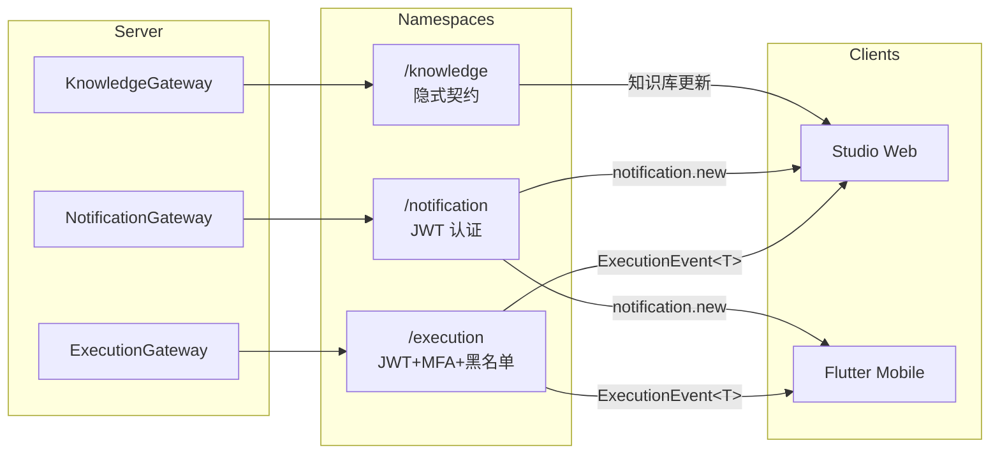

# 实时通信协议

AgentLoom 使用 **Socket.IO** 实现服务端到客户端的实时事件推送，涵盖工作流执行进度、通知推送和知识库更新三个命名空间。

## 命名空间概览

| 命名空间        | 认证                      | 用途                | 状态     |
| --------------- | ------------------------- | ------------------- | -------- |
| `/execution`    | WsJwtGuard + MFA + 黑名单 | 执行进度推送        | 正式协议 |
| `/notification` | JWT 认证                  | 通知推送 + 未读计数 | 正式协议 |
| `/knowledge`    | 无                        | 知识库更新          | 隐式契约 |

---

## /execution 命名空间

最核心的实时协议，用于向 Studio 推送工作流执行的全过程状态变化。

### 事件信封

所有事件使用统一的 `ExecutionEvent<T>` 类型信封：

```typescript
interface ExecutionEvent<T> {
  eventId: number; // 单调递增 ID（用于断线重连）
  executionId: string; // 工作流执行 ID
  timestamp: string; // ISO 8601 时间戳
  type: string; // 事件类型
  payload: T; // 业务载荷（类型参数化）
}
```

**`eventId` 保证**：

- 每个执行实例内**单调递增**
- 客户端可通过 `lastEventId` 实现断线续传
- 不跨执行实例共享

### /execution 房间模型

```text
execution:{tenantId}:{executionId}
```

客户端订阅特定执行的事件时，加入对应的 Socket.IO room。

### 订阅协议

#### 订阅事件

```typescript
// 客户端 → 服务端
socket.emit(
  "execution:subscribe",
  {
    executionId: "uuid-xxx",
  },
  (ack: { success: boolean; error?: string }) => {
    // ACK 回调确认订阅结果
  },
);
```

#### 取消订阅

```typescript
// 客户端 → 服务端
socket.emit(
  "execution:unsubscribe",
  {
    executionId: "uuid-xxx",
  },
  (ack: { success: boolean }) => {
    // ACK 回调确认
  },
);
```

> **兼容性**：服务端同时支持 `subscribe`/`join`（别名）和 `unsubscribe`/`leave`（别名）。

### /execution 事件类型

#### 节点级事件

| 事件名                                 | 载荷           | 说明                 |
| -------------------------------------- | -------------- | -------------------- |
| `execution.node.status-changed`        | 节点状态变更   | 步骤状态转换         |
| `execution.node.agent-event`           | Agent 运行事件 | LLM 调用、工具执行等 |
| `execution.node.retrying`              | 重试信息       | 含重试次数、延迟     |
| `execution.node.output-chunk`          | 流式输出块     | LLM 流式响应分块     |
| `execution.node.intervention-required` | 介入请求       | 需要人工审批         |
| `execution.node.intervention-resolved` | 介入结果       | 审批通过/拒绝        |

#### 执行级事件

| 事件名                     | 载荷         | 说明                   |
| -------------------------- | ------------ | ---------------------- |
| `execution.status.changed` | 执行状态变更 | 全局 6 状态转换        |
| `execution.state.snapshot` | 完整状态快照 | 用于断线重连后状态同步 |

### 背压控制

服务端实现双层流量控制：

#### 1. 背压队列

| 参数                             | 值    | 说明     |
| -------------------------------- | ----- | -------- |
| `BACKPRESSURE_QUEUE_LIMIT`       | 500   | 队列上限 |
| `BACKPRESSURE_DRAIN_INTERVAL_MS` | 100ms | 排水间隔 |

当事件产生速率超过排水速率时：

- 事件入队等待
- 队列满时丢弃最旧事件
- 终态事件（completed/failed/cancelled）强制立即广播

#### 2. 节流合并

| 参数     | 值           | 说明                         |
| -------- | ------------ | ---------------------------- |
| 合并窗口 | 50ms         | ThrottleService merge window |
| 速率桶   | 100 events/s | 每秒最大事件数               |

同一节点在 50ms 窗口内的多次状态变更会被合并为一次广播。

### 终态清理流程

当执行到达终态（completed/failed/cancelled）时：



### 断线重连

客户端支持 `lastEventId` 增量回放：

```typescript
// 重连后发送 lastEventId
socket.emit(
  "execution:subscribe",
  {
    executionId: "uuid-xxx",
    lastEventId: 42, // 上次收到的最大 eventId
  },
  (ack) => {
    // 服务端回放 eventId > 42 的所有事件
  },
);
```

### 认证

| 层级     | 机制                    |
| -------- | ----------------------- |
| 连接认证 | `WsJwtGuard` — JWT 验证 |
| MFA 校验 | 多因素认证检查          |
| 黑名单   | 令牌撤销检查            |
| 认证失败 | 关闭连接，code `4001`   |

---

## /notification 命名空间

用于推送应用内通知和未读计数同步。

### /notification 房间模型

```text
tenant:{tenantId}:user:{userId}
```

每个用户在其租户下拥有独立的通知 room。

### /notification 事件类型

| 事件名                      | 方向            | 说明         |
| --------------------------- | --------------- | ------------ |
| `notification.new`          | 服务端 → 客户端 | 新通知推送   |
| `notification.unread-count` | 服务端 → 客户端 | 未读数量同步 |

### 通知触发

通知由 BullMQ `notification` 队列的 `NotificationProcessor` 处理，支持三种通道：

| 通道     | 说明                                     |
| -------- | ---------------------------------------- |
| `in_app` | 写入 `notifications` 表 + Socket.IO 推送 |
| `email`  | 邮件通知                                 |
| `push`   | 设备推送（通过 `device_tokens`）         |

通知类型包括：`completed`（执行完成）、`failed`（执行失败）、`intervention_required`（需要介入）。

---

## /knowledge 命名空间

用于知识库文档处理进度的实时更新。

::: warning 隐式契约
`/knowledge` 命名空间目前为隐式契约状态，未配置认证守卫（no auth guard），未来可能会正式化。
:::

---

## 客户端集成

### Studio 集成示例

```typescript
import { io } from "socket.io-client";

// 建立连接
const socket = io("/execution", {
  auth: { token: "jwt-token" },
  transports: ["websocket"],
});

// 订阅执行
socket.emit(
  "execution:subscribe",
  {
    executionId,
    lastEventId: lastKnownEventId,
  },
  (ack) => {
    if (!ack.success) console.error(ack.error);
  },
);

// 监听事件
socket.on(
  "execution.node.status-changed",
  (event: ExecutionEvent<NodeStatusPayload>) => {
    console.log(`节点 ${event.payload.nodeId} → ${event.payload.status}`);
  },
);

socket.on(
  "execution.status.changed",
  (event: ExecutionEvent<StatusPayload>) => {
    console.log(`执行 ${event.executionId} → ${event.payload.status}`);
  },
);

// 断线重连
socket.on("reconnect", () => {
  socket.emit("execution:subscribe", {
    executionId,
    lastEventId: maxReceivedEventId,
  });
});
```

### 移动端集成

Flutter 客户端通过 `socket_io_client` 包连接 `/execution` 命名空间，使用 JWT 认证，支持断线重连和 `lastEventId` 回放。

---

## 协议总结


