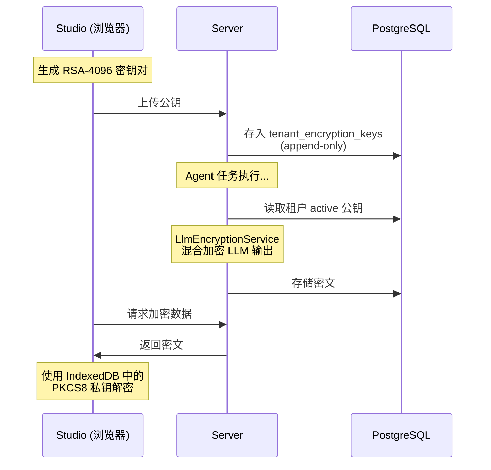
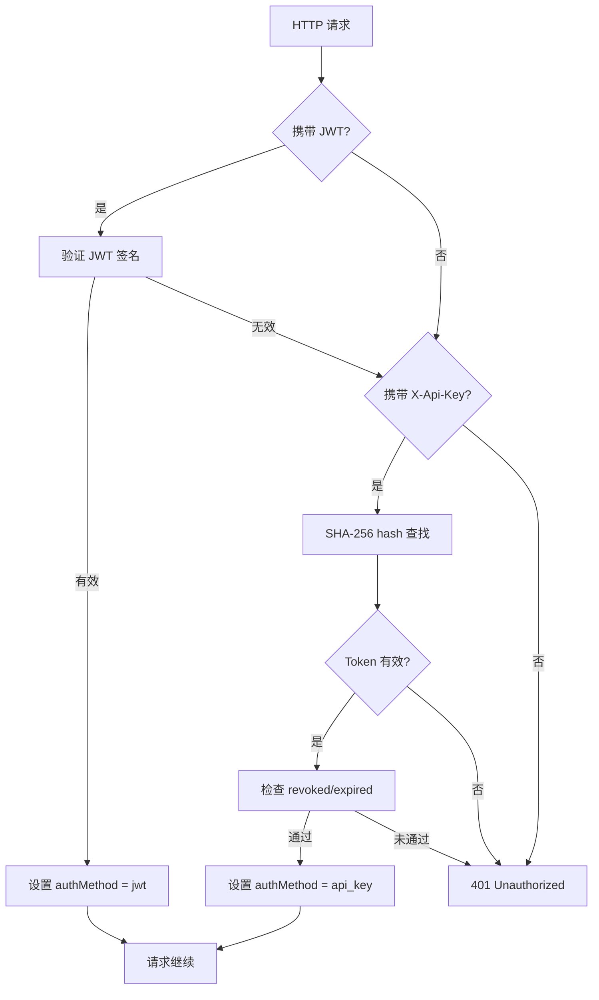

# 安全与加密

AgentLoom 采用多层安全架构，包括端到端加密 (E2EE)、多租户行级安全 (RLS)、双重认证和 API Token 管理。

## 端到端加密 (E2EE)

AgentLoom 对 LLM 输出和敏感证据数据实施端到端加密，确保即使数据库泄露，密文也无法被解读。

### 加密架构



### 混合加密方案

采用 **RSA-OAEP + AES-256-GCM** 混合加密：

| 步骤                | 算法                | 说明                                         |
| ------------------- | ------------------- | -------------------------------------------- |
| 1. 生成随机对称密钥 | AES-256             | 每次加密生成新密钥                           |
| 2. 加密数据         | AES-256-GCM         | 使用对称密钥加密明文，附带认证标签           |
| 3. 加密对称密钥     | RSA-OAEP (4096-bit) | 使用租户公钥加密 AES 密钥                    |
| 4. 打包密文         | —                   | 组合加密后的 AES 密钥 + IV + 认证标签 + 密文 |

### 密钥管理

#### 服务端 — `TenantKeyModule`

- **表结构**：`tenant_encryption_keys`
  - `organization_id + key_fingerprint` 唯一约束
  - 单一 `active` 部分唯一索引（每个组织仅一个活跃密钥）
  - **Append-only** 历史模型，不删除旧密钥
- **API**：
  - `POST /tenant-keys` — 上传新公钥
  - `GET /tenant-keys/active` — 获取当前活跃公钥
- **轮转**：上传新公钥后自动设为 active，旧密钥保留用于解密历史数据

#### 客户端 — Studio

- **私钥存储**：PKCS8 二进制格式存入 IndexedDB
- **导入方式**：`crypto.subtle.importKey()` → non-extractable `CryptoKey`
- **安全保证**：私钥永不离开浏览器，不可通过 JS 读取

### 加密覆盖范围

| 组件              | 加密时机         | 加密内容                             |
| ----------------- | ---------------- | ------------------------------------ |
| `AgentTaskWorker` | Agent 任务完成时 | LLM 输出内容                         |
| `EvidenceService` | 证据记录时       | `agent_decision`、`tool_output` 证据 |

## 多租户隔离

AgentLoom 使用三层多租户隔离策略：

### 1. 数据库级 — PostgreSQL RLS

所有业务表启用行级安全策略 (Row-Level Security)，通过 `organization_id` 列实现租户数据隔离。

::: info Direct-Tenant RLS 模式
部分敏感表（如 `tenant_encryption_keys`、`tenant_quotas`、`private_deployment_settings`）使用 direct-tenant RLS + authenticated DML grant，确保即使绕过应用层也无法跨租户访问。
:::

### 2. 应用级 — 租户事务

`TenantTransactionInterceptor` 通过 `AsyncLocalStorage` 将每个请求绑定到租户事务上下文：

```text
请求 → TenantMiddleware(提取 tenantId)
     → TenantTransactionInterceptor(创建租户事务)
     → 业务代码(通过 runInTenantTransaction() 获取事务)
     → 自动提交/回滚
```

### 3. 请求级 — TenantGuard

`TenantGuard` 验证请求中的 `tenantId` 为有效 UUID，防止租户 ID 伪造。

## 认证体系

### 双重认证策略

`AuthGuard` 支持两种认证方式，按优先级尝试：



### JWT 认证 (主要)

- **提供方**：Supabase Auth
- **传输**：`Authorization: Bearer <token>`
- **用途**：Studio 和移动端用户交互式登录

### API Key 认证 (回退)

- **传输**：`X-Api-Key: al_xxxxx`
- **存储**：SHA-256 hash（不存储明文）
- **管理**：`PlatformApiTokenModule`

## API Token 管理

### Token 生命周期

| 操作 | API                      | 权限              |
| ---- | ------------------------ | ----------------- |
| 创建 | `POST /api-tokens`       | `owner` / `admin` |
| 列表 | `GET /api-tokens`        | `owner` / `admin` |
| 吊销 | `DELETE /api-tokens/:id` | `owner` / `admin` |

### Token 规格

| 属性     | 说明                                             |
| -------- | ------------------------------------------------ |
| 前缀     | `al_`（AgentLoom 标识）                          |
| 存储方式 | SHA-256 hash（创建时返回一次明文，之后不可恢复） |
| 租户限额 | 每个组织最多 20 个 Token                         |
| 过期检查 | 每次认证时校验                                   |
| 吊销状态 | `revoked` 标记，立即生效                         |

### 安全实践

::: warning 明文仅返回一次
API Token 创建时响应中包含完整明文，之后服务端仅存储 SHA-256 hash。丢失明文后无法恢复，需重新创建。
:::

## RBAC 角色体系

### 角色层级

```text
owner → admin → creator → operator → viewer
```

角色采用**向上兼容**策略：要求 `operator` 权限的端点，`creator`、`admin`、`owner` 均可访问。

### 角色定义

| 角色       | 典型用户     | 核心权限                                       |
| ---------- | ------------ | ---------------------------------------------- |
| `owner`    | 组织创建者   | 完整管理权限，包括组织设置、资源治理、私有部署 |
| `admin`    | 组织管理员   | 等同 owner，但不可转移组织所有权               |
| `creator`  | 工作流开发者 | 工作流和 Agent 的完整 CRUD，可执行和安装插件   |
| `operator` | 运营人员     | 只读查看工作流，可触发执行和安装插件           |
| `viewer`   | 只读访客     | 只读查看工作流和执行记录                       |

### 缓存策略

角色信息通过 `RbacCacheService` 缓存在 Redis 中，避免每次请求查询数据库。角色变更时主动失效缓存。

## 速率限制

### 默认限制

| 维度          | 默��值                  | 超限响应                                                  |
| ------------- | ----------------------- | --------------------------------------------------------- |
| 每分钟请求数  | 100 req/min             | `429 Too Many Requests` + `Retry-After` + `X-RateLimit-*` |
| 每日 API 调用 | 由 `tenant_quotas` 配置 | `409 Conflict`（治理阻断）                                |

### 租户级覆盖

组织管理员可通过 [资源治理](/zh/server/modules#资源治理-7-维度) 自定义限流配额，覆盖默认��。

### 追踪键优先级

1. `apikey:{prefix}` — API Key 请求
2. `jwt:{sub}` — JWT 认证请求
3. `req.ip` — 未认证请求

## 执行治理准入

`ExecutionService.runWorkflow()` 在创建执行记录前，会调用资源治理准入判断：

| 检查项     | 阻断条件                                       | 响应                                                 |
| ---------- | ---------------------------------------------- | ---------------------------------------------------- |
| 并发执行数 | 超出租户配额                                   | `409` + `ResourceGovernanceDecisionBlockedException` |
| 日执行量   | 超出每日上限                                   | `409`                                                |
| 治理暂停   | `execution_governance_controls` 有活跃暂停记录 | `409`                                                |

所有治理阻断均写入正式审计日志，并通过 `EventEmitter2` 驱动通知。
