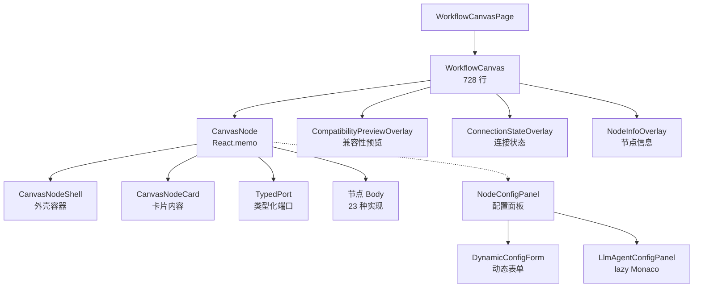

# 画布编辑器

画布编辑器是 Studio 的核心，用户在此构建 DAG 工作流。基于 `@xyflow/react` v12 实现，支持 23 种节点类型、12 种端口数据类型、3 级 LOD 缩放和实时兼容性检查。

## 节点类型体系

画布定义了 **8 大类别、23 种节点类型**：

```mermaid
graph TD
    Root[节点类型体系]
    Root --> Agent[🤖 Agent 智能体]
    Root --> Tool[🔧 Tool 工具]
    Root --> Trigger[⚡ Trigger 触发器]
    Root --> Knowledge[📚 Knowledge 知识]
    Root --> Output[📤 Output 输出]
    Root --> Control[🔀 Control 控制]
    Root --> Plugin[🧩 Plugin 插件]
    Root --> Memory[🧠 Memory 记忆]

    Agent --> chat-agent[chat-agent<br/>对话智能体]
    Agent --> llm-model[llm-model<br/>模型节点]
    Agent --> agent-node[agent<br/>Agent 节点]
    Agent --> smart-routing-node[smart-routing<br/>智能路由]
    Agent --> skill-node[skill<br/>Skill 节点]

    Tool --> http-tool[http-tool<br/>HTTP 工具]
    Tool --> code-tool[code-tool<br/>代码工具]
    Tool --> mcp-tool[mcp-tool<br/>MCP 工具]
    Tool --> sandbox[sandbox<br/>沙箱]
    Tool --> input-preprocessor[input-preprocessor<br/>输入预处理]
    Tool --> workspace-node[workspace<br/>工作区]

    Trigger --> manual-trigger[manual-trigger<br/>手动触发]
    Trigger --> schedule-trigger[schedule-trigger<br/>定时触发]
    Trigger --> webhook-trigger[webhook-trigger<br/>Webhook 触发]
    Trigger --> api-event-trigger[api-event-trigger<br/>API 事件触发]

    Knowledge --> knowledge-base[knowledge-base<br/>知识库]

    Output --> text-output[text-output<br/>文本输出]
    Output --> json-output[json-output<br/>JSON 输出]

    Control --> condition[condition<br/>条件分支]
    Control --> loop[loop<br/>循环]
    Control --> reusable-block[reusable-block<br/>可复用块]

    Plugin --> plugin-node[plugin<br/>插件节点]

    Memory --> memory-node[memory<br/>Agent 记忆]
```



### 节点类型详述

| 类别          | 节点               | 输入端口                     | 输出端口      | 说明                               |
| ------------- | ------------------ | ---------------------------- | ------------- | ---------------------------------- |
| **Agent**     | `chat-agent`       | text, model, tool, knowledge | text, json    | 对话式 Agent，支持工具调用与 RAG   |
|               | `llm-model`        | —                            | model         | 模型配置节点，输出 model 端口      |
|               | `agent`            | text, model, tool, knowledge, sandbox | text, json | 独立 Agent 定义节点                |
|               | `smart-routing`    | model (多个)                 | model         | 智能路由，6 种策略选择最优模型     |
|               | `skill`            | skill                        | skill         | Skill 行为注入节点                 |
| **Tool**      | `http-tool`        | json                         | json          | HTTP API 调用                      |
|               | `code-tool`        | json                         | json          | 沙箱代码执行                       |
|               | `mcp-tool`         | json                         | json, tool    | MCP 协议工具集成                   |
|               | `sandbox`          | text                         | sandbox       | ACP 沙箱终端                       |
|               | `input-preprocessor` | json                       | json          | 输入数据预处理与格式化             |
|               | `workspace`        | exec                         | volume        | 工作区存储卷管理                   |
| **Trigger**   | `manual-trigger`   | —                            | text          | 手动触发入口                       |
|               | `schedule-trigger` | —                            | text          | Cron 定时触发                      |
|               | `webhook-trigger`  | —                            | json          | Webhook 回调触发                   |
|               | `api-event-trigger`| —                            | json          | API 事件触发                       |
| **Knowledge** | `knowledge-base`   | text                         | knowledge     | 向量知识库检索                     |
| **Output**    | `text-output`      | text                         | —             | 文本结果输出                       |
|               | `json-output`      | json                         | —             | 结构化数据输出                     |
| **Control**   | `condition`        | json                         | json (多分支) | 条件分支路由                       |
|               | `loop`             | json                         | json          | 循环执行                           |
|               | `reusable-block`   | (动态)                       | (动态)        | 子工作流引用                       |
| **Plugin**    | `plugin`           | (动态)                       | (动态)        | 第三方插件节点                     |
| **Memory**    | `memory`           | text                         | json          | Agent 记忆图谱节点                 |

## 端口数据类型

画布使用 **12 种端口数据类型**，其中 10 种为 canonical 类型（与 Server 和 [Type Engine](/zh/type-engine/) 三端统一），3 种为 Studio 扩展类型：

| 类型        | 说明         | 典型场景               |
| ----------- | ------------ | ---------------------- |
| `model`     | LLM 模型配置 | llm-model → chat-agent |
| `text`      | 纯文本       | 触发器 → Agent → 输出  |
| `json`      | 结构化 JSON  | 工具输入/输出          |
| `image`     | 图像数据     | 多模态 Agent 输入      |
| `audio`     | 音频数据     | 语音相关处理           |
| `tool`      | 工具引用     | mcp-tool → chat-agent  |
| `sandbox`   | 沙箱会话     | sandbox → Agent        |
| `knowledge` | 知识库引用   | knowledge-base → Agent |
| `skill`     | Skill 行为注入 | skill → chat-agent     |
| `agent`     | Agent 引用   | agent → 工作流节点     |
| `exec`      | 执行控制流   | 节点执行依赖控制       |
| `volume`    | 工作区存储卷 | workspace → sandbox    |

### 兼容性检查

连线时 [Type Engine](/zh/type-engine/) 实时计算端口兼容性，分为 4 个等级：

| 等级           | 可视化      | 含义                   |
| -------------- | ----------- | ---------------------- |
| `EXACT`        | L0 默认样式 | 类型完全匹配           |
| `TRANSFORM`    | L1 提示标记 | 需要隐式转换           |
| `PARTIAL`      | L1 提示标记 | 部分兼容，可能丢失信息 |
| `INCOMPATIBLE` | 红色错误    | 不可连接               |

::: info Legacy 兼容
`mcpToolMapping` 对 legacy `number` / `boolean` 类型自动回退为 `json`，保持向后兼容。
:::

## LOD 缩放系统

画布实现 **3 级 LOD（Level of Detail）** 渲染，根据缩放级别动态切换节点渲染精度：

| 缩放级别         | LOD 等级    | 渲染内容                               |
| ---------------- | ----------- | -------------------------------------- |
| zoom ≥ 0.7       | **Full**    | 完整节点配置面板、端口标签、状态指示器 |
| 0.4 ≤ zoom < 0.7 | **Compact** | 紧凑布局，仅显示节点名、图标和端口     |
| zoom < 0.4       | **Minimal** | 最小化展示，仅图标和连线               |

LOD 切换使用 `React.memo` 避免非必要重渲染，在大型工作流（50+ 节点）下保持流畅。

## SmartEdge 连线

连线基于 SmartEdge 自定义实现：

- **智能路径计算** — 自动绕过节点，避免视觉遮挡
- **粒子动画** — 执行中的连线显示流动粒子效果，指示数据方向
- **兼容性着色** — 根据端口兼容性等级显示不同颜色

## 组件架构



### 关键组件说明

| 组件                  | 行数 | 职责                                              |
| --------------------- | ---- | ------------------------------------------------- |
| `WorkflowCanvas`      | ~728 | 画布容器，管理 ReactFlow 实例、事件监听、连线逻辑 |
| `CanvasNode`          | —    | React.memo 包裹，根据节点类型分发到对应 Body      |
| `CanvasNodeShell`     | —    | 统一外壳：阴影、选中态、拖拽                      |
| `TypedPort`           | —    | 类型化端口渲染，显示端口颜色与标签                |
| `NodeConfigPanel`     | —    | 右侧配置面板，选中节点时弹出                      |
| `LlmAgentConfigPanel` | —    | LLM Agent 专用面板，lazy 加载 Monaco 编辑器       |

### Overlay 层

画布叠加 3 个 Overlay 提供实时视觉反馈：

- **CompatibilityPreviewOverlay** — 拖拽连线时，高亮可连接端口并显示兼容性等级
- **ConnectionStateOverlay** — 显示当前连线状态（连接中 / 断开 / 错误）
- **NodeInfoOverlay** — 悬停节点时显示快速信息卡片

## CanvasStore

画布状态由 `canvasStore`（Zustand，~535 行）统一管理。

### 核心状态

```typescript
interface CanvasState {
  nodes: Node[]; // ReactFlow 节点数组
  edges: Edge[]; // ReactFlow 连线数组
  selectedNodeId: string | null;
  viewport: Viewport; // { x, y, zoom }
  isDirty: boolean; // 是否有未保存修改
  // ...更多状态字段
}
```

### 关键 Action

| Action                     | 说明                       |
| -------------------------- | -------------------------- |
| `addNode(type, position)`  | 添加节点到画布             |
| `removeNode(id)`           | 删除节点及关联连线         |
| `updateNodeData(id, data)` | 更新节点配置               |
| `addEdge(connection)`      | 添加连线（触发兼容性检查） |
| `setViewport(viewport)`    | 更新视口状态               |
| `saveToServer()`           | 持久化到服务端             |

### 自动保存

canvasStore 使用 `subscribe()` 监听状态变更，配合 **2 秒 debounce** 自动触发持久化：

```text
用户编辑 → canvasStore 更新 → isDirty=true
                             → 2s debounce
                             → PUT /workflow-versions/:id
                             → isDirty=false
```

## 相关文档

- [状态管理](./state) — canvasStore 与其他 Store 的协作
- [WASM 集成](./wasm) — 端口兼容性检查的底层实现
- [类型引擎](/zh/type-engine/) — 兼容性规则详解
