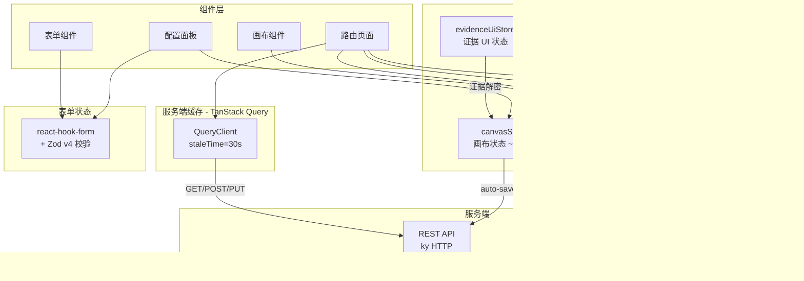

# 状态管理

Studio 采用分层状态管理策略：Zustand 管理客户端全局状态，TanStack Query 管理服务端缓存，react-hook-form 管理表单状态。

## 架构总览



## Zustand Stores

Studio 使用 **4 个 Zustand Store**，均配置 `immer` + `devtools` + `subscribeWithSelector` 中间件：

### canvasStore（~535 行）

画布核心状态，管理节点、连线、视口、选中态。

| 状态             | 类型             | 说明                      |
| ---------------- | ---------------- | ------------------------- |
| `nodes`          | `Node[]`         | ReactFlow 节点数组        |
| `edges`          | `Edge[]`         | ReactFlow 连线数组        |
| `selectedNodeId` | `string \| null` | 当前选中节点              |
| `viewport`       | `Viewport`       | 画布视口 `{ x, y, zoom }` |
| `isDirty`        | `boolean`        | 未保存修改标记            |

**自动保存机制**：`subscribe()` 监听 → 2 秒 debounce → `PUT /workflow-versions/:id`

详见 [画布编辑器 — CanvasStore](./canvas#canvasstore)。

### executionStore

工作流执行状态追踪，与 Socket.IO `/execution` namespace 联动。

| 状态         | 说明                                   |
| ------------ | -------------------------------------- |
| 当前执行 ID  | 活跃执行标识                           |
| 节点执行状态 | 每个节点的 running/success/failed 状态 |
| 执行日志     | 实时日志流                             |
| 进度信息     | 总步数与已完成步数                     |

**执行触发流程**：

```text
VersionToolbar [Run]
  → useStartExecution hook
  → POST /workflow-definitions/:id/run
  → executionStore.initExecution(id)
  → Socket.IO 订阅 execution:subscribe
  → 实时接收 execution.node.* / execution.status.changed 事件
```

### evidenceUiStore

执行证据的 UI 展示状态（解密结果缓存、展开/折叠态）。与 E2EE 解密流程协作：IndexedDB 私钥 → 导入 non-extractable CryptoKey → 解密证据。

### notificationStore

全局通知管理，与 Socket.IO `/notification` namespace 联动。维护未读数、通知列表和实时推送。

## TanStack Query

服务端数据缓存层，全局配置：

| 配置                   | 值      | 说明             |
| ---------------------- | ------- | ---------------- |
| `staleTime`            | 30 秒   | 数据新鲜期       |
| `retry`                | 1       | 失败重试次数     |
| `refetchOnWindowFocus` | `false` | 禁用焦点自动刷新 |

### 典型使用模式

```typescript
// 查询工作流列表
const { data } = useQuery({
  queryKey: ["workflows"],
  queryFn: () => api.get("workflow-definitions").json(),
});

// 突变 + 缓存失效
const mutation = useMutation({
  mutationFn: (data) => api.post("workflow-definitions", { json: data }).json(),
  onSuccess: () => queryClient.invalidateQueries({ queryKey: ["workflows"] }),
});
```

## HTTP 客户端 — ky

Studio 使用 [ky](https://github.com/sindresorhus/ky) 作为 HTTP 客户端（非 axios / 原生 fetch），配置全局 hook 实现自动大小写转换：

| Hook            | 方向          | 转换                   |
| --------------- | ------------- | ---------------------- |
| `beforeRequest` | 请求 → 服务端 | camelCase → snake_case |
| `afterResponse` | 服务端 → 前端 | snake_case → camelCase |

::: warning 大小写约定
Studio 内部使用 **camelCase**，Server API 使用 **snake_case**。ky 全局 hook 透明处理转换，开发时无需手动转换。
:::

## 表单管理

配置面板和设置页使用 **react-hook-form** + **Zod v4** 组合：

- **react-hook-form** — 非受控表单性能优化，减少重渲染
- **Zod v4** — 运行时 schema 校验，与 TypeScript 类型推导协同

```typescript
const schema = z.object({
  name: z.string().min(1, "名称必填"),
  temperature: z.number().min(0).max(2),
});

const form = useForm({
  resolver: zodResolver(schema),
  defaultValues: { name: "", temperature: 0.7 },
});
```

## Socket.IO 实时通信

Studio 连接 3 个 Socket.IO namespace：

### `/execution` — 执行追踪

最核心的实时通道，使用 typed `ExecutionEvent<T>` 信封（含 monotonic `eventId`）：

- **订阅**: `execution:subscribe` / `execution:unsubscribe` + ACK
- **事件**: `execution.node.started` / `.completed` / `.failed` + `execution.status.changed`
- **断线重连**: 支持 `lastEventId` 增量回放，5 秒初始间隔，最大 30 秒
- **背压保护**: Gateway 端 500 cap 队列 + 100ms drain interval

### `/notification` — 通知推送

实时推送 `completed` / `failed` / `intervention_required` 通知。

### `/knowledge` — 知识库

知识库操作实时反馈（隐式契约）。

## 样式系统

| 技术            | 说明                                   |
| --------------- | -------------------------------------- |
| Tailwind CSS v4 | dark-only 主题，无 light mode          |
| Radix UI        | 无障碍原语组件                         |
| CVA             | Class Variance Authority，组件变体管理 |
| `cn()`          | `clsx` + `tailwind-merge` 工具函数     |

共享 UI 组件位于 `shared/ui/`，包含 8 个基础组件。详见 [Studio 概述 — 共享 UI 层](./#共享-ui-层)。

## 相关文档

- [画布编辑器](./canvas) — canvasStore 详细状态与 Action
- [功能模块](./features) — 各 feature 的具体状态使用
- [WASM 集成](./wasm) — TypeEngine 与 canvasStore 的协作
