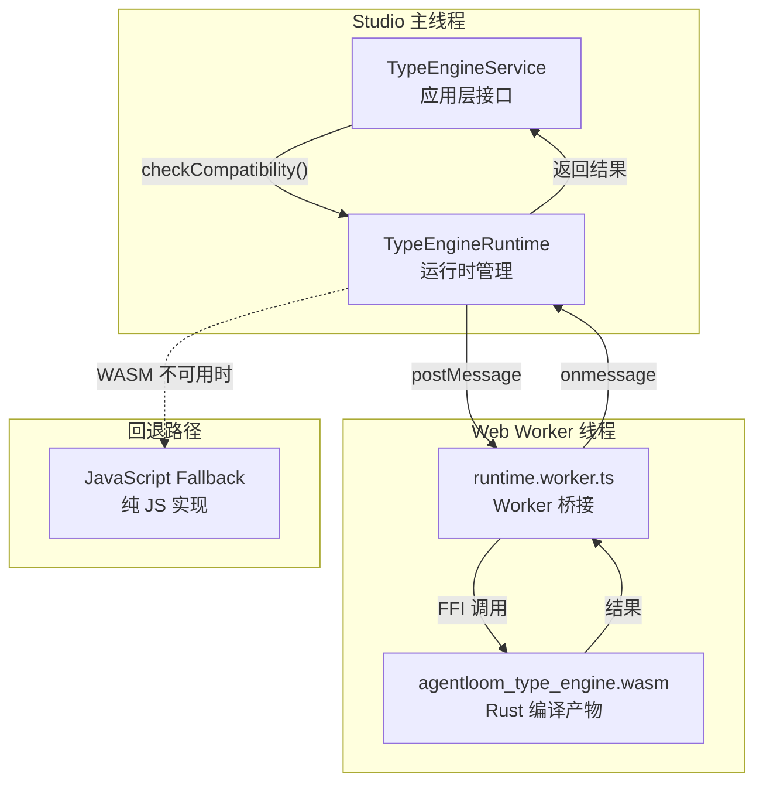
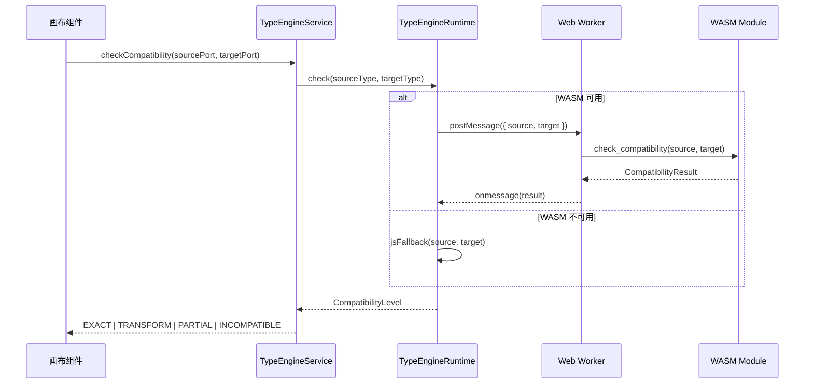

# WASM 集成

Studio 通过 Web Worker + WASM 实现高性能的端口类型兼容性检查，并提供 JavaScript 回退保证可用性。

## 三层架构

端口兼容性检查采用 **Service → Runtime → Worker → WASM** 四层架构：



### 各层职责

| 层级                  | 文件                         | 职责                                       |
| --------------------- | ---------------------------- | ------------------------------------------ |
| **TypeEngineService** | `type-engine.service.ts`     | 应用层 API，供画布组件调用                 |
| **TypeEngineRuntime** | `type-engine.runtime.ts`     | 管理 Worker 生命周期、消息序列化、超时控制 |
| **Worker**            | `runtime.worker.ts`          | Web Worker 桥接层，加载和调用 WASM         |
| **WASM**              | `agentloom_type_engine.wasm` | Rust 编译的类型检查引擎                    |

## WASM 加载

Vite 配置允许 WASM 作为 sibling asset 加载（非 inline）：

```typescript
// vite.config.ts
{
  optimizeDeps: {
    exclude: ['agentloom-type-engine']
  },
  worker: {
    format: 'es'
  }
}
```

WASM 二进制产物位于 `agentloom-type-engine/pkg/`，已提交到仓库。

## JavaScript 回退

当 WASM 不可用时（浏览器不支持 / 加载失败），TypeEngineRuntime 自动降级到纯 JavaScript 实现：

| 场景          | 行为                         |
| ------------- | ---------------------------- |
| WASM 加载成功 | 使用 WASM 执行兼容性检查     |
| WASM 加载失败 | 自动回退到 JS 实现，功能等价 |
| Worker 不可用 | 直接在主线程使用 JS 实现     |

::: tip 性能差异
WASM 实现在大量端口检查场景下性能显著优于 JS 回退，但对于常规工作流（< 50 节点）差异不明显。
:::

## 兼容性检查流程



### 兼容性等级

| 等级           | 含义         | 可视化       |
| -------------- | ------------ | ------------ |
| `EXACT`        | 类型完全匹配 | 默认连线样式 |
| `TRANSFORM`    | 需要隐式转换 | 提示标记     |
| `PARTIAL`      | 部分兼容     | 提示标记     |
| `INCOMPATIBLE` | 不可连接     | 红色错误     |

10 种端口数据类型（`model` / `text` / `json` / `image` / `audio` / `tool` / `sandbox` / `knowledge` / `skill` / `agent`）的完整兼容性矩阵详见 [类型引擎 — 架构与兼容性规则](/zh/type-engine/architecture)。

## 与画布的协作

1. **拖拽连线时** — `CompatibilityPreviewOverlay` 调用 TypeEngineService 实时检查，高亮可连接端口
2. **连线创建后** — canvasStore 的 `addEdge()` 触发最终兼容性校验
3. **节点配置变更时** — 端口类型变化触发关联连线重新检查

## 相关文档

- [类型引擎](/zh/type-engine/) — Rust WASM 端口兼容性检查器
- [端口数据类型与架构](/zh/type-engine/architecture) — 10 种 canonical 类型定义与兼容性矩阵
- [WASM API 参考](/zh/type-engine/api) — 导出函数签名与调用示例
- [画布编辑器](./canvas) — 端口与连线的视觉交互
