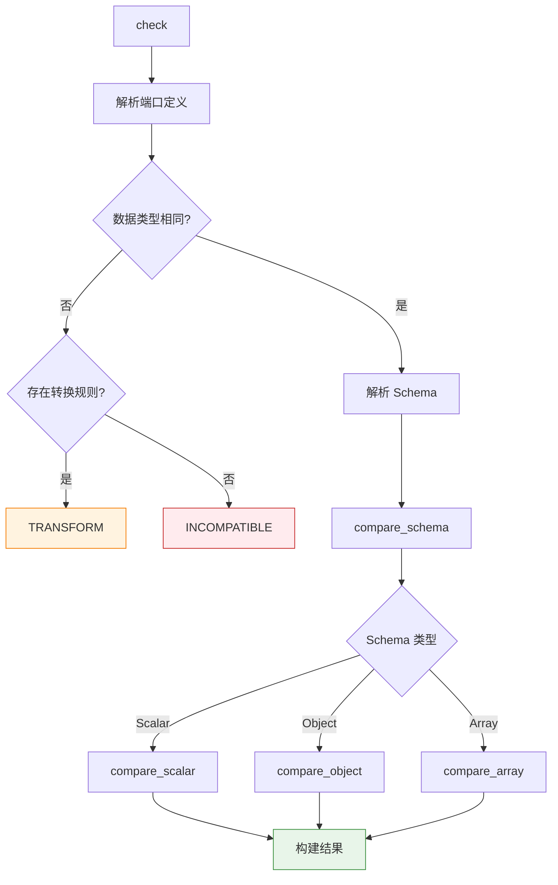

# 架构与兼容性规则

本文档详解类型引擎的内部架构、兼容性判定算法和 9×9 端口兼容矩阵。

## 整体架构

类型引擎的核心检查器位于 `src/checker/compatibility.rs`（约 563 行），采用递归比较策略：



## 四级兼容性

类型引擎的兼容性判定结果分为四个级别（从高到低）：

| 级别         | 标识           | 含义                             | 画布表现               |
| ------------ | -------------- | -------------------------------- | ---------------------- |
| **完全兼容** | `EXACT`        | 类型和 Schema 完全匹配           | 绿色连线，直接连接     |
| **可转换**   | `TRANSFORM`    | 类型不同但存在已知转换规则       | 橙色连线，提示转换     |
| **部分兼容** | `PARTIAL`      | 部分字段匹配，存在缺失或候选映射 | 黄色连线，显示映射建议 |
| **不兼容**   | `INCOMPATIBLE` | 无法连接                         | 红色，禁止连线         |

### 判定优先级

```text
EXACT > TRANSFORM > PARTIAL > INCOMPATIBLE
```

当多种判定同时适用时，取最高优先级的结果。

## 端口数据类型（PortDataType）

9 种规范端口数据类型在 Rust 中定义为枚举：

```rust
// 简化示意，非完整源码
enum PortDataType {
    Model, Text, Json, Image, Audio, Tool, Sandbox, Knowledge, Skill
}
```

序列化时统一使用小写标识：`model`、`text`、`json`、`image`、`audio`、`tool`、`sandbox`、`knowledge`、`skill`。

## 9×9 兼容矩阵

下表展示了所有端口数据类型对之间的 **基础兼容性**（不考虑 Schema 级比较）：

| 源 ↓ \ 目标 → |  model   |     text     |     json     |  image   |  audio   |   tool   | sandbox  | knowledge |  skill   |
| :-----------: | :------: | :----------: | :----------: | :------: | :------: | :------: | :------: | :-------: | :------: |
|   **model**   | ✅ EXACT |      ❌      |      ❌      |    ❌    |    ❌    |    ❌    |    ❌    |    ❌     |    ❌    |
|   **text**    |    ❌    |   ✅ EXACT   | 🔄 TRANSFORM |    ❌    |    ❌    |    ❌    |    ❌    |    ❌     |    ❌    |
|   **json**    |    ❌    | 🔄 TRANSFORM |   ✅ EXACT   |    ❌    |    ❌    |    ❌    |    ❌    |    ❌     |    ❌    |
|   **image**   |    ❌    |      ❌      |      ❌      | ✅ EXACT |    ❌    |    ❌    |    ❌    |    ❌     |    ❌    |
|   **audio**   |    ❌    |      ❌      |      ❌      |    ❌    | ✅ EXACT |    ❌    |    ❌    |    ❌     |    ❌    |
|   **tool**    |    ❌    |      ❌      |      ❌      |    ❌    |    ❌    | ✅ EXACT |    ❌    |    ❌     |    ❌    |
|  **sandbox**  |    ❌    |      ❌      |      ❌      |    ❌    |    ❌    |    ❌    | ✅ EXACT |    ❌     |    ❌    |
| **knowledge** |    ❌    |      ❌      |      ❌      |    ❌    |    ❌    |    ❌    |    ❌    | ✅ EXACT  |    ❌    |
|   **skill**   |    ❌    |      ❌      |      ❌      |    ❌    |    ❌    |    ❌    |    ❌    |    ❌     | ✅ EXACT |

**图例：**

- ✅ **EXACT** — 类型完全匹配，直接连接
- 🔄 **TRANSFORM** — 需要内置转换（`text↔json`）
- ❌ **INCOMPATIBLE** — 不可连接

::: info 关于转换规则
当前引擎内置 **2 条转换规则**：

- `text → json`：`parse_json` — 将文本解析为 JSON 结构
- `json → text`：`stringify_json` — 将 JSON 序列化为文本

转换规则是可扩展的，未来可按需添加更多跨类型转换。
:::

::: tip 同类型 Schema 级比较
当两个端口数据类型相同（对角线上的 EXACT），引擎会进一步进行 Schema 级兼容性比较。此时结果可能降级为 PARTIAL 或 INCOMPATIBLE。详见下文 Schema 比较章节。
:::

## TypeSchema 系统

当两个端口的基础类型相同时，引擎进入 Schema 级比较。TypeSchema 是一个三变体递归结构：

### Scalar（标量）

```typescript
interface ScalarTypeSchema {
  kind: "model" | "text" | "image" | "audio" | "tool" | "sandbox" | "knowledge" | "skill";
  format?: string;
  examples?: string[];
  title?: string;
  description?: string;
  nullable?: boolean;
}
```

::: warning 约束
Scalar 的 `kind` **不能**为 `json`。`json` 类型必须使用 Object 或 Array Schema。
:::

### Object（对象）

```typescript
interface ObjectTypeSchema {
  kind: "json"; // 必须为 json
  shape: "object"; // 形状标识符
  properties: Record<string, TypeSchema>;
  required?: string[];
  additionalProperties?: boolean;
  title?: string;
  description?: string;
  nullable?: boolean;
}
```

### Array（数组）

```typescript
interface ArrayTypeSchema {
  kind: "json"; // 必须为 json
  shape: "array"; // 形状标识符
  items: TypeSchema; // 元素 Schema（递归）
  minItems?: number;
  maxItems?: number;
  title?: string;
  description?: string;
  nullable?: boolean;
}
```

### Schema 序列化

Schema 使用 `shape` 字段作为判别符（discriminator）：

- 无 `shape` 字段 → Scalar
- `shape: "object"` → Object
- `shape: "array"` → Array

## Schema 比较算法

### Scalar 比较

直接比较 `kind` 值：

- 相同 → `EXACT`
- 不同 → 检查转换规则 → `TRANSFORM` 或 `INCOMPATIBLE`

### Object 比较

遍历目标 Schema 的每个 `properties` 字段，在源 Schema 中查找匹配：

1. **精确匹配**：字段名完全相同，递归比较子 Schema
2. **缺失字段**：记录到 `missing_fields`
3. **候选映射**：对未匹配字段进行相似度计算（`field_similarity()`），生成映射建议

**相似度阈值：**

- `≥ 0.55` — 纳入候选列表
- `≥ 0.85` — 自动推荐映射
- 每个字段最多 **6** 个候选

**结果判定：**

- 全部匹配 + 无缺失 → `EXACT`
- 部分匹配 → `PARTIAL`（附带 `matchedRatio`、候选映射等元数据）
- 全部缺失 → `INCOMPATIBLE`

### Array 比较

1. 验证基数约束（`minItems` / `maxItems`）
2. 递归比较 `items` 子 Schema

## Schema 校验规则

Schema 校验器（`SchemaValidator`，默认最大深度 12 层）执行以下检查：

| 规则                               | 说明                                     |
| ---------------------------------- | ---------------------------------------- |
| Scalar 不能使用 `json` kind        | `json` 类型必须具有 Object 或 Array 形状 |
| Object/Array 必须使用 `json` kind  | 只有 `json` 类型支持结构化形状           |
| required 字段必须存在于 properties | 不允许引用不存在的属性名                 |
| minItems ≤ maxItems                | 数组基数约束不能矛盾                     |
| 递���深度 ≤ 12                     | 防止无限递归                             |

校验返回 `ValidationResult`，包含 `valid` 布尔值和 `errors` 错误列表。

## 错误处理

WASM 层统一使用 `WasmError` 结构，映射为 JavaScript 的 `TypeEngineError`：

```typescript
class TypeEngineError extends Error {
  name: "TypeEngineError";
  code: string; // 错误码
  context?: unknown; // 上下文信息
}
```

## 下一步

- [WASM API 参考](./api) — 查看导出函数的详细签名和调用示例
- [构建指南](./build) — 了解如何构建和测试类型引擎
