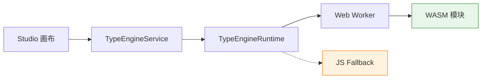

# 类型引擎

AgentLoom 类型引擎（Type Engine）是一个基于 **Rust + WebAssembly** 的端口兼容性检查器。它负责在工作流画布中实时判断两个节点端口之间能否连接，以及连接时需要怎样的数据转换。

## 为什么选择 Rust WASM？

工作流画布中，用户拖拽连线时需要 **亚毫秒级** 的兼容性判断反馈。传统的 JavaScript 实现在复杂 Schema 递归比较场景下存在性能瓶颈。Rust 编译为 WASM 带来了以下优势：

| 特性         | Rust WASM                        | 纯 JavaScript            |
| ------------ | -------------------------------- | ------------------------ |
| **性能**     | 编译优化，递归比较接近原生速度   | 解释执行，深层递归较慢   |
| **类型安全** | 编译期保证，零运行时错误         | 运行时检查，易出边界错误 |
| **内存管理** | 零成本抽象，无 GC 暂停           | GC 管理，存在暂停风险    |
| **包体积**   | LTO + `opt-level = "z"` 极致压缩 | 无法做到同等优化         |
| **确定性**   | 跨平台结果一致                   | 浮点精度等差异           |

## Studio 集成架构

类型引擎通过 Web Worker 与 Studio 画布集成，避免阻塞主线程：

**集成链路：**

1. **TypeEngineService** — 业务层入口，提供 `checkPortCompatibility()` 等方法
2. **TypeEngineRuntime** — 运行时抽象层，管理 WASM 加载与降级策略
3. **Web Worker** — 在独立线程中运行 WASM，保证画布交互不卡顿
4. **JS Fallback** — 当 WASM 不可用时（如旧浏览器），自动降级为 JavaScript 实现

::: tip 降级策略
Studio 在初始化时尝试加载 WASM 模块。若加载失败（环境不支持、网络问题等），自动启用 JavaScript 受控降级（Controlled Fallback），功能一致但性能略低。
:::

## 核心能力

类型引擎提供三大核心能力：

### 端口类型兼容性检查

判断源端口和目标端口的数据类型是否兼容，返回四级兼容性结果（EXACT / TRANSFORM / PARTIAL / INCOMPATIBLE）。

详见 → [架构与兼容性规则](./architecture)

### Schema 级兼容性检查

当两个端口的基础类型相同（如都是 `json`）时，进一步比较它们�� Schema 结构（对象属性、数组元素等），给出更精细的兼容性判断。

详见 → [WASM API](./api)

### Schema 校验

验证用户输入的 TypeSchema 是否合法（深度限制、类型约束、属性完整性等）。

详见 → [WASM API](./api)

## 8 种端口数据类型

AgentLoom 工作流定义了 **8 种规范端口数据类型**（PortDataType）：

| 类型          | 标识        | 说明             |
| ------------- | ----------- | ---------------- |
| **Model**     | `model`     | LLM 模型引用     |
| **Text**      | `text`      | 纯文本字符串     |
| **JSON**      | `json`      | 结构化 JSON 数据 |
| **Image**     | `image`     | 图像数据         |
| **Audio**     | `audio`     | 音频数据         |
| **Tool**      | `tool`      | 工具/函数调用    |
| **Sandbox**   | `sandbox`   | 沙箱环境引用     |
| **Knowledge** | `knowledge` | 知识库引用       |

这 8 种类型在 Rust 引擎、Studio 前端和 Server 后端之间保持统一。Studio 的 `mcpToolMapping` 对 legacy `number` / `boolean` 类型提供 `→ json` 回退兼容。

## 下一步

- [架构与兼容性规则](./architecture) — 了解 4 级兼容性判定逻辑和 8×8 兼容矩阵
- [WASM API 参考](./api) — 查看 3 个导出函数的 TypeScript 签名和调用示例
- [构建指南](./build) — 了解如何构建、测试和发布 WASM 产物
