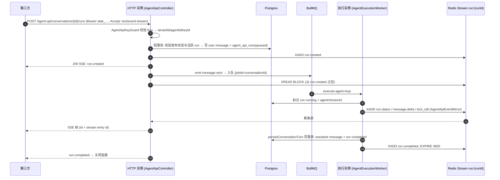

# Agent 对外 API 设计方案

- 状态：草案，待评审
- 契约：[`agent-external-api.openapi.yaml`](./agent-external-api.openapi.yaml)（OpenAPI 3.1；`redocly lint` 通过，`prism mock` 已跑过下文列出的请求）
- 已定决策：Agent 专用 API Key；先做原生 REST，OpenAI 兼容放到二期；平台 Token scopes 未校验的问题另开修复，不在本方案内

## 1. 背景：现状事实

| # | 事实 | 证据 |
|---|---|---|
| F1 | `X-Api-Key` 走 `PlatformApiTokenService.validateToken`，Guard 以 Token 创建者的 `userId/tenantId/tenantRole` 身份放行，`scopes` 存了但从未校验 | `agentloom-server/src/common/guards/auth.guard.ts:178-198`、`platform-api-token.service.ts:159-212` |
| F2 | `platform_api_tokens.user_id` 外键 `ON DELETE CASCADE`，表上没有 RLS | `database/schema/platform-api-tokens.schema.ts` |
| F3 | `sendMessage` 只写入用户消息并发出 `agent-conversation.message-sent`，回复由 BullMQ `agent-conversation-execution` 队列（`jobId=conversationId`）异步生成 | `agent-conversation.service.ts:510-534`、`agent-execution/agent-execution.service.ts:22-38,70-84,264-291` |
| F4 | `/agent-conversation` Socket.IO 握手只做 `jwt.verify` | `agent-execution/agent-conversation.gateway.ts:139-160` |
| F5 | server 和 worker 用同一镜像、同一 `main.js`，任一进程都可能执行对话 job；EventEmitter2、EventBridge 的事件计数器与 500 条环形缓冲、`activeRuns` 都只在进程内；唯一跨进程的扇出通道是 Socket.IO Redis adapter | `agentloom-deploy/docker-compose.yml:164-194`、`execution/services/event-bridge.service.ts:53-58,529-590`、`main.ts:38-47` |
| F6 | 对话事件不落库，断线回放靠内存缓冲，缓冲缺口时退化为 DB 快照 | `agent-conversation.gateway.ts:769-858` |
| F7 | 对话 job 内部可以合并处理多条待处理用户消息，每轮只写一条 assistant 消息，并记录 `lastProcessedMessageId` | `agent-execution-worker-persistence.service.ts:212-300`、`agent-execution-worker-runtime.service.ts:680-709` |
| F8 | 执行时：有 `publishedVersionId` 就用已发布快照，否则回退到实时草稿画布；创建对话时不检查发布状态 | `agent-execution-worker-runtime.service.ts:236-320`、`agent-conversation.service.ts:88-101` |
| F9 | `agent_conversations.created_by` 为 NOT NULL，外键 `ON DELETE CASCADE`；没有 source/channel/api key 列 | `database/schema/agent-conversations.schema.ts:62-64` |
| F10 | 对话列表只按 agentId 过滤，同租户 viewer 以上可以看到所有人的对话 | `agent-conversation.service.ts:279-341` |
| F11 | 工具审批：no_sandbox 下只有自进化写工具需要人工确认（30s 超时自动拒绝）；sandbox 对话不下发 `permissionCallbackUrl`，等于没有审批门 | `agent/pi-agent-core.adapter.ts:1010-1145`、`sandbox-session-runtime.service.ts:130-147` |
| F12 | HTTP 取消只把对话状态改为 `ended`，跨实例时不会中止正在执行的轮次 | `agent-conversation.service.ts:537-560`、`agent-execution.service.ts:114-131` |
| F13 | 节流按租户计数（`tenant:<id>`，默认 100 次/分钟）；对话执行不经过 `ResourceGovernanceService` | `common/guards/custom-throttler.guard.ts:218-225`、`app.module.ts:69-76` |
| F14 | `TenantTransactionInterceptor` 把整个 handler 包在一个租户事务里（`request.user.tenantId` 不存在时直接放行） | `common/interceptors/tenant-transaction.interceptor.ts:25-29` |
| F15 | 服务端没有任何 SSE；nginx `/api/` 已经关闭缓冲，超时 300s | `agentloom-deploy/nginx.conf:59-78` |
| F16 | 节流器抛出的 429 被统一映射成 `errors/http-error`；Studio、mobile、contracts 都不按这个 type 分支 | `common/filters/all-exceptions.filter.ts:82` |
| F17 | 执行链路里拿不到 token 用量（usage） | 在 agent-execution 和 contracts 中 grep `usage` 无结果 |

## 2. 需求（每条都可以判定真假）

- **R1**：Owner/Admin 能为某个 Agent 创建 API Key，明文只在创建响应里出现一次；吊销之后，用该 Key 发起的任何请求在 1 秒内返回 401 `agent-api-key-invalid`。
- **R2**：Key A 绑定 Agent X 时，用 Key A 访问 Agent Y 的对话、或访问 Key B 创建的对话，一律返回 404。
- **R3**：Key 的权限仅限于第 7 节列出的对外接口。用它调用任何 `/api/v1/**` 管理接口都返回 401（global AuthGuard 不认 `alak_` 前缀）。
- **R4**：创建 Key 的用户被删除后，Key 和它创建的对话、run 照常可用。
- **R5**：Agent 不是 `published` 状态时，创建对话和创建 run 都返回 409 `agent-not-published`；run 使用当时的已发布版本，并把版本号记录在 `run.agentVersionId`。
- **R6**：`POST …/runs` 在 `Accept: text/event-stream` 时返回 SSE。即使 run 被另一个进程执行，也能收到 `message.delta` 和终态事件，每个 delta 只收到一次。
- **R7**：SSE 断开后，带 `Last-Event-ID` 调用 `GET …/events`，能从断点继续，不重复也不丢事件；run 终态 1 小时后返回 410。
- **R8**：带 `Prefer: wait=N` 时，run 在 N 秒内结束就返回 200 和终态 run，否则返回 202，`Location` 指向该 run。
- **R9**：同一对话已有 queued/running 的 run 时，再创建 run 返回 409 `conversation-busy`，响应带 `activeRunId`。
- **R10**：`POST …/cancel` 发到任意实例，执行中的轮次都会在 5 秒内中止，run 变为 `cancelled`。
- **R11**：执行进程崩溃后，遗留的 run 最迟 2 小时内变为 `failed`，`error.type=run-worker-lost`。
- **R12**：单 Key 每分钟请求数超过 `rate_limit_per_minute`，或并发 run 数超过 `max_concurrent_runs`，返回 429 和 `Retry-After`，type 分别是 `rate-limit-exceeded`、`concurrency-limit-exceeded`；租户日配额依旧生效。
- **R13**：API 来源的对话里不注册自进化工具，因此不会出现需要人工审批的工具调用。
- **R14**：Studio 能在 Agent 详情页管理 Key；在 Studio 对话列表里，API 来源的对话带 `source=api` 标识，并能按来源筛选。

## 3. 非目标（本轮不做）

- OpenAI 兼容层（Responses 或 Chat Completions）：二期做，见第 12 节。
- 平台 Token scopes 的校验：单独开修复。
- token 用量与计费：执行链路里还没有 usage（F17），要先补 runtime 层。
- 通过 API 做人工工具审批（`requires_action` 状态）：R13 已经从根上消除了审批需求。
- Socket.IO 支持 API Key（F4 保持不变），第三方统一走 SSE。
- 把 thinking、沙箱终端输出、文件变更作为对外事件。
- 让 Key 固定某个历史版本。v1 始终跑当前已发布版本，版本漂移刷新沿用现有逻辑。
- mobile 端改动。

## 4. 关键决策与被否决的方案

| 决策 | 选择 | 被否决的方案及原因 |
|---|---|---|
| 凭证 | 新表 `agent_api_keys`，一个 Key 绑一个 Agent，以服务身份调用 | **给平台 Token 加 scope**：Token 以个人身份运行，用户被删除后 Token 和对话会级联消失（F2、F9）；改 scope 语义还会影响所有现有 Token。 |
| 认证入口 | 对外 controller 标记 `@Public()`，再用专用的 `AgentApiKeyGuard`，Header 用 `Authorization: Bearer alak_…` | **复用 global AuthGuard 的 X-Api-Key 分支**：global AuthGuard 会把调用方识别成用户，并接入 RolesGuard，等于把 Key 变成万能凭证，违反 R3。用 Bearer 头是为了二期 OpenAI SDK 能直接用。 |
| 跨进程事件 | 每个 run 一条 Redis Stream（`XADD`/`XREAD BLOCK`），由执行进程写入 | **Redis pub/sub**：不能断点续传，满足不了 R7。**Postgres 事件表**：每个 delta 都要写库，压力太大。**进程内 Socket.IO 自连**：绕路，还要伪造 JWT。 |
| 一次调用的建模 | 新表 `agent_api_runs`：一条用户消息对应一个 run，同一对话同时只允许一个活跃 run | **直接复用 message**：worker 会合并多条用户消息处理（F7），没有 run 实体就无法回答“这次调用的结果是什么”。 |
| 同步语义 | 默认 202 加轮询；`Prefer: wait` 最长等 60s；SSE 用于流式 | **纯同步阻塞**：沙箱一轮可能跑好几分钟（单次 prompt 超时 1h），超过 nginx 的 300s，客户端分不清超时和失败。 |
| 数据库事务 | 对外接口不走 `TenantTransactionInterceptor`，service 内用 `runInTenantTransaction` 包短事务 | **沿用全局拦截器**：SSE 或 wait 请求会持有数据库事务长达数分钟（F14），耗尽连接池。 |
| 人工审批 | API 对话不注册自进化工具 | **把审批暴露给第三方**：需要新增状态机，还要求调用方能处理平台内部工具，超出本轮范围。 |
| 分页 | 沿用仓库的 `page/pageSize` 加 `meta.total` | **cursor 分页**：仓库里没有先例（server DTO 中 grep `cursor` 无结果），会形成第二套约定。消息按正序追加，offset 是稳定的；对话列表倒序翻页时可能重复，契约中已注明。 |

## 5. 架构

### 5.1 模块划分

新建模块 `agentloom-server/src/modules/agent-api/`，按域分文件：

| 文件 | 职责 |
|---|---|
| `agent-api-key.controller.ts` / `.service.ts` | Studio 侧管理接口：创建、列出、吊销 Key（JWT、`@Roles`） |
| `agent-api-key.guard.ts` | 解析 `Bearer alak_`，用 `globalDb` 按 hash 查找，并校验吊销、过期、Agent 归档状态；把 `{keyId, tenantId, agentDefinitionId, keyPrefix, maxConcurrentRuns}` 挂到 `request.agentApiKey`，**不设置** `request.user` |
| `agent-api.controller.ts` / `.service.ts` | 对外接口（第 7 节） |
| `agent-api-run.service.ts` | run 状态机：创建、标记 running、终态、过期清扫 |
| `agent-api-event-stream.service.ts` | Redis Stream 的读写、SSE 帧编码、心跳 |
| `agent-api-event-mirror.listener.ts` | 在执行进程内用 `@OnEvent` 订阅 `ExecutionEventName.OUTPUT_CHUNK`、`NODE_TOOL_CALL_STATUS` 和 `'execution.status.changed'`，只把本进程登记过的 API run 对应的事件映射成对外事件并 `XADD` |
| `dto/*.dto.ts` | Zod schema 加 `createZodDto`；对外事件 schema 放在 contracts |

### 5.2 run 与执行链路的衔接（改动现有代码的地方）

1. **标记 running**：worker 拿到待处理消息之后、开始运行轮次之前，`AgentApiRunService.markRunning(pendingMessageIds, publishedVersionId)` 执行 `UPDATE … WHERE user_message_id = ANY($1) AND status='queued' RETURNING id`。返回非空时，就在进程内登记 `conversationId → runId`，供 mirror 过滤事件。
2. **终态**：在 `persistConversationTurn` 的同一个事务里，按 `user_message_id = ANY(pendingIds)` 把 run 更新为 `completed`，同时写入 `assistant_message_id` 和 `stop_reason`。失败路径（`worker:1323-1432`）更新为 `failed` 并写入部分输出；`stopReason==='cancelled'` 更新为 `cancelled`。事务提交后再 `XADD` 终态事件并 `EXPIRE 3600`。
3. **崩溃兜底**：`@OnWorkerEvent('failed')`（`worker:997`）把该对话的活跃 run 标记为 `failed`。另外用 BullMQ repeatable job 每 5 分钟清扫一次：`running/queued` 状态且 `created_at < now() - 2h` 的 run 标记为 `failed/run-worker-lost`。2h 大于沙箱单次 prompt 超时 1h（`sandbox-session-runtime.service.ts:17`）。同一个清扫任务还会结束 `source='api'`、`status='active'`、`updated_at` 超过 `APP_AGENT_API_CONVERSATION_IDLE_HOURS`（默认 24）的对话，防止第三方遗留的对话一直占着沙箱。
4. **跨实例取消**：`AgentExecutionService.cancelExecution` 增加 Redis pub/sub 频道 `__agent_conversation_cancel__`，做法照搬 `AgentToolPermissionSyncService`（`agent-tool-permission-sync.service.ts:28,115-125`）。各实例收到后中止本地的 `activeRun`。Studio 的 socket 取消路径也会因此获得跨实例能力（F12），属于行为增强，不改契约。
5. **`created_by` 为 null 的消费者**：API 对话的 `created_by` 为 null（见 6.3）。需要处理以下调用点：
   - `agent-conversation.service.ts:68`：`ended` 事件里的 `userId` 改为可空。下游 `workspace-integration.service.ts:438-449` 本来就没用这个参数（`_userId`）。
   - `conversation-title.service.ts:56,202`：API 对话不自动生成标题。
   - `agent-execution-worker-persistence.service.ts:669-720`、`self-evolution.service.ts:485-513`：`source='api'` 时不注册自进化工具（R13）。
   - 其余消费者（memory、workspace 快照）在步骤 0 里清点。

## 6. 数据模型

### 6.1 `agent_api_keys`（新表，tenant RLS）

| 列 | 类型 | 说明 |
|---|---|---|
| id | uuid pk `uuid_generate_v7()` | |
| tenant_id | uuid not null | `createDirectTenantPolicies` |
| agent_definition_id | uuid not null → agent_definitions ON DELETE CASCADE | |
| name | varchar(255) not null | |
| key_hash | varchar(64) not null unique | SHA-256 hex，和平台 Token 一致 |
| key_prefix | varchar(16) not null | `alak_` 加 8 位 hex |
| rate_limit_per_minute | integer null | 为 null 时使用租户的 `apiRateLimitPerMinute` |
| max_concurrent_runs | integer not null default 5 | |
| expires_at / revoked_at / last_used_at | timestamptz null | 吊销是软删除 |
| created_by | uuid null → users ON DELETE SET NULL | 满足 R4 |
| created_at / updated_at | timestamptz not null | |

索引：`(agent_definition_id, revoked_at)`、`key_prefix`。每个 Agent 未吊销的 Key 上限 20 个，超出返回 409 `agent-api-key-limit-exceeded`。

Key 格式：`alak_` 加 `randomBytes(32).hex`，共 69 个字符。它不以 `al_` 开头，所以 global AuthGuard 和节流器现有的平台 Token 分支都不会命中（`custom-throttler.guard.ts:112` 用的是 `startsWith('al_')`）。校验时用 `globalDb` 按 `key_hash` 查找（RLS 生效前还不知道租户），这和 `generated-app.repository.ts:1267-1279` 用公开 token 查找的做法相同。

### 6.2 `agent_api_runs`（新表，tenant RLS）

| 列 | 类型 | 说明 |
|---|---|---|
| id | uuid pk v7 | |
| tenant_id | uuid not null | RLS |
| conversation_id | uuid not null → agent_conversations ON DELETE CASCADE | |
| api_key_id | uuid not null → agent_api_keys | |
| user_message_id | uuid not null unique → agent_messages | |
| assistant_message_id | uuid null → agent_messages | |
| agent_version_id | uuid null | 在 running 时写入 |
| status | enum `agent_api_run_status`: queued/running/completed/failed/cancelled | |
| stop_reason | varchar(32) null | |
| error | jsonb null | `{type,title,detail}` |
| idempotency_key | varchar(255) null | `unique(api_key_id, idempotency_key)`；`request_hash` 存在同表 |
| request_hash | varchar(64) null | 用来判断同一个 key 是否配了不同 body |
| created_at / started_at / completed_at | timestamptz | |

约束：部分唯一索引 `unique(conversation_id) WHERE status IN ('queued','running')`，保证 R9 在并发下也成立：插入冲突映射为 409。幂等记录 24h 后由清扫任务把 `idempotency_key` 置为 null。

### 6.3 `agent_conversations` 增列

- `source` enum `conversation_source`（`studio`|`api`），not null，default `'studio'`
- `api_key_id` uuid null → agent_api_keys
- `external_user_id` varchar(255) null，索引 `(api_key_id, external_user_id, created_at)`
- `created_by` 改为可空，并加 CHECK：`(source='studio' AND created_by IS NOT NULL) OR (source='api' AND api_key_id IS NOT NULL)`

迁移是纯增量：已有的行全部是 `studio`，并且都满足 CHECK。

## 7. 对外接口

完整契约见 OpenAPI。基础路径为 `/api/v1`，对外接口全部使用 camelCase。

| 方法 & 路径 | 成功 | 主要失败 |
|---|---|---|
| `GET /agent-api/agent` | 200 | 401, 429 |
| `POST /agent-api/conversations` | 201 + Location | 401, 409 agent-not-published/agent-archived, 422, 429 |
| `GET /agent-api/conversations` | 200（仅本 Key 的对话；可按 externalUserId、status 筛选） | 401, 429 |
| `GET /agent-api/conversations/{id}` | 200 | 401, 404, 429 |
| `POST /agent-api/conversations/{id}/end` | 200（幂等） | 401, 404, 429 |
| `GET /agent-api/conversations/{id}/messages` | 200（只返回 user/assistant，附件只返回元数据） | 401, 404, 429 |
| `POST /agent-api/conversations/{id}/runs` | 200 SSE / 200 wait 命中 / 202 + Location + Retry-After | 401, 404, 409 conversation-busy/conversation-ended/agent-not-published, 422, 429, 503 sandbox-maintenance |
| `GET /agent-api/conversations/{id}/runs` | 200 | 401, 404, 429 |
| `GET /agent-api/conversations/{id}/runs/{runId}` | 200（未结束时带 Retry-After） | 401, 404, 429 |
| `POST /agent-api/conversations/{id}/runs/{runId}/cancel` | 202（幂等） | 401, 404, 409 run-not-cancellable, 429 |
| `GET /agent-api/conversations/{id}/runs/{runId}/events` | 200 SSE（支持 Last-Event-ID） | 401, 404, 410 run-events-expired, 429 |

管理接口（Studio、JWT）：`POST|GET /agent-definitions/{agentId}/api-keys`、`DELETE /agent-definitions/{agentId}/api-keys/{keyId}`。请求体用 snake_case，沿用 platform-api-tokens 的约定，因为 Studio 的 ky hook 会做转换。

### 7.1 SSE 帧

- `id`：Redis Stream entry id，跨实例单调递增。
- `event`：`run.created`、`run.status`、`message.delta`、`tool_call`、`run.completed`、`run.failed`、`run.cancelled`。
- `data`：JSON 格式，schema 统一放在 `agentloom-contracts/src/agent-api-events.ts`，OpenAPI 的 `RunStreamEvent` 与之对应。
- 每 15 秒发一次 `: ping` 心跳，避开 nginx 的 300s 超时。终态事件发出后服务端关闭连接。
- 响应头 `Content-Type: text/event-stream`、`Cache-Control: no-cache`、`X-Accel-Buffering: no`。用 Fastify 的 `reply.hijack()` 写 `reply.raw`；沙箱容器里已有同样写法（`agentloom-deploy/sandbox/src/server.ts:362-372`）。
- 映射规则：`execution.node.output-chunk` 映射为 `message.delta`（`index` 取自 chunk.index）；`execution.node.tool-call-status` 映射为 `tool_call`，**不带 args 和 result**，避免把内部工具参数和结果泄露给第三方，需要时去读消息；`execution.status.changed` 中的 `preparing/running` 映射为 `run.status`，终态事件则由 run 服务在提交事务后写入，不从 status 事件派生，确保终态事件和数据库一致。

### 7.2 错误契约

所有错误都沿用 `DomainException` 和 `AllExceptionsFilter`，输出 RFC 9457 `application/problem+json`。type 前缀为 `https://agentloom.dev/errors/`：

| type | status | 可重试 |
|---|---|---|
| agent-api-key-invalid | 401 | 否 |
| agent-api-conversation-not-found / agent-api-run-not-found | 404 | 否 |
| agent-not-published / agent-archived | 409 | 否 |
| conversation-ended | 409 | 否 |
| conversation-busy（扩展字段 `activeRunId`） | 409 | 等活跃 run 结束后重试 |
| run-not-cancellable | 409 | 否 |
| agent-api-key-limit-exceeded | 409 | 否 |
| idempotency-key-reused | 422 | 否 |
| validation-error | 422 | 否 |
| rate-limit-exceeded / concurrency-limit-exceeded | 429 + Retry-After | 是 |
| run-events-expired | 410 | 否，改为 GET run |
| sandbox-maintenance | 503 + Retry-After | 是 |

`rate-limit-exceeded` 需要改 `CustomThrottlerGuard`，抛出 `DomainException`，不再走通用的 `http-error`。这个改动对所有路由生效，F16 已确认没有客户端按 `http-error` 分支。

### 7.3 限流与并发

- 节流器识别 `Bearer alak_` 后，tracker 记为 `agentkey:<keyPrefix>`，limit 取 `key.rate_limit_per_minute`，为空时取租户的 `apiRateLimitPerMinute`。租户的 `dailyApiCallLimit` 照常计数。Key 查询结果放在进程内缓存，TTL 30s，并订阅吊销事件主动失效，保证满足 R1 的“1 秒内生效”。
- 并发控制：创建 run 时，在同一个短事务里统计该 Key 处于 `queued/running` 的 run 数，达到 `max_concurrent_runs` 就返回 429，`Retry-After: 5`。

### 7.4 审计

Key 的创建和吊销用 `@CaptureAuditLog` 记录（actorType=user）。run 本身就是调用记录，不逐条写 audit_logs。被限流拦截的请求按现有逻辑记为 `actorType='service'`，metadata 里带 `keyPrefix`。

## 8. Studio

- 在 Agent 详情页新增“API 访问”标签页，放 Key 列表、创建对话框（明文只显示一次）、吊销操作、curl 和 SSE 示例。这部分页面必须交给 `designer` agent 实现（仓库约定）。
- 对话列表支持 `source` 筛选，API 来源的对话显示 `API · <keyName>` 徽标（R14）。

## 9. 实施计划

全局约束：命令在对应包目录执行；生成物 `agentloom-api-client/src/models.ts` 只能通过 `pnpm contracts:regen` 再生成；每一步单独做原子提交。

**步骤 0：清点 `created_by` 为 null 时的消费者（探针，先解决风险最大的未知项）**
- 依赖：无。这一步决定步骤 2 和 5 的改动面。
- 内容：用 LSP references 查出 `agentConversations.createdBy`、`agent-conversation.ended` 中 `userId` 以及对话链路里 `actorUserId` 的全部消费者（重点看 memory 和 workspace 快照），把每个调用点的处理方式写回本文档 5.2 第 5 项。
- 验收：本文档 5.2 第 5 项列出全部消费者及其处理方式，不再有“其余”二字。

**步骤 1：在 contracts 中定义对外事件与 run schema**
- 依赖：无（纯 schema）。
- 文件：新建 `agentloom-contracts/src/agent-api-events.ts`，由 `src/index.ts` 导出；fixtures 放在 `fixtures/agent-api/*.json`。
- 产出：`AgentApiRunStatusSchema`、`AgentApiRunSchema`、`AgentApiStreamEventSchema`（按 event 做判别联合，字段与 OpenAPI 的 `RunStreamEvent` 一致）。
- 验收：`pnpm --filter @agentloom/contracts test`，fixtures 用例通过。

**步骤 2：数据库迁移**
- 依赖：步骤 0。
- 文件：新建 `database/schema/agent-api-keys.schema.ts`、`agent-api-runs.schema.ts`；修改 `agent-conversations.schema.ts`、`schema/index.ts`；用 `pnpm db:generate` 生成迁移。
- 验收：`pnpm test:e2e -- agent-api-rls` 通过。新增 e2e 覆盖：跨租户读取返回 0 行；同一对话插入第二个活跃 run 违反部分唯一索引；不满足 CHECK 的插入失败。

**步骤 3：Key 管理与 Guard**
- 依赖：步骤 2。
- 产出：`AgentApiKeyService.create/list/revoke/validate(rawKey)`，`AgentApiKeyGuard`。
- 验收：`pnpm test -- agent-api-key` 通过。覆盖吊销、过期、Agent 已归档、非 `alak_` 前缀、hash 不匹配这几种情况；e2e 中验证用 `alak_` Key 调 `GET /api/v1/agent-definitions` 返回 401（R3）。

**步骤 4：节流器接入**
- 依赖：步骤 3。
- 文件：修改 `common/guards/custom-throttler.guard.ts`。
- 验收：`pnpm test -- custom-throttler` 通过。新增用例：`alak_` 请求的 tracker 为 `agentkey:<prefix>`，limit 取 Key 的配置；超限时返回 `rate-limit-exceeded`。

**步骤 5：处理 `created_by` 为 null 的路径**
- 依赖：步骤 0、2。
- 内容：按步骤 0 的清单修改。`source='api'` 时跳过自进化 provider 和自动标题。
- 验收：`pnpm test -- agent-execution-worker-persistence conversation-title` 通过，新增 `source='api'` 用例。

**步骤 6：run 生命周期接入 worker**
- 依赖：步骤 2、5。
- 文件：修改 `agent-execution.worker.ts`、`agent-execution-worker-persistence.service.ts`；新建 `agent-api-run.service.ts`。
- 验收：`pnpm test -- agent-api-run agent-execution.worker` 通过。覆盖 queued→running→completed、failed（含部分输出）、cancelled、worker 失败事件、清扫过期 run。

**步骤 7：跨实例取消**
- 依赖：无，与步骤 3–6 都不改同一个文件（`agent-execution.service.ts` 只有本步骤会改）。
- 验收：`pnpm test -- agent-execution.service` 通过。新增用例：本地没有 activeRun 时发布到频道；收到频道消息时中止本地 run。

**步骤 8：事件 mirror 与 Redis Stream**
- 依赖：步骤 1、6。
- 验收：`pnpm test -- agent-api-event` 通过。覆盖 output-chunk、tool-call-status、status 三类事件的映射（tool_call 不带 args），以及没有登记的会话不写入。

**步骤 9：对外 controller**
- 依赖：步骤 3、6、7、8。
- 内容：实现第 7 节全部接口；用 `reply.hijack()` 输出 SSE；实现 `Prefer: wait` 和 `Idempotency-Key`；把 `agent-api` 路径加入 `TenantMiddleware` 的 exclude 列表（`app.module.ts:170-186`）。
- 验收：`pnpm test -- agent-api.controller agent-api.service` 通过；随后 `pnpm openapi:export`，用 `npx @redocly/cli@latest lint sdk/openapi.json` 检查导出结果与本草案没有冲突。

**步骤 10：契约再生成**
- 依赖：步骤 9。
- 验收：仓库根目录执行 `pnpm contracts:regen` 成功，`pnpm typecheck:all` 退出码为 0。

**步骤 11：Studio 页面（designer agent）**
- 依赖：步骤 10。
- 验收：在 `agentloom-studio` 中 `pnpm test` 和 `pnpm typecheck` 通过；在浏览器里完成一次创建、复制、吊销的完整操作，并截图。

**步骤 12：端到端冒烟与文档**
- 依赖：步骤 9、11。
- 内容：在双实例的 docker compose 环境（server 加 worker）里用 curl 依次验证 R5–R10：用 SSE 发起 run、断线后带 Last-Event-ID 续传、`Prefer: wait`、并发请求触发 409、跨实例取消。新增 `agentloom-docs/zh/api/agent-api.md` 并加入侧边栏；更新根 `AGENTS.md` 的架构段落。
- 验收：curl 输出与 R5–R10 逐条对得上；在 `agentloom-docs` 中 `pnpm build` 退出码为 0。

**可并行的步骤**：步骤 1 和 7 不依赖其他步骤，可以与步骤 0 → 2 → 3 这条主链并行，它们和主链不改同一个文件。步骤 4 与 5 都只依赖步骤 3 或 2，改动的文件互不重叠，也可以并行。其余步骤按依赖顺序串行。

**回滚点**：步骤 2 的迁移只做加法，`created_by` 改为可空也不影响旧代码读取。在步骤 9 上线前可以随时停下，此时系统行为与现在相同（只是取消变成跨实例生效）。步骤 9 上线后，要关闭对外 API，只需把 controller 从模块里移除，表结构保留。

## 10. 风险与假设

- **A1**：Redis 可用性等同于现有 BullMQ 的要求，不额外引入新依赖。如果 Redis 不可用，队列本身也会瘫痪。受影响的步骤：8、9。
- **A2**：每个 run 的事件量在数千条以内，使用 `XADD MAXLEN ~ 5000`。如果出现超长 run，最早的 delta 会被裁掉，此时续传会落入缺口。处理方式：`GET …/events` 检测到 Last-Event-ID 早于流的起点时，补发一个 `run.status` 和当前 run 快照，客户端可以通过 `GET run` 拿到完整输出。受影响的步骤：8、9。
- **A3**：执行进程登记的 `conversationId → runId` 只存在于进程内。job 天然只在一个进程执行（`jobId=conversationId`），所以这个前提成立。受影响的步骤：6、8。
- **R-1**：创建 run 时 HTTP 实例先 `XADD run.created` 再入队，可能出现 worker 写入的事件 id 比 `run.created` 更早的情况。处理方式：stream 的 key 按 runId 分开；`run.created` 在入队之前写入，入队发生在 XADD 返回之后，因此顺序有保证。
- **R-2**：入队发生在短事务提交之后，无法与写库一起回滚。处理方式：开启事务前先检查 `APP_SANDBOX_MAINTENANCE_MODE`（与 `agent-execution.service.ts:224-226` 用同一个开关），维护中直接返回 503，不写库；如果提交后入队仍然失败，就把 run 标记为 `failed`（`error.type=run-dispatch-failed`）并写入 `run.failed`，不留下停在 queued 状态的孤儿 run。

## 11. 已执行的验证

- `npx @redocly/cli@latest lint agent-external-api.openapi.yaml` 输出 `Your API description is valid`，退出码 0。`no-unused-components` 已在 `redocly.yaml` 中显式关闭，原因是 SSE 帧的 schema 在 3.1 里没有挂载点。
- `prism mock` 已跑过以下请求：createRun 的 200 和 202（202 带 `Location` 与 `Retry-After: 2`）、`listConversations` 分页、空 `input.content` 返回 422 `validation-error`、无凭证返回 401 `agent-api-key-invalid`、409 `conversation-busy`（带 `activeRunId`）、events 的 SSE 响应。所有响应都来自契约里的示例，没有 prism 自行合成的内容。

## 12. 二期：OpenAI 兼容层（概要）

- 选用 **Responses API**，而不是 Chat Completions。原因：`previous_response_id` 正好对应有状态的对话，而 Chat Completions 每次都要求客户端回传完整历史，和沙箱会话冲突。
- 映射关系：`model` 对应 Key 绑定的 Agent（忽略或校验 slug），`response` 对应 run，`previous_response_id` 用来找到对话，`stream: true` 时把 SSE 事件转换成 `response.output_text.delta` 和 `response.completed`。
- 复用本期的 Key、run 和 stream 基础设施，只新增一个适配 controller。
